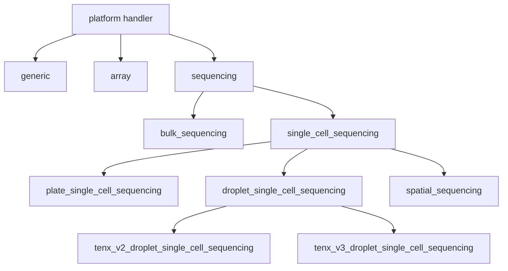

# meta_standards_converter

Convert biological study metadata among GEO MINiML, parsed JSON, ArrayExpress MAGE-TAB, and AnnData/H5AD.

## Description

`meta_standards_converter` is a Python package and command-line toolkit for moving study metadata between GEO and ArrayExpress-compatible representations and for attaching that metadata to expression data. It can fetch and parse GEO MINiML, enrich packages with PubMed and SRA/ENA records, read and write MAGE-TAB IDF/SDRF files, normalize processed matrices into H5AD, and process raw FASTQs through pinned nf-core pipelines.

Version 1.0.0 introduces unified JSON-output orchestration while consuming
Atlas document schema 1.0, H5AD metadata schema 1.0, and MINiML ledger schema
1.0. MSC remains
standalone: native MINiML, MAGE-TAB, delimited, and expression workflows do not
import or depend on ThematicAtlases.
Organization-specific H5AD adapters compose through the public `Asset`,
`SourcePlanner`, projector protocols, and `JSON2H5ADConverter` facade.

The seven primary workflows are:

- `geo2ae`: GEO Series accession to MAGE-TAB IDF and SDRF.
- `geo2json`: GEO Series accession to parsed MINiML-compatible JSON.
- `json2ae`: parsed MINiML or canonical Atlas v1 JSON to MAGE-TAB IDF and SDRF.
- `ae2json`: local, HTTP(S), or BioStudies MAGE-TAB to parsed JSON.
- `json2h5ad`: parsed JSON plus H5AD, matrix, or FASTQ assets to normalized H5AD.
- `json2tsv`: parsed JSON to a sample manifest in TSV or CSV format.
- `json2obs`: parsed JSON plus expression assets to combined AnnData metadata sidecars.

## Installation

Install the base package from GitHub:

```bash
python -m pip install "git+https://github.com/jaychowcl/meta_standards_converter.git"
```

Install locally for development:

```bash
git clone https://github.com/jaychowcl/meta_standards_converter
cd meta_standards_converter
python -m pip install -e .
```

Include AnnData/H5AD support when using `json2h5ad`:

```bash
python -m pip install -e '.[h5ad]'
```

Install the complete test stack and run the canonical suite with pytest:

```bash
python -m pip install -e '.[test]'
PYTHONDONTWRITEBYTECODE=1 MPLCONFIGDIR=/tmp/matplotlib-meta-standards \
  pytest -p no:cacheprovider -q
```

`unittest discover` is not a supported substitute because it does not collect
the repository's pytest functions, fixtures, parametrization, or subtests.

MSC owns its public metadata-provider contracts; they are skipped normally:

```bash
RUN_LIVE_API_TESTS=1 python -m pytest tests/live_api -m live_api -vv
```

Build the project image, which includes the H5AD extra, Java 21, Nextflow, `gffread`, and the Docker CLI:

```bash
docker build -t meta-standards-converter .
```

### Requirements

- Python `>=3.10`.
- Base dependencies: `requests>=2.31.0,<3` and `python-dateutil>=2.8.2,<3`.
- H5AD dependencies have tested major-version bounds: AnnData `>=0.10.8,<1`,
  h5py `>=3.10,<4`, NumPy `>=1.26,<3`, pandas `>=2.1,<4`, Scanpy
  `>=1.10,<2`, and SciPy `>=1.11,<2`; install the `h5ad` extra.
- Network access for live GEO, BioStudies, PubMed, NCBI SRA, and ENA lookups.
- Host-side raw FASTQ processing: Java, Nextflow, and a supported Nextflow runtime/profile such as Docker or Apptainer.
- GFF/GFF3 annotation conversion: `gffread`.
- Rootless Compose processing: Linux, Docker Engine rootless extras, subordinate UID/GID support, ACL tools, and user-level systemd.

The Python metadata converters do not require Docker. The project image supplies the scientific and workflow dependencies needed by `json2h5ad`, but raw Docker-profile processing also requires access to a Docker daemon.

## Quickstart

### CLI quickstart

Install the package, then run any of its seven commands. This example creates parsed JSON and then normalized H5AD. See the [CLI guide](#cli).

```bash
geo2json GSE234602 --out output
json2h5ad output/GSE234602.json --out output
```

### Python API quickstart

Import a converter and call `convert()`. See the [Python API guide](#python-api).

```python
from meta_standards_converter.converters.geo2json import geo2json

packages = geo2json().convert("GSE234602", out="output")
```

### Docker quickstart

Build the image and mount a writable output directory. See the [Docker guide](#docker).

```bash
docker build -t meta-standards-converter .
mkdir -p output
docker run --rm -v "$PWD/output:/out" \
  meta-standards-converter geo2ae GSE234602 --out /out
```

### Rootless Docker Compose quickstart

Provision the dedicated runner once, then build through its rootless daemon. See the [Rootless Docker Compose guide](#rootless-docker-compose).

```bash
sudo "$PWD/scripts/provision-rootless-json2h5ad.sh" "$PWD" "$PWD/.out/json2h5ad"
sudo -u nfcore-runner -H "$PWD/scripts/json2h5ad-compose.sh" build converter
```

### Inputs & Outputs

| Workflow | Expected input | Output |
| --- | --- | --- |
| `geo2ae` | One or more `GSE...` accessions | `{accession}.idf.txt` and `{accession}.sdrf.txt`; Python returns MAGE-TAB row payloads |
| `geo2json` | One or more `GSE...` accessions | `{GSE}.json`; Python returns a package `list[dict]` |
| `json2ae` | Parsed MINiML object/list or canonical Atlas v1 document | IDF/SDRF files; Python returns ordered MAGE-TAB payloads |
| `ae2json` | IDF path, HTTP(S) IDF URL, or BioStudies/ArrayExpress accession; optional SDRF overrides | `{accession}.json`; Python returns a one-package list with a `mage_tab` extension |
| `json2h5ad` | Parsed MINiML object/list or canonical Atlas v1 document plus discovered or explicit H5AD, matrix, or FASTQ assets | Per-dataset sample H5ADs, optional compatible combined H5AD, provenance JSON, optional nf-core results, and single- or multi-dataset result objects |
| `json2tsv` | Parsed MINiML package JSON or a canonical Atlas v1 document | One normalized sample manifest in selected TSV/CSV format plus a JSON result manifest |
| `json2obs` | Same JSON and expression assets accepted by `json2h5ad` | Combined `.obs.csv`, optional `.var.csv` and `.uns.json`, plus a JSON result manifest |

GEO JSON packages contain Series metadata plus the referenced samples, platforms, contributors, organizations, and databases. MAGE-TAB-origin JSON uses the same public package shape and adds validated `mage_tab.model` schema version 1, warnings, unmapped data, and lossless round-trip metadata. H5AD outputs retain expression values, canonical dotted `msc.*` observation metadata, normalized sample values in `uns["msc_metadata"]`, flattened MINiML metadata in `uns["msc_miniml"]`, typed assay occurrences in `uns["msc_mage_tab"]`, and conversion provenance.

**Enriched core:** `mage_tab.model` schema version 1 exposes editable protocols,
assay paths, typed attributes, declarations, properties, and document
boundaries. Harmonized values and units are additive `hz_*` annotations;
`mage_tab.roundtrip` remains exact unchanged-source evidence. See the
[enriched-core contract](docs/codebase.md#proposed-enriched-miniml-core).

## Guide

### Configuration

The package has no mandatory application config file. Configure conversions with CLI flags or the equivalent Python `convert()` keyword arguments; use files only for detailed asset mappings, nf-core parameters, or Nextflow infrastructure settings.

| Area | CLI / Python configuration | Default |
| --- | --- | --- |
| Related GEO studies | `--related` / `related_series=True` | Only the requested Series |
| Empty MINiML fields | `--remove-empty` or `--keep-empty` / `remove_empty` | Remove empty fields |
| Remote enrichment | `--no-enrich` / `enrich=False` | PubMed and SRA/ENA enrichment enabled |
| MAGE-TAB platform handler | `--platform-handler` / `platform_handler` | Automatic metadata-based detection |
| Output location | `--out` / `out` | Current directory |
| Logging | `-v`, `-vv`, `-q`, `--log-file` | WARNING and above to stdout |
| H5AD asset override | `--asset`, `--asset-manifest` / `asset_specs`, `asset_manifest`, `explicit_assets` | Discover assets from JSON |
| Matrix orientation | `--matrix-orientation` / `matrix_orientation` | `auto`; ambiguous delimited matrices fail |
| Raw pipeline | `--pipeline` / `pipeline` | `auto` modality detection |
| Reference | `--genome`, or `--fasta` with `--gtf`/`--gff` | Explicitly accepted human/mouse inference when available |
| Nextflow | `--profile`, `--revision`, `--params-file`, `--nextflow-config`, `--work-dir`, `--resume` | Docker profile and pinned pipeline revision |
| Existing H5AD outputs | `--overwrite` / `overwrite=True` | Protect existing outputs |
| H5AD projector validation | `--allow-invalid` / `allow_invalid=True` | Fail closed before publishing artifacts |

#### Platform handlers

`geo2ae` and `json2ae` detect the MAGE-TAB platform handler from study metadata by default. Use `--platform-handler KEY` (or the Python `platform_handler` argument) to force a handler, and run either command with `--list-platform-handlers` to print the authoritative runtime catalog.

The following graph shows the conceptual specialization of the selectable handlers. It is not the literal inheritance tree of the private IDF and SDRF implementation classes.



For detailed H5AD source configuration, `--asset-manifest` accepts CSV or TSV. `scope_id` and `path` are required; supported optional columns are `kind`, `role`, `read`, `lane`, `run`, `md5`, `features_path`, `barcodes_path`, and `orientation`.

```csv
scope_id,path,kind,role,read,lane,md5,orientation
GSM9651991,/data/GSM9651991.h5ad,h5ad,primary,,,,
GSM9651992,https://example.org/GSM9651992_R1.fastq.gz,raw,primary,1,L001,,
GSM9651992,https://example.org/GSM9651992_R2.fastq.gz,raw,primary,2,L001,,
```

Reference combinations accepted for raw processing are `--genome GENOME`, `--genome GENOME` with one annotation override, or `--fasta FASTA` with exactly one of `--gtf GTF` and `--gff GFF`. GFF/GFF3 is converted to a checksum-addressed GTF. A JSON object supplied through `--params-file` is merged into nf-core parameters, but converter-owned input, output, and reference values take precedence; `--nextflow-config` is reserved for resource and infrastructure configuration.

The rootless Compose helper derives `DOCKER_HOST` and its runtime paths. `ROOTLESS_DOCKER_SOCKET` is the single test/operations seam for overriding the derived user socket; `JSON2H5AD_OUT` overrides the default `.out/json2h5ad` tree. Compose sets `META_STANDARDS_REQUIRE_ROOTLESS_DOCKER=1`, causing Docker-profile raw processing to fail before Nextflow starts unless the connected daemon reports rootless security mode.

### CLI

The package installs `geo2ae`, `geo2json`, `json2ae`, `ae2json`, `json2h5ad`, `json2tsv`, and `json2obs`. Run `<command> --help` for generated usage text.

All commands process multiple positional inputs in order. A failed input is logged, later inputs continue, and the final exit status is `1`; a fully successful invocation returns `0`. Logging defaults to `WARNING`. `-v` selects `INFO`, `-vv` selects `DEBUG`, and `-q` selects `ERROR`.

#### `geo2ae`

Fetch one or more GEO Series and write MAGE-TAB IDF/SDRF files.

```bash
geo2ae GSE234602 --out output
geo2ae GSE234602 GSE34779 --related --keep-empty --out output
geo2ae GSE234602 --platform-handler array --out output
geo2ae --list-platform-handlers
```

| Argument | Behavior |
| --- | --- |
| `gse` | One or more GEO Series accessions; required. |
| `-h`, `--help` | Display generated help and exit. |
| `--related`, `--related-series`, `--get-related-series` | Include transitively related GEO super/subseries; disabled by default. |
| `--remove-empty` | Remove empty parsed fields; this is the default. |
| `--keep-empty` | Preserve empty parsed fields; mutually exclusive with `--remove-empty`. |
| `--out` `OUT` | Output directory; default `.`. |
| `--platform-handler` `KEY` | Force both IDF and SDRF generation through a listed platform handler. |
| `--list-platform-handlers` | Print valid handler keys, one per line, and exit without converting. |
| `-v`, `--verbose` | Increase verbosity; repeat as `-vv` for DEBUG. |
| `-q`, `--quiet` | Emit ERROR logs only; mutually exclusive with verbosity. |
| `--log-file` `LOG_FILE` | Also write logs to this file, replacing an existing file. |

#### `geo2json`

Fetch one or more GEO Series and write parsed MINiML-compatible JSON package lists.

```bash
geo2json GSE234602 --out output
geo2json GSE234602 --no-enrich --keep-empty --out output
```

| Argument | Behavior |
| --- | --- |
| `gse` | One or more GEO Series accessions; required. |
| `-h`, `--help` | Display generated help and exit. |
| `--related`, `--related-series`, `--get-related-series` | Include transitively related GEO super/subseries; disabled by default. |
| `--remove-empty` | Remove empty parsed fields; this is the default. |
| `--keep-empty` | Preserve empty parsed fields; mutually exclusive with `--remove-empty`. |
| `--no-enrich` | Skip PubMed and SRA/ENA enrichment; enrichment is enabled by default. |
| `--out` `OUT` | Output directory; default `.`. |
| `-v`, `--verbose` | Increase verbosity; repeat as `-vv` for DEBUG. |
| `-q`, `--quiet` | Emit ERROR logs only; mutually exclusive with verbosity. |
| `--log-file` `LOG_FILE` | Also write logs to this file, replacing an existing file. |

#### `json2ae`

Read parsed MINiML or canonical Atlas v1 JSON and write MAGE-TAB
IDF/SDRF files.

```bash
json2ae output/GSE234602.json --out output
json2ae atlas.json --out output
json2ae primary.json related.json --no-enrich --out output
json2ae study.json --platform-handler bulk_sequencing --out output
json2ae --list-platform-handlers
```

| Argument | Behavior |
| --- | --- |
| `json_path` | One or more paths containing a parsed MINiML object/list or canonical Atlas v1 document. |
| `-h`, `--help` | Display generated help and exit. |
| `--no-enrich` | Convert supplied metadata without PubMed/SRA enrichment; enrichment is enabled by default. |
| `--use-harmonization-overrides` | Apply the validated profile from an Agentic Curator result envelope while retaining every `hz_*` characteristic. |
| `--out` `OUT` | Output directory; default `.`. |
| `--platform-handler` `KEY` | Force both IDF and SDRF generation through a listed platform handler. |
| `--list-platform-handlers` | Print valid handler keys, one per line, and exit without converting. |
| `-v`, `--verbose` | Increase verbosity; repeat as `-vv` for DEBUG. |
| `-q`, `--quiet` | Emit ERROR logs only; mutually exclusive with verbosity. |
| `--log-file` `LOG_FILE` | Also write logs to this file, replacing an existing file. |

`json2ae` validates all retained packages before converting any of them. For
an Atlas v1 document it converts datasets whose status is `harmonized`, warns
about other dataset states and their diagnostics, and fails when no convertible
package groups remain. Legacy unversioned `accessions` envelopes fail with cutover
guidance instead of being inferred. If the input came from
`ae2json`, an unchanged single-SDRF package can reproduce its original tables
exactly; edits to the typed `mage_tab.model` or mapped core fields regenerate
the relevant MAGE-TAB content. During regeneration, mapped core content is
overlaid as a keyed union: missing allowlisted IDF rows and non-structural SDRF
columns are inserted while model-only rows, assay paths, node columns, and
`Protocol REF` columns remain authoritative. This lets curator-added fields
such as `Characteristics[hz_cell_type]`, `Characteristics[hz_cell_type_id]`,
and `Characteristics[hz_cell_type_onto]` survive as separate columns. The same
ontology-agnostic rule preserves ECTO exposure and PCL provisional-state
annotations such as `hz_exposure_name_id` and `hz_cell_state_name_id`.
Duplicate SDRF headers are matched by normalized label and occurrence, and
values are copied only when source/sample/run identity gives one unambiguous
value; otherwise existing model content is retained and newly inserted cells
stay blank.
Enriched harmonization annotations regenerate as adjacent reserved
`Comment[hz_*]` columns. They never replace original Parameter Value, Unit, or
term-companion cells, and `ae2json` reattaches them to the preceding typed
attribute on a later parse.

#### `ae2json`

Resolve an IDF and its SDRFs, then write a MINiML-compatible JSON package.

```bash
ae2json study.idf.txt --out output
ae2json https://example.org/study.idf.txt --out output
ae2json E-MTAB-1990 --out output
ae2json study.idf.txt --sdrf first.sdrf.txt --sdrf second.sdrf.txt --out output
```

| Argument | Behavior |
| --- | --- |
| `source` | One or more IDF paths, HTTP(S) IDF URLs, or BioStudies/ArrayExpress accessions. |
| `-h`, `--help` | Display generated help and exit. |
| `--sdrf` `PATH_OR_URL` | Override IDF SDRF references; repeat for multiple SDRFs. Requires exactly one `source` and cannot accompany an accession source. |
| `--out` `OUT` | Output directory; default `.`. |
| `-v`, `--verbose` | Increase verbosity; repeat as `-vv` for DEBUG. |
| `-q`, `--quiet` | Emit ERROR logs only; mutually exclusive with verbosity. |
| `--log-file` `LOG_FILE` | Also write logs to this file, replacing an existing file. |

Remote IDF/SDRF text remains in memory. Accession mode paginates the BioStudies
file listing to discover exactly one IDF and at least one SDRF; assay data files
are not downloaded.

#### `json2h5ad`

Select the best available expression source for every sample, normalize it into AnnData, and write H5AD outputs. Explicit manifest assets outrank `--asset` entries, which outrank JSON-discovered assets; within a source tier the order is H5AD, matrix, then raw FASTQ.

```bash
json2h5ad output/GSE234602.json --out output
json2h5ad output/GSE234602.json \
  --asset GSM9651991=local.h5ad --out output
json2h5ad output/GSE234602.json \
  --force-reprocess --pipeline rnaseq --genome GRCh38 \
  --gtf references/current.gtf.gz --profile docker --out output
```

| Argument | Behavior |
| --- | --- |
| `json_path` | One or more paths containing parsed MINiML packages or a canonical Atlas v1 document. |
| `-h`, `--help` | Display generated help and exit. |
| `--out`, `--outdir` `OUTDIR` | Output directory; default `.`. |
| `--asset-manifest` `ASSET_MANIFEST` | CSV/TSV mapping with required `scope_id` and `path` columns and optional kind, role, read/lane, matrix, checksum, and orientation metadata. |
| `--asset` `ACCESSION=PATH` | Explicit local or remote H5AD, matrix, or FASTQ; repeat as needed. |
| `--force-reprocess` | Ignore processed sources and require raw FASTQ for every sample. |
| `--pipeline` `{auto,scrnaseq,rnaseq}` | Raw-input pipeline; default `auto`, which groups samples by detected modality. |
| `--genome` `GENOME` | nf-core catalogue genome key, optionally combined with `--gtf` or `--gff`. |
| `--fasta` `FASTA` | Local custom FASTA; requires exactly one of `--gtf` or `--gff`. |
| `--gtf` `GTF` | Local GTF or GTF.GZ annotation; mutually exclusive with `--gff`. |
| `--gff` `GFF` | Local GFF/GFF3 annotation; mutually exclusive with `--gtf` and converted to GTF with `gffread`. |
| `--accept-inferred-reference` | Accept supported human/mouse reference inference when no explicit reference is supplied. |
| `--profile` `PROFILE` | Nextflow profile; default `docker`. |
| `--revision` `REVISION` | Override the pinned nf-core revision; defaults are `scrnaseq` 4.2.0 and `rnaseq` 3.26.0. |
| `--params-file` `PARAMS_FILE` | Additional nf-core JSON parameters; converter-owned input, output, and reference values take precedence. |
| `--nextflow-config` `NEXTFLOW_CONFIG` | Additional Nextflow resource/infrastructure config. |
| `--work-dir` `WORK_DIR` | Nextflow work directory; defaults below the study/pipeline output tree. |
| `--resume` | Resume Nextflow and reuse fingerprint-valid processed-sample checkpoints. |
| `--processed-checkpoint-dir` `DIR` | Persist atomic normalized sample checkpoints in `DIR`; matching checkpoints are reused with `--resume`. |
| `--overwrite` | Replace normalized H5AD and manifest outputs; existing outputs are protected by default. |
| `--allow-invalid` | Publish a partial bundle carrying projector-reported errors; structural type, collision, and axis-length errors always fail. |
| `--matrix-orientation` `{auto,genes-by-observations,observations-by-genes}` | Delimited matrix orientation; default `auto`, which rejects ambiguous generic matrices. |
| `--use-harmonization-overrides` | Replace canonical metadata destinations from the envelope profile and publish `msc_harmonization` provenance. |
| `-v`, `--verbose` | Increase verbosity; repeat as `-vv` for DEBUG. |
| `-q`, `--quiet` | Emit ERROR logs only; mutually exclusive with verbosity. |
| `--log-file` `LOG_FILE` | Also write logs to this file, replacing an existing file. |

Processed assets may be local or HTTP(S)/FTP and may include `.h5ad`, `.h5ad.gz`, 10x HDF5, 10x MTX directories, CSV, TSV, or TXT matrices. Remote processed assets are cached under the output directory and an available MD5 is verified. Raw processing upgrades known ENA/NCBI FTP FASTQ links to HTTPS before writing nf-core samplesheets.

Ordinary H5AD and delimited-matrix paths use AnnData, pandas, NumPy, and SciPy
directly. Scanpy is imported lazily only when reading 10x HDF5 or MTX inputs,
so processed H5AD conversion does not trigger unrelated plotting/font-system
process discovery.

Each successful sample produces `{GSM}.h5ad`. Compatible samples are outer-joined into `{GSE}.h5ad`; incompatible organisms, references, modalities, or feature namespaces leave the sample files intact, omit the combined file, record a partial failure, and cause CLI status `1`. Dataset, study, and sample identifiers must be safe single path components. Sample H5ADs, the combined H5AD, and the manifest are staged and published as one rollback-safe dataset bundle. If restoration itself fails, `DatasetBundleRecoveryError` reports retained recovery paths instead of deleting the previous artifacts. Every run writes `{GSE}.json2h5ad.json` provenance unless output protection rejects an existing file.

##### H5AD metadata schema 1.0

Converter-owned observation columns use only canonical dotted names such as
`msc.sample.accession`, `msc.archive.sra_run_accessions`,
`msc.characteristics.cell_type`, and `msc.combination.batch`. Version 3 does
not generate the former underscore aliases. If a source H5AD already contains
an underscore-style column, it is retained as opaque source data but is not
used as MSC metadata. Study-level input splitting recognizes
`msc.sample.accession` and the external generic columns `geo_accession`,
`sample_id`, `sample`, and `gsm_accession`.

Sample-bound Parameter Values appear as
`msc.mage_tab.parameter.<slug>.*` columns; the lossless assay/row/column
occurrences remain in `uns["msc_mage_tab"]["parameters"]`.

Analysis-facing `obs` values remain scalar strings; repeated values are
de-duplicated in source order and displayed with `; ` separators. The
authoritative reversible projection is
`uns["msc_metadata"]["sample_values"]`, with columns `sample_accession`,
`field`, `ordinal`, `value`, and `value_type`. The complete source hierarchy
continues to live in `uns["msc_miniml"]["fields"]`. H5AD provenance and the
JSON manifest declare `1.0` as the H5AD metadata schema independently of the
Atlas and MINiML schema versions.

Original observation identifiers are stored in
`obs["msc.observation.original_id"]`. Identifiers that already contain their
sample accession as a delimiter-bounded token are preserved; unqualified IDs
receive `-{sample_accession}`. Duplicate candidates receive deterministic
numeric suffixes before sample and combined files are written, so both files
use the same globally unique identifiers.

#### `json2tsv`

Write one row per sample using the neutral dotted `msc.*` metadata contract.
The command accepts ordinary MINiML package JSON or a
canonical Atlas v1 document and retains only datasets whose status is
`harmonized`. TSV is the default; `--format csv` selects CSV without a second
command. The table and JSON result manifest publish as one bundle, and stdout
contains the same machine-readable result summary while logs use stderr.

```bash
json2tsv atlas.json --outdir output --format csv
```

| Argument | Behavior |
| --- | --- |
| `json_path` | One or more parsed MINiML or canonical Atlas v1 JSON paths. |
| `-h`, `--help` | Display generated help and exit. |
| `--out`, `--outdir` `OUTDIR` | Output directory; default `.`. |
| `--format` `{tsv,csv}` | Manifest serialization; default `tsv`. |
| `--allow-invalid` | Write projected rows despite projector-reported errors and return a partial result; default behavior raises before writing. |
| `--overwrite` | Replace an existing destination; existing files are protected by default. |
| `--use-harmonization-overrides` | Apply the envelope profile to canonical columns and retain all `msc.characteristics.hz_*` columns. |
| `-v`, `--verbose` | Increase verbosity; repeat as `-vv` for DEBUG. |
| `-q`, `--quiet` | Emit ERROR logs only; mutually exclusive with verbosity. |
| `--log-file` `LOG_FILE` | Also write logs to this file, replacing an existing file. |

#### `json2obs`

Build the same combined AnnData view as `json2h5ad`, then export cell metadata
without publishing normalized H5AD files. The required output directory
contains `<study>.obs.csv` with an explicit `cell_id` column. Optional typed
sidecars expose feature metadata and reconstructable unstructured metadata.
Atlas batches always isolate every completed dataset below
`OUTDIR/<dataset_id>/`, including partial batches with only one success.

```bash
json2obs atlas.json --outdir output --asset GSM1=source.h5ad \
  --include-var --include-uns
```

| Argument | Behavior |
| --- | --- |
| `json_path` | One or more parsed MINiML or canonical Atlas v1 JSON paths. |
| `-h`, `--help` | Display generated help and exit. |
| `--outdir` `OUTDIR` | Required component-output directory. |
| `--include-var` | Add `<study>.var.csv` with a `feature_id` column. |
| `--include-uns` | Add typed `<study>.uns.json`. |
| `--asset-manifest` `ASSET_MANIFEST` | CSV/TSV mapping accessions to assets. |
| `--asset` `ACCESSION=PATH` | Explicit H5AD, matrix, or FASTQ asset; repeatable. |
| `--force-reprocess` | Prefer raw processing over discovered processed assets. |
| `--pipeline` `{auto,scrnaseq,rnaseq}` | Raw-input pipeline. |
| `--genome` `GENOME` | nf-core genome key. |
| `--fasta` `FASTA` | Custom reference FASTA. |
| `--gtf` `GTF` | Custom GTF annotation. |
| `--gff` `GFF` | Custom GFF/GFF3 annotation. |
| `--accept-inferred-reference` | Permit supported organism-based reference inference. |
| `--profile` `PROFILE` | Nextflow profile; default `docker`. |
| `--revision` `REVISION` | Override the pinned nf-core revision. |
| `--params-file` `PARAMS_FILE` | Additional nf-core parameters. |
| `--nextflow-config` `NEXTFLOW_CONFIG` | Nextflow infrastructure configuration. |
| `--work-dir` `WORK_DIR` | Nextflow working directory. |
| `--resume` | Resume Nextflow and reuse fingerprint-valid processed-sample checkpoints. |
| `--processed-checkpoint-dir` `DIR` | Persist atomic normalized sample checkpoints in `DIR`; matching checkpoints are reused with `--resume`. |
| `--overwrite` | Replace the complete component bundle. |
| `--allow-invalid` | Publish projector-reported validation errors as a partial result. |
| `--matrix-orientation` `{auto,genes-by-observations,observations-by-genes}` | Generic delimited-matrix orientation. |
| `--use-harmonization-overrides` | Use the same harmonization-aware AnnData assembly as `json2h5ad`. |
| `-v`, `--verbose` | Increase verbosity; repeat for DEBUG. |
| `-q`, `--quiet` | Emit ERROR logs only. |
| `--log-file` `LOG_FILE` | Write detailed logs to a file. |

Programmatic callers use `JSONDataOutputOrchestrator`; its manifest, H5AD, and
AnnData-metadata methods return typed result objects. Injected
`TabularMetadataProjector` objects can replace the default manifest columns.
Related manifest and AnnData-metadata files are published into immutable,
checksummed generations. A single fsynced `current.json` pointer is the
crash-atomic authority; returned results expose `bundle_pointer_path`. Existing
direct output files remain v1 compatibility views. If compatibility recovery
fails, `ArtifactRecoveryError` preserves and reports every remaining backup.

### Python API

The converters accept injectable collaborators for testing and integration, but default construction is sufficient for normal use.

Read the canonical Atlas v1 wire format without installing its producer:

```python
from meta_standards_converter.atlas_v1 import AtlasV1Reader

result = AtlasV1Reader().load("atlas.json")
for dataset in result.datasets:
    print(dataset.dataset_id, dataset.metadata)
```

The reader validates the Atlas v1 identity, collections, cross-references and summary,
returns only harmonized dataset metadata, and reports skipped states through
`result.warnings`. MSC intentionally has no runtime or build dependency on
ThematicAtlases; compatibility is verified with the producer-owned golden wire
fixture copied into `tests/fixtures/contracts/`. A harmonized dataset whose
metadata is exactly `{"packages": [...]}` remains one dataset group while each
contained MINiML package is converted independently; this preserves related
series packages without treating them as separate Atlas datasets.

Convert GEO to MAGE-TAB:

```python
from meta_standards_converter.converters.geo2ae import geo2ae

magetabs = geo2ae().convert(
    gse="GSE234602",
    related_series=False,
    remove_empty=True,
    out="output",
    platform_handler=None,
)
```

`geo2ae.convert(gse, related_series=False, remove_empty=True, out=None, platform_handler=None)` returns a list of in-memory MAGE-TAB payloads. `out=None` suppresses file writes; `platform_handler=None` keeps automatic detection.

Convert GEO to JSON:

```python
from meta_standards_converter.converters.geo2json import geo2json

packages = geo2json().convert(
    gse="GSE234602",
    related_series=False,
    remove_empty=True,
    enrich=True,
    out="output",
)
```

`geo2json.convert(gse, related_series=False, remove_empty=True, enrich=True, out=None)` returns `list[dict]`; `out` writes `{gse}.json`.

Convert parsed JSON to MAGE-TAB:

```python
from meta_standards_converter.converters.json2ae import json2ae

magetabs = json2ae().convert(
    json_path="output/GSE234602.json",
    out="output",
    enrich=True,
    platform_handler=None,
)
```

`json2ae.convert(json_path, out=None, enrich=True, platform_handler=None)`
accepts a parsed MINiML object/list or canonical Atlas v1 document and
returns ordered MAGE-TAB payloads. `json2ae(..., package_source=...)` permits
injection of a compatible source loader. Forcing a handler regenerates
IDF/SDRF content instead of reusing unchanged round-trip tables or a
typed-model-only rendering. Regeneration unions eligible mapped core IDF rows
and non-structural SDRF columns into the typed model, including separate
harmonized `hz_*`, `hz_*_id`, and `hz_*_onto` characteristic columns when
present.

Convert MAGE-TAB to parsed JSON:

```python
from meta_standards_converter.converters.ae2json import ae2json

packages = ae2json().convert(
    source="E-MTAB-1990",
    out="output",
    sdrf_sources=None,
)
```

`ae2json.convert(source, out=None, sdrf_sources=None)` returns a one-package list. `sdrf_sources` is a list of explicit local paths or HTTP(S) URLs and follows the same constraints as repeated CLI `--sdrf` values.

Convert parsed JSON and expression assets to H5AD:

```python
from meta_standards_converter.converters.json2h5ad import Asset, json2h5ad

result = json2h5ad().convert(
    json_path="output/GSE234602.json",
    out="output",
    explicit_assets=[Asset("GSM9651991", "local.h5ad", "h5ad")],
    asset_manifest=None,
    asset_specs=None,
    force_reprocess=False,
    matrix_orientation="auto",
    overwrite=False,
    pipeline="auto",
    genome="GRCh38",
    fasta=None,
    gtf="references/current.gtf.gz",
    gff=None,
    accept_inferred_reference=False,
    profile="docker",
    revision=None,
    params_file=None,
    nextflow_config=None,
    work_dir=None,
    resume=False,
)
```

`JSON2H5ADConverter.convert()` accepts ordinary parsed MINiML JSON or a
canonical Atlas v1 document. It returns `ConversionResult` for exactly
one dataset group and `BatchConversionResult` for multiple groups.
`convert_source(json_path, out=None, **options)` always returns
`BatchConversionResult`. For multiple groups, each dataset is converted below
an output child directory named for its dataset ID; per-group exceptions are
recorded in `BatchConversionResult.failures` while later groups continue.
Invalid paths, unsafe dataset IDs, invalid source shapes, sources with no
convertible groups, and sources with no convertible samples raise before
aggregation. `ConversionResult` exposes `study_accession`,
`sample_h5ads`, `combined_h5ad`, `retained_h5ads`, `pipeline_runs`,
`manifest_path`, `warnings`, `errors`, `failures`, `primary_h5ad`, and
`partial`.
In-memory paths are absolute; persisted provenance paths are relative to their
artifact parent where possible. See the
[H5AD workflow contract](docs/codebase.md#workflow-json2h5ad).

Applications can add organization-neutral metadata without subclassing the
converter by passing metadata projectors:

```python
from meta_standards_converter.converters import AnnDataMetadataProjection
from meta_standards_converter.converters.json2h5ad import JSON2H5ADConverter


class Projector:
    def project_sample(self, *, adata, context):
        return AnnDataMetadataProjection(
            obs={"example.sample_accession": context.sample_accession},
            obs_renames={"source_label": "author_source_label"},
            obs_drops=("temporary_source_column",),
            uns={"example": {"schema_version": "1"}},
        )

    def project_combined(self, *, adata, contexts):
        return AnnDataMetadataProjection(
            uns={"example": {"sample_count": len(contexts)}}
        )


result = JSON2H5ADConverter(metadata_projectors=[Projector()]).convert(
    "output/GSE234602.json",
    out="output",
)
```

Projectors run after standard `msc_*` normalization and before H5AD writing.
Scalars are broadcast over the selected axis, vectors must match the axis
length, and existing `obs`, `var`, or top-level `uns` keys cannot be replaced.
`obs_renames` and `obs_drops` are validated and applied atomically before
projected `obs` additions; missing sources, duplicate targets, collisions, or
attempting to rename and drop the same column fail unconditionally.
Warnings returned by a projector are added to the conversion result and
manifest. Projector-reported `errors` raise `AnnDataProjectionError` and leave
no final bundle by default. `allow_invalid=True` writes artifacts, records the
errors in the result and manifest, and makes `partial` true. Structural
`TypeError` and `ValueError` conditions remain unconditional. Omitting
projectors preserves the standard output.

Create a private or organization-specific table without modifying MSC:

```python
from meta_standards_converter.converters import TabularMetadataProjection
from meta_standards_converter.converters.json2tabular import JSON2TSVConverter


class Projector:
    def project_sample(self, *, context):
        return TabularMetadataProjection(
            values={"example.sample": context.sample_accession},
            columns=("example.sample",),
        )


result = JSON2TSVConverter(
    metadata_projectors=[Projector()]
).convert_source("atlas.json", "output/metadata.tsv")
```

Explicit projector lists replace the default MSC table contract. Preferred
columns are written first, remaining columns are sorted, collisions fail, and
projector errors fail closed unless `allow_invalid=True`.

### Docker

Build the image:

```bash
docker build -t meta-standards-converter .
```

With no command, the image displays `geo2ae --help`. Any installed CLI can be supplied after the image name:

```bash
docker run --rm meta-standards-converter geo2json --help
```

Mount host paths for inputs and outputs. Use matching container paths in CLI arguments:

```bash
mkdir -p output
docker run --rm \
  -v "$PWD/output:/work" \
  meta-standards-converter \
  geo2json GSE234602 --out /work

docker run --rm \
  -v "$PWD/output:/work" \
  meta-standards-converter \
  json2ae /work/GSE234602.json --out /work
```

The standard image contains no Docker daemon. Metadata conversion and processed-asset H5AD conversion work without a nested runtime. Raw FASTQ processing with the Docker profile requires a deliberately supplied daemon; use the hardened rootless Compose workflow below.

### Rootless Docker Compose

The rootless workflow is intended for raw `json2h5ad` processing. It creates a locked `nfcore-runner` account, gives it read access to the project and read/write access only to `.out/json2h5ad`, and connects the converter to that account's rootless Docker socket.

Provision once as root:

```bash
sudo "$PWD/scripts/provision-rootless-json2h5ad.sh" \
  "$PWD" "$PWD/.out/json2h5ad"
```

Build and verify the image as the runner:

```bash
sudo -u nfcore-runner -H "$PWD/scripts/json2h5ad-compose.sh" build converter
sudo -u nfcore-runner -H "$PWD/scripts/json2h5ad-compose.sh" \
  run --rm converter docker info --format '{{json .SecurityOptions}}'
```

Generate JSON and process raw data. All mounted inputs, outputs, caches, and Nextflow work must remain under `.out/json2h5ad`:

```bash
sudo -u nfcore-runner -H "$PWD/scripts/json2h5ad-compose.sh" \
  run --rm converter geo2json GSE104830 \
  --out "$PWD/.out/json2h5ad/json" -vv

sudo -u nfcore-runner -H "$PWD/scripts/json2h5ad-compose.sh" \
  run --rm converter json2h5ad \
  "$PWD/.out/json2h5ad/json/GSE104830.json" \
  --out "$PWD/.out/json2h5ad/bulk" \
  --force-reprocess --pipeline rnaseq \
  --accept-inferred-reference --profile docker -vv
```

The helper refuses non-rootless daemons. Compose drops all capabilities, enables `no-new-privileges`, makes the root filesystem read-only, and mounts only the dedicated output tree and rootless socket. Final H5AD files use mode `0660`; provisioning establishes and verifies the project-owner and runner ACLs.

### Code flow

```text
CLI or Python API
  |
  +-- GEO accession
  |     -> GEOWebFetcher -> GEOParser -> [MINiMLEnricher]
  |          |                                  |
  |          +-> geo2json: JSON packages        +-> PubMed / NCBI SRA / ENA
  |          `-> geo2ae: AEConstructor -> IDF + SDRF
  |
  +-- parsed JSON
  |     +-> json2ae: validate -> [enrich] -> AEConstructor -> IDF + SDRF
  |     +-> json2tsv: group datasets -> project sample rows -> TSV/CSV manifest
  |     +-> json2obs: assemble AnnData -> obs/optional var+uns sidecars
  |     `-> json2h5ad: plan assets -> [nf-core for FASTQ]
  |                         -> normalize AnnData -> sample/combined H5AD + manifest
  |
  `-- IDF path, URL, or BioStudies accession
        -> AEWebFetcher -> AEParser -> JSON package + mage_tab sidecar
```

Network requests pass through the
[`RateLimitedRequester`](docs/codebase.md#request-helper) boundary.
Limits are shared by normalized HTTP hostname, including across different
service labels. Defaults conservatively allow two NCBI E-utilities starts per
second and one start per second for GEO FTP, ENA Portal, and BioStudies, with at
most two requests in flight per host. These are client ceilings, not provider
entitlements; `429` and transient server responses still use bounded retries.
[`GEOWebFetcher`](docs/codebase.md#geo-web-fetcher),
[`GEOParser`](docs/codebase.md#geo-parser),
[`AEConstructor`](docs/codebase.md#ae-constructor), and the
[H5AD](docs/codebase.md#json2h5ad-flow) and
[tabular](docs/codebase.md#json2tabular-flow) workflows are traced in the
canonical handoff. CLI entrypoints catch failures per top-level input, while
programmatic converter calls raise errors to their caller.

## Testing

The deterministic, network-blocked suite was last verified on 2026-08-02:
`464 passed, 3 skipped`. The skipped cases are the explicitly opt-in live API
provider contracts. Normal tests fake HTTP and subprocess boundaries and do
not launch nf-core.

```bash
PYTHONDONTWRITEBYTECODE=1 python -m pytest -p no:cacheprovider
```

Rootless acceptance was completed separately on 2026-07-31: the pinned
`nf-core/rnaseq` 3.26.0 and `nf-core/scrnaseq` 4.2.0 profiles returned code 0
and produced non-partial H5AD results. See the
[rootless acceptance report](docs/rootless-acceptance-2026-07-31.md).

## Docs

- [Docs index](docs/index.md): routing index with stable anchors, section purposes, and keywords.
- [Codebase docs](docs/codebase.md): canonical architecture, workflow, callable, test, and maintenance handoff.

## Authors

Created by [jaychowcl](https://github.com/jaychowcl) @ [Saez-Rodriguez Group](https://saezlab.org) & [EMBL-EBI Functional Genomics Team](https://www.ebi.ac.uk/about/teams/functional-genomics/) on May 2026
