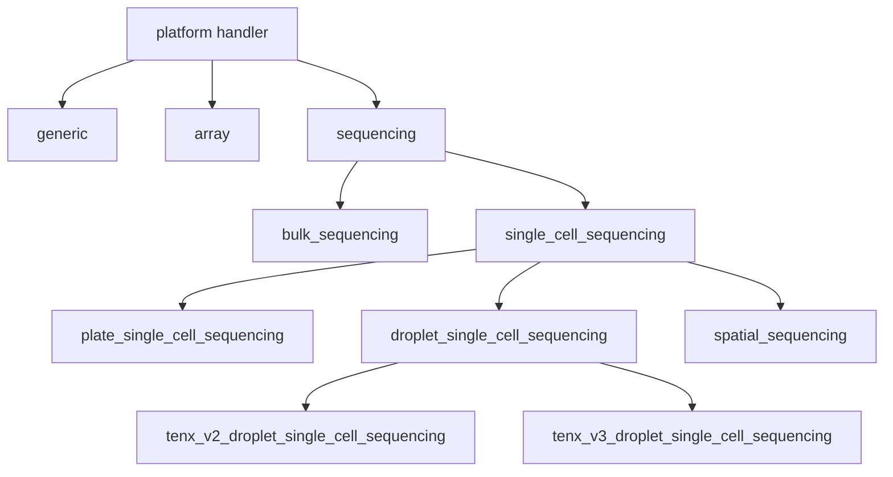

<!--
Authors

Created by jaychowcl @ Saez-Rodriguez Group & EMBL-EBI Functional Genomics Team on May 2026
https://github.com/jaychowcl
https://saezlab.org
https://www.ebi.ac.uk/about/teams/functional-genomics/
-->
# meta_standards_converter Codebase Handoff

This is the canonical handoff for the live package under
`src/meta_standards_converter`. It covers seven conversion paths and the explicit legacy importer, their
runtime boundaries, extension contracts, and the evidence needed to change them
safely.

<a id="architecture"></a>
## Architecture

`meta_standards_converter` is a Python library and eight-command toolkit for
moving study metadata and expression assets among GEO MINiML, the package's
parsed JSON model, ArrayExpress MAGE-TAB, delimited sample tables, and AnnData
H5AD. CLI modules are thin batch adapters. Converter classes own use-case
orchestration; fetchers and parsers own repository-specific I/O; MAGE-TAB
constructors and H5AD/tabular projectors own output models. The current distribution is **MSC 8.0.0**.

Start with [the design and class map](#oop-design), then follow one
[principal workflow](#principal-workflows). Use the
[package layout](#project-purpose-and-layout) to locate code and the
[API inventory](#public-api-and-callable-reference) for exact signatures.
The reference describes the current checkout; dated acceptance reports are
historical evidence, not a claim that external providers were retested.

```text
Users: CLI / Python / Docker / rootless Compose
                         |
                  seven converters
       +-----------------+--------------------+
       |                 |                    |
 GEO/BioStudies      local JSON/files    explicit/discovered assets
       |                 |                    |
 fetch + parse       validate/group       plan/download/run nf-core
       |                 |                    |
 enrich (optional)  project/construct     normalize/project AnnData
       +-----------------+--------------------+
                         |
      JSON | IDF/SDRF | TSV/CSV | H5AD + provenance
```

The package owns conversion policy and emitted artifacts. GEO, NCBI, ENA,
BioStudies, OLS, nf-core, Nextflow, Docker, and the Atlas v1 wire contract are
delegated boundaries. MSC implements that wire boundary locally and does not
import its producer package. See
[Project purpose and layout](#project-purpose-and-layout) for the module tree
and [Runtime behavior](#runtime-behavior) for concrete dependencies.

<a id="system-context-and-boundaries"></a>
## System context and boundaries

| Boundary | Data crossing it | Repository responsibility | Failure owner |
| --- | --- | --- | --- |
| CLI/Python callers | Accessions, paths, options, injected projectors | Validate supported combinations and return/write deterministic results | CLI records per-input failures; most library calls raise, while H5AD group aggregation records per-group failures |
| GEO FTP | GSE accession, MINiML tar/XML | Fetch safely, scope packages, and avoid leaking query data to logs | `GEOWebFetcher` and `RateLimitedRequester` |
| NCBI/ENA/PubMed/OLS | Accessions and public metadata | Rate-limit, retry, parse, and attach enrichment without owning upstream availability | Service fetcher or harmonizer; enrichment records partial failures where supported |
| BioStudies/HTTP/local MAGE-TAB | IDF/SDRF references and text | Resolve exactly one IDF plus SDRFs, parse and retain round-trip evidence | `AEWebFetcher`/`AEParser` |
| Filesystem | JSON, MAGE-TAB, matrices, H5AD, manifests, references | Validate paths, protect existing output unless overwrite is explicit, and write provenance | Converter owning the artifact |
| Nextflow/nf-core/runtime | FASTQ samplesheet, references, workflow parameters | Pin default revisions, reserve converter-owned parameters, execute and collect outputs | `NFCoreRunner`; subprocess failures become conversion failures |
| Docker/rootless Compose | Image, socket, output tree, caches | Provide a hardened supported process boundary, not a daemon | Provisioning/helper scripts and connected daemon operator |
| Atlas v1 JSON | Versioned document and harmonized dataset metadata | Validate the delegated wire format with `AtlasV1Reader` and emit organization-neutral package groups | MSC owns reading/adaptation; the producer owns atlas creation and the canonical model |

The base Python path has no persistent database. Files are the durable boundary;
in-memory dictionaries, typed MAGE-TAB models, and AnnData objects are
conversion-scoped state. Remote metadata is public study metadata, but logs
must not include URL queries, request parameters, XML, metadata payloads,
credentials, or tokens.

<a id="architectural-decisions"></a>
## Architectural decisions

<a id="decision-thin-cli-adapters"></a>
### AD-001: Keep CLI adapters thin and converters reusable

- **Status:** Observed
- **Decision:** Each console script parses a batch and delegates one input at a time to a converter class; converters expose the programmatic workflow.
- **Rationale:** Not documented.
- **Consequences:** CLI failures can be isolated per input, while Python callers retain exceptions and injectable collaborators.
- **Affected components:** `cli/*`, `converters/*`, logging configuration, and output status handling.
- **Evidence:** [`pyproject.toml`](../pyproject.toml), [`cli/geo2ae.py`](../src/meta_standards_converter/cli/geo2ae.py), and [`converters/geo2ae.py`](../src/meta_standards_converter/converters/geo2ae.py).

<a id="decision-magetab-round-trips"></a>
### AD-002: Preserve MAGE-TAB round trips beside the mapped core

- **Status:** Observed
- **Decision:** `ae2json` maps semantic MAGE-TAB content into MSC MINiML 3.0; `json2ae` regenerates ordered IDF/SDRF tables from that typed model.
- **Rationale:** Not documented.
- **Consequences:** Metadata semantics are editable and format-independent. Raw row layout is not replayed; unsafe consolidation of heterogeneous SDRF document graphs is rejected.
- **Affected components:** `AEParser`, `ae_model`, `MINiMLV1Migrator`, and `AEConstructor`.
- **Evidence:** [`ae_parser.py`](../src/meta_standards_converter/magetab/parser.py), [`ae_model.py`](../src/meta_standards_converter/magetab/semantics.py), and [`migration.py`](../src/meta_standards_converter/miniml/migration.py).

<a id="decision-expression-source-planning"></a>
### AD-003: Select expression assets before normalizing AnnData

- **Status:** Observed
- **Decision:** `json2h5ad` resolves explicit and discovered sources into a plan, then dispatches processed assets or raw nf-core execution before a common normalization/projection stage.
- **Rationale:** Not documented.
- **Consequences:** Source precedence is centralized; incompatible samples remain as per-sample H5ADs and make the aggregate result partial.
- **Affected components:** `AssetManifest`, `SourcePlanner`, `NFCoreRunner`, and `JSON2H5ADConverter`.
- **Evidence:** [`json2h5ad.py`](../src/meta_standards_converter/converters/json2h5ad.py) and [`test_h5ad_pipeline.py`](../tests/expression/test_h5ad_pipeline.py).

<a id="decision-fail-closed-projectors"></a>
### AD-004: Extend emitted metadata through fail-closed projector protocols

- **Status:** Observed
- **Decision:** AnnData and delimited outputs accept injected projector protocols; explicit tabular projectors replace the default MSC projection.
- **Rationale:** Not documented.
- **Consequences:** Downstream adapters can add organization-specific fields without coupling them into MSC, while collisions, invalid vector lengths, and projector errors stop unsafe output unless tabular invalid-output mode is explicit.
- **Affected components:** `AnnDataMetadataProjector`, `TabularMetadataProjector`, H5AD normalization, and delimited converters.
- **Evidence:** [`json2h5ad.py`](../src/meta_standards_converter/converters/json2h5ad.py), [`json2tabular.py`](../src/meta_standards_converter/converters/json2tsv.py), and their projector tests.

<a id="decision-rootless-runner"></a>
### AD-005: Isolate raw processing behind a restricted rootless runner

- **Status:** Documented
- **Decision:** The supported Compose workflow connects a locked runner to its rootless Docker socket, mounts one output tree, drops capabilities, and uses a read-only container filesystem.
- **Rationale:** Limit host access while still allowing Nextflow's Docker profile to launch containers and produce project-owner-readable artifacts.
- **Consequences:** Provisioning requires Linux root access once; raw inputs, caches, work, and outputs must live below the dedicated output root.
- **Affected components:** `Dockerfile`, `compose.yaml`, `provision-rootless-json2h5ad.sh`, and `json2h5ad-compose.sh`.
- **Evidence:** [`compose.yaml`](../compose.yaml), [`provision-rootless-json2h5ad.sh`](../scripts/provision-rootless-json2h5ad.sh), and [`test_docker_artifacts.py`](../tests/test_docker_artifacts.py).

<a id="design-invariants-and-expectations"></a>
## Design invariants and expectations

- A parsed source contains at least one package group and at least one
  convertible sample; packages remain scoped to their Series.
- JSON consumers accept native parsed MINiML or `schema_version = "1.0"` Atlas
  documents. Atlas v1 `accessions` envelopes fail with explicit pinned-v1
  guidance; MSC has no runtime/build dependency on ThematicAtlases.
- CLI batch commands continue after an input failure and return `1` if any
  input fails. Most programmatic workflows propagate exceptions; H5AD group
  aggregation is the explicit exception and converts per-group exceptions
  into `BatchConversionResult.failures`.
- `geo2ae`/`json2ae` use the same selected platform handler for IDF and SDRF.
- MAGE-TAB regeneration preserves typed-model semantics. Raw table layout is
  not part of the runtime model.
- H5AD source priority remains manifest, explicit specification, then JSON
  discovery; processed H5AD/matrix sources outrank raw FASTQ within a tier.
- Existing H5AD, tabular, and provenance outputs are protected unless the
  relevant overwrite option is explicit. H5AD sample, combined, and manifest
  artifacts publish as one staged bundle with backup/rollback on commit error.
- Metadata projectors cannot silently replace existing AnnData keys or emit
  axis vectors of the wrong length. Tabular collisions and invalid projections
  fail closed unless `allow_invalid=True`; projector-reported H5AD errors use
  the same explicit policy, while structural errors always fail.
- External calls use service-specific requester settings. Safe telemetry never
  logs credentials, URL queries, raw XML, or study payloads.
- Remote expression assets cross `RetrievalPolicy`: provider hosts and public
  addresses are checked before every request/redirect, cross-scheme redirects
  and URL credentials are rejected, and object/run/cache/disk ceilings are
  mandatory. Cache reuse requires a matching SHA-256 sidecar.
- XML provider bodies and GEO archives use the selected typed resource profile.
  XML is byte-bounded; one ordinary external SYSTEM/PUBLIC DTD may be stripped
  without resolution, while entities, internal subsets, malformed declarations,
  and misplaced declarations fail closed. GEO archives are streamed to a
  disk-preflighted temporary file and may contain safe auxiliary files and
  directories alongside exactly one expected bounded XML member.
- Converter-owned nf-core input/output/reference parameters override additional
  params JSON; Nextflow config is for infrastructure and resources.
- Rootless Compose refuses a daemon without rootless security mode and confines
  writable state to the configured output tree.

<a id="typed-mage-tab-model"></a>
<a id="proposed-enriched-miniml-core"></a>
## Enriched MINiML-compatible core

MSC MINiML 3.0 folds semantic MAGE-TAB content into the typed package itself:
`series.protocols` owns protocol identity and details, `series.assay_paths`
owns ordered node and protocol-application paths, named values own units and
`hz_*` groups, and annotated channel scalar objects retain harmonized values
beside their raw `value`. Declaration lists retain QC/replicate/normalization
semantics, and `source.documents` records source-document provenance. Raw IDF
and SDRF table layouts and the former `mage_tab` replay sidecar are deliberately
outside the runtime representation.

MAGE-TAB construction is therefore semantic and deterministic. IDF ordering
is a renderer responsibility, while assay-path order and repeated
characteristic/parameter occurrences remain data. The SDRF renderer reads the
canonical `name` field (with `tag` only as a migration fallback) and unwraps typed
ontology values such as channel `source` and `molecule` instead of serializing
their JSON object representation. IDF renderers emit the MAGE-TAB 1.1 labels
`Publication Status Term Source REF`, `Publication Status Term Accession
Number`, `Protocol Term Source REF`, and `Protocol Term Accession Number`.
The parser retains the four former MSC labels as input-only aliases and gives
the canonical rows precedence when both spellings are present. Parsing retains
characteristic units and ontology companions, keeps Protocol Contact distinct from per-application
Protocol Performer, and preserves generic IDF/SDRF comments as named comments.
Blank and external Protocol REF values and external sample names are retained
with compatibility diagnostics. Unknown layout remains outside the semantic
model and is reported rather than replayed.

SDRF row order is scoped to each `SourceDocument`. The public
`meta_standards_converter.magetab.semantics.render_miniml_assay_documents`
returns one rendered table per document, preserving repeated Sample Name paths,
protocol-application performer/date/comments, ontology companion columns,
`Unit[type]`, factor qualifiers, and repeated headers. The legacy AE constructor
has a single SDRF-table return shape, so it consolidates compatible document
graphs and raises for heterogeneous layouts instead of silently losing order or
path multiplicity.

Runtime converters accept only explicit schema `3.0` packages. Legacy or
unversioned source data enters through `MINiMLV1Migrator`, which folds supported
sidecar semantics and legacy harmonized values directly into v3 `hz_*` groups.
It preserves explicit source labels and reports dropped source-layout evidence.
No v2 package or wire annotation array is constructed during ingestion.

**Current-state evidence:** [`ae_parser.py`](../src/meta_standards_converter/magetab/parser.py),
[`ae_model.py`](../src/meta_standards_converter/magetab/semantics.py),
[`migration.py`](../src/meta_standards_converter/miniml/migration.py),
and [`ae_constructor.py`](../src/meta_standards_converter/magetab/constructor.py).


<a id="data-contracts"></a>
## Data contracts and preservation

| Contract | Current version | Role |
| --- | --- | --- |
| MSC distribution | 8.0.0 | Python/CLI compatibility and version-specific checkpoint namespace |
| MSC MINiML | 3.0 | Canonical metadata; v2 is rejected |
| Harmonization patch | 3.1 | Source-bound decisions applied additively by MSC |
| Patch extension ledger | 1.0 | Retained operations in `extensions.msc_harmonization` |
| Atlas document | 1.0 | Independent producer wire format accepted by MSC's local reader |
| H5AD metadata | 2.0 | Dotted observation fields and normalized sample values |
| Exported assay metadata | 3.0 | Occurrence structures with `hz_value`, `hz_unit` and companions |
| MINiML AnnData transport | 1.0 | Canonical packages and typed field ledger in `uns["msc_miniml"]` |
| Replacement profile | 1.0 | Optional export-time destination replacement policy |
| Operational status | 2.0 | Independent execution/completeness/evidence/validation/publication axes |

`hz_*` evidence is exported by default. A `replacement_profile` additionally
selects harmonized values for ordinary destination fields on a conversion copy.
It does not change canonical source values, ontology decisions, or retained
patch evidence. Profile-free `miniml_json` envelopes remain accepted; embedded
`harmonization_overrides` is rejected. See [replacement profiles](#harmonization-overrides).

**Round-trip boundary:** v3 canonical packages and AnnData transport retain the
patch ledger. MAGE-TAB preserves supported sample/channel/path occurrences,
source and harmonized values, units, ontology companions, hierarchy depth and
indexed groups. Reparse preserves flattened provenance comments, but does not
reconstruct the complete `extensions.msc_harmonization` patch ledger. Raw
IDF/SDRF byte layout is also outside this contract. Cross-location ambiguity
is diagnosed rather than resolved by final row number.

**Evidence:** [model](../src/meta_standards_converter/miniml/model.py),
[patches](../src/meta_standards_converter/miniml/patches.py),
[assay projection](../src/meta_standards_converter/metadata/projection/assay.py),
[AnnData projection](../src/meta_standards_converter/metadata/projection/anndata.py),
[harmonized MAGE-TAB](../src/meta_standards_converter/magetab/harmonized.py),
[provenance transport](../src/meta_standards_converter/metadata/provenance.py).

<a id="component-relationships-and-data-flow"></a>
## Component relationships and data flow

| Source | Destination | Interface and direction | Data/lifecycle | Failure behavior |
| --- | --- | --- | --- | --- |
| CLI module | converter | `convert(...)` control call | One converter instance per command; inputs processed in order | Logs per-input exception and records non-zero status |
| GEO converters | `GEOWebFetcher` → `GEOSource` → `GEOParser` | internal calls around HTTP/XML | GSE becomes Series-scoped immutable `MINiMLPackage` objects | Fetch/parse errors propagate |
| GEO/JSON converters | `MINiMLEnricher` | optional internal mutation | Adds PubMed and SRA/ENA evidence to a package | Enricher records service-specific misses where implemented |
| GEO/JSON converters | `AEConstructor` | `miniml2magetab` then optional `MAGETabWriter.write` | Package becomes IDF/SDRF row collections; `MAGETabWriter` owns files | Validation/handler/write errors propagate |
| `ae2json` | `AEWebFetcher` → `AEParser` | resolve and parse | IDF/SDRF text becomes canonical v3 packages with source documents | Invalid source cardinality or MAGE-TAB fails |
| tabular converters | `JSONPackageSource` → `MINiMLMetadataProvider` → projectors | load/group, obtain format-neutral sample metadata, then `project_sample` | Dataset groups become ordered row maps | Collisions/invalid output fail closed by default |
| `JSON2H5ADConverter` | planner/downloader/runner | plan, localize, or process | Per-conversion state becomes sample AnnData | Per-sample failures retained; aggregate can be partial |
| tabular and H5AD converters | `MINiMLMetadataProvider` | public injected service calls | Study/sample identity, canonical metadata, and modality use one scientific interpretation | Provider failures propagate without partial output |
| H5AD converter | metadata projectors | `project_sample`/`project_combined` | Projection applied before each write | Collision/shape/projector error fails conversion |
| Atlas/MINiML source | `JSON2H5ADConverter` | `AtlasV1Reader` → `JSONPackageSource.load` then group conversion | Harmonized Atlas v1 datasets or ordinary packages become one conversion per dataset | Invalid versions/shapes raise before aggregation; non-harmonized states warn; per-group conversion failures are retained |
| `NFCoreRunner` | Nextflow/nf-core | subprocess/system call | Samplesheet + reference + params produce pipeline results | Exit/output failure becomes a recorded pipeline failure |

The orchestrating converter owns transient conversion state and output
decisions. Fetchers own network protocol details; parsers own input shape;
constructors/projectors own output shape; callers own retrying a failed
top-level conversion.

<a id="json-helper"></a>
<a id="oop-design"></a>
## Design and object relationships

The useful organizing principle is **one orchestration layer, several replaceable
services, and a typed canonical model**. A converter selects and sequences work;
source services perform retrieval; parsers interpret supplied content; constructors
and projectors build the destination representation. MSC does not use a common
converter superclass to own all workflows.

```text
CLI parser -> converter instance -> conversion-scoped services and data
                                    |
           +------------------------+-------------------------+
           |                        |                         |
      source services          MINiMLPackage              output services
   fetch / resolve / group   immutable canonical v3    build / project / write
           |                        |                         |
     pure parsers           conversion copy + policy    files / result objects
```

| Relationship | Actual design | State and change implications |
| --- | --- | --- |
| `GEO2JSONConverter`, `GEO2AEConverter`, `JSON2AEConverter` → `JSONHandler` | Inherit generic JSON helpers; compose the substantive services | Inheritance supplies utilities, not a shared workflow state machine |
| `GEO2JSONConverter` / `GEO2AEConverter` → `GEOSource` | Constructor injection; `parser` defaults to the source service | `GEOSource` owns related-Series retrieval; its `GEOParser` collaborator is network-free |
| `JSON2TSVConverter` → `JSON2DelimitedConverter` | Specializes delimiter/output selection | Shared base owns grouping, projection, deterministic columns, validation and writing |
| `JSON2OBSConverter` → `JSON2H5ADConverter` + `AnnDataComponentExporter` | Composition, not inheritance | Build a temporary per-sample catalogue, export metadata components, then clean up temporary matrices |
| `JSON2H5ADConverter` → planner, reader, downloader, runner, metadata service | Constructor-injected collaborators | Converter owns sequencing, admission, checkpoints and publication; collaborators own their specific operations |
| `AEConstructor` → evidence resolver, IDF/SDRF builders, protocol registry | Per-operation composition | Resolve network evidence before pure rendering; registry identity must agree across IDF and SDRF |
| SDRF technology handlers → base/array/sequencing specializations | Inheritance within one rendering domain | Override technology behavior without placing retrieval policy in row rendering |
| Projectors and source contracts → `Protocol` interfaces | Structural typing | Callers can inject compatible objects without subclassing MSC implementations |
| `MINiMLPackage` → series, samples, channels, paths, named values | Frozen typed records with mapping codecs | Replace/copy records for transformations; `to_mapping()` produces the serializable boundary |

**State ownership:** protocol registries and rendering graphs belong to a
construction operation. Dataset groups and replacement resolutions belong to a
conversion. Checkpoints, asset caches and host pacing persist independently and
must use their own identity and integrity policies. A converter instance may
retain injected clients and cumulative request metrics; it is not a claim of
thread safety or a process-global cache.

**Design decisions:** favor composition for independently replaceable I/O and
scientific interpretation; retain inheritance where implementations share a
specific behavior family. These are observed relationships, not invented
historical rationale. The evidence-backed [decision records](#architectural-decisions)
state which rationale is documented.

**How to change behavior:** new metadata columns belong in a
[projector](#api-tabular-metadata-projector), new expression formats in an
[asset reader/planner](#package-exports), source retrieval changes in
[source services](#msc6-source-services), and wire representation changes in
[MINiML](#miniml-package-model). Trace the affected public workflow and its
[tests](#test-plan) before editing a shared helper.

**Evidence:** [converter constructors](../src/meta_standards_converter/converters/),
[source contracts](../src/meta_standards_converter/sources/contracts.py),
[MINiML model](../src/meta_standards_converter/miniml/model.py),
[SDRF handlers](../src/meta_standards_converter/magetab/sdrf/handlers/),
[component exporter](../src/meta_standards_converter/expression/components.py).

<a id="entrypoints-and-interfaces"></a>
## Entrypoints and interfaces

The supported public entrypoints are:

<a id="interface-cli"></a>
- eight console scripts registered in `pyproject.toml`: `geo2ae`, `geo2json`,
  `json2ae`, `ae2json`, `json2h5ad`, `json2tsv`, `json2obs`, and `miniml-migrate`;
<a id="interface-python"></a>
- seven lazy converter-class exports from `meta_standards_converter.converters`,
  plus supported models, source services, projectors and expression collaborators
  from their [owning packages](#package-exports);
<a id="interface-docker"></a>
- a Docker image that accepts any installed console command;
<a id="interface-rootless-compose"></a>
- rootless Compose and its two operational scripts for raw `json2h5ad`.

Every CLI parser contract, option, default, and batch status rule is listed
under [CLI](#cli). Docker and rootless process contracts are described under
[Rootless json2h5ad runtime](#rootless-json2h5ad-runtime). No HTTP server,
database service, or plugin discovery mechanism is exposed.

<a id="orchestrators-and-core-types"></a>
## Orchestrators and core types

<a id="orchestrator-atlas-v1-reader"></a>
- `AtlasV1Reader` owns version detection, structural/cross-reference/summary
  validation, harmonized-dataset selection, skipped-state diagnostics, and
  adaptation to locally owned immutable reader results. `JSONPackageSource`
  owns the subsequent MINiML package grouping/deduplication contract.

<a id="converter"></a>
<a id="orchestrator-metadata-converters"></a>
- `geo2ae`, `geo2json`, `json2ae`, and `ae2json` coordinate metadata-only
  conversions. `AEConstructor` owns MAGE-TAB evidence orchestration and handler selection;
  `MAGETabWriter` owns file output and `AEParser` owns reverse semantic mapping.
<a id="orchestrator-json2h5ad-converter"></a>
- `JSON2TSVConverter`, `JSON2H5ADConverter`, and `JSON2OBSConverter` own the respective JSON-origin workflows. Their manifest,
  H5AD, and AnnData-metadata methods back the three thin CLI wrappers.
  `JSON2H5ADConverter` owns the expression conversion lifecycle beneath it.
  `SourcePlanner`, `AssetManifest`, and `AssetDownloader` resolve inputs;
  `ReferenceResolver`, `AnnotationConverter`, and `NFCoreRunner` own raw-data
  execution; an injected `DatasetCombinationPolicy` owns fail-closed
  organism/reference/modality/feature-namespace evidence inspection but refuses
  implicit matrix combination. Per-sample H5ADs plus a truthful catalogue
  manifest are the expression output; result dataclasses expose complete and
  partial outcomes.
<a id="orchestrator-json2delimited-converter"></a>
- `JSON2DelimitedConverter` owns JSON grouping, sample iteration, projection,
  column ordering, validation policy, and file output. `JSON2TSVConverter`
  selects TSV or CSV through `output_format`. Both tabular and H5AD conversion
  depend on the public `MINiMLMetadataProvider` contract instead of calling
  another converter's private helpers; `MINiMLMetadataService` is the default.
<a id="core-rate-limited-requester"></a>
- `RateLimitedRequester` is the shared external-call boundary.
  `GEOWebFetcher`, `AEWebFetcher`, `PubmedWebFetcher`, and `INSDCWebfetcher`
  apply repository-specific URL and response semantics.
- `HostRequestGate` persists per-host request-start timestamps and provider
  cooldowns under an owner-only per-user runtime directory. Its `flock`
  boundary coordinates unrelated local processes as well as MSC instances;
  an unavailable implicit XDG runtime path falls back to an owner-only `/tmp`
  directory, while an explicit unsafe path still fails closed.
- `NCBIApplicationIdentity` supplies validated application tool/contact
  parameters and an optional secret API key to every PubMed/SRA E-utilities
  request without exposing their values in logs. A missing email warns once
  and retains conservative pacing.
- `OperationStatusV2`, `SafeErrorEnvelope`, and `ResourceProfile` are the
  shared status, persistence-safe error, and resource-policy vocabulary.
  `RetrievalService` consumes the resource profile behind the supported
  `AssetDownloader` facade.
<a id="core-magetab-construction"></a>
- Neutral `magetab.protocols.ProtocolRegistry` and technology/file detection feed
  `IDFConstructor` and `SDRFConstructor`; typed MAGE-TAB
  records, and technology handlers form the MAGE-TAB construction subsystem.
  Constructor and SDRF modules now depend one-way on that neutral module; they
  contain no mutual or late imports. Import `ProtocolRegistry` from `magetab.protocols`; do not depend on incidental
  imports inside constructor modules.

Definitions, signatures, state, internal calls, external operations, and
failure behavior are detailed in
[Public API and callable reference](#public-api-and-callable-reference).

<a id="public-api-reference"></a>
## Public API reference

The public facade is distributed across owning packages. `converters` exports
nine converter classes and two archive result types lazily; `miniml`, `sources`, `expression`, `metadata`,
`metadata.projection`, `magetab`, and `atlas_v1` expose their own contracts.
The [package export table](#package-exports) enumerates their current names.
The [source inventory](#public-api-and-callable-reference) lists every public-named
production definition, constructors, public methods and properties. Importable
implementation helpers are distinguished from explicitly exported interfaces;
Python visibility alone is not a stability guarantee.

The curated contracts below explain the most consequential integration points.
Exact current signatures, including inherited dataclass fields, appear in the
source inventory; it supersedes historical call examples from preceding releases.

<a id="atlas-v1-reader"></a>
### Atlas v1 reader facade

- `AtlasV1Reader.load(path) -> AtlasV1ReadResult` reads UTF-8 JSON;
  `from_mapping(value) -> AtlasV1ReadResult` accepts an already decoded object.
- `AtlasV1ReadResult.datasets` contains immutable `AtlasV1Dataset` records for
  datasets whose status is `harmonized`; each record carries `dataset_id`,
  `source_repository`, `source_ordinal`, and copied MINiML-compatible metadata.
  `warnings` describes every skipped state and its document diagnostics.
- `JSONPackageSource` turns each retained dataset into one
  `DatasetPackageGroup`. Ordinary metadata is one package; metadata whose exact
  shape is `{"packages": [...]}` expands the validated object list within that
  same group. Sample deduplication and conflicting-metadata rejection then run
  across all contained packages.
- `AtlasV1Error` is the fail-closed `ValueError` subclass for unsupported
  versions, legacy unversioned envelopes, malformed collections, duplicate IDs, broken
  publication references, invalid dataset metadata, and inconsistent summary
  counts.
- A dataset's optional `harmonization.status` is parsed as the shared
  `OperationStatusV2` contract. Invalid or legacy status mappings fail closed;
  documents that omit the field remain compatible with Atlas schema 1.0.
- `SCHEMA_VERSION` is currently `"1.0"`. The producer-owned golden fixture is
  copied verbatim to `tests/fixtures/contracts/atlas-document-v1.json`; tests
  consume it without importing ThematicAtlases.
- Qualified production symbols are
  `meta_standards_converter.atlas_v1.reader.AtlasV1Dataset`,
  `meta_standards_converter.atlas_v1.reader.AtlasV1Error`,
  `meta_standards_converter.atlas_v1.reader.AtlasV1ReadResult`, and
  `meta_standards_converter.atlas_v1.reader.AtlasV1Reader`.
- Side effects are limited to reading the supplied path. The reader performs no
  network, subprocess, database, or output writes.

<a id="api-asset"></a>
### `Asset`

- **Signature:** `Asset(scope_id, path, kind, role="primary", source="json", members=(), features_path=None, barcodes_path=None, orientation="auto", md5=None, study_scope=None, reference=None, annotation_source=None, annotation_format=None, annotation_sha256=None, effective_annotation=None)`.
- **Inputs:** sample/study scope, source path/kind, role and optional matrix,
  checksum, reference, and annotation metadata.
- **Outputs:** frozen description of one processed, matrix, 10x, or raw
  expression source.
- **Failures:** construction performs no custom validation; consuming planners
  and converters validate supported combinations.
- **Side effects:** none.
- **Support:** formal export for source-planner and adapter integrations.
- **Source:** [assets.py](../src/meta_standards_converter/expression/assets.py).

<a id="api-json2h5ad-converter"></a>
### `JSON2H5ADConverter`

- **Signature:** `JSON2H5ADConverter(planner: 'SourcePlanner | None' = None, reader=None, asset_cache_dir=None, pipeline_runner: 'NFCoreRunner | None' = None, downloader: 'AssetDownloader | None' = None, metadata_projectors: 'Sequence[AnnDataMetadataProjector] | None' = None, package_source: 'JSONPackageSource | None' = None, retrieval_policy: 'RetrievalPolicy | None' = None, resource_profile: 'str' = 'standard', resource_overrides: 'Mapping[str, int | float] | None' = None, metadata_service: 'MINiMLMetadataProvider | None' = None, combination_policy: 'DatasetCombinationPolicy | None' = None, available_memory: 'Callable[[], int] | None' = None, memory_estimator: 'Callable[[str, Asset], int] | None' = None)`; see [exact method signatures](#public-api-and-callable-reference).
- **Inputs:** native MINiML or Atlas v1 JSON, source/reference/runtime options,
  and optional public collaborators.
- **Outputs:** single or batch conversion results plus a transactional
  per-sample H5AD catalogue bundle and manifest declaring no expression
  integration.
- **Failures:** structural, validation, filesystem, external process, and
  publication failures follow the strict/permissive and batch contracts in
  [JSON to H5AD](#workflow-json2h5ad).
- **Side effects:** may read/download assets, run nf-core, and publish staged
  H5AD/provenance artifacts.
- **Support:** formal export and composition boundary.
- **Source:** [json2h5ad.py](../src/meta_standards_converter/converters/json2h5ad.py).

The non-exported injection implementation and its typed scientific rejection
are importable as
`meta_standards_converter.converters.dataset_combination.DatasetCombinationPolicy`
and
`meta_standards_converter.converters.dataset_combination.DatasetCompatibilityError`.
They are documented implementation seams rather than additions to
`converters.__all__`.

<a id="api-source-planner"></a>
### `SourcePlanner`

- **Signature:** `SourcePlanner(discovery=None)`; `plan(packages, explicit_assets=None, force_reprocess=False) -> dict[str, Asset]`. The injected discovery collaborator supplies `discover(packages)`.
- **Inputs:** MINiML packages and optional explicit assets.
- **Outputs:** one ranked `Asset` per sample; inject an `AssetDiscovery` implementation
  to specialize discovery while retaining converter-owned lifecycle policy.
- **Failures:** unsupported or missing sources raise `ValueError`.
- **Side effects:** planning does not download, execute, or publish.
- **Support:** formal export and source-planning extension point.
- **Source:** [planning.py](../src/meta_standards_converter/expression/planning.py).

<a id="api-anndata-metadata-projection"></a>
### `AnnDataMetadataProjection`

- **Signature:** `AnnDataMetadataProjection(obs={}, var={}, uns={}, obs_renames={}, obs_drops=(), warnings=(), errors=())`.
- **Inputs:** mappings of additions for AnnData axes/unstructured metadata, atomic observation rename/drop requests, and warning and validation-error strings.
- **Outputs:** frozen projector-result dataclass.
- **Failures:** construction performs no validation; application rejects missing transform sources, duplicate/colliding targets, rename/drop overlap, addition collisions, and wrong-length axis values.
- **Side effects:** none.
- **Support:** formal export.
- **Source:** [anndata.py](../src/meta_standards_converter/metadata/projection/anndata.py).

<a id="api-anndata-projection-error"></a>
### `AnnDataProjectionError`

- **Signature:** `AnnDataProjectionError(errors)`; subclass of `ValueError`.
- **Inputs:** projector-reported validation error strings.
- **Outputs:** fail-closed exception exposing the normalized `errors` tuple.
- **Failures:** raised before final bundle publication unless `allow_invalid=True`.
- **Side effects:** none; staged files are discarded.
- **Support:** formal export.
- **Source:** [anndata.py](../src/meta_standards_converter/metadata/projection/anndata.py).

<a id="api-anndata-metadata-projector"></a>
### `AnnDataMetadataProjector`

- **Signature:** structural `Protocol` with `project_sample(*, adata, context) -> AnnDataMetadataProjection`.
- **Inputs:** current sample AnnData plus one context. Former
  `project_combined` methods on third-party objects are ignored because no
  combined expression object exists.
- **Outputs:** metadata additions and warnings.
- **Failures:** projector exceptions, collisions, invalid vectors, and wrong result types fail conversion.
- **Side effects:** the converter, not the projector contract, owns applying returned additions.
- **Support:** formal export and injection extension point; it has no `@runtime_checkable`, so runtime protocol checks are unsupported.
- **Source:** [anndata.py](../src/meta_standards_converter/metadata/projection/anndata.py).

<a id="api-metadata-projection-context"></a>
### `MetadataProjectionContext`

- **Signature:** `MetadataProjectionContext(sample, package, study_accession, sample_accession, asset, base_metadata)`.
- **Inputs:** read-only mappings, identifiers, selected `Asset`, and base metadata.
- **Outputs:** frozen H5AD-projector context.
- **Failures:** no custom validation.
- **Side effects:** none.
- **Support:** formal export; these are all current fields.
- **Source:** [anndata.py](../src/meta_standards_converter/metadata/projection/anndata.py).

<a id="api-json-data-output-orchestrator"></a>
### `JSON2OBSConverter`

- **Signature:** `JSON2OBSConverter(h5ad_converter=None, components=None)`; see [exact method signatures](#public-api-and-callable-reference).
- **Inputs:** JSON source, output destination, optional per-sample sidecars, and H5AD conversion options.
- **Outputs:** `AnnDataMetadataBatchResult` with aggregated observation tables and optional sample components.
- **Failures:** Preserves group errors, overwrite refusal, and atomic publication/recovery errors.
- **Side effects:** Converts selected assets, then publishes tables through the artifact bundle service.
- **Support:** Public MSC 6 API. TSV manifest publication is owned by `JSON2TSVConverter.export_manifest`; H5AD publication by `JSON2H5ADConverter.convert`.
- **Source:** [json2obs.py](../src/meta_standards_converter/converters/json2obs.py).

<a id="api-anndata-metadata-export-result"></a>
### `AnnDataMetadataExportResult`

- **Signature:** `AnnDataMetadataExportResult(dataset_id, obs, var, uns, obs_path, var_path, uns_path, manifest_path, warnings=(), errors=(), partial=False)`.
- **Inputs:** one dataset's row-aggregated sample observation metadata, optional published paths, and diagnostics.
- **Outputs:** in-memory `obs`, optional `var`/`uns`, artifact locations, and a compact `to_dict()` summary.
- **Failures:** construction performs no custom validation; the orchestrator validates and serializes its data.
- **Side effects:** none.
- **Support:** formal export and successful per-dataset result for `json2obs`.
- **Source:** [components.py](../src/meta_standards_converter/expression/components.py).

<a id="api-anndata-metadata-batch-result"></a>
### `AnnDataMetadataBatchResult`

- **Signature:** `AnnDataMetadataBatchResult(source, conversions=(), warnings=(), failures=())`.
- **Inputs:** source path, completed dataset exports, cross-dataset warnings, and keyed failures.
- **Outputs:** immutable batch status, `partial` state, and compact `to_dict()` summary.
- **Failures:** construction performs no custom validation; conversion failures are retained in `failures`.
- **Side effects:** none.
- **Support:** formal export and multi-dataset result for `json2obs`.
- **Source:** [components.py](../src/meta_standards_converter/expression/components.py).

<a id="api-json2tsv-converter"></a>
### `JSON2TSVConverter`

- **Signature:** `JSON2TSVConverter(metadata_projectors: 'Sequence[TabularMetadataProjector] | None' = None, package_source: 'JSONPackageSource | None' = None, metadata_service: 'MINiMLMetadataProvider | None' = None, *, output_format: 'str' = 'tsv') -> 'None'`; see [exact method signatures](#public-api-and-callable-reference).
- **Inputs:** parsed MINiML JSON or canonical Atlas v1, TSV/CSV format, and destination.
- **Outputs:** selected delimited file and result metadata.
- **Failures:** invalid formats, source, projector, collision, fail-closed diagnostic, and protected-output errors propagate.
- **Side effects:** creates the destination parent and writes TSV or CSV.
- **Support:** formal export.
- **Source:** [json2tsv.py](../src/meta_standards_converter/converters/json2tsv.py).

<a id="api-miniml-metadata-service"></a>
### `MINiMLMetadataProvider` and `MINiMLMetadataService`

- **Signature:** `MINiMLMetadataProvider` is the structural service contract;
  `MINiMLMetadataService()` is its default stateless implementation.
- **Inputs:** parsed MINiML package/sample mappings.
- **Outputs:** canonical study/sample identity, tuple-valued or rendered sample
  metadata, platform resolution, normalized values, and modality.
- **Failures:** malformed collaborator inputs and ontology protocol mapping
  failures propagate to the owning converter.
- **Side effects:** none; the service does not read files, access the network,
  execute processes, or publish artifacts.
- **Support:** both names are formal exports and the supported injection seam
  shared by tabular and AnnData output adapters.
- **Source:** [`metadata/interpretation.py`](../src/meta_standards_converter/metadata/interpretation.py).

<a id="api-msc-metadata-projector"></a>
### `MSCMetadataProjector`

- **Signature:** `MSCMetadataProjector()` and `project_sample(*, context: TabularMetadataContext) -> TabularMetadataProjection`.
- **Inputs:** one sample context.
- **Outputs:** canonical dotted `msc.*` values and ordered base columns.
- **Failures:** converter validation applies to the returned projection.
- **Side effects:** none.
- **Support:** formal export and default projector when no explicit projectors are supplied.
- **Source:** [tabular.py](../src/meta_standards_converter/metadata/projection/tabular.py).

<a id="api-tabular-conversion-result"></a>
### `TabularConversionResult`

- **Signature:** `TabularConversionResult(row_count, columns, dataset_ids, warnings=(), errors=(), output_path=None)`.
- **Inputs:** immutable output summary values.
- **Outputs:** frozen result; `partial` is `True` exactly when `errors` is non-empty.
- **Failures:** no custom validation.
- **Side effects:** none.
- **Support:** formal export; `partial` is its public property.
- **Source:** [tabular.py](../src/meta_standards_converter/metadata/projection/tabular.py).

<a id="api-tabular-metadata-context"></a>
### `TabularMetadataContext`

- **Signature:** `TabularMetadataContext(package, sample, dataset_id, study_accession, sample_accession, base_metadata)`.
- **Inputs:** group/package/sample mappings, identifiers, and base metadata.
- **Outputs:** frozen context passed to every tabular projector.
- **Failures:** no custom validation.
- **Side effects:** none.
- **Support:** formal export; these are all current fields.
- **Source:** [tabular.py](../src/meta_standards_converter/metadata/projection/tabular.py).

<a id="api-tabular-metadata-projection"></a>
### `TabularMetadataProjection`

- **Signature:** `TabularMetadataProjection(values, columns=(), warnings=(), errors=())`.
- **Inputs:** projected values, preferred column order, and diagnostics.
- **Outputs:** frozen per-sample projection.
- **Failures:** converter rejects wrong types/collisions; errors raise `TabularProjectionError` unless `allow_invalid=True`.
- **Side effects:** none.
- **Support:** formal export.
- **Source:** [tabular.py](../src/meta_standards_converter/metadata/projection/tabular.py).

<a id="api-tabular-metadata-projector"></a>
### `TabularMetadataProjector`

- **Signature:** structural `Protocol` with `project_sample(*, context: TabularMetadataContext) -> TabularMetadataProjection`.
- **Inputs:** one immutable sample context.
- **Outputs:** projected values, order, warnings, and errors.
- **Failures:** projector exceptions propagate; converter validates type and collisions.
- **Side effects:** none required.
- **Support:** formal export/injection extension point; not runtime-checkable.
- **Source:** [tabular.py](../src/meta_standards_converter/metadata/projection/tabular.py).

<a id="principal-workflows"></a>
## Principal workflows

<a id="workflow-geo2ae"></a>
### `geo2ae`: GEO to MAGE-TAB

```text
GSE -> fetch MINiML --failure--> exception
    -> parse packages --failure--> exception
    -> enrich each --failure----> exception
    -> build IDF/SDRF --failure-> exception
    -> [out?] write files / else return in memory
```

1. The CLI validates accessions/options and calls `GEO2AEConverter.convert`.
2. `GEOWebFetcher.fetch_gse_miniml` performs the GEO FTP HTTP retrieval.
3. `GEOSource.parse` delegates XML decoding to the pure `GEOParser` and owns optional related-Series retrieval.
4. Each package is enriched and passed to `AEConstructor.miniml2magetab`.
5. `out` writes IDF/SDRF; otherwise only the in-memory list is returned.

Pseudocode: `fetch -> parse -> for package: enrich -> construct -> [write] -> list`.

**Evidence:** [`converters/geo2ae.py`](../src/meta_standards_converter/converters/geo2ae.py), [`cli/geo2ae.py`](../src/meta_standards_converter/cli/geo2ae.py), and [`geo_webfetcher.py`](../src/meta_standards_converter/sources/geo.py).

<a id="workflow-geo2json"></a>
### `geo2json`: GEO to parsed JSON

Contributor/contact reference fields are visited in parsed-document insertion order, with series then samples then platforms traversal and first-occurrence deduplication. This preserves source person order and keeps JSON/IDF output independent of Python hash randomization; GSE60450 supplies the real-source regression.

```text
GSE -> fetch --failure--> exception
    -> parse --failure--> exception
    -> [enrich?] yes -> [one direct parent publication?]
                         yes -> bounded parent fetch + reciprocal/unique-PMID guard
                         no  -> retain child publication state
                      -> enrich each --failure--> exception
                  no --------------------------> retain parsed packages
    -> [out?] JSON file / else return only
```

1. The CLI calls `GEO2JSONConverter.convert` once per accession and continues after failures.
2. GEO fetch and parsing are shared with `geo2ae`.
3. With enrichment enabled, a child that has no direct publication and exactly one
   `SubSeries of` parent may inherit exactly one parent PubMed ID. The parent must
   reciprocally identify the child as a `SuperSeries of` member. Retrieval failure,
   non-reciprocal linkage, multiple parents, or multiple PubMed IDs leaves the child
   unchanged. This lookup does not recursively traverse related studies or add the
   parent as another output package.
4. Inherited publication provenance is retained under
   package `extensions.publication_inheritance`; the ordinary PubMed enricher then
   resolves title, DOI, authors, and status from the inherited identifier.
5. `enrich=False` bypasses parent-publication, PubMed, and SRA/ENA enrichment.
6. `json2file` creates the output directory and writes `{GSE}.json` when requested.

Pseudocode: `packages = parse(fetch(gse)); [inherit guarded parent PMID]; [enrich packages]; [write]; return`.

**Evidence:** [`converters/geo2json.py`](../src/meta_standards_converter/converters/geo2json.py) and [`cli/geo2json.py`](../src/meta_standards_converter/cli/geo2json.py).

<a id="workflow-json2ae"></a>
### `json2ae`: MINiML/Atlas v1 JSON to MAGE-TAB

```text
path -> AtlasV1Reader/JSONPackageSource -> invalid/version/v1 -> exception
                                      \-> non-harmonized dataset -> warning + skip
     -> resolve optional profile on copy -> [enrich?]
     -> construct each package --failure--> exception
     -> [out?] IDF/SDRF files / else in-memory MAGE-TAB list
```

1. `JSONPackageSource` accepts one parsed MINiML object, a non-empty package
   list, or a canonical Atlas v1 document.
2. `AtlasV1Reader` validates version, IDs, references and summary; it retains
   `harmonized` datasets and emits warnings for other states and their
   diagnostics. V1 envelopes are rejected. No remaining groups raises
   `ValueError`.
3. Exact Atlas metadata wrappers `{"packages": [...]}` expand within the
   dataset's single group; non-object entries fail before conversion.
4. Every retained package must be an object with a usable study accession,
   and all packages are validated before collaborator calls.
5. Resolve the direct replacement profile per group on conversion copies, then
   optionally enrich before `AEConstructor.miniml2magetab`. Skipping enrichment
   does not disable the constructor's separate missing-evidence lookups.
6. `AEConstructor` renders deterministic IDF/SDRF tables from native protocols,
   assay paths, named characteristics, units, and typed annotations. It does
   not replay raw source tables or consult a `mage_tab` sidecar, and it emits
   canonical MAGE-TAB 1.1 publication-status and protocol ontology companion
   labels rather than the former MSC aliases.
7. `out` controls writing; construction errors propagate.

Pseudocode: `validate(flatten(source.load(path))); warn(skipped); for package:
resolve profile -> [enrich] -> construct -> [write]; return`.

**Evidence:** [`converters/json2ae.py`](../src/meta_standards_converter/converters/json2ae.py), [`ae_constructor.py`](../src/meta_standards_converter/magetab/constructor.py), and [`ae_model.py`](../src/meta_standards_converter/magetab/semantics.py).

<a id="ae-web-fetcher"></a>
<a id="ae-parser"></a>
<a id="workflow-ae2json"></a>
### `ae2json`: MAGE-TAB to parsed JSON

```text
local/HTTP/accession -> resolve IDF + SDRF(s) --failure--> exception
                     -> parse semantic model -> direct v3 import --failure--> exception
                     -> [out?] accession JSON / else return package list
```

1. `AEWebFetcher.resolve` accepts a bounded local IDF, a policy-approved HTTPS IDF, or a BioStudies accession and optional SDRF overrides.
2. Every API, IDF, and SDRF response is host/public-address checked, manually redirected under the selected profile, streamed under the per-file ceiling, and charged to the aggregate run limit. Local reads stop at the same ceiling.
3. Resolution requires exactly one IDF and at least one SDRF.
4. `AEParser.parse` maps core fields and retains typed/source provenance. It registers referenced accession databases, maps non-MINiML source material types to lossless characteristics, keeps extract molecules in the typed molecule field, and maps MAGE-TAB factors such as `compound` to the nearest XSD factor while retaining the original type value. Canonical publication/protocol ontology companion rows and the four former MSC aliases map to the same typed values; regenerated output is always canonical.
5. The frozen E-MTAB-6486 IDF/SDRF contract exercises the ENA secondary accession, repeated material columns, and `compound` factor through strict `MINiMLCodec` validation.
6. `out` writes a sanitized accession filename; otherwise no file is created.

Term-source declarations merge only when trimmed name, file/URL and version agree (blank optional values equal omission). Conflicting same-name declarations retain unique, deterministic collision-checked internal IDs and their original names/metadata. Bare-name references remain unresolved with parser diagnostics identifying their locations; no arbitrary alias is created. IDF reconstruction retains every conflicting declaration and original reference text. MINiML uniqueness validation remains strict. The full E-MTAB-1 regression retains 45 sample identities and 176 assay paths.

Pseudocode: `resolved = fetcher.resolve(source); package = parser.parse(resolved); [write]; return [package]`.

**Evidence:** [`converters/ae2json.py`](../src/meta_standards_converter/converters/ae2json.py), [`ae_webfetcher.py`](../src/meta_standards_converter/sources/magetab.py), and [`ae_parser.py`](../src/meta_standards_converter/magetab/parser.py).

<a id="workflow-json2h5ad"></a>
### `json2h5ad`: MINiML/Atlas v1 JSON to H5AD

The source may be ordinary parsed MINiML JSON (one object or list) or a
canonical Atlas v1 document. `AtlasV1Reader` validates and selects harmonized
datasets; `JSONPackageSource` adapts each selected dataset to one package group
and carries skipped-state warnings. An exact `metadata.packages` wrapper
expands multiple MINiML packages inside that group without changing the Atlas
dataset ID or output containment scope.

```text
path -> missing/invalid/no groups --------------------------> exception
     -> one group via convert -> package conversion --------> ConversionResult
     -> multiple groups via convert/any via convert_source
          -> each group in child directory when multiple
          -> success ---------------------------------------> conversions[id]
          -> exception -------------------------------------> failures[]; continue
          -> aggregate -------------------------------------> BatchConversionResult
package conversion -> processed normalize / raw reference + nf-core
          -> estimate memory; oversized sample retained as partial failure
          -> admitted samples checkpoint sequentially; release each matrix
          -> one H5AD per sample; no expression-matrix join
          -> catalogue manifest declaring expression_integration=none
```

1. `convert(json_path, ...)` returns `ConversionResult` for one group or
   `BatchConversionResult` for multiple groups.
2. `convert_source(json_path, ...)` always returns `BatchConversionResult`,
   including for one group.
3. With multiple groups, `_convert_groups` places each group in an output-root
   child directory named for `dataset_id`; one group uses the root directly.
4. Planning applies manifest, explicit, then discovered asset precedence. It
   indexes candidates once by sample/study scope, avoiding a full asset scan
   for every sample while preserving source order and rank behavior.
5. Processed assets normalize directly; ordinary H5AD and delimited paths do
   not import Scanpy, while 10x HDF5/MTX branches import it lazily. Raw assets
   call reference resolution and Nextflow/nf-core through `NFCoreRunner`.
6. Per-sample failures and allowed projector errors can make
   `ConversionResult.partial`; per-group exceptions are caught in
   `BatchConversionResult.failures`. Organism, reference, modality, and feature
   namespace heterogeneity is catalogued rather than joined and is not itself a
   conversion failure. `allow_unverified_combination=True` /
   `--allow-unverified-combination` is retained as a deprecated compatibility
   option and ignored with a warning.
7. Invalid path/source/no-group/no-sample and unsafe dataset-ID conditions raise before aggregation; successful
   groups and diagnostics survive later failures.
8. Bound MAGE-TAB Parameter Values are projected to dotted `obs` columns and
   every typed attribute occurrence is retained in `uns["msc_mage_tab"]`.
   Raw named characteristics use `msc.characteristics.<name>`; their typed
   ontology annotations use separate
   `msc.characteristics.hz_<field>` value/ID/ontology columns. Typed
   organism annotations take precedence over raw organism labels in each
   sample artifact.
9. `uns["msc_miniml"]` retains the flattened query table and provenance plus
   `packages_json`, a deterministic JSON encoding of the complete MSC MINiML
   package list. JSON encoding is intentional because HDF5 cannot represent
   heterogeneous lists of nested MINiML objects natively; `json.loads`
   reconstructs the data-model shape losslessly.
10. Before loading an expression matrix, conversion estimates peak resident
   memory. Normal admission is `min(profile ceiling, 70% available RAM)`, where
   `standard` is 8 GiB and `large` is 32 GiB. Oversized samples are skipped and
   recorded in `memory_report`, making the result partial. Only
   `--resume --force-memory` bypasses the fixed ceiling; its non-bypassable
   limit is 90% of current host/cgroup availability.
11. Every admitted sample is normalized and atomically checkpointed before its
   AnnData matrix is released. The default checkpoint root is
   `{out}/.processed/{study}`; `--processed-checkpoint-dir` overrides it. The
   fingerprint covers source JSON, sample, asset, orientation, and converter
   version. With `--resume`, valid matching checkpoints are copied into the
   catalogue without materialising their expression matrices; incomplete,
   corrupt, colliding, or stale checkpoint pairs are ignored.

Pseudocode: `load -> if one and convert: convert_packages; else for group: try convert_packages into child; except record; return batch`.

**Evidence:** [`JSON2H5ADConverter`](../src/meta_standards_converter/converters/json2h5ad.py), [`JSONPackageSource`](../src/meta_standards_converter/sources/json.py), and [`cli/json2h5ad.py`](../src/meta_standards_converter/cli/json2h5ad.py).

<a id="workflow-json2tsv"></a>
### `json2tsv`: MINiML/Atlas JSON to sample manifest

```text
source -> load/group --failure--> exception
       -> project each sample
          -> bad type/collision ---------------------------> exception
          -> errors + !allow_invalid ----------------------> TabularProjectionError
          -> errors + allow_invalid -----------------------> partial result
       -> destination exists + !overwrite ----------------> FileExistsError
       -> write selected TSV/CSV + JSON manifest ----------> result
```

1. `JSONPackageSource.load` accepts native MINiML or canonical Atlas v1 data.
2. The converter builds base metadata and invokes every projector per sample.
3. Preferred columns precede sorted extras; diagnostics are deduplicated.
4. Validation is fail-closed unless `allow_invalid=True`.
5. The selected table and result JSON are staged and published as one bundle. Manifest export reuses the injected package source, metadata service and projectors, including virtual sources; it does not fall back to default services.

Pseudocode: `load -> project -> validate -> order -> protect -> write selected delimiter + result JSON`.

**Evidence:** [`converters/json2tsv.py`](../src/meta_standards_converter/converters/json2tsv.py), [`sources/json.py`](../src/meta_standards_converter/sources/json.py), and [`cli/json2tsv.py`](../src/meta_standards_converter/cli/json2tsv.py).

<a id="workflow-json2obs"></a>
### `json2obs`: MINiML/Atlas JSON to AnnData metadata

```text
JSON + expression assets -> per-sample H5AD catalogue
       -> no sample H5AD ----------------------------------> failure
       -> concatenate obs metadata rows only --------------> .obs.csv
       -> include_var + one sample ------------------------> .var.csv
       -> include_var + multiple samples ------------------> explicit failure
       -> include_uns -------------------------------------> typed sample-namespaced .uns.json
       -> atomic component bundle + JSON result manifest
```

1. Asset resolution, raw processing, normalization, projectors, and smart IDs
   exactly match `json2h5ad`; expression matrices are not combined.
2. Sample `obs` tables are read in backed mode and row-aggregated with
   `cell_id`; source and canonical names remain unchanged.
3. Optional `var` uses `feature_id` only for a single-sample catalogue because
   a union feature table would imply an unperformed integration. Optional
   `uns` uses tagged JSON for nested mappings, arrays, and DataFrames and is
   namespaced by sample for multi-sample catalogues.
4. Every batch conversion publishes beneath its dataset-ID directory, even when other groups fail and only one dataset succeeds.
5. The CLI prints only a compact JSON summary to stdout, sends logs to stderr, and returns status `1` for partial/failure outcomes.

Pseudocode: `catalogue -> backed-read each sample metadata -> concatenate obs rows -> serialize selected components -> atomic publish -> result`.

**Evidence:** [`converters/json2obs.py`](../src/meta_standards_converter/converters/json2obs.py) and [`cli/json2obs.py`](../src/meta_standards_converter/cli/json2obs.py).

<a id="workflow-miniml-migrate"></a>
### `miniml-migrate`: explicit legacy source import

```text
source JSON -> read + decode JSON -- invalid/unreadable --> exception; no write
            -> preserve object/list shape
            -> migrate every unversioned/1.0 package
                 |-- v2 / unsupported schema -----------> exception; no write
                 |-- malformed legacy content ----------> exception; no write
                 `-- all converted to v3
                       -> write destination -> print diagnostic summary -> exit 0
```

1. Parse the required source and destination paths; this command is not a batch
   converter with per-input error continuation.
2. Read a mapping or list and call `MINiMLCodec.migrate_v1` for every package.
   `MINiMLV1Migrator` builds v3 directly, including supported legacy semantic
   sidecars; it never constructs or accepts an intermediate v2 package.
3. Encode all converted packages before writing; errors leave the destination
   unwritten. Parent directories must already exist. A successful write uses
   `Path.write_text` and **replaces an existing destination**; no overwrite flag
   or durable artifact transaction is provided by this small utility.
4. Print a JSON summary with `packages_migrated` and location-bearing diagnostics.
   Empty input lists retain their list shape and produce an empty output list.

Pseudocode: `parse args -> json.load -> migrate_v1 each -> to_mapping each ->
write original object/list shape -> print diagnostics`.

**Evidence:** [CLI](../src/meta_standards_converter/cli/miniml_migrate.py),
[codec](../src/meta_standards_converter/miniml/codec.py),
[migrator](../src/meta_standards_converter/miniml/migration.py).
Saved v2 inputs require regeneration or conversion using the preceding release;
see [compatibility guidance](#miniml-v3-only-cutover).

<a id="extension-and-change-guidance"></a>
## Extension and change guidance

- Add a converter workflow behind a reusable converter first, then register a
  thin CLI and update `pyproject.toml`, parser-contract tests, README interface
  tables, this handoff, and the index.
- Add organization-specific H5AD or table metadata through the public projector
  protocols. Preserve collision, length, ordering, warning, and fail-closed
  contracts; do not import downstream organization packages here.
- Add a MAGE-TAB technology through the shared platform registry and matched
  IDF/SDRF handler selection. Update handler-list tests and document the new
  metadata-based detection rule.
- Add an expression source by extending `Asset` classification, precedence,
  localization, and normalization together; test explicit, manifest, and
  discovery paths plus partial failure and overwrite behavior.
- Add an external service behind `RateLimitedRequester` with explicit timeout,
  delay, retry, safe-logging, and response validation tests.
- Any round-trip model change requires source-value and harmonized-occurrence
  preservation, edited-core authority, duplicate-header alignment, and explicit
  path/channel association tests. Raw layout and the complete patch ledger are
  not reconstructed from flattened MAGE-TAB comments.
- Any raw-runner change requires Docker artifact tests, rootless-daemon
  rejection, mount/ACL review, and corresponding README/codebase updates.

<a id="insdc-provider-reference-material"></a>
## INSDC provider reference material

The repository vendors offline, source-faithful provider evidence for designing
future SRA- and ENA-native conversions. This reference material does not implement `sra2json` or `ena2json`; no new CLI, converter, or runtime endpoint is registered.

| Route | Contents and contract |
|---|---|
| [SRA snapshot](sra/README.md) | All eight `SRA.*.xsd` files from INSDC SRA 1.5; NCBI BioSample/BioProject schemas; SRA EInfo and BioSample catalogues; NCBI composite SRA, BioSample, BioProject, and available PubMed fixtures; integrity manifest |
| [SRA expected fields](sra/expected-fields.md) | Study/sample/experiment/run hierarchy, XPath/cardinality/value classes, linked-record joins, strict-validation limits, current MSC subset, precedence, and future MAGE-TAB coverage |
| [ENA snapshot](ena/README.md) | All eight in-scope `ENA.*.xsd` files, four OpenAPI documents, nine result-type field catalogues, 18 controlled vocabularies, checklist evidence, Browser/Portal/file-report/Xref/Taxonomy fixtures, integrity manifest |
| [ENA expected fields](ena/expected-fields.md) | Endpoint/column and XML contracts, accession classes, semicolon-aligned files, missing-value semantics, current MSC subset, precedence, and future MAGE-TAB coverage |
| [Checklist availability](ena/checklist-availability.md) | Snapshot reconciliation: Portal declared 47 checklist IDs, while the documented Browser route supplied 31 XML records and returned HTTP 404 for 16 |

Two fixture chains cover complementary conditions: `SRX017289` links
`SRP002056` → `SRS011830` → `SRX017289` → `SRR037073` with BioProject,
BioSample, GEO, and PMID `20133686`; `SRX7812918` links `SRP250911` →
`SRS6225446` → `SRX7812918` → `SRR11192680` with BioProject/BioSample,
paired files, geographic sample attributes, and no publication. Provider files
remain byte-for-byte snapshots. Each provider manifest records URL, retrieval
timestamp, content type, available HTTP validators, SHA-256, local path, and
fixture accession; offline tests recalculate every digest.

The active implementation boundary remains deliberately narrow.
`MINiMLEnricher` discovers SRA accessions from GEO sample relations and uses
NCBI SRA EFetch for accessions, library values, instrument model, runs, file
fallbacks, and read lengths. It uses ENA only for a four-column read-run file
report, preferring a non-empty ENA FASTQ list over NCBI file entries. PubMed
ESummary is driven by PubMed IDs already present in GEO MINiML. It does not
currently fetch the separate BioSample/BioProject fixtures or consume ENA
Browser, search, Xref, Taxonomy, analysis, assembly, or checklist records.

SRA/ENA enrichment does not overwrite GEO geographic or biological fields.
The sequencing SDRF handler explicitly chooses GEO sample-level library values
and instrument model over conflicting SRA values, logs the disagreement, and
keeps the GEO accession when the SRA `geo_sample` differs. ENA precedence is
limited to file metadata for the same run. These observed rules inform future
converter design but do not define precedence for an SRA- or ENA-native input.

The ENA schemas retain their provider `schemaLocation` values. Resolve local
SRA imports through `docs/sra/schemas/` rather than rewriting XSD bytes;
complete `ENA.webin.xsd` compilation additionally needs excluded `EGA.*.xsd`
dependencies. Likewise, NCBI's archive-oriented `EXPERIMENT_PACKAGE_SET`
contains extensions beyond submission-oriented SRA 1.5 schemas, so fixture
verification asserts well-formedness and field contracts rather than claiming
strict whole-document XSD validity.

**Evidence:** [`tests/test_provider_reference_material.py`](../tests/test_provider_reference_material.py),
[`sources/insdc.py`](../src/meta_standards_converter/sources/insdc.py),
[`metadata/enrichment.py`](../src/meta_standards_converter/metadata/enrichment.py),
and [`magetab/sdrf/constructor.py`](../src/meta_standards_converter/magetab/sdrf/constructor.py).

<a id="project-purpose-and-layout"></a>
## Project Purpose And Layout

`meta_standards_converter` converts biological study metadata between repository standards. The current package focuses on GEO MINiML to ArrayExpress/MAGE-TAB-style output.

```text
src/meta_standards_converter/
├── cli/                       # unchanged command names and option contracts
├── converters/                # GEO2JSON, GEO2AE, AE2JSON, JSON2AE/TSV/H5AD/OBS
├── sources/                   # GEO, MAGE-TAB/BioStudies, PubMed, INSDC, JSON groups
├── miniml/                    # typed models, codec, patches, pure GEO XML parser
├── magetab/
│   ├── parser.py              # IDF/SDRF decoding
│   ├── constructor.py         # ordered evidence and build orchestration
│   ├── writer.py              # IDF/SDRF file publication
│   ├── semantics.py           # semantic overlay and round-trip contracts
│   ├── protocols.py           # operation-local registry
│   ├── technology.py          # technology selection
│   ├── idf.py                 # network-free IDF row construction
│   └── sdrf/                  # model, constructor, renderer, technology handlers
├── metadata/                  # enrichment, interpretation, overrides, provenance
│   └── projection/            # tabular, AnnData, assay semantics
├── expression/                # assets, planning, readers, normalization, memory
│                              # references, nfcore, checkpoints, catalogue, components
├── atlas_v1/                  # unchanged standalone Atlas input contract
├── helpers/                   # shared JSON, requests and host gates
├── retrieval.py               # shared source and asset policy
├── runtime_contracts.py       # resource and failure contracts
└── artifact_bundle.py         # durable publication and recovery

```

Tests cover parser packaging, converter orchestration, CLI flags, AE constructor composition, IDF behavior, and SDRF rendering:

```text
tests/miniml/test_geo_parser.py
tests/converters/test_geo2ae.py
tests/converters/test_geo2json.py
tests/converters/test_json2ae.py
tests/converters/test_ae2json.py
tests/sources/test_ae_webfetcher.py
tests/expression/test_json2h5ad.py
tests/cli/test_cli_geo2ae.py
tests/cli/test_cli_geo2json.py
tests/cli/test_cli_json2ae.py
tests/cli/test_cli_ae2json.py
tests/cli/test_cli_json2h5ad.py
tests/test_project_scripts.py
tests/magetab/test_ae_constructor.py
tests/magetab/test_ae_sdrf_handlers.py
tests/metadata/test_miniml_enricher.py
tests/test_request_helper.py
tests/sources/test_geo_webfetcher.py
tests/sources/test_insdc_webfetcher.py
tests/sources/test_pubmed_webfetcher.py
tests/test_retrieval.py
tests/test_runtime_contracts.py
tests/test_xml_safety.py
tests/GSE328265_family.xml
```

<a id="configuration"></a>
## Configuration

The package has no mandatory application config file. Configure conversions with CLI flags or the equivalent Python `convert()` keyword arguments; use files only for detailed asset mappings, nf-core parameters, or Nextflow infrastructure settings.

| Area | CLI / Python configuration | Default |
| --- | --- | --- |
| Related GEO studies | `--related` / `related_series=True` | Only the requested Series |
| Empty MINiML fields | `--remove-empty` or `--keep-empty` / `remove_empty` | Remove empty fields |
| Remote enrichment | `--no-enrich` / `enrich=False` | Guarded parent-publication, PubMed, and SRA/ENA enrichment enabled |
| MAGE-TAB platform handler | `--platform-handler` / `platform_handler` | Automatic metadata-based detection |
| Resource envelope | `--resource-profile`, `--resource-override` / `resource_profile`, `resource_overrides` | Typed `standard` profile |
| Additional MAGE-TAB source host | `ae2json --source-host` / `source_hosts` or an injected retrieval policy | Fixed public provider suffixes only |
| Output location | CLI `--out` / Python `out` | CLI defaults vary by command; Python metadata `out=None` returns in memory |
| Logging | `-v`, `-vv`, `-q`, `--log-file` | WARNING normally; `json2obs` reserves stdout for its JSON result and logs to stderr |
| H5AD asset override | `--asset`, `--asset-manifest` / `asset_specs`, `asset_manifest`, `explicit_assets` | Discover assets from JSON |
| Matrix orientation | `--matrix-orientation` / `matrix_orientation` | `auto`; ambiguous delimited matrices fail |
| Raw pipeline | `--pipeline` / `pipeline` | `auto` modality detection |
| Reference | `--genome`, or `--fasta` with `--gtf`/`--gff` | Explicitly accepted human/mouse inference when available |
| Nextflow | `--profile`, `--revision`, `--params-file`, `--nextflow-config`, `--work-dir`, `--resume` | Docker profile and pinned pipeline revision |
| Existing H5AD outputs | `--overwrite` / `overwrite=True` | Protect existing outputs |
| H5AD projector validation | `--allow-invalid` / `allow_invalid=True` | Fail closed before publishing artifacts |
| Legacy unverified-combination flag | `--allow-unverified-combination` / `allow_unverified_combination=True` | Deprecated and ignored; matrices are never combined |

#### Platform handlers

`geo2ae` and `json2ae` detect the MAGE-TAB platform handler from study metadata by default. Use `--platform-handler KEY` (or the Python `platform_handler` argument) to force a handler, and run either command with `--list-platform-handlers` to print the authoritative runtime catalog.

The following graph shows the conceptual specialization of the selectable handlers. It is not the literal inheritance tree of the private IDF and SDRF implementation classes.



For detailed H5AD source configuration, `--asset-manifest` accepts CSV or TSV. `scope_id` and `path` are required; supported optional columns are `kind`, `role`, `read`, `lane`, `run`, `md5`, `features_path`, `barcodes_path`, and `orientation`.

```csv
scope_id,path,kind,role,read,lane,md5,orientation
GSM9651991,/data/GSM9651991.h5ad,h5ad,primary,,,,
GSM9651992,https://example.org/GSM9651992_R1.fastq.gz,raw,primary,1,L001,,
GSM9651992,https://example.org/GSM9651992_R2.fastq.gz,raw,primary,2,L001,,
```

Reference combinations accepted for raw processing are `--genome GENOME`, `--genome GENOME` with one annotation override, or `--fasta FASTA` with exactly one of `--gtf GTF` and `--gff GFF`. GFF/GFF3 is converted to a checksum-addressed GTF. A JSON object supplied through `--params-file` is merged into nf-core parameters, but converter-owned input, output, and reference values take precedence; `--nextflow-config` is reserved for resource and infrastructure configuration.

The rootless Compose helper derives `DOCKER_HOST` and its runtime paths. `ROOTLESS_DOCKER_SOCKET` is the single test/operations seam for overriding the derived user socket; `JSON2H5AD_OUT` overrides the default `.out/json2h5ad` tree. Compose sets `META_STANDARDS_REQUIRE_ROOTLESS_DOCKER=1`, causing Docker-profile raw processing to fail before Nextflow starts unless the connected daemon reports rootless security mode.


Replacement profiles are optional and direct: supplying one enables replacements.
See [profile validation and fallback](#harmonization-overrides).


<a id="cli"></a>
## CLI reference

All eight commands are registered in [pyproject.toml](../pyproject.toml).
The tables below are derived from their current `argparse` parsers.
`None` denotes an omitted value; repeatable options accumulate unless a
mutually exclusive group is noted. Use `COMMAND --help` for installed-version help.

The seven conversion commands isolate failures per input and return nonzero on
errors (H5AD/OBS also report partial results). `miniml-migrate` propagates
read/validation/write failures directly. Python errors are described with each
workflow.


<a id="command-ae2json"></a>
#### `ae2json`

Convert local, remote, or BioStudies MAGE-TAB metadata to parsed JSON.

| Argument | Type / values | Default | Meaning |
| --- | --- | --- | --- |
| `-h`, `--help` | flag | `'==SUPPRESS=='` | show this help message and exit |
| `source` | text; multiple | `required` | IDF path, HTTP(S) IDF URL, or ArrayExpress/BioStudies accession. |
| `--sdrf` | text; repeatable | `None` | Explicit SDRF path or HTTP(S) URL. Repeat for multiple SDRFs; requires one source. |
| `--out` | text | `'.'` | Directory for generated JSON files. |
| `--resource-profile` | standard / large | `'standard'` | Typed resource envelope. Defaults to standard. |
| `--resource-override` | parse_resource_override; repeatable | `[]` | Override one typed profile field; repeat for multiple fields. |
| `--source-host` | text; repeatable | `[]` | Explicitly allow one exact remote IDF/SDRF hostname. |
| `-v`, `--verbose` | flag | `0` | Increase logging verbosity. Use -v for INFO and -vv for DEBUG. |
| `-q`, `--quiet` | flag | `False` | Only emit ERROR logs. |
| `--log-file` | text | `None` | Optional file path to write logs. |

Mutually exclusive: `-v`, `-q`.

[Execution and failure behavior](#workflow-ae2json); [parser source](../src/meta_standards_converter/cli/ae2json.py).


<a id="command-geo2ae"></a>
#### `geo2ae`

Convert one or more GEO Series accessions to ArrayExpress MAGE-TAB files.

| Argument | Type / values | Default | Meaning |
| --- | --- | --- | --- |
| `-h`, `--help` | flag | `'==SUPPRESS=='` | show this help message and exit |
| `gse` | text; multiple | `required` | GEO Series accession(s), for example GSE234602. |
| `--related`, `--related-series`, `--get-related-series` | flag | `False` | Include related GEO super/subseries where available. |
| `--remove-empty` | flag | `True` | Remove empty parsed MINiML fields before conversion. This is the default. |
| `--keep-empty` | flag | `True` | Preserve empty parsed MINiML fields before conversion. |
| `--out` | text | `'.'` | Directory for generated IDF and SDRF files. Defaults to the current directory. |
| `--platform-handler` | plate_single_cell_sequencing / droplet_single_cell_sequencing / tenx_v2_droplet_single_cell_sequencing / tenx_v3_droplet_single_cell_sequencing / single_cell_sequencing / spatial_sequencing / bulk_sequencing / sequencing / array / generic | `None` | Force IDF and SDRF generation through the selected platform handler. |
| `--list-platform-handlers` | flag | `False` | List available platform handler keys and exit. |
| `--resource-profile` | standard / large | `'standard'` | Typed resource envelope. Defaults to standard. |
| `--resource-override` | parse_resource_override; repeatable | `[]` | Override one typed profile field; repeat for multiple fields. |
| `-v`, `--verbose` | flag | `0` | Increase logging verbosity. Use -v for INFO and -vv for DEBUG. |
| `-q`, `--quiet` | flag | `False` | Only emit ERROR logs. |
| `--log-file` | text | `None` | Optional file path to write logs. |

Mutually exclusive: `--remove-empty`, `--keep-empty`.

Mutually exclusive: `--platform-handler`, `--list-platform-handlers`.

Mutually exclusive: `-v`, `-q`.

[Execution and failure behavior](#workflow-geo2ae); [parser source](../src/meta_standards_converter/cli/geo2ae.py).


<a id="command-geo2json"></a>
#### `geo2json`

Convert one or more GEO Series accessions to parsed MINiML JSON files.

| Argument | Type / values | Default | Meaning |
| --- | --- | --- | --- |
| `-h`, `--help` | flag | `'==SUPPRESS=='` | show this help message and exit |
| `gse` | text; multiple | `required` | GEO Series accession(s), for example GSE234602. |
| `--related`, `--related-series`, `--get-related-series` | flag | `False` | Include related GEO super/subseries where available. |
| `--remove-empty` | flag | `True` | Remove empty parsed MINiML fields before conversion. This is the default. |
| `--keep-empty` | flag | `True` | Preserve empty parsed MINiML fields before conversion. |
| `--no-enrich` | flag | `True` | Skip PubMed/SRA enrichment and write parsed GEO MINiML JSON only. |
| `--out` | text | `'.'` | Directory for generated JSON files. Defaults to the current directory. |
| `--resource-profile` | standard / large | `'standard'` | Typed resource envelope. Defaults to standard. |
| `--resource-override` | parse_resource_override; repeatable | `[]` | Override one typed profile field; repeat for multiple fields. |
| `-v`, `--verbose` | flag | `0` | Increase logging verbosity. Use -v for INFO and -vv for DEBUG. |
| `-q`, `--quiet` | flag | `False` | Only emit ERROR logs. |
| `--log-file` | text | `None` | Optional file path to write logs. |

Mutually exclusive: `--remove-empty`, `--keep-empty`.

Mutually exclusive: `-v`, `-q`.

[Execution and failure behavior](#workflow-geo2json); [parser source](../src/meta_standards_converter/cli/geo2json.py).


<a id="command-json2ae"></a>
#### `json2ae`

Convert canonical Atlas v1 JSON or parsed MINiML JSON to ArrayExpress MAGE-TAB files.

| Argument | Type / values | Default | Meaning |
| --- | --- | --- | --- |
| `-h`, `--help` | flag | `'==SUPPRESS=='` | show this help message and exit |
| `json_path` | text; multiple | `required` | Parsed MINiML or canonical Atlas v1 JSON file(s), for example GSE234602.json. |
| `--no-enrich` | flag | `True` | Skip PubMed/SRA enrichment and convert the JSON exactly as supplied. |
| `--out` | text | `'.'` | Directory for generated IDF and SDRF files. Defaults to the current directory. |
| `--replacement-profile` | text | `None` | Replacement profile as inline JSON; supplying it activates replacements. |
| `--replacement-profile-file` | text | `None` | Path to a replacement profile JSON object. |
| `--platform-handler` | plate_single_cell_sequencing / droplet_single_cell_sequencing / tenx_v2_droplet_single_cell_sequencing / tenx_v3_droplet_single_cell_sequencing / single_cell_sequencing / spatial_sequencing / bulk_sequencing / sequencing / array / generic | `None` | Force IDF and SDRF generation through the selected platform handler. |
| `--list-platform-handlers` | flag | `False` | List available platform handler keys and exit. |
| `-v`, `--verbose` | flag | `0` | Increase logging verbosity. Use -v for INFO and -vv for DEBUG. |
| `-q`, `--quiet` | flag | `False` | Only emit ERROR logs. |
| `--log-file` | text | `None` | Optional file path to write logs. |

Mutually exclusive: `--replacement-profile`, `--replacement-profile-file`.

Mutually exclusive: `--platform-handler`, `--list-platform-handlers`.

Mutually exclusive: `-v`, `-q`.

[Execution and failure behavior](#workflow-json2ae); [parser source](../src/meta_standards_converter/cli/json2ae.py).


<a id="command-json2h5ad"></a>
#### `json2h5ad`

Convert parsed MINiML or canonical Atlas v1 JSON files to H5AD.

| Argument | Type / values | Default | Meaning |
| --- | --- | --- | --- |
| `-h`, `--help` | flag | `'==SUPPRESS=='` | show this help message and exit |
| `json_path` | text; multiple | `required` | Parsed MINiML or canonical Atlas v1 JSON file(s), for example GSE234602.json. |
| `--out`, `--outdir` | text | `'.'` | Directory for generated H5AD files. Defaults to the current directory. |
| `--asset-manifest` | text | `None` | CSV/TSV mapping GEO accessions to local or remote assets. |
| `--asset` | text; repeatable | `[]` | Explicit H5AD, matrix, or FASTQ asset. Repeat for multiple assets. |
| `--force-reprocess` | flag | `False` | Ignore processed assets and rebuild every eligible sample from raw FASTQs. |
| `--pipeline` | auto / scrnaseq / rnaseq | `'auto'` | nf-core pipeline for raw inputs. Defaults to metadata-based selection. |
| `--genome` | text | `None` | nf-core genome key, for example GRCh38. |
| `--fasta` | text | `None` | Custom reference genome FASTA path. |
| `--gtf` | text | `None` | Custom reference annotation GTF path. |
| `--gff` | text | `None` | Custom reference annotation GFF3 path. |
| `--accept-inferred-reference` | flag | `False` | Allow a supported reference inferred from GEO organism metadata. |
| `--profile` | text | `'docker'` | Nextflow profile. Defaults to docker. |
| `--revision` | text | `None` | Override the pinned nf-core pipeline revision. |
| `--params-file` | text | `None` | Additional nf-core JSON parameters. |
| `--nextflow-config` | text | `None` | Nextflow resource/infrastructure config path. |
| `--work-dir` | text | `None` | Nextflow work directory. |
| `--resume` | flag | `False` | Resume from the Nextflow cache. |
| `--force-memory` | flag | `False` | On a resumed run, bypass the fixed in-memory profile ceiling while retaining the hard 90%% available-memory ceiling. |
| `--processed-checkpoint-dir` | text | `None` | Persistent directory for resumable processed-sample checkpoints. |
| `--overwrite` | flag | `False` | Replace existing normalized outputs. |
| `--allow-invalid` | flag | `False` | Write outputs carrying projector-reported validation errors. |
| `--allow-unverified-combination` | flag | `False` | Deprecated compatibility flag; ignored because outputs are a per-sample catalogue and expression matrices are never combined. |
| `--matrix-orientation` | auto / genes-by-observations / observations-by-genes | `'auto'` | Orientation for generic delimited matrices. |
| `--replacement-profile` | text | `None` | Replacement profile as inline JSON; supplying it activates replacements. |
| `--replacement-profile-file` | text | `None` | Path to a replacement profile JSON object. |
| `--resource-profile` | standard / large | `'standard'` | Typed resource envelope. Defaults to standard. |
| `--resource-override` | parse_resource_override; repeatable | `[]` | Override one typed profile field; repeat for multiple fields. |
| `--asset-host` | text; repeatable | `[]` | Explicitly allow one additional exact remote asset hostname. |
| `-v`, `--verbose` | flag | `0` | Increase logging verbosity. Use -v for INFO and -vv for DEBUG. |
| `-q`, `--quiet` | flag | `False` | Only emit ERROR logs. |
| `--log-file` | text | `None` | Optional file path to write logs. |

Mutually exclusive: `--replacement-profile`, `--replacement-profile-file`.

Mutually exclusive: `-v`, `-q`.

[Execution and failure behavior](#workflow-json2h5ad); [parser source](../src/meta_standards_converter/cli/json2h5ad.py).


<a id="command-json2tsv"></a>
#### `json2tsv`

Convert parsed MINiML or canonical Atlas v1 JSON files to a sample manifest.

| Argument | Type / values | Default | Meaning |
| --- | --- | --- | --- |
| `-h`, `--help` | flag | `'==SUPPRESS=='` | show this help message and exit |
| `json_path` | text; multiple | `required` |  |
| `--out`, `--outdir` | text | `'.'` |  |
| `--format` | tsv / csv | `'tsv'` |  |
| `--allow-invalid` | flag | `False` |  |
| `--overwrite` | flag | `False` |  |
| `--replacement-profile` | text | `None` | Replacement profile as inline JSON; supplying it activates replacements. |
| `--replacement-profile-file` | text | `None` | Path to a replacement profile JSON object. |
| `-v`, `--verbose` | flag | `0` | Increase logging verbosity. Use -v for INFO and -vv for DEBUG. |
| `-q`, `--quiet` | flag | `False` | Only emit ERROR logs. |
| `--log-file` | text | `None` | Optional file path to write logs. |

Mutually exclusive: `--replacement-profile`, `--replacement-profile-file`.

Mutually exclusive: `-v`, `-q`.

[Execution and failure behavior](#workflow-json2tsv); [parser source](../src/meta_standards_converter/cli/json2tsv.py).


<a id="command-json2obs"></a>
#### `json2obs`

Aggregate AnnData observation metadata without combining expression matrices.

| Argument | Type / values | Default | Meaning |
| --- | --- | --- | --- |
| `-h`, `--help` | flag | `'==SUPPRESS=='` | show this help message and exit |
| `json_path` | text; multiple | `required` |  |
| `--outdir` | text | `required` |  |
| `--include-var` | flag | `False` |  |
| `--include-uns` | flag | `False` |  |
| `--asset-manifest` | text | `None` |  |
| `--asset` | text; repeatable | `[]` |  |
| `--force-reprocess` | flag | `False` |  |
| `--pipeline` | auto / scrnaseq / rnaseq | `'auto'` |  |
| `--genome` | text | `None` |  |
| `--fasta` | text | `None` |  |
| `--gtf` | text | `None` |  |
| `--gff` | text | `None` |  |
| `--accept-inferred-reference` | flag | `False` |  |
| `--profile` | text | `'docker'` |  |
| `--revision` | text | `None` |  |
| `--params-file` | text | `None` |  |
| `--nextflow-config` | text | `None` |  |
| `--work-dir` | text | `None` |  |
| `--resume` | flag | `False` |  |
| `--force-memory` | flag | `False` | On resume, permit conversion up to 90%% of currently available memory. |
| `--processed-checkpoint-dir` | text | `None` |  |
| `--overwrite` | flag | `False` |  |
| `--allow-invalid` | flag | `False` |  |
| `--replacement-profile` | text | `None` | Replacement profile as inline JSON; supplying it activates replacements. |
| `--replacement-profile-file` | text | `None` | Path to a replacement profile JSON object. |
| `--matrix-orientation` | auto / genes-by-observations / observations-by-genes | `'auto'` |  |
| `-v`, `--verbose` | flag | `0` | Increase logging verbosity. Use -v for INFO and -vv for DEBUG. |
| `-q`, `--quiet` | flag | `False` | Only emit ERROR logs. |
| `--log-file` | text | `None` | Optional file path to write logs. |

Mutually exclusive: `--replacement-profile`, `--replacement-profile-file`.

Mutually exclusive: `-v`, `-q`.

[Execution and failure behavior](#workflow-json2obs); [parser source](../src/meta_standards_converter/cli/json2obs.py).


<a id="command-miniml-migrate"></a>
#### `miniml-migrate`

Import legacy unversioned/1.0 source JSON directly as MSC MINiML 3.0. MINiML 2.0 is unsupported.

| Argument | Type / values | Default | Meaning |
| --- | --- | --- | --- |
| `-h`, `--help` | flag | `'==SUPPRESS=='` | show this help message and exit |
| `source` | text | `required` | Legacy MINiML JSON file. |
| `destination` | text | `required` | Destination for MSC MINiML 3.0 JSON. |

[Execution and failure behavior](#workflow-miniml-migrate); [parser source](../src/meta_standards_converter/cli/miniml_migrate.py).

<a id="python-api-guide"></a>
## Python API guide

The converters accept injectable collaborators for testing and integration, but default construction is sufficient for normal use. `JSON2H5ADConverter(..., combination_policy=None)` retains a dedicated compatibility-evidence policy for future explicit integration workflows, but its `combine()` operation fails with guidance: catalogue conversion never performs a sparse outer join. Replacements must not turn catalogue publication into an implicit integration step; source processing and transactional publication remain converter responsibilities.

Read the canonical Atlas v1 wire format without installing its producer:

```python
from meta_standards_converter.atlas_v1 import AtlasV1Reader

result = AtlasV1Reader().load("atlas.json")
for dataset in result.datasets:
    print(dataset.dataset_id, dataset.metadata)
```

The reader validates the Atlas v1 identity, collections, cross-references and summary,
returns only harmonized dataset metadata, and reports skipped states through
`result.warnings`. MSC intentionally has no runtime or build dependency on
ThematicAtlases; compatibility is verified with the producer-owned golden wire
fixture copied into `tests/fixtures/contracts/`. A harmonized dataset whose
metadata is exactly `{"packages": [...]}` remains one dataset group while each
contained MINiML package is converted independently; this preserves related
series packages without treating them as separate Atlas datasets.

Convert GEO to MAGE-TAB:

```python
from meta_standards_converter.converters.geo2ae import GEO2AEConverter

magetabs = GEO2AEConverter().convert(
    gse="GSE234602",
    related_series=False,
    remove_empty=True,
    out="output",
    platform_handler=None,
)
```

`GEO2AEConverter.convert(...)` returns a list of in-memory MAGE-TAB payloads. `out=None` suppresses file writes; `platform_handler=None` keeps automatic detection.

Convert GEO to JSON:

```python
from meta_standards_converter.converters.geo2json import GEO2JSONConverter

packages = GEO2JSONConverter().convert(
    gse="GSE234602",
    related_series=False,
    remove_empty=True,
    enrich=True,
    out="output",
)
```

`GEO2JSONConverter.convert(gse, related_series=False, remove_empty=True, enrich=True, out=None)` returns `list[MINiMLPackage]`; `out` writes `{gse}.json`. Enrichment may perform one bounded direct-parent GEO lookup when a child has no publication, exactly one `SubSeries of` parent, a reciprocal parent relation, and one unambiguous parent PubMed ID. The parent is not returned as another package, and provenance is retained in package `extensions.publication_inheritance`. Legacy nested `series.extensions` inputs remain readable, but canonical encoding hoists all entries to package scope and rejects conflicts.

For callers that collect related studies directly,
`GEOSource.parse_related_series(..., strict=False)` returns a list-compatible
`RelatedSeriesParseResult`. Its status 2.0 envelope, attempted/failed accession
lists, and persistence-safe errors make partial traversal explicit; provider
exception messages are neither returned nor logged.

Convert parsed JSON to MAGE-TAB:

```python
from meta_standards_converter.converters.json2ae import JSON2AEConverter

magetabs = JSON2AEConverter().convert(
    json_path="output/GSE234602.json",
    out="output",
    enrich=True,
    platform_handler=None,
)
```

`JSON2AEConverter.convert(json_path, out=None, enrich=True, platform_handler=None)`
accepts a parsed MINiML object/list or canonical Atlas v1 document and
returns ordered MAGE-TAB payloads. `json2ae(..., package_source=...)` permits
injection of a compatible source loader. Forcing a handler regenerates
IDF/SDRF content instead of reusing unchanged round-trip tables or a
typed-model-only rendering. Regeneration unions eligible mapped core IDF rows
and non-structural SDRF columns into the typed model, including separate
harmonized `hz_*`, `hz_*_id`, and `hz_*_onto` characteristic columns when
present.

Convert MAGE-TAB to parsed JSON:

```python
from meta_standards_converter.converters.ae2json import AE2JSONConverter

packages = AE2JSONConverter().convert(
    source="E-MTAB-1990",
    out="output",
    sdrf_sources=None,
)
```

`AE2JSONConverter.convert(source, out=None, sdrf_sources=None)` returns a one-package list. Configure the constructor with `resource_profile`, `resource_overrides`, and additional exact `source_hosts`. `sdrf_sources` is a list of explicit local paths or policy-approved HTTPS URLs and follows the same constraints as repeated CLI `--sdrf` values.

Convert parsed JSON and expression assets to H5AD:

```python
from meta_standards_converter.expression.assets import Asset
from meta_standards_converter.converters import JSON2H5ADConverter

result = JSON2H5ADConverter().convert(
    json_path="output/GSE234602.json",
    out="output",
    explicit_assets=[Asset("GSM9651991", "local.h5ad", "h5ad")],
    asset_manifest=None,
    asset_specs=None,
    force_reprocess=False,
    matrix_orientation="auto",
    overwrite=False,
    pipeline="auto",
    genome="GRCh38",
    fasta=None,
    gtf="references/current.gtf.gz",
    gff=None,
    accept_inferred_reference=False,
    profile="docker",
    revision=None,
    params_file=None,
    nextflow_config=None,
    work_dir=None,
    resume=False,
)
```

`JSON2H5ADConverter.convert()` accepts ordinary parsed MINiML JSON or a
canonical Atlas v1 document. It returns `ConversionResult` for exactly
one dataset group and `BatchConversionResult` for multiple groups.
`convert_source(json_path, out=None, **options)` always returns
`BatchConversionResult`. For multiple groups, each dataset is converted below
an output child directory named for its dataset ID; per-group exceptions are
recorded in `BatchConversionResult.failures` while later groups continue.
Invalid paths, unsafe dataset IDs, invalid source shapes, sources with no
convertible groups, and sources with no convertible samples raise before
aggregation. `ConversionResult` exposes `study_accession`,
`sample_h5ads`, `combined_h5ad`, `retained_h5ads`, `pipeline_runs`,
`manifest_path`, `warnings`, `errors`, `failures`, `primary_h5ad`, and
`partial`; catalogue conversions leave the compatibility field
`combined_h5ad` as `None` and choose the first sample artifact as `primary_h5ad`.
In-memory paths are absolute; persisted provenance paths are relative to their
artifact parent where possible. See the
[H5AD workflow contract](#workflow-json2h5ad).

Applications can add organization-neutral metadata without subclassing the
converter by passing metadata projectors:

```python
from meta_standards_converter.metadata.projection import AnnDataMetadataProjection
from meta_standards_converter.converters.json2h5ad import JSON2H5ADConverter


class Projector:
    def project_sample(self, *, adata, context):
        return AnnDataMetadataProjection(
            obs={"example.sample_accession": context.sample_accession},
            uns={"example": {"schema_version": "1"}},
        )


result = JSON2H5ADConverter(metadata_projectors=[Projector()]).convert(
    "output/GSE234602.json",
    out="output",
)
```

Projectors run after standard `msc.*` normalization and before H5AD writing.
The sample hook runs per sample; the legacy `project_combined` hook is not called
by catalogue conversion. Add `obs_renames`/`obs_drops` only when the referenced
source columns are known to exist.
Scalars are broadcast over the selected axis, vectors must match the axis
length, and existing `obs`, `var`, or top-level `uns` keys cannot be replaced.
`obs_renames` and `obs_drops` are validated and applied atomically before
projected `obs` additions; missing sources, duplicate targets, collisions, or
attempting to rename and drop the same column fail unconditionally.
Warnings returned by a projector are added to the conversion result and
manifest. Projector-reported `errors` raise `AnnDataProjectionError` and leave
no final bundle by default. `allow_invalid=True` writes artifacts, records the
errors in the result and manifest, and makes `partial` true. Structural
`TypeError` and `ValueError` conditions remain unconditional. Omitting
projectors preserves the standard output.

Create a private or organization-specific table without modifying MSC:

```python
from meta_standards_converter.metadata.projection import TabularMetadataProjection
from meta_standards_converter.converters import JSON2TSVConverter


class Projector:
    def project_sample(self, *, context):
        return TabularMetadataProjection(
            values={"example.sample": context.sample_accession},
            columns=("example.sample",),
        )


result = JSON2TSVConverter(
    metadata_projectors=[Projector()]
).convert_source("atlas.json", "output/metadata.tsv")
```

Explicit projector lists replace the default MSC table contract. Preferred
columns are written first, remaining columns are sorted, collisions fail, and
projector errors fail closed unless `allow_invalid=True`.
`JSON2TSVConverter` and `JSON2H5ADConverter` also accept an optional
`metadata_service` implementing the exported `MINiMLMetadataProvider`
protocol. The default `MINiMLMetadataService` keeps study/sample identity,
canonical sample fields, and modality scientifically consistent across
delimited and AnnData outputs without coupling either exporter to the other.


<a id="docker-guide"></a>
## Docker guide

Build the image:

```bash
docker build -t meta-standards-converter .
```

With no command, the image displays `geo2ae --help`. Any installed CLI can be supplied after the image name:

```bash
docker run --rm meta-standards-converter geo2json --help
```

Mount host paths for inputs and outputs. Use matching container paths in CLI arguments:

```bash
mkdir -p output
docker run --rm \
  -v "$PWD/output:/work" \
  meta-standards-converter \
  geo2json GSE234602 --out /work

docker run --rm \
  -v "$PWD/output:/work" \
  meta-standards-converter \
  json2ae /work/GSE234602.json --out /work
```

The standard image contains no Docker daemon. Metadata conversion and processed-asset H5AD conversion work without a nested runtime. Raw FASTQ processing with the Docker profile requires a deliberately supplied daemon; use the hardened rootless Compose workflow below.

### Rootless Docker Compose guide

The rootless workflow is intended for raw `json2h5ad` processing. It creates a locked `nfcore-runner` account, gives it read access to the project and read/write access only to `.out/json2h5ad`, and connects the converter to that account's rootless Docker socket.

Provision once as root:

```bash
sudo "$PWD/scripts/provision-rootless-json2h5ad.sh" \
  "$PWD" "$PWD/.out/json2h5ad"
```

Build and verify the image as the runner:

```bash
sudo -u nfcore-runner -H "$PWD/scripts/json2h5ad-compose.sh" build converter
sudo -u nfcore-runner -H "$PWD/scripts/json2h5ad-compose.sh" \
  run --rm converter docker info --format '{{json .SecurityOptions}}'
```

Generate JSON and process raw data. All mounted inputs, outputs, caches, and Nextflow work must remain under `.out/json2h5ad`:

```bash
sudo -u nfcore-runner -H "$PWD/scripts/json2h5ad-compose.sh" \
  run --rm converter geo2json GSE104830 \
  --out "$PWD/.out/json2h5ad/json" -vv

sudo -u nfcore-runner -H "$PWD/scripts/json2h5ad-compose.sh" \
  run --rm converter json2h5ad \
  "$PWD/.out/json2h5ad/json/GSE104830.json" \
  --out "$PWD/.out/json2h5ad/bulk" \
  --force-reprocess --pipeline rnaseq \
  --accept-inferred-reference --profile docker -vv
```

The helper refuses non-rootless daemons. Compose drops all capabilities, enables `no-new-privileges`, makes the root filesystem read-only, and mounts only the dedicated output tree and rootless socket. Final H5AD files use mode `0660`; provisioning establishes and verifies the project-owner and runner ACLs.


<a id="request-helper"></a>
## Host-aware request policy

Source fetchers own provider-specific operations; `RateLimitedRequester` owns
bounded attempts, timing and redacted metrics. `HostRequestGate` shares start
times and cooldowns across processes using a locked, owner-only per-user runtime
directory. This is a filesystem coordination boundary, not a service database.

| Source operation | Request and response use | Owning code |
| --- | --- | --- |
| GEO MINiML | HTTPS GET to `ftp.ncbi.nlm.nih.gov/geo/series/{bucket}/{GSE}/miniml/{GSE}_family.xml.tgz`; validate the bounded archive and decode its expected XML | [GEOWebFetcher](../src/meta_standards_converter/sources/geo.py) |
| BioStudies MAGE-TAB | API root `https://www.ebi.ac.uk/biostudies/api/v1`; resolve study file records, page file listings, fetch selected IDF/SDRF resources | [AEWebFetcher](../src/meta_standards_converter/sources/magetab.py) |
| PubMed | GET `https://www.ncbi.nlm.nih.gov/entrez/eutils/esummary.fcgi` with PubMed IDs; extract publication summaries for enrichment and IDF evidence | [PubmedWebFetcher](../src/meta_standards_converter/sources/pubmed.py) |
| SRA | GET `https://eutils.ncbi.nlm.nih.gov/entrez/eutils/efetch.fcgi` for SRA XML; parse run, library, instrument and study evidence | [INSDCWebfetcher](../src/meta_standards_converter/sources/insdc.py) |
| ENA | GET `https://www.ebi.ac.uk/ena/portal/api/filereport`; parse the run/FASTQ file report and merge supported missing evidence | [INSDCWebfetcher](../src/meta_standards_converter/sources/insdc.py) |

Conservative defaults space NCBI E-utilities starts by 0.5 seconds and GEO FTP,
BioStudies and ENA starts by one second. `Retry-After` cooldowns survive process
exit. A cooldown exceeding the inline wait budget produces deferred work rather
than an unbounded sleep. `SCIENTIFIC_PROVIDER_GATE_DIR` selects an explicit
state directory; otherwise the validated runtime-directory fallback applies.
`NCBIApplicationIdentity` supplies tool/contact parameters. `NCBI_API_KEY` is
optional and secret: it is not logged and does not raise the default request rate.

Request metrics expose cumulative `provider_attempts`, `retry_count` and
`rate_wait_seconds`; converters aggregate them through public `metrics()` methods
where provided. The same gate supports model-provider leases for composing
libraries, but MSC conversion does not itself perform LLM inference.

Resource profiles control timeouts and in-flight ceilings. These are client
limits, not provider entitlements. Redacted telemetry records host/service,
status and timing, never credentials, request parameters, source XML or study
payloads. [Secure retrieval](#secure-retrieval-and-xml) separately enforces
host/address, archive/XML, checksum and byte limits. [Source contracts](#msc6-source-services)
define how consumers inject clients and observe metrics without accessing nested
private requesters.

**Evidence:** [request helper](../src/meta_standards_converter/helpers/request_helper.py),
[resource profiles](../src/meta_standards_converter/runtime_contracts.py),
[operational events](../src/meta_standards_converter/operational_events.py).

<a id="runtime-behavior"></a>
## Runtime Behavior

- Distribution version `8.0.0` keeps typed immutable MINiML packages the Python conversion boundary. It uses
  H5AD metadata schema 2.0 and
  consumes Atlas document schema 1.0 and MINiML ledger schema 1.0;
  neither build metadata nor production imports depend on ThematicAtlases.
- The package requires Python `>=3.10`.
- Base runtime dependencies are `requests>=2.31,<3` and
  `python-dateutil>=2.8.2,<3`; the `h5ad` extra bounds AnnData `<1`, Scanpy
  `<2`, NumPy `<3`, pandas `<4`, SciPy `<2`, and h5py `<4` while retaining the
  documented minimum versions.
- `dependency-provenance/pylock.python312-linux-x86_64.toml` locks the complete
  external base/H5AD Python 3.12/Linux x86_64 resolution by exact version,
  artifact URL, and SHA-256. `runtime.python312-linux-x86_64.cdx.json` is the
  deterministic CycloneDX 1.6 inventory derived from that lock.
  `release-policy.json` requires a verified signed artifact manifest and an
  approved offline advisory snapshot no older than seven days, with
  critical/high/medium/low remediation SLAs of 2/7/30/90 days. Those trusted
  operator artifacts are deliberately absent, leaving the composing release
  gate blocked instead of fabricating security evidence.
- The `geo2ae`, `geo2json`, `json2ae`, `ae2json`, `json2h5ad`, `json2tsv`, and `json2obs` console scripts point to their matching modules under `meta_standards_converter.cli`.
- Network calls are owned by platform fetchers and routed through `RateLimitedRequester`: `GEOWebFetcher` handles GEO FTP MINiML tarballs and `GEOSource` owns related-series traversal, `AEWebFetcher` handles BioStudies discovery and HTTP(S) MAGE-TAB text, `INSDCWebfetcher` handles NCBI SRA EFetch plus ENA Portal file reports, and `PubmedWebFetcher` handles NCBI PubMed ESummary publication metadata.
- Default request settings are derived from the standard resource profile and
  enforced across the process by normalized hostname: 10-second connect and
  60-second read timeouts with at most four network workers. Service-specific
  request delays and three bounded retries remain in force. The opt-in large
  profile uses 30/300-second timeouts and eight network workers.
- Library logging propagates safe structured telemetry to caller handlers.
  DEBUG records service/host, attempt, status, timeout, and duration without URL
  queries or request parameters. INFO records retries, GEO fetch sizes/duration,
  MINiML structural counts, related-series progress, and enrichment hit/failure
  totals. XML, parsed metadata, publication content, tokens, and credentials are
  never logged.
- `GEO2AEConverter.convert()` keeps parsed and enriched GEO metadata in memory for MAGE-TAB construction.
- `GEO2JSONConverter.convert()` returns typed `MINiMLPackage` objects, enriched by default, and can write `{accession}.json`.
- `JSON2AEConverter.convert()` loads one parsed package object or a non-empty package list, enriches it by default, and returns or writes MAGE-TAB outputs.
- `AE2JSONConverter.convert()` resolves one IDF and one or more SDRFs, returns one MINiML-compatible package in a list, and can write `{accession}.json`.
- `JSON2H5ADConverter.convert()` selects per-sample H5AD, matrix, or raw FASTQ sources; normalizes them into AnnData; and writes a per-sample H5AD catalogue without matrix integration.
- `json2tsv --format {tsv,csv}` emits the neutral MSC sample projection; `json2obs` row-aggregates only sample observation metadata. Both are orchestrator methods with CLI wrappers, and both share the public `MINiMLMetadataProvider` interpretation boundary with `json2h5ad`.
- When `out` is supplied, `GEO2AEConverter.convert()` writes `{accession}.idf.txt` and `{accession}.sdrf.txt`.
- `geo2ae` `out` controls MAGE-TAB output only; use `geo2json` for parsed JSON snapshots.
- Processed `json2h5ad` conversion requires the `h5ad` extra. Raw processing directly on the host additionally requires Nextflow, Java, and a supported execution profile/runtime. The project image includes Java 21, pinned Nextflow, the Docker CLI, and `.[h5ad]`.

<a id="end-to-end-geo2ae-flow"></a>
## GEO to MAGE-TAB

See the canonical [GEO to MAGE-TAB workflow](#workflow-geo2ae) for stages, branches, calls and outputs.

<a id="end-to-end-json2ae-flow"></a>
## JSON to MAGE-TAB

See the canonical [JSON to MAGE-TAB workflow](#workflow-json2ae) for stages, branches, calls and outputs.

<a id="end-to-end-ae2json-flow"></a>
## End-To-End ae2json Flow

```text
main(argv)
  -> parse one or more sources, optional repeated --sdrf, --out,
     --resource-profile/--resource-override, --source-host, and logging flags
  -> require exactly one source when --sdrf is present
  -> for each source:
       AE2JSONConverter.convert(source, out, sdrf_sources)
       continue to the next source if conversion fails
  -> return 1 if any source failed, else 0

ae2json(resource_profile, resource_overrides, source_hosts)
  .convert(source, out=None, sdrf_sources=None)
  -> AEWebFetcher.resolve(source, sdrf_sources)
       existing path: bounded-read the IDF and relative/local/HTTPS SDRFs
       HTTPS URL: validate egress, stream IDF text, and resolve approved SDRFs
       accession: paginate bounded BioStudies JSON, query study info, then
                  validate and stream only the IDF/SDRF metadata files
  -> AEParser.parse(resolved_input)
       parse the IDF and rectangular SDRF tables
       map known investigation, publication, contributor, protocol, sample,
       platform, factor, characteristic, SRA/FASTQ, and array-file metadata
       merge repeated sample/platform records in first-seen order
       keep the first conflicting scalar and record a warning
       set series.iid from the primary ArrayExpress/investigation accession
       normalize factor/material values into the strict MINiML 3.0 vocabulary
       preserve original values in typed fields/characteristics and source digests
  -> if out, write [{package}] to {study_accession}.json
  -> return [package]
```

IDF labels are matched case- and whitespace-insensitively. The parser accepts general MAGE-TAB inputs rather than only files emitted by this project, including MSC's former `Status Term ...` and `Protocol Type Term ...` ontology-companion aliases. Canonical spellings win if both are present. Its public output is immutable MSC MINiML 3.0: repository source format and document name/URI/media type/SHA-256 live under `source`, while typed protocols, variables, assay paths, samples, platforms, and accessions live in their canonical model fields. Raw IDF/SDRF bodies and the former `mage_tab` runtime sidecar are not retained. `series.iid` prefers the explicit ArrayExpress accession and cannot be displaced by a GEO or ENA secondary accession. Values outside the XSD vocabulary are normalized only where required for strict validation, with the original scientific value retained in the adjacent typed value or characteristic rather than discarded.

Accession resolution calls `GET /api/v1/files/{accession}` to discover exactly one IDF and at least one SDRF, calls `GET /api/v1/studies/{accession}/info` for the HTTPS base, and downloads only those metadata files beneath `Files/`. API JSON and MAGE-TAB text are UTF-8/BOM decoded only after streamed declared/actual byte checks. Every URL and redirect is restricted to HTTPS, approved provider or explicit exact hosts, and public DNS answers. Referenced assay data is not downloaded.

<a id="geo2json-vs-ae2json"></a>
## geo2json Versus ae2json

Both converters return a list of package dictionaries using the same MINiML-compatible core vocabulary, but they do not promise identical keys or values. `geo2json` is a generic projection of actual GEO MINiML XML; `ae2json` is an explicit MAGE-TAB projection with a separate typed extension for information the core cannot represent.

| Behavior | `geo2json` | `ae2json` |
|---|---|---|
| Input | One GEO `GSE...` accession | IDF path/URL or BioStudies/ArrayExpress accession plus one or more SDRFs |
| Parsing | Generic XML element/attribute mapping to snake_case | Explicit IDF-row and SDRF-column mappings |
| Packages | One package per selected GEO Series, including related Series when requested | One consolidated package per resolved IDF and its SDRFs |
| Root `version` | MINiML document version such as `0.5.0` | Normalized `magetabv1.1` |
| Root `schema_location` | MINiML XSD location from the XML root | BioStudies MAGE-TAB v1.1 specification URL |
| `series.iid` | GEO Series IID, normally the `GSE...` accession | Primary ArrayExpress accession, with investigation-accession fallback |
| Series/sample fields | Every field present in the selected MINiML elements | Only fields with an explicit exact core mapping |
| Factors | Native MINiML `Variable` records when supplied | IDF experimental factors plus SDRF factor values |
| Protocols | Native GEO protocol elements | Complete typed records in `series.protocols` |
| Platform/contributors | Referenced GEO records with their available MINiML fields | IDF/SDRF projection, usually a smaller record |
| PubMed/SRA enrichment | Enabled by default and optional with `enrich=False`/`--no-enrich` | No remote enrichment stage; publication, ENA, run, and file metadata come from IDF/SDRF fields |
| Empty fields | Removed by default or retained with `remove_empty=False`/`--keep-empty` | Omitted unless a mapped source value exists; required extension structure remains present |
| Assay-row multiplicity | MINiML samples plus optionally enriched `sra_run` lists | Core samples/runs may consolidate rows; every modeled SDRF row remains an independent `series.assay_paths` record |
| Unsupported metadata | Remains available when it exists as an XML element/attribute | Supported protocol/assay extensions become typed steps; source document names, URIs, media types, and digests remain as provenance, while unmodeled raw layout is deliberately dropped |
| Lossless MAGE-TAB round trip | Not applicable | Semantic typed content is reconstructable; exact raw row order/layout requires retaining the original IDF/SDRF documents outside MINiML 3.0 |

Representative GEO output:

```json
{
  "version": "0.5.0",
  "schema_location": "http://www.ncbi.nlm.nih.gov/geo/info/MINiML http://www.ncbi.nlm.nih.gov/geo/info/MINiML.xsd",
  "series": {"iid": "GSE123", "accession": [{"value": "GSE123", "database": "GEO"}]},
  "sample": [],
  "platform": [],
  "contributor": []
}
```

Representative AE output:

```json
{
  "miniml_schema_version": "3.0",
  "source": {
    "format": "MAGE-TAB",
    "documents": [{"kind": "idf", "name": "E-MTAB-1.idf.txt", "sha256": "..."}]
  },
  "series": {
    "iid": "E-MTAB-1",
    "accession": [{"value": "E-MTAB-1", "database": "ArrayExpress"}],
    "protocols": [],
    "assay_paths": []
  },
  "sample": [],
  "platform": [],
  "contributor": []
}
```

The shared core makes downstream processing reusable; it does not imply
field-for-field parity between repositories. Consumers that need exact source
layout must retain the original MAGE-TAB documents; MINiML 3.0 preserves their
identity/digests and the supported typed scientific semantics, not raw tables.

<a id="json2h5ad-flow"></a>
## End-To-End json2h5ad Flow

```text
JSON2H5ADConverter.convert(json_path, out, asset_manifest, asset_specs, force_reprocess, ...)
  -> load ordinary parsed MINiML JSON or validate a canonical Atlas v1 document
  -> group packages by dataset; fail if no convertible groups
  -> one group: convert directly
  -> multiple groups: convert each below out/{dataset_id}, recording group exceptions
  -> AssetManifest loads explicit CSV/TSV and CLI mappings
  -> SourcePlanner invokes injected AssetDiscovery and selects per sample:
       explicit H5AD > explicit matrix > JSON H5AD > JSON matrix > raw FASTQ
  -> if force_reprocess: require raw FASTQ for every sample
  -> NFCoreRunner groups raw samples by detected modality
       -> ReferenceResolver validates catalogue/custom reference and annotation combinations
       -> AnnotationConverter validates local files and converts GFF3 to shared GTF
       -> write nf-core samplesheet and params.json
       -> subprocess.run(nextflow run nf-core/{scrnaseq|rnaseq}, shell=False)
       -> discover scrnaseq H5AD or rnaseq count/TPM matrices
  -> load H5AD (including .h5ad.gz), 10x HDF5, 10x MTX, or delimited matrices
  -> normalize sparse AnnData with canonical dotted msc.* obs fields
  -> retain reversible sample values in uns["msc_metadata"] and provenance in uns
  -> invoke ordered metadata projectors for additive sample obs/var/uns metadata
  -> flatten the permitted MINiML metadata into uns["msc_miniml"]
  -> estimate peak resident memory against fixed and live-availability bounds
       -> oversized: record skip in memory_report and continue
       -> admitted: normalize, checkpoint immediately, release matrix
  -> copy durable checkpoints into one normalized H5AD per sample
  -> do not join expression matrices or invoke combined-study projector callbacks
  -> write JSON catalogue manifest with expression_integration=none
  -> return ConversionResult for one group or BatchConversionResult for multiple
```

`AssetDownloader` streams HTTP(S)/FTP processed assets into an output-local cache and verifies an MD5 when supplied. Source files are never modified. Gzip-compressed H5AD assets are expanded into a temporary `.h5ad` only while AnnData reads them; the cached download remains compressed. Study-level H5AD splitting recognizes canonical `msc.sample.accession` and the external generic columns `geo_accession`, `sample_id`, `sample`, and `gsm_accession`.

<a id="h5ad-metadata-schema-v3"></a>
<a id="h5ad-metadata-schema-v1"></a>
### H5AD metadata schema 2.0

Converter-owned observation metadata uses only dotted names grouped under `msc.sample`, `msc.series`, `msc.platform`, `msc.archive`, `msc.library`, `msc.instrument`, `msc.protocol`, `msc.database`, `msc.asset`, `msc.expression`, `msc.characteristics`, and `msc.observation`. The converter does not generate underscore aliases. Existing underscore-style columns from an input H5AD remain opaque source columns: normalization preserves but neither interprets nor validates them. Custom projectors retain ownership of their injected names.

Stable observation fields cover sample/study accessions, title/description, organism and taxid, organism part, developmental stage, disease, genotype, biological source, material/provider/molecule, platform, SRA/ENA/BioSample/run accessions, library fields, instrument, modality, asset provenance, and database identity. Organism resolution evaluates each channel independently. Database identity uses `public_id`, then `iid`, then `name`. Every raw characteristic becomes `msc.characteristics.<normalized_name>`; typed annotations become `msc.characteristics.hz_<field>` plus identifier and ontology companions. Sample-bound assay-node material types take precedence over the typed `material_type` characteristic, legacy channel material, normalized molecule, and organism-part fallbacks. Native assay parameters become `msc.assay.parameter.<name>.*`, with their occurrence ledger in `uns["msc_assay"]`. Missing values are empty in `obs`; repeated values are case-insensitively de-duplicated in source order and displayed with `; ` separators.

`uns["msc_metadata"]` declares schema version `2.0` and contains the authoritative normalized `sample_values` DataFrame with `sample_accession`, `field`, `ordinal`, `value`, and `value_type`. It stores one row per non-empty canonical value, so embedded semicolons and list cardinality remain recoverable without parsing the display string. Each sample H5AD contains only its sample rows. `uns["msc_miniml"]` remains the complete typed source ledger at schema 1.0. H5AD provenance and manifests separately declare the H5AD metadata schema version; the catalogue manifest additionally declares `artifact_kind = per_sample_h5ad_catalogue`, `expression_integration = none`, and a non-verified combination state.

Normalization copies each incoming index into `msc.observation.original_id`. An identifier is already sample-qualified when its accession occurs case-insensitively as a token bounded by the start/end or `-`, `_`, `.`, or `:`. Qualified identifiers are preserved; other identifiers receive `-{sample_accession}`. Repeated candidates receive source-order numeric suffixes. A sequential used-ID ledger qualifies any remaining collision before each sample checkpoint is written, so global uniqueness does not require retaining earlier expression matrices.

`uns["msc_miniml"]` contains schema/policy metadata, the source JSON path and SHA-256, and a typed long-form `fields` DataFrame (`package_index`, `entity_type`, `entity_id`, `path`, `value`, `value_type`). GSM files contain the sample plus its series and transitively referenced platform, contributor, and database records without following `sample_ref`; both scalar references and real MINiML `{"ref": "..."}` objects are resolved. GSE files contain all package entities. Protocol descriptions remain in this table. `msc.protocol.types`, source refs, and accessions preserve exact typed ontology values in sample-bound assay-path order; when no path binds the sample, all declared protocols retain study order. `Harmonizer.geoprotocols2efo()` is only the compatibility fallback when no applicable typed protocol exists. Publication records are whitelisted to PubMed ID, DOI, title, authors, status, and status ontology fields; abstracts, full text, article bodies, sections, and other publication content are not embedded. GEO series summary and overall design remain experiment metadata.

Persisted local provenance paths in the manifest and H5AD metadata are relative to the containing artifact and declare `path_base = artifact_parent`; parallel scope fields distinguish internal, external (`../...`), and remote locations. Remote URLs remain unchanged. Recorded Nextflow command path arguments are also relative, while generated runtime configs retain the absolute paths required by Nextflow resume. `ConversionResult` continues to return absolute paths in memory. ANSI-stripped, de-duplicated Nextflow warnings are stored on each pipeline run and promoted to the manifest's top-level warnings without changing a successful return code.

Before writing nf-core samplesheets, `NFCoreRunner` upgrades raw `ftp://` URLs from the known ENA and NCBI archive hosts to their equivalent `https://` endpoints. This avoids truncated Java FTP transfers through rootless container networking while leaving unknown FTP servers unchanged.

Raw processing pins `nf-core/scrnaseq` 4.2.0 and `nf-core/rnaseq` 3.26.0 by default. The scrnaseq 4.2.0 floor includes the upstream strict-syntax fixes required by the pinned Nextflow 26 runtime; 4.1.0 contains a reference to a missing `conf/test_multiome.config` and fails during config parsing. The runner requires Nextflow, Java, and the selected Docker/Podman/Apptainer/Singularity runtime. `scrnaseq` discovers H5ADs across the results tree, associates outputs when the sample accession appears in the filename or containing directories, and prefers CellBender-filtered, then filtered, then raw output. This includes QCATCH names such as `GSM1_filtered_quants.h5ad`, not only `*_matrix.h5ad`. For each sample, `rnaseq` selects its named numeric column from the merged count and TPM tables, tolerates the standard text `gene_name` column, writes counts to sparse `X`, writes aligned TPM values to `layers["tpm"]`, and preserves `gene_name` in `var`.

When `META_STANDARDS_REQUIRE_ROOTLESS_DOCKER` is truthy and the Docker profile is selected, `NFCoreRunner._preflight()` queries `docker info` before creating workflow files. An unreachable daemon or security options without `rootless` abort the conversion before Nextflow starts. Other deployments retain the existing runtime-presence checks.

Catalogue publication preserves successful per-sample outputs regardless of
expression modality, organism, declared reference build, or feature namespace;
those differences are descriptive heterogeneity, not an integration claim.
The compatibility helper treats every all-unknown dimension as missing,
classifies all-numeric gene IDs as Entrez rather than symbols, and returns
unknown for mixed/ambiguous namespaces. Its `combine()` method fails with
guidance to use an explicit scientific integration workflow.

`JSONPackageSource` delegates canonical documents to `AtlasV1Reader`. The
reader retains only `harmonized` datasets, preserves canonical dataset IDs,
and reports other states with diagnostics; v1 envelopes are rejected. Exact
`metadata.packages` wrappers expand within the dataset group before shared
sample deduplication.
Native MINiML grouping still deduplicates identical samples and rejects
conflicting duplicates. `JSON2H5ADConverter.convert_source()` runs every group separately;
multi-study output uses one child directory per study and returns
`BatchConversionResult`. The existing `convert()` contract remains a
`ConversionResult` for one study and returns the batch result only for a
multi-study source. Source warnings and per-study failures remain auditable
without discarding successful studies.

GEO 10x `.matrix.mtx`, `.barcodes.tsv`, and `.genes.tsv`/`.features.tsv`
companions are grouped by the standard `SourcePlanner`. The reader localizes
all members into a temporary Scanpy-compatible directory, including legacy
gzip-compressed genes trios.

<a id="json2tabular-flow"></a>
## End-To-End json2tsv Manifest Flow

```text
JSON2TSVConverter.export_manifest(source, outdir, output_format)
  -> AtlasV1Reader/JSONPackageSource loads MINiML or harmonized Atlas v1 metadata
  -> group packages by study and visit every sample in source order
  -> build TabularMetadataContext with normalized MINiML sample metadata
  -> invoke ordered TabularMetadataProjector objects
  -> reject projector column collisions
  -> fail closed on projection errors unless allow_invalid=True
  -> write preferred columns first and remaining columns sorted
  -> return TabularConversionResult with rows, datasets, warnings, and errors
```

With no explicit projectors, `MSCMetadataProjector` emits stable dotted
`msc.sample`, `msc.series`, `msc.platform`, `msc.archive`, `msc.library`,
`msc.instrument`, `msc.protocol`, `msc.database`, and `msc.expression`
columns followed by sorted `msc.characteristics.*` columns. Supplying an
explicit projector list replaces that default contract, allowing private
schemas to own the complete table without leaking into this repository.

<a id="reference-annotation-flow"></a>
### Reference And Annotation Flow

Raw nf-core processing accepts these reference combinations:

```text
--genome KEY
--genome KEY --gtf annotation.gtf[.gz]
--genome KEY --gff annotation.gff|gff3[.gz]
--fasta genome.fa[.gz] --gtf annotation.gtf[.gz]
--fasta genome.fa[.gz] --gff annotation.gff|gff3[.gz]
```

`ReferenceResolver.resolve()` rejects simultaneous GTF/GFF, annotation without a genome or FASTA, and FASTA without an annotation. Explicit catalogue keys bypass organism inference. Otherwise, confirmed inference supports human/taxid 9606 as `GRCh38` and mouse/taxid 10090 as `GRCm39`.

`AnnotationConverter.prepare()` requires local readable reference files, resolves them to absolute paths, computes the source annotation SHA-256, and passes GTF through unchanged. GFF3 is converted with `gffread SOURCE -T -o OUTPUT` into `nfcore/{study}/reference/{source_sha256}.gtf`. Existing non-empty checksum-addressed output is reused across mixed `scrnaseq`/`rnaseq` runs and resume attempts. Conversion failures remove the temporary output and stop before Nextflow.

Generated nf-core parameters include `genome` plus the explicit/effective `gtf`, or fully custom `fasta` plus `gtf`. Generated `input`, `outdir`, and reference fields override the same keys from a user params file. Annotation source path, input format, SHA-256, and effective GTF path are stored on nf-core assets and pipeline runs, then written to per-sample H5AD `uns["meta_standards_converter"]` and the JSON provenance manifest. The converter validates files and formats but cannot prove FASTA/annotation assembly or chromosome-name compatibility.

<a id="rootless-json2h5ad-runtime"></a>
## Rootless json2h5ad Runtime

This is the supported process boundary for raw `json2h5ad` workflows.
[Historical acceptance evidence](../docs/rootless-acceptance-2026-07-31.md) records
the separately executed rootless run; [current test commands](#test-plan) verify
the checkout without claiming a new live runtime acceptance.

`Dockerfile` builds the application image with Python 3.12, Java 21, Nextflow 26.04.2 verified by SHA-256, Docker CLI 29.6.2, `gffread`, and the H5AD extra. It contains no Docker daemon.

`scripts/provision-rootless-json2h5ad.sh` is the administrative boundary. It installs rootless prerequisites, creates the locked `nfcore-runner` account, allocates a non-overlapping 65,536-ID subordinate range, enables its user service, and configures ACLs. The build context is read-only to the runner; `.out/json2h5ad` is the only writable project path.

`scripts/json2h5ad-compose.sh` must run as `nfcore-runner`. It resolves that user's socket, with `ROOTLESS_DOCKER_SOCKET` as the only override seam, refuses a daemon without the `rootless` security option, prepares output-local home and Nextflow caches, and invokes `compose.yaml` with absolute paths. Compose passes the same absolute `JSON2H5AD_OUT` into the container that it uses for the working directory and bind mount. The application process uses container UID/GID 0:0, which the rootless daemon maps to the unprivileged host `nfcore-runner` identity; using UID 1001 inside the container would instead map to a subordinate host UID without output or socket access.

```text
administrator provisions nfcore-runner once
  -> rootless dockerd listens at /run/user/<uid>/docker.sock
  -> runner helper validates docker info SecurityOptions
  -> rootless Compose creates the converter container
       -> only .out/json2h5ad and the rootless socket are mounted
       -> json2h5ad preflight independently verifies rootless mode
       -> Nextflow asks the same unprivileged daemon for per-process containers
  -> nf-core tasks and converter outputs remain owned by the runner namespace
  -> H5AD mode 0660 keeps the provisioned project-user ACL effective
```

The Compose container drops all capabilities, enables `no-new-privileges`, uses a read-only root filesystem, and receives a `noexec` tmpfs `/tmp`. Nextflow alone is pointed through `NXF_OPTS` at a separate executable 2 GiB `/nextflow-tmp`; this is required because its AWS/S3 client extracts a native library before staging iGenomes references. Host and container output paths are identical because the sibling nf-core task containers must bind the Nextflow work files by host-visible absolute path. The system rootful socket is never mounted. Final H5AD files use mode `0660`: this preserves the output directory's named project-user ACL while denying access to other users. Provisioning and Compose verify effective runner/project-owner ACL access; filesystems that map the rootless writer to `nobody:nogroup` are accepted when those checks pass, and no privileged ownership repair is attempted.

<a id="rootless-acceptance-2026-07-31"></a>
### Rootless acceptance evidence — 2026-07-31

The dedicated acceptance run on 2026-07-31 completed `nf-core/rnaseq` 3.26.0
and `nf-core/scrnaseq` 4.2.0 with return code 0 and non-partial H5AD results.
See [`rootless-acceptance-2026-07-31.md`](rootless-acceptance-2026-07-31.md).

<a id="parser-generic-xml-mapping"></a>
<a id="parsed-miniml-data-shape"></a>
## Parsed MINiML data shape

There are two different mappings during GEO ingestion. `GEOParser.parse_mapping`
creates a source-faithful legacy mapping from XML, preserving text as strings,
attributes, repeated children and reference identity. It is immediately imported
into v3 by `MINiMLV1Migrator`; it is not a converter input contract.

The canonical public shape is `MINiMLPackage` in Python and its `to_mapping()`
representation in JSON. The diagram shows relationships, not a complete fixture:

```text
package (miniml_schema_version = "3.0")
  source -> format / version / document identities and content digests
  series -> identity / sample refs / protocols / ordered assay paths
  sample[] -> identity / platform refs / channels / run metadata
    channel[] -> source / organism / molecule / characteristics
      raw occurrence -> value + local hz_<field> and ontology companions
  platform[] / database[] / contributor[] / organization[]
  extensions -> msc_harmonization patch ledger + other source provenance
```

Sample order, channel identity, path binding, repeated named values and indexed
harmonized groups are significant. A harmonized scalar is adjacent to its raw
occurrence, while named characteristic collections use adjacent named rows.
Do not search only one `annotations` object: canonical v3 has no annotation
array. Internal typed attributes may still be called `annotations`.

`MINiMLEnricher` attaches PubMed publications and SRA/ENA run evidence without
replacing raw source values. [Model and codec](#miniml-package-model) define
structural validation, and [data contracts](#data-contracts) distinguish source
metadata, export projections and retained patch provenance.

**Evidence:** [source mapping](../src/meta_standards_converter/miniml/geo_parser.py),
[direct importer](../src/meta_standards_converter/miniml/migration.py),
[canonical types](../src/meta_standards_converter/miniml/model.py).

<a id="miniml-package-model"></a>
## MSC MINiML 3.0 package API

MSC owns the unified metadata representation in
`meta_standards_converter.miniml`. The dependency-free Python model and its
codec are derived from the repository's MINiML XSD. The Python model is the
sole structural authority; MSC does not publish or package a parallel JSON
Schema. The model covers the package entities (`Database`, `Organization`, `Contributor`,
`Platform`, `Sample`, and `Series`) and reusable accession, reference, status,
person, channel, table/data, variable, repeat, organism, relation, and link
structures. Protocols, protocol applications, assay nodes and paths, ontology
values, named values, occurrence-local harmonized values, comments, and source documents
fold MAGE-TAB semantics into the same immutable representation.
PubMed publications, SRA/ENA accessions, SRA runs, and FASTQ file records are
first-class typed enrichments.

The wire discriminator is `miniml_schema_version: "3.0"`. Runtime decoding
rejects unversioned, 1.x, 2.0, and unknown versions. The v3-only codec has no
`migrate_v2` API. `MINiMLV1Migrator` and the `miniml-migrate` command retain
explicit unversioned/1.0 source import directly into 3.0. Canonical
collections are always lists, while `series` remains a single object.
`MINiMLCodec.decode`/`decode_many` return immutable packages plus structured
compatibility diagnostics. Strict mode promotes blocking diagnostics to
`MINiMLCompatibilityError`; policy `miniml-3.0-source-compat-v1` accepts only
sample-title `xsd_uniqueness` warnings when every sample sharing that title has
a non-empty unique iid. Accepted warnings remain in the decode result, titles
remain byte-for-byte source faithful, and duplicate/missing identities plus all
other diagnostics remain blocking. The public
`MINIML_STRICT_COMPATIBILITY_POLICY_VERSION` constant identifies this policy
for cache and runtime provenance. `encode`/`encode_many` are the serializer boundary,
while `load`/`dump` provide deterministic, atomic UTF-8 JSON publication.
`MINiMLPackage.from_mapping()` and `load()` remain direct model conveniences.
Construction and codec encode/decode canonicalize and validate nested typed
objects; direct construction recursively freezes mapping and collection inputs,
and duplicate top-level identifiers or malformed entity shapes raise
`MINiMLModelError`.

`MINiMLPackage.validate()` is compatibility-first. XSD vocabulary deviations,
checksum formats, unresolved references, and channel-count mismatches are
reported as structured `MINiMLValidationIssue` diagnostics instead of rejecting
historically accepted data. External protocol/sample references are therefore
preserved as warnings. Wire validation is performed by `MINiMLCodec` and
`MINiMLPackage.from_mapping()`; there is no secondary schema contract for
consumers to reconcile.

Harmonized evidence is stored beside the raw occurrence, never in an
`annotations` array. A group uses `hz_<field>`, optional `hz_<field>_id`,
`hz_<field>_onto`, and `hz_<field>_hierarchy_depth`; collisions use aligned
`(1)`, `(2)`, ... suffixes. Named characteristic lists store adjacent named
rows, while ontology/value objects store the same keys as members. Every
companion requires a value. `HarmonizedValue`, `iter_harmonized_values`, and
the mapping helpers are the shared validated projector interface.
`append_harmonized_value(destination, value, *, name_key=None)` is the shared
writer: it validates the existing destination, reuses an exact semantic
identity, allocates the next free collision index for a distinct value, and
writes aligned mapping members or `name`/`tag` rows without replacing raw
evidence.

MSC exposes the generic `MINiMLHarmonizationPatch` 3.1 contract without
changing the MINiML 3.0 discriminator. An operation contains an occurrence
path, a typed harmonized value and optional bounded source evidence. The
`exact_value` and `exact_span` claims are Unicode-normalized and revalidated at
their source value pointer; `interpreted` evidence remains auditable but does
not claim literal authorship. `apply_miniml_harmonization_patch` writes or
deduplicates the occurrence-local `hz_*` group, partitions document patches
into package-local fragments, rebases their pointers, and attaches them in
application order under `extensions.msc_harmonization`. Fingerprints omit only
that retained extension, so unrelated extensions remain identity-bearing and
reapplication is idempotent. Package-list paths always carry a leading package index, including lists with
exactly one package; partitioning therefore follows the document shape rather
than treating a one-package list as a package mapping.
`iter_harmonization_patches`,
`iter_harmonization_operations`, and `harmonization_provenance_index` provide
one validated downstream view after one canonical package decode; internal
iteration reuses that mapping instead of recursively decoding it. Canonical
package encoding also hoists every
legacy `series.extensions` entry to package `extensions`; identical duplicates
deduplicate, conflicts fail closed, and the reserved `msc_harmonization` key
cannot enter through the legacy series surface.

Generic converters expose this evidence rather than using it as an implicit
replacement policy. TSV/CSV emits deterministic indexed
`msc.harmonization.<field>.*` columns, MAGE-TAB adds `Characteristics[hz_*]` value groups plus machine-readable adjacent
`Comment[msc_harmonization_*]` patch-provenance columns, and H5AD/obs carries the fragment ledger in
`uns["msc_harmonization"]` while the self-contained package remains in
`uns["msc_miniml"]`. Optional `replacement_profile` is a separate converter contract.

`NamedValue` carries a
typed ontology value, optional unit ontology, `unit_type`, and qualifier;
`Variable.type` is an ontology value so factor type source/accession companions
round-trip without string flattening. Source documents retain document role,
source URI, media type, and SHA-256 of the consumed UTF-8 content (never the raw
body), plus document-scoped order. Series fields retain experiment design ontology,
experiment date, contacts and roles, and generic IDF comments.

Public symbols are exported from `meta_standards_converter.miniml`; neither a
schema-path helper nor JSON Schema package data is public. Contract coverage
lives in `tests/test_msc_miniml_v3.py`,
`tests/test_miniml_migration_cli.py`, `tests/magetab/test_magetab_miniml_v3.py`, and
`tests/miniml/test_geo_parser.py`. Cross-boundary stabilization coverage lives in
`tests/test_miniml_stabilization.py`.

The [owning-package export table](#package-exports) and
[exact callable reference](#public-api-and-callable-reference) cover model,
codec, patch, harmonization and migration interfaces.

MAGE-TAB parsing folds its parser state immediately into native protocols,
declarations, assay paths, attributes, units, comments, and document
provenance. Raw-table replay state is discarded. Canonical source-document order and
explicit occurrence identity remain part of the semantic model. Construction regenerates ordered IDF rows and
repeated SDRF columns from the model, so the supported round trip is semantic.

**Evidence:** [`model.py`](../src/meta_standards_converter/miniml/model.py),
[`codec.py`](../src/meta_standards_converter/miniml/codec.py),
[`geo_parser.py`](../src/meta_standards_converter/miniml/geo_parser.py),
and [`ae_parser.py`](../src/meta_standards_converter/magetab/parser.py).

<a id="workflow-details"></a>
## Workflow Details

<a id="geo-parser"></a>
<a id="geoparser-class-and-parse-methods"></a>
<a id="parser-reference-resolution"></a>
<a id="parser-cleanup-and-helpers"></a>
<a id="geo-parse-flow"></a>
### GEO parse flow

```text
GEOParser.parse(miniml, remove_empty=False)               # no network
  -> parse_mapping(miniml)
       -> xml_safety.parse_xml(max_bytes=resource profile)
       -> _top_level_nodes -> _parse_element -> _build_indexes
       -> _series_package for each Series
  -> [remove_empty] prune empty source mapping fields
  -> MINiMLV1Migrator.migrate(each legacy source mapping)  # direct v3
  -> list[MINiMLPackage]
```

Per-Series scoping follows sample references, then the samples' platform and
contact references, then referenced contributors, organizations and databases.
Missing external references remain representable; diagnostics belong to the
model/codec boundary. Contributor traversal follows source insertion order.
The source XML mapping stage preserves strings and repeated tags; it is not the
canonical v3 wire representation. Call `parse()` for typed packages, not
`parse_mapping()` as a substitute for canonical conversion.

**Evidence:** [pure parser](../src/meta_standards_converter/miniml/geo_parser.py),
[source service](../src/meta_standards_converter/sources/geo.py).

<a id="parser-related-series-helpers"></a>
<a id="related-series-flow"></a>
### Related-Series flow

```text
GEOSource.parse(miniml, related_series=True)
  -> GEOParser.parse_mapping(input XML)
  -> _parse_with_related_series
       -> seed seen accessions and pending relation queue
       -> fetch unseen related GSE -> parse_mapping -> append packages
       -> enqueue newly discovered relations until exhausted
  -> [remove_empty] -> MINiMLV1Migrator.migrate each -> typed packages
```

The default related traversal propagates errors. The separate
`GEOSource.parse_related_series(miniml, remove_empty=False, strict=True)` returns
only related packages in a list-compatible `RelatedSeriesParseResult` with
attempted/failed accessions and status 2.0. With `strict=False`, successful
related packages survive failures, with partial/degraded/review-required status
and safe error envelopes. Provider exception text is not exposed.

`GEOParser` itself has no retrieval collaborator or related traversal method.
The single guarded parent-publication lookup in `geo2json` is a different
[enrichment path](#workflow-geo2json); it does not enable recursive traversal.

**Evidence:** [GEOSource](../src/meta_standards_converter/sources/geo.py),
[GEO converter](../src/meta_standards_converter/converters/geo2json.py).

<a id="ae-idf-handlers"></a>
<a id="ae-constructor"></a>
<a id="idf-and-mage-tab-construction-flow"></a>
### IDF and MAGE-TAB construction flow

```text
AEConstructor.miniml2magetab(package, platform_handler=None)
  -> codec decode/encode -> validate forced handler or detect technology
  -> create operation ProtocolRegistry and initial SDRF handler
  -> evidence.sample_runs(handler, technology)             # may retrieve
  -> [automatic] create_operation_handler by sample/channel/run evidence
  -> SDRFConstructor.build(handler)                        # pure rendering
  -> IDFConstructor.prefix_rows(data)                      # validate first
  -> evidence.publications(data)                          # may retrieve
  -> IDFConstructor.miniml2idf(... same registry, evidence)
  -> embed SDRF table -> overlay_miniml_semantics -> return row payload
converter -> MAGETabWriter.write(payload, out)             # optional filesystem
```

`MAGETabEvidenceResolver` owns PubMed/INSDC collaborators. Available enriched
run/publication evidence suppresses lookups. A mixed-study generic IDF summary
must not suppress sequencing evidence needed by individual samples. Explicit
handler selection overrides automatic per-occurrence routing.

The protocol registry reuses identities for matching protocol kind/text and
is shared across IDF and SDRF construction. Builders do not create network
clients. The final semantic overlay retains native explicit assay paths and
occurrence-local harmonized columns; incompatible source-document graphs fail
instead of being silently merged.

`MAGETabWriter.write` locates and validates the embedded SDRF, chooses the
accession-based filenames, and writes IDF/SDRF tables. It owns writing separately
from `AEConstructor`; metadata output is not the expression bundle publisher.

**Evidence:** [constructor](../src/meta_standards_converter/magetab/constructor.py),
[evidence resolver](../src/meta_standards_converter/metadata/enrichment.py),
[writer](../src/meta_standards_converter/magetab/writer.py),
[semantic overlay](../src/meta_standards_converter/magetab/semantics.py).

<a id="sdrf-handlers"></a>
<a id="sdrf-dataclasses"></a>
<a id="sdrfconstructor"></a>
<a id="sdrf-file-helpers"></a>
<a id="sdrf-graph-and-rendering-flow"></a>
### SDRF Graph And Rendering Flow

The SDRF code models each rendered row as an `SDRFPath`, an ordered list of nodes and protocol edges.

- `SDRFAttr`: companion column label, value, nested attrs, and required flag.
- `SDRFNode`: primary SDRF column such as `Source Name`, `Extract Name`, `Assay Name`, `Scan Name`, or file columns.
- `SDRFEdge`: `Protocol REF` column with optional attrs.
- `SDRFPath`: one rendered row path.
- `ColumnGroup`: planned primary column plus companion columns.
- `SDRFAudit`: warnings, dropped values, and validation errors.

```text
SDRFConstructor._miniml2sdrf(data, protocol_registry, technology_type=None)
  -> use supplied technology_type, or fall back to _detect_sdrf_technology(data)
  -> select handler class
  -> handler.build()
       -> build_paths()
       -> plan_columns(paths)
       -> render_paths(columns, paths)
  -> store handler.audit as self.last_sdrf_audit
  -> return SDRF table rows
```

Column planning scans every path before rendering rows. Repeated visible labels are disambiguated internally with occurrence keys such as `Array Data File#1`; visible labels can repeat when MAGE-TAB expects repeated columns.

<a id="technology-handler-selection"></a>
### Technology Handler Selection

`AEConstructor._detect_ae_technology()` reads platform technology/title, library source/strategy/selection, sample type, series text, sample text, channel text, file extensions, and SRA relations. `SDRFConstructor._detect_sdrf_technology()` remains available for direct SDRF callers, but delegates to the AE constructor detector.

Selectable handler keys are defined once by `PLATFORM_HANDLER_KEYS`:

```text
plate_single_cell_sequencing
droplet_single_cell_sequencing
tenx_v2_droplet_single_cell_sequencing
tenx_v3_droplet_single_cell_sequencing
single_cell_sequencing
spatial_sequencing
bulk_sequencing
sequencing
array
generic
```

`single_cell_sequencing` and `sequencing` are supported manual dispatch keys even though the current detector normally returns a more specific single-cell variant or `bulk_sequencing`. Unknown keys are rejected by the CLIs and direct `AEConstructor.miniml2magetab()` calls. `--list-platform-handlers` prints this catalog in the displayed order.

The README Guide contains the user-facing configuration reference and a Mermaid graph of this catalog's conceptual specialization. That graph intentionally describes selectable platform relationships rather than the literal private IDF and SDRF class trees, which differ in their 10x implementations.

Detection rules in broad order:

- High-throughput sequencing platform text, SRA relations, library strategy, or sample type `SRA` choose bulk sequencing.
- Single-cell text chooses single-cell sequencing variants.
- `visium` or `spatial` text takes spatial precedence.
- `10x`, `droplet`, or `chromium` text chooses droplet single-cell.
- Within 10x/Chromium droplet context, standalone `v2` and `v3` markers choose the 10x v2/v3 droplet keys; generic 10x text remains `droplet_single_cell_sequencing`.
- Single-cell text without droplet hints chooses plate single-cell.
- Array platform technology or array-like files choose array.
- Everything else uses the generic handler.

Assay terms such as ChIP-seq, ATAC-seq, multiome, methylation, or array assay names do not by themselves create special technology handlers beyond sequencing or array.

<a id="sequencing-handlers"></a>
<a id="sequencing-sdrf-flow"></a>
### Sequencing SDRF Flow

Sequencing paths use:

```text
Source Name
Protocol REFs for treatment/growth/extraction
Extract Name
Protocol REF for library construction
Assay Name
optional Protocol REF for `sample.scan_protocol`
Scan Name
Factor Value[...] columns
```

Sequencing behavior:

- SRA accessions are extracted from sample relations and cached per handler.
- SRA records contribute library layout/source/strategy/selection, run/experiment/sample accessions, submitted file names, MD5, instrument model, read lengths, and FASTQ metadata.
- GEO values take precedence over conflicting SRA values, and warnings are recorded in `SDRFAudit`.
- `Comment[LIBRARY_SOURCE]` is rendered uppercase in the SDRF only; library source text used for protocol descriptions keeps its original cleaned casing.
- Library construction is distinct from extraction: its synthesized description uses only available layout/strategy/source/selection metadata and its IDF type maps to `nucleic acid library construction protocol` (`EFO_0004184`).
- A populated `sample.scan_protocol` is registered and referenced before the sequencing scan node.
- Shared sequencing paths render FASTQs as `Comment[readN file]`, `Comment[FASTQ_URI]`, and `Comment[MD5]` companion columns.
- Bulk and plate sequencing paths emit one SDRF row per FASTQ URI, with duplicate sample/source metadata allowed across rows.
- More than two FASTQs are preserved; shared sequencing uses additional read comments, while bulk and plate sequencing use additional rows.
- When no SRA FASTQs exist, sequencing raw files from GEO supplementary/raw data can become read comments.
- Sequencing handlers emit supplementary processed assets as `Derived Array Data File` columns while raw reads remain FASTQ comments.
- Single-cell handlers add library construction, technical replicate, read geometry, isolation, or spatial read-index comments where their subclass supports it.

<a id="array-and-generic-handlers"></a>
<a id="array-sdrf-flow"></a>
### Array SDRF Flow

Array paths use:

```text
Source Name
Protocol REFs for treatment/growth/extraction
Extract Name
optional labeling Protocol REF
optional Labeled Extract Name
Hybridization Protocol REF
Assay Name
optional Scan Protocol REF
Scan Name
file nodes
Factor Value[...] columns
```

Array behavior:

- Two-channel samples emit one path per channel and warn through the audit object.
- Channel `label` creates a `Labeled Extract Name` with a `Label` companion.
- `Array Design REF` is taken from the sample platform accession and has nested `Term Source REF = ArrayExpress`.
- `.tif` and `.tiff` files render as `Image File`.
- `.cel`, `.gpr`, `.idat`, `.exp`, `.rpt`, `.cab`, and similar raw array files render as `Array Data File`.
- Matrix-like supplementary files render as `Derived Array Data Matrix File`; other processed assets render as `Derived Array Data File`.
- Repeated raw and derived files are preserved as repeated columns and recorded as warnings.

<a id="base-sdrf-handler"></a>
<a id="legacy-fallback-notes"></a>
<a id="base-sdrf-behavior"></a>
### Base SDRF Behavior

Base handler behavior shared by generic, sequencing, and array handlers:

- Sample ordering follows `series.sample_ref` first, then any remaining samples.
- A sample with multiple channels emits multiple channel paths and records a warning.
- `Source Name` uses the GSM accession when available, falling back to sample `iid`.
- GEO channel source is preserved as `Comment[Sample_source_name]`.
- Sample title and description render as mapped sample comment columns when present.
- `Characteristics[organism]`, `Characteristics[organism part]`, `Characteristics[developmental stage]`, `Characteristics[disease]`, and `Characteristics[genotype]` are always planned for source nodes and may be blank.
- `Characteristics[organism]` reads each channel organism's legacy `name` field first, then falls back to the parsed MINiML `value` field produced from `<Organism taxid="...">text</Organism>`.
- Explicit `organism part` wins; otherwise `tissue` wins; otherwise channel `source` is used as fallback.
- Repeated characteristics with the same tag are preserved as repeated columns and recorded as warnings.
- Provider and material type are mapped from channel biomaterial provider and molecule/source context.
- Factor values come from series variables when present, otherwise from characteristic tags with more than one value.
- Required blank protocol refs are emitted as blank cells with audit warnings but do not create IDF protocol rows.
- `normalized_extension()` strips archive suffixes such as `.gz`, `.zip`, `.bz2`, and `.xz` before classifying the underlying extension.

Legacy greedy GEO and SRA fallback comment classes are kept only as commented reference code at the bottom of `ae_sdrf_handlers.py`. They have no runtime effect.

<a id="harmonizers"></a>
<a id="sra-pubmed-and-ontology-enrichment"></a>
### SRA, PubMed, And Ontology Enrichment

- Normal `GEO2AEConverter.convert()` enrichment happens after `GEOParser.parse()` and before `AEConstructor.miniml2magetab()`.
- `MINiMLEnricher` writes PubMed metadata to `series.pubmed_publication` and SRA metadata to `sample.sra_accession`/`sample.sra_run`.
- IDF construction prefers `series.pubmed_publication`; `_lookup_pubmed_id()` remains as a compatibility fallback.
- SDRF construction prefers `sample.sra_run`; relation-based `_lookup_sra()` remains as a compatibility fallback.
- GEO protocol labels map through `Harmonizer().geoprotocols2efo()`.
- PubMed status maps through `Harmonizer().pubstatus2efo()`.
- Term source names combine non-empty `source ref` cells with every declared `database` record. A matching declared record supplies its URL and exact version, including an intentionally missing version; `Harmonizer` is used only when no matching database exists.

<a id="public-api-and-callable-reference"></a>
## Public API and callable reference

This source-derived inventory covers every public-named top-level definition.
Rows under a class list its declared public methods/properties and constructor;
base classes supply inherited behavior. Dataclass signatures include inherited
fields. Type annotations describe inputs/returns; an omitted annotation is not
an assertion that a function returns nothing. `self`/`cls` are omitted.

The summary comes from the defining docstring when present. Direct `raise`
types are listed as an aid to navigation, not an exhaustive exception guarantee:
I/O errors and collaborator failures can propagate through calls. See the
workflow and curated contract sections for validation, outputs and side effects.
Unexported helpers remain implementation interfaces even when importable.

<a id="ae-roundtrip"></a>
<a id="pubmed-fetcher"></a>
<a id="insdc-fetcher"></a>
### Implementation lookup

Earlier helper anchors remain aliases to this inventory. Search the qualified
name below; use the owning module rather than retired compatibility imports.

Raw-table round-trip helpers are retired; MAGE-TAB uses canonical semantic
reconstruction. The retired `ae_roundtrip` module is not a public interface.


### `meta_standards_converter.artifact_bundle`

| Definition / member | Signature or bases | Contract / declared failures |
| --- | --- | --- |
| `meta_standards_converter.artifact_bundle.ArtifactRecoveryError` [source](../src/meta_standards_converter/artifact_bundle.py#L29) | `ArtifactRecoveryError(publication_error: 'BaseException', recovery_errors: 'list[BaseException]', recovery_paths: 'tuple[Path, ...]') -> 'None'` | Publication failed and one or more compatibility views need recovery. Bases: RuntimeError. |
| `ArtifactRecoveryError.__init__` [source](../src/meta_standards_converter/artifact_bundle.py#L32) | `__init__(publication_error: BaseException, recovery_errors: list[BaseException], recovery_paths: tuple[Path, ...]) -> None` | See source; follows the owning type contract. |
| `meta_standards_converter.artifact_bundle.PublishedArtifactBundle` [source](../src/meta_standards_converter/artifact_bundle.py#L49) | `PublishedArtifactBundle(pointer_path: 'Path', generation_path: 'Path', artifacts: 'dict[str, Path]') -> None` | Resolved immutable generation selected by one current pointer. |
| `meta_standards_converter.artifact_bundle.DurableArtifactBundlePublisher` [source](../src/meta_standards_converter/artifact_bundle.py#L82) | `DurableArtifactBundlePublisher(*, replace: 'Callable[[os.PathLike[str] \| str, os.PathLike[str] \| str], None]' = <built-in function replace>) -> 'None'` | Publish immutable generations and one crash-atomic current pointer. |
| `DurableArtifactBundlePublisher.__init__` [source](../src/meta_standards_converter/artifact_bundle.py#L85) | `__init__(*, replace: Callable[[os.PathLike[str] \| str, os.PathLike[str] \| str], None]=os.replace) -> None` | See source; follows the owning type contract. |
| `DurableArtifactBundlePublisher.publish` [source](../src/meta_standards_converter/artifact_bundle.py#L92) | `publish(staged: Mapping[str, Path], destinations: Mapping[str, Path], *, overwrite: bool) -> PublishedArtifactBundle` | Publish ``staged`` files and return the committed immutable generation. Direct raises: ArtifactRecoveryError, FileExistsError, FileNotFoundError, ValueError. |
| `meta_standards_converter.artifact_bundle.resolve_current_bundle` [source](../src/meta_standards_converter/artifact_bundle.py#L254) | `resolve_current_bundle(pointer_path: str \| Path) -> PublishedArtifactBundle` | Validate and resolve the immutable generation selected by ``pointer_path``. |

### `meta_standards_converter.atlas_v1.reader`

| Definition / member | Signature or bases | Contract / declared failures |
| --- | --- | --- |
| `meta_standards_converter.atlas_v1.reader.AtlasV1Error` [source](../src/meta_standards_converter/atlas_v1/reader.py#L54) | `bases: ValueError` | The input is not a valid or supported Atlas v1 document. Bases: ValueError. |
| `meta_standards_converter.atlas_v1.reader.AtlasV1Dataset` [source](../src/meta_standards_converter/atlas_v1/reader.py#L59) | `AtlasV1Dataset(dataset_id: 'str', source_repository: 'str', source_ordinal: 'int', metadata: 'Mapping[str, Any]') -> None` | One harmonized dataset adapted from an Atlas v1 document. |
| `meta_standards_converter.atlas_v1.reader.AtlasV1ReadResult` [source](../src/meta_standards_converter/atlas_v1/reader.py#L69) | `AtlasV1ReadResult(datasets: 'tuple[AtlasV1Dataset, ...]', warnings: 'tuple[str, ...]' = ()) -> None` | Convertible datasets plus diagnostics for skipped dataset states. |
| `meta_standards_converter.atlas_v1.reader.AtlasV1Reader` [source](../src/meta_standards_converter/atlas_v1/reader.py#L192) | `AtlasV1Reader()` | Read the versioned wire format without importing its producer package. |
| `AtlasV1Reader.load` [source](../src/meta_standards_converter/atlas_v1/reader.py#L195) | `load(path: str \| Path) -> AtlasV1ReadResult` | See source; follows the owning type contract. |
| `AtlasV1Reader.from_mapping` [source](../src/meta_standards_converter/atlas_v1/reader.py#L200) | `from_mapping(value: Mapping[str, Any]) -> AtlasV1ReadResult` | Direct raises: AtlasV1Error. |

### `meta_standards_converter.cli.ae2json`

| Definition / member | Signature or bases | Contract / declared failures |
| --- | --- | --- |
| `meta_standards_converter.cli.ae2json.main` [source](../src/meta_standards_converter/cli/ae2json.py#L55) | `main(argv=None)` | See defining source and workflow contracts. |

### `meta_standards_converter.cli.common`

| Definition / member | Signature or bases | Contract / declared failures |
| --- | --- | --- |
| `meta_standards_converter.cli.common.parse_resource_override` [source](../src/meta_standards_converter/cli/common.py#L25) | `parse_resource_override(value: str) -> tuple[str, int \| float]` | See defining source and workflow contracts. |
| `meta_standards_converter.cli.common.add_resource_profile_arguments` [source](../src/meta_standards_converter/cli/common.py#L44) | `add_resource_profile_arguments(parser) -> None` | See defining source and workflow contracts. |
| `meta_standards_converter.cli.common.configured_resource_profile` [source](../src/meta_standards_converter/cli/common.py#L61) | `configured_resource_profile(args, parser) -> ResourceProfile` | See defining source and workflow contracts. |
| `meta_standards_converter.cli.common.add_platform_handler_arguments` [source](../src/meta_standards_converter/cli/common.py#L71) | `add_platform_handler_arguments(parser: argparse.ArgumentParser) -> None` | See defining source and workflow contracts. |
| `meta_standards_converter.cli.common.print_platform_handlers` [source](../src/meta_standards_converter/cli/common.py#L85) | `print_platform_handlers() -> None` | See defining source and workflow contracts. |
| `meta_standards_converter.cli.common.add_logging_arguments` [source](../src/meta_standards_converter/cli/common.py#L90) | `add_logging_arguments(parser: argparse.ArgumentParser) -> None` | See defining source and workflow contracts. |
| `meta_standards_converter.cli.common.log_level` [source](../src/meta_standards_converter/cli/common.py#L111) | `log_level(args) -> int` | See defining source and workflow contracts. |
| `meta_standards_converter.cli.common.configure_logging` [source](../src/meta_standards_converter/cli/common.py#L121) | `configure_logging(args, *, stream=None) -> None` | See defining source and workflow contracts. |
| `meta_standards_converter.cli.common.record_safe_cli_error` [source](../src/meta_standards_converter/cli/common.py#L144) | `record_safe_cli_error(logger: logging.Logger, error: BaseException, *, location: str, stage: str, provider: str \| None=None) -> SafeErrorEnvelope` | Log and return a durable error without serializing its raw message. |
| `meta_standards_converter.cli.common.add_replacement_profile_arguments` [source](../src/meta_standards_converter/cli/common.py#L170) | `add_replacement_profile_arguments(parser)` | Add explicit, mutually exclusive export replacement policy inputs. |
| `meta_standards_converter.cli.common.replacement_profile_from_args` [source](../src/meta_standards_converter/cli/common.py#L177) | `replacement_profile_from_args(args, parser)` | Parse once before conversion; malformed policy input must not publish files. |

### `meta_standards_converter.cli.geo2ae`

| Definition / member | Signature or bases | Contract / declared failures |
| --- | --- | --- |
| `meta_standards_converter.cli.geo2ae.main` [source](../src/meta_standards_converter/cli/geo2ae.py#L72) | `main(argv=None) -> int` | See defining source and workflow contracts. |

### `meta_standards_converter.cli.geo2json`

| Definition / member | Signature or bases | Contract / declared failures |
| --- | --- | --- |
| `meta_standards_converter.cli.geo2json.main` [source](../src/meta_standards_converter/cli/geo2json.py#L76) | `main(argv=None) -> int` | See defining source and workflow contracts. |

### `meta_standards_converter.cli.json2ae`

| Definition / member | Signature or bases | Contract / declared failures |
| --- | --- | --- |
| `meta_standards_converter.cli.json2ae.main` [source](../src/meta_standards_converter/cli/json2ae.py#L61) | `main(argv=None) -> int` | See defining source and workflow contracts. |

### `meta_standards_converter.cli.json2h5ad`

| Definition / member | Signature or bases | Contract / declared failures |
| --- | --- | --- |
| `meta_standards_converter.cli.json2h5ad.main` [source](../src/meta_standards_converter/cli/json2h5ad.py#L137) | `main(argv=None) -> int` | See defining source and workflow contracts. |

### `meta_standards_converter.cli.json2obs`

| Definition / member | Signature or bases | Contract / declared failures |
| --- | --- | --- |
| `meta_standards_converter.cli.json2obs.main` [source](../src/meta_standards_converter/cli/json2obs.py#L70) | `main(argv=None) -> int` | See defining source and workflow contracts. |

### `meta_standards_converter.cli.json2tsv`

| Definition / member | Signature or bases | Contract / declared failures |
| --- | --- | --- |
| `meta_standards_converter.cli.json2tsv.main` [source](../src/meta_standards_converter/cli/json2tsv.py#L43) | `main(argv=None) -> int` | See defining source and workflow contracts. |

### `meta_standards_converter.cli.miniml_migrate`

| Definition / member | Signature or bases | Contract / declared failures |
| --- | --- | --- |
| `meta_standards_converter.cli.miniml_migrate.main` [source](../src/meta_standards_converter/cli/miniml_migrate.py#L29) | `main(argv=None) -> int` | See defining source and workflow contracts. |

### `meta_standards_converter.converters.ae2json`

| Definition / member | Signature or bases | Contract / declared failures |
| --- | --- | --- |
| `meta_standards_converter.converters.ae2json.AE2JSONConverter` [source](../src/meta_standards_converter/converters/ae2json.py#L28) | `AE2JSONConverter(fetcher=None, parser=None, resource_profile: str \| meta_standards_converter.runtime_contracts.ResourceProfile = 'standard', resource_overrides=None, source_hosts=())` | See defining source and workflow contracts. |
| `AE2JSONConverter.metrics` [source](../src/meta_standards_converter/converters/ae2json.py#L29) | `metrics()` | See source; follows the owning type contract. |
| `AE2JSONConverter.__init__` [source](../src/meta_standards_converter/converters/ae2json.py#L33) | `__init__(fetcher=None, parser=None, resource_profile: str \| ResourceProfile='standard', resource_overrides=None, source_hosts=())` | See source; follows the owning type contract. |
| `AE2JSONConverter.convert` [source](../src/meta_standards_converter/converters/ae2json.py#L55) | `convert(source: str, out: str \| None=None, sdrf_sources: list[str] \| None=None) -> list[MINiMLPackage]` | See source; follows the owning type contract. |

### `meta_standards_converter.converters.dataset_combination`

| Definition / member | Signature or bases | Contract / declared failures |
| --- | --- | --- |
| `meta_standards_converter.converters.dataset_combination.DatasetCompatibilityError` [source](../src/meta_standards_converter/converters/dataset_combination.py#L18) | `bases: ValueError` | A public-safe scientific reason that prevents dataset combination. Bases: ValueError. |
| `meta_standards_converter.converters.dataset_combination.DatasetCombinationPolicy` [source](../src/meta_standards_converter/converters/dataset_combination.py#L22) | `DatasetCombinationPolicy(*, scientific_modules: 'Callable[[], tuple[Any, Any, Any, Any]]', attach_sample_values: 'Callable[[Any, dict[str, dict]], None]', package_version: 'Callable[[], str]', metadata_schema_version: 'str') -> 'None'` | Inspect compatibility evidence without claiming matrix integration. |
| `DatasetCombinationPolicy.__init__` [source](../src/meta_standards_converter/converters/dataset_combination.py#L25) | `__init__(*, scientific_modules: Callable[[], tuple[Any, Any, Any, Any]], attach_sample_values: Callable[[Any, dict[str, dict]], None], package_version: Callable[[], str], metadata_schema_version: str) -> None` | See source; follows the owning type contract. |
| `DatasetCombinationPolicy.combine` [source](../src/meta_standards_converter/converters/dataset_combination.py#L38) | `combine(adatas: dict[str, object], *, allow_unverified: bool=False)` | Direct raises: DatasetCompatibilityError. |
| `DatasetCombinationPolicy.missing_combination_evidence` [source](../src/meta_standards_converter/converters/dataset_combination.py#L50) | `missing_combination_evidence(adatas: Mapping[str, object]) -> dict[str, list[str]]` | See source; follows the owning type contract. |
| `DatasetCombinationPolicy.feature_namespace` [source](../src/meta_standards_converter/converters/dataset_combination.py#L102) | `feature_namespace(adata) -> str` | See source; follows the owning type contract. |
| `DatasetCombinationPolicy.declared_reference` [source](../src/meta_standards_converter/converters/dataset_combination.py#L124) | `declared_reference(adata) -> str \| None` | See source; follows the owning type contract. |

### `meta_standards_converter.converters.geo2ae`

| Definition / member | Signature or bases | Contract / declared failures |
| --- | --- | --- |
| `meta_standards_converter.converters.geo2ae.GEO2AEConverter` [source](../src/meta_standards_converter/converters/geo2ae.py#L29) | `GEO2AEConverter(enricher=None, geo_fetcher=None, parser=None, ae_constructor=None, resource_profile: str \| meta_standards_converter.runtime_contracts.ResourceProfile = 'standard', resource_overrides=None)` | Bases: JSONHandler. |
| `GEO2AEConverter.metrics` [source](../src/meta_standards_converter/converters/geo2ae.py#L30) | `metrics()` | See source; follows the owning type contract. |
| `GEO2AEConverter.__init__` [source](../src/meta_standards_converter/converters/geo2ae.py#L34) | `__init__(enricher=None, geo_fetcher=None, parser=None, ae_constructor=None, resource_profile: str \| ResourceProfile='standard', resource_overrides=None)` | See source; follows the owning type contract. |
| `GEO2AEConverter.convert` [source](../src/meta_standards_converter/converters/geo2ae.py#L55) | `convert(gse: str, related_series: bool=False, remove_empty: bool=True, out: str=None, platform_handler: str \| None=None)` | fetches MINIML from GEO using gse accession, parses into meta_json, then writes via AEConstructor. |

### `meta_standards_converter.converters.geo2json`

| Definition / member | Signature or bases | Contract / declared failures |
| --- | --- | --- |
| `meta_standards_converter.converters.geo2json.GEO2JSONConverter` [source](../src/meta_standards_converter/converters/geo2json.py#L81) | `GEO2JSONConverter(enricher=None, geo_fetcher=None, parser=None, resource_profile: str \| meta_standards_converter.runtime_contracts.ResourceProfile = 'standard', resource_overrides=None)` | Bases: JSONHandler. |
| `GEO2JSONConverter.metrics` [source](../src/meta_standards_converter/converters/geo2json.py#L82) | `metrics()` | See source; follows the owning type contract. |
| `GEO2JSONConverter.__init__` [source](../src/meta_standards_converter/converters/geo2json.py#L86) | `__init__(enricher=None, geo_fetcher=None, parser=None, resource_profile: str \| ResourceProfile='standard', resource_overrides=None)` | See source; follows the owning type contract. |
| `GEO2JSONConverter.convert` [source](../src/meta_standards_converter/converters/geo2json.py#L105) | `convert(gse: str, related_series: bool=False, remove_empty: bool=True, enrich: bool=True, out: str=None) -> list[MINiMLPackage]` | Fetches GEO MINiML, parses it to JSON packages, optionally enriches, and optionally writes JSON. |
| `GEO2JSONConverter.json2file` [source](../src/meta_standards_converter/converters/geo2json.py#L267) | `json2file(gse: str, packages: list[MINiMLPackage], out: str) -> str` | See source; follows the owning type contract. |

### `meta_standards_converter.converters.json2ae`

| Definition / member | Signature or bases | Contract / declared failures |
| --- | --- | --- |
| `meta_standards_converter.converters.json2ae.JSON2AEConverter` [source](../src/meta_standards_converter/converters/json2ae.py#L26) | `JSON2AEConverter(enricher=None, ae_constructor=None, package_source=None)` | Convert parsed MINiML JSON packages into MAGE-TAB payloads. Bases: JSONHandler. |
| `JSON2AEConverter.__init__` [source](../src/meta_standards_converter/converters/json2ae.py#L29) | `__init__(enricher=None, ae_constructor=None, package_source=None)` | See source; follows the owning type contract. |
| `JSON2AEConverter.convert` [source](../src/meta_standards_converter/converters/json2ae.py#L34) | `convert(json_path: str, out: str=None, enrich: bool=True, platform_handler: str \| None=None, *, replacement_profile: Mapping[str, Any] \| None=None) -> list[list]` | Load parsed MINiML JSON and optionally write IDF/SDRF files. |

### `meta_standards_converter.converters.json2h5ad`

| Definition / member | Signature or bases | Contract / declared failures |
| --- | --- | --- |
| `meta_standards_converter.converters.json2h5ad.JSON2H5ADConverter` [source](../src/meta_standards_converter/converters/json2h5ad.py#L124) | `JSON2H5ADConverter(planner: 'SourcePlanner \| None' = None, reader=None, asset_cache_dir=None, pipeline_runner: 'NFCoreRunner \| None' = None, downloader: 'AssetDownloader \| None' = None, metadata_projectors: 'Sequence[AnnDataMetadataProjector] \| None' = None, package_source: 'JSONPackageSource \| None' = None, retrieval_policy: 'RetrievalPolicy \| None' = None, resource_profile: 'str' = 'standard', resource_overrides: 'Mapping[str, int \| float] \| None' = None, metadata_service: 'MINiMLMetadataProvider \| None' = None, combination_policy: 'DatasetCombinationPolicy \| None' = None, available_memory: 'Callable[[], int] \| None' = None, memory_estimator: 'Callable[[str, Asset], int] \| None' = None)` | See defining source and workflow contracts. |
| `JSON2H5ADConverter.__init__` [source](../src/meta_standards_converter/converters/json2h5ad.py#L169) | `__init__(planner: SourcePlanner \| None=None, reader=None, asset_cache_dir=None, pipeline_runner: NFCoreRunner \| None=None, downloader: AssetDownloader \| None=None, metadata_projectors: Sequence[AnnDataMetadataProjector] \| None=None, package_source: JSONPackageSource \| None=None, retrieval_policy: RetrievalPolicy \| None=None, resource_profile: str='standard', resource_overrides: Mapping[str, int \| float] \| None=None, metadata_service: MINiMLMetadataProvider \| None=None, combination_policy: DatasetCombinationPolicy \| None=None, available_memory: Callable[[], int] \| None=None, memory_estimator: Callable[[str, Asset], int] \| None=None)` | Direct raises: ValueError. |
| `JSON2H5ADConverter.convert` [source](../src/meta_standards_converter/converters/json2h5ad.py#L219) | `convert(json_path: str, out: str \| None=None, explicit_assets: list[Asset] \| None=None, asset_manifest: str \| None=None, asset_specs: list[str] \| None=None, force_reprocess: bool=False, matrix_orientation: str='auto', overwrite: bool=False, pipeline: str='auto', genome: str \| None=None, fasta: str \| None=None, gtf: str \| None=None, gff: str \| None=None, accept_inferred_reference: bool=False, profile: str='docker', revision: str \| None=None, params_file: str \| None=None, nextflow_config: str \| None=None, work_dir: str \| None=None, resume: bool=False, force_memory: bool=False, processed_checkpoint_dir: str \| None=None, allow_invalid: bool=False, allow_unverified_combination: bool=False, *, replacement_profile: Mapping[str, Any] \| None=None, **options) -> ConversionResult \| BatchConversionResult` | Direct raises: FileNotFoundError, TypeError, ValueError. |
| `JSON2H5ADConverter.convert_source` [source](../src/meta_standards_converter/converters/json2h5ad.py#L314) | `convert_source(json_path: str, out: str \| None=None, allow_invalid: bool=False, *, replacement_profile: Mapping[str, Any] \| None=None, **options) -> BatchConversionResult` | Direct raises: FileNotFoundError, TypeError, ValueError. |

### `meta_standards_converter.converters.json2obs`

| Definition / member | Signature or bases | Contract / declared failures |
| --- | --- | --- |
| `meta_standards_converter.converters.json2obs.JSON2OBSConverter` [source](../src/meta_standards_converter/converters/json2obs.py#L33) | `JSON2OBSConverter(h5ad_converter=None, components=None)` | See defining source and workflow contracts. |
| `JSON2OBSConverter.__init__` [source](../src/meta_standards_converter/converters/json2obs.py#L34) | `__init__(h5ad_converter=None, components=None)` | See source; follows the owning type contract. |
| `JSON2OBSConverter.convert` [source](../src/meta_standards_converter/converters/json2obs.py#L38) | `convert(source: str \| Path, *, outdir: str \| Path, include_var: bool=False, include_uns: bool=False, overwrite: bool=False, replacement_profile: Mapping[str, Any] \| None=None, **options) -> AnnDataMetadataExportResult \| AnnDataMetadataBatchResult` | See source; follows the owning type contract. |

### `meta_standards_converter.converters.json2tsv`

| Definition / member | Signature or bases | Contract / declared failures |
| --- | --- | --- |
| `meta_standards_converter.converters.json2tsv.JSON2DelimitedConverter` [source](../src/meta_standards_converter/converters/json2tsv.py#L33) | `JSON2DelimitedConverter(metadata_projectors: 'Sequence[TabularMetadataProjector] \| None' = None, package_source: 'JSONPackageSource \| None' = None, metadata_service: 'MINiMLMetadataProvider \| None' = None) -> 'None'` | Host one or more injected sample projectors and write one table. |
| `JSON2DelimitedConverter.__init__` [source](../src/meta_standards_converter/converters/json2tsv.py#L38) | `__init__(metadata_projectors: Sequence[TabularMetadataProjector] \| None=None, package_source: JSONPackageSource \| None=None, metadata_service: MINiMLMetadataProvider \| None=None) -> None` | See source; follows the owning type contract. |
| `JSON2DelimitedConverter.convert_source` [source](../src/meta_standards_converter/converters/json2tsv.py#L52) | `convert_source(source: str \| Path, destination: str \| Path, *, allow_invalid: bool=False, overwrite: bool=False, replacement_profile: Mapping[str, Any] \| None=None) -> TabularConversionResult` | Direct raises: FileExistsError, TabularProjectionError, TypeError, ValueError. |
| `meta_standards_converter.converters.json2tsv.JSON2TSVConverter` [source](../src/meta_standards_converter/converters/json2tsv.py#L160) | `JSON2TSVConverter(metadata_projectors: 'Sequence[TabularMetadataProjector] \| None' = None, package_source: 'JSONPackageSource \| None' = None, metadata_service: 'MINiMLMetadataProvider \| None' = None, *, output_format: 'str' = 'tsv') -> 'None'` | Bases: JSON2DelimitedConverter. |
| `JSON2TSVConverter.__init__` [source](../src/meta_standards_converter/converters/json2tsv.py#L161) | `__init__(metadata_projectors: Sequence[TabularMetadataProjector] \| None=None, package_source: JSONPackageSource \| None=None, metadata_service: MINiMLMetadataProvider \| None=None, *, output_format: str='tsv') -> None` | Direct raises: ValueError. |
| `JSON2TSVConverter.export_manifest` [source](../src/meta_standards_converter/converters/json2tsv.py#L180) | `export_manifest(source: str \| Path, *, outdir: str \| Path, output_format: str='tsv', allow_invalid: bool=False, overwrite: bool=False, replacement_profile: Mapping[str, Any] \| None=None)` | Direct raises: FileExistsError. |

### `meta_standards_converter.expression.assets`

| Definition / member | Signature or bases | Contract / declared failures |
| --- | --- | --- |
| `meta_standards_converter.expression.assets.Asset` [source](../src/meta_standards_converter/expression/assets.py#L21) | `Asset(scope_id: 'str', path: 'str', kind: 'str', role: 'str' = 'primary', source: 'str' = 'json', members: 'tuple[dict, ...]' = (), features_path: 'str \| None' = None, barcodes_path: 'str \| None' = None, orientation: 'str' = 'auto', md5: 'str \| None' = None, study_scope: 'str \| None' = None, reference: 'str \| None' = None, annotation_source: 'str \| None' = None, annotation_format: 'str \| None' = None, annotation_sha256: 'str \| None' = None, effective_annotation: 'str \| None' = None) -> None` | One processed or raw data source associated with a sample or study. |
| `meta_standards_converter.expression.assets.AssetManifest` [source](../src/meta_standards_converter/expression/assets.py#L42) | `AssetManifest()` | Load explicit asset mappings from CSV/TSV or compact CLI specifications. |
| `AssetManifest.load` [source](../src/meta_standards_converter/expression/assets.py#L45) | `load(path: str) -> list[Asset]` | Direct raises: ValueError. |
| `AssetManifest.parse_spec` [source](../src/meta_standards_converter/expression/assets.py#L96) | `parse_spec(spec: str) -> Asset` | Direct raises: ValueError. |
| `meta_standards_converter.expression.assets.classify_asset` [source](../src/meta_standards_converter/expression/assets.py#L113) | `classify_asset(path: str \| None) -> str \| None` | See defining source and workflow contracts. |

### `meta_standards_converter.expression.catalogue`

| Definition / member | Signature or bases | Contract / declared failures |
| --- | --- | --- |
| `meta_standards_converter.expression.catalogue.PipelineRun` [source](../src/meta_standards_converter/expression/catalogue.py#L24) | `PipelineRun(pipeline: 'str', revision: 'str', command: 'list[str]', work_dir: 'str', out_dir: 'str', returncode: 'int \| None' = None, log_path: 'str \| None' = None, annotation_source: 'str \| None' = None, annotation_format: 'str \| None' = None, annotation_sha256: 'str \| None' = None, effective_annotation: 'str \| None' = None, warnings: 'list[str]' = <factory>) -> None` | See defining source and workflow contracts. |
| `meta_standards_converter.expression.catalogue.ConversionResult` [source](../src/meta_standards_converter/expression/catalogue.py#L40) | `ConversionResult(study_accession: 'str', combined_h5ad: 'str \| None' = None, sample_h5ads: 'dict[str, str]' = <factory>, retained_h5ads: 'list[str]' = <factory>, pipeline_runs: 'list[PipelineRun]' = <factory>, manifest_path: 'str \| None' = None, warnings: 'list[str]' = <factory>, failures: 'list[str]' = <factory>, errors: 'list[str]' = <factory>, memory_report: 'list[dict[str, Any]]' = <factory>) -> None` | Files and diagnostics produced for one parsed GEO study. |
| `ConversionResult.primary_h5ad` [source](../src/meta_standards_converter/expression/catalogue.py#L55) | `primary_h5ad() -> str \| None` | Property.  |
| `ConversionResult.partial` [source](../src/meta_standards_converter/expression/catalogue.py#L59) | `partial() -> bool` | Property.  |
| `ConversionResult.to_dict` [source](../src/meta_standards_converter/expression/catalogue.py#L65) | `to_dict() -> dict[str, Any]` | See source; follows the owning type contract. |
| `meta_standards_converter.expression.catalogue.BatchConversionResult` [source](../src/meta_standards_converter/expression/catalogue.py#L84) | `BatchConversionResult(conversions: 'dict[str, ConversionResult]' = <factory>, warnings: 'list[str]' = <factory>, failures: 'list[str]' = <factory>) -> None` | Per-study conversions and diagnostics for one JSON source. |
| `BatchConversionResult.partial` [source](../src/meta_standards_converter/expression/catalogue.py#L92) | `partial() -> bool` | Property.  |
| `BatchConversionResult.to_dict` [source](../src/meta_standards_converter/expression/catalogue.py#L97) | `to_dict() -> dict[str, Any]` | See source; follows the owning type contract. |
| `meta_standards_converter.expression.catalogue.RawProcessingResult` [source](../src/meta_standards_converter/expression/catalogue.py#L110) | `RawProcessingResult(assets: 'dict[str, Asset]', retained_h5ads: 'list[str]' = <factory>, runs: 'list[PipelineRun]' = <factory>) -> None` | See defining source and workflow contracts. |
| `meta_standards_converter.expression.catalogue.CataloguePublisher` [source](../src/meta_standards_converter/expression/catalogue.py#L116) | `CataloguePublisher()` | See defining source and workflow contracts. |
| `CataloguePublisher.publish` [source](../src/meta_standards_converter/expression/catalogue.py#L164) | `publish(*, sample_sources: Mapping[str, Path], result: ConversionResult, planned: dict[str, Asset], json_path: str, overwrite: bool) -> None` | Direct raises: FileExistsError. |
| `meta_standards_converter.expression.catalogue.DatasetBundleRecoveryError` [source](../src/meta_standards_converter/expression/catalogue.py#L413) | `DatasetBundleRecoveryError(publication_error: 'BaseException', recovery_errors: 'Sequence[BaseException]', recovery_paths: 'Sequence[Path]') -> 'None'` | A dataset bundle failed to publish and could not be fully restored. Bases: RuntimeError. |
| `DatasetBundleRecoveryError.__init__` [source](../src/meta_standards_converter/expression/catalogue.py#L416) | `__init__(publication_error: BaseException, recovery_errors: Sequence[BaseException], recovery_paths: Sequence[Path]) -> None` | See source; follows the owning type contract. |

### `meta_standards_converter.expression.checkpoints`

| Definition / member | Signature or bases | Contract / declared failures |
| --- | --- | --- |
| `meta_standards_converter.expression.checkpoints.ProcessedCheckpointStore` [source](../src/meta_standards_converter/expression/checkpoints.py#L19) | `ProcessedCheckpointStore(package_version)` | See defining source and workflow contracts. |
| `ProcessedCheckpointStore.__init__` [source](../src/meta_standards_converter/expression/checkpoints.py#L20) | `__init__(package_version)` | See source; follows the owning type contract. |
| `ProcessedCheckpointStore.key` [source](../src/meta_standards_converter/expression/checkpoints.py#L23) | `key(root: Path \| None, *, sample_id: str, source_json_sha256: str, sample: Mapping[str, Any], asset: Asset, orientation: str, replacement_profile: Mapping[str, Any] \| None=None) -> tuple[Path, Path, str] \| None` | See source; follows the owning type contract. |
| `ProcessedCheckpointStore.metadata` [source](../src/meta_standards_converter/expression/checkpoints.py#L67) | `metadata(checkpoint)` | See source; follows the owning type contract. |
| `ProcessedCheckpointStore.observation_ids` [source](../src/meta_standards_converter/expression/checkpoints.py#L81) | `observation_ids(path: Path) -> set[str] \| None` | Read checkpoint observation metadata without materialising its matrix. |
| `ProcessedCheckpointStore.write` [source](../src/meta_standards_converter/expression/checkpoints.py#L95) | `write(checkpoint, adata, *, warnings: Sequence[str], errors: Sequence[str]) -> None` | See source; follows the owning type contract. |

### `meta_standards_converter.expression.components`

| Definition / member | Signature or bases | Contract / declared failures |
| --- | --- | --- |
| `meta_standards_converter.expression.components.AnnDataMetadataExportResult` [source](../src/meta_standards_converter/expression/components.py#L23) | `AnnDataMetadataExportResult(study_accession: 'str', obs: 'Any', obs_path: 'str', manifest_path: 'str', var: 'Any \| None' = None, var_path: 'str \| None' = None, uns: 'Mapping[str, Any] \| None' = None, uns_path: 'str \| None' = None, warnings: 'tuple[str, ...]' = (), errors: 'tuple[str, ...]' = (), failures: 'tuple[str, ...]' = (), bundle_pointer_path: 'str \| None' = None) -> None` | Aggregated observation metadata and optional catalogue sidecars. |
| `AnnDataMetadataExportResult.partial` [source](../src/meta_standards_converter/expression/components.py#L40) | `partial() -> bool` | Property.  |
| `AnnDataMetadataExportResult.to_dict` [source](../src/meta_standards_converter/expression/components.py#L43) | `to_dict() -> dict[str, Any]` | See source; follows the owning type contract. |
| `meta_standards_converter.expression.components.AnnDataMetadataBatchResult` [source](../src/meta_standards_converter/expression/components.py#L75) | `AnnDataMetadataBatchResult(conversions: 'dict[str, AnnDataMetadataExportResult]', failures: 'tuple[str, ...]' = (), warnings: 'tuple[str, ...]' = ()) -> None` | See defining source and workflow contracts. |
| `AnnDataMetadataBatchResult.partial` [source](../src/meta_standards_converter/expression/components.py#L81) | `partial() -> bool` | Property.  |
| `AnnDataMetadataBatchResult.to_dict` [source](../src/meta_standards_converter/expression/components.py#L84) | `to_dict() -> dict[str, Any]` | See source; follows the owning type contract. |
| `meta_standards_converter.expression.components.scientific_modules` [source](../src/meta_standards_converter/expression/components.py#L96) | `scientific_modules()` | See defining source and workflow contracts. |
| `meta_standards_converter.expression.components.AnnDataComponentExporter` [source](../src/meta_standards_converter/expression/components.py#L103) | `AnnDataComponentExporter()` | See defining source and workflow contracts. |
| `AnnDataComponentExporter.export` [source](../src/meta_standards_converter/expression/components.py#L104) | `export(conversion: ConversionResult, destination: Path, *, include_var: bool, include_uns: bool, overwrite: bool) -> AnnDataMetadataExportResult` | Direct raises: FileExistsError, ValueError. |

### `meta_standards_converter.expression.nfcore`

| Definition / member | Signature or bases | Contract / declared failures |
| --- | --- | --- |
| `meta_standards_converter.expression.nfcore.NFCoreRunner` [source](../src/meta_standards_converter/expression/nfcore.py#L28) | `NFCoreRunner(command_runner=None, which=None, reference_resolver=None, runtime_runner=None, annotation_converter=None)` | Prepare, execute, and inspect pinned nf-core RNA-seq workflows. |
| `NFCoreRunner.__init__` [source](../src/meta_standards_converter/expression/nfcore.py#L34) | `__init__(command_runner=None, which=None, reference_resolver=None, runtime_runner=None, annotation_converter=None)` | See source; follows the owning type contract. |
| `NFCoreRunner.process` [source](../src/meta_standards_converter/expression/nfcore.py#L48) | `process(assets: dict[str, Asset], packages: list[dict], out: str, study_accession: str, pipeline: str='auto', genome: str \| None=None, fasta: str \| None=None, gtf: str \| None=None, gff: str \| None=None, accept_inferred_reference: bool=False, profile: str='docker', revision: str \| None=None, params_file: str \| None=None, nextflow_config: str \| None=None, work_dir: str \| None=None, resume: bool=False) -> RawProcessingResult` | Direct raises: RuntimeError, ValueError. |

### `meta_standards_converter.expression.normalization`

| Definition / member | Signature or bases | Contract / declared failures |
| --- | --- | --- |
| `meta_standards_converter.expression.normalization.AnnDataNormalizer` [source](../src/meta_standards_converter/expression/normalization.py#L29) | `AnnDataNormalizer(*, metadata_service, planner, localize, package_version, combination_policy=None)` | See defining source and workflow contracts. |
| `AnnDataNormalizer.__init__` [source](../src/meta_standards_converter/expression/normalization.py#L77) | `__init__(*, metadata_service, planner, localize, package_version, combination_policy=None)` | See source; follows the owning type contract. |
| `AnnDataNormalizer.normalize` [source](../src/meta_standards_converter/expression/normalization.py#L88) | `normalize(adata, sample: dict, package: dict, study_accession: str, asset: Asset, characteristic_columns: list[str], artifact_parent: Path, harmonization_resolution=None) -> dict` | See source; follows the owning type contract. |
| `AnnDataNormalizer.ensure_observation_ids` [source](../src/meta_standards_converter/expression/normalization.py#L296) | `ensure_observation_ids(adata, sample_id: str, used: set[str]) -> None` | Make one sample globally unique without retaining earlier matrices. |
| `AnnDataNormalizer.characteristic_columns` [source](../src/meta_standards_converter/expression/normalization.py#L318) | `characteristic_columns(packages: list[dict]) -> list[str]` | See source; follows the owning type contract. |
| `AnnDataNormalizer.attach_miniml` [source](../src/meta_standards_converter/expression/normalization.py#L376) | `attach_miniml(adata, packages: list[dict], source_json: str, source_json_sha256: str \| None, sample_id: str \| None=None, artifact_parent: Path \| None=None) -> None` | See source; follows the owning type contract. |
| `AnnDataNormalizer.attach_harmonization` [source](../src/meta_standards_converter/expression/normalization.py#L470) | `attach_harmonization(adata, resolution, *, packages: list[dict] \| tuple[dict, ...]=(), sample_id: str \| None=None) -> None` | See source; follows the owning type contract. |

### `meta_standards_converter.expression.planning`

| Definition / member | Signature or bases | Contract / declared failures |
| --- | --- | --- |
| `meta_standards_converter.expression.planning.AssetDiscovery` [source](../src/meta_standards_converter/expression/planning.py#L20) | `AssetDiscovery(*args, **kwargs)` | Bases: Protocol. |
| `AssetDiscovery.discover` [source](../src/meta_standards_converter/expression/planning.py#L21) | `discover(packages: list[dict]) -> list[Asset]` | See source; follows the owning type contract. |
| `meta_standards_converter.expression.planning.SourcePlanner` [source](../src/meta_standards_converter/expression/planning.py#L24) | `SourcePlanner(discovery: 'AssetDiscovery \| None' = None)` | Discover assets and select the best available source for every sample. |
| `SourcePlanner.__init__` [source](../src/meta_standards_converter/expression/planning.py#L30) | `__init__(discovery: AssetDiscovery \| None=None)` | See source; follows the owning type contract. |
| `SourcePlanner.plan` [source](../src/meta_standards_converter/expression/planning.py#L33) | `plan(packages: list[dict], explicit_assets: list[Asset] \| None=None, force_reprocess: bool=False) -> dict[str, Asset]` | Direct raises: ValueError. |
| `SourcePlanner.samples` [source](../src/meta_standards_converter/expression/planning.py#L179) | `samples(packages: list[dict]) -> list[str]` | See source; follows the owning type contract. |
| `SourcePlanner.sample_accession` [source](../src/meta_standards_converter/expression/planning.py#L189) | `sample_accession(sample: dict) -> str \| None` | See source; follows the owning type contract. |
| `SourcePlanner.classify` [source](../src/meta_standards_converter/expression/planning.py#L197) | `classify(path: str \| None) -> str \| None` | See source; follows the owning type contract. |
| `meta_standards_converter.expression.planning.DefaultAssetDiscovery` [source](../src/meta_standards_converter/expression/planning.py#L224) | `DefaultAssetDiscovery()` | See defining source and workflow contracts. |
| `DefaultAssetDiscovery.discover` [source](../src/meta_standards_converter/expression/planning.py#L225) | `discover(packages: list[dict]) -> list[Asset]` | See source; follows the owning type contract. |
| `DefaultAssetDiscovery.samples` [source](../src/meta_standards_converter/expression/planning.py#L264) | `samples(packages: list[dict]) -> list[str]` | See source; follows the owning type contract. |
| `DefaultAssetDiscovery.sample_accession` [source](../src/meta_standards_converter/expression/planning.py#L274) | `sample_accession(sample: dict) -> str \| None` | See source; follows the owning type contract. |
| `DefaultAssetDiscovery.classify` [source](../src/meta_standards_converter/expression/planning.py#L282) | `classify(path: str \| None) -> str \| None` | See source; follows the owning type contract. |

### `meta_standards_converter.expression.readers`

| Definition / member | Signature or bases | Contract / declared failures |
| --- | --- | --- |
| `meta_standards_converter.expression.readers.scientific_modules` [source](../src/meta_standards_converter/expression/readers.py#L27) | `scientific_modules()` | See defining source and workflow contracts. |
| `meta_standards_converter.expression.readers.scanpy_module` [source](../src/meta_standards_converter/expression/readers.py#L41) | `scanpy_module()` | See defining source and workflow contracts. |
| `meta_standards_converter.expression.readers.read_h5ad` [source](../src/meta_standards_converter/expression/readers.py#L52) | `read_h5ad(anndata, path: str)` | See defining source and workflow contracts. |
| `meta_standards_converter.expression.readers.underlying_suffix` [source](../src/meta_standards_converter/expression/readers.py#L67) | `underlying_suffix(path: str) -> str` | See defining source and workflow contracts. |
| `meta_standards_converter.expression.readers.AssetReader` [source](../src/meta_standards_converter/expression/readers.py#L120) | `AssetReader(*args, **kwargs)` | Bases: Protocol. |
| `AssetReader.read` [source](../src/meta_standards_converter/expression/readers.py#L121) | `read(asset: Asset, *, orientation: str='auto', localize: Callable[[str], str]) -> Any` | See source; follows the owning type contract. |
| `meta_standards_converter.expression.readers.ProcessedAssetReader` [source](../src/meta_standards_converter/expression/readers.py#L124) | `ProcessedAssetReader()` | See defining source and workflow contracts. |
| `ProcessedAssetReader.read` [source](../src/meta_standards_converter/expression/readers.py#L125) | `read(asset: Asset, *, orientation: str='auto', localize)` | Direct raises: ValueError. |

### `meta_standards_converter.expression.references`

| Definition / member | Signature or bases | Contract / declared failures |
| --- | --- | --- |
| `meta_standards_converter.expression.references.ReferenceResolver` [source](../src/meta_standards_converter/expression/references.py#L21) | `ReferenceResolver()` | Resolve explicit or safely confirmed nf-core reference parameters. |
| `ReferenceResolver.resolve` [source](../src/meta_standards_converter/expression/references.py#L27) | `resolve(packages: list[dict], genome: str \| None=None, fasta: str \| None=None, gtf: str \| None=None, gff: str \| None=None, accept_inferred: bool=False) -> dict` | Direct raises: ValueError. |
| `meta_standards_converter.expression.references.AnnotationConverter` [source](../src/meta_standards_converter/expression/references.py#L96) | `AnnotationConverter(command_runner=None, which=None)` | Validate local annotations and normalize GFF3 input to GTF. |
| `AnnotationConverter.__init__` [source](../src/meta_standards_converter/expression/references.py#L99) | `__init__(command_runner=None, which=None)` | See source; follows the owning type contract. |
| `AnnotationConverter.prepare` [source](../src/meta_standards_converter/expression/references.py#L103) | `prepare(reference: dict, reference_dir: Path) -> dict` | Direct raises: RuntimeError. |

### `meta_standards_converter.helpers.json_helper`

| Definition / member | Signature or bases | Contract / declared failures |
| --- | --- | --- |
| `meta_standards_converter.helpers.json_helper.JSONHandler` [source](../src/meta_standards_converter/helpers/json_helper.py#L13) | `JSONHandler()` | See defining source and workflow contracts. |

### `meta_standards_converter.helpers.request_helper`

| Definition / member | Signature or bases | Contract / declared failures |
| --- | --- | --- |
| `meta_standards_converter.helpers.request_helper.NCBIApplicationIdentity` [source](../src/meta_standards_converter/helpers/request_helper.py#L46) | `NCBIApplicationIdentity(tool: 'str' = 'meta_standards_converter', email: 'str \| None' = 'jaychowcl@gmail.com', api_key: 'str \| None' = <factory>) -> None` | Contactable application identity required by NCBI E-utilities. |
| `NCBIApplicationIdentity.params` [source](../src/meta_standards_converter/helpers/request_helper.py#L75) | `params() -> dict[str, str]` | See source; follows the owning type contract. |
| `meta_standards_converter.helpers.request_helper.HostRequestCooldownDeferred` [source](../src/meta_standards_converter/helpers/request_helper.py#L90) | `HostRequestCooldownDeferred(key: 'str', retry_at: 'float') -> 'None'` | The shared provider cooldown exceeds the caller's inline wait budget. Bases: TimeoutError. |
| `HostRequestCooldownDeferred.__init__` [source](../src/meta_standards_converter/helpers/request_helper.py#L93) | `__init__(key: str, retry_at: float) -> None` | See source; follows the owning type contract. |
| `meta_standards_converter.helpers.request_helper.HostRequestGate` [source](../src/meta_standards_converter/helpers/request_helper.py#L99) | `HostRequestGate(directory: 'str \| Path \| None' = None) -> 'None'` | Coordinate provider request starts across local processes for one user. |
| `HostRequestGate.__init__` [source](../src/meta_standards_converter/helpers/request_helper.py#L107) | `__init__(directory: str \| Path \| None=None) -> None` | See source; follows the owning type contract. |
| `HostRequestGate.default` [source](../src/meta_standards_converter/helpers/request_helper.py#L122) | `default() -> 'HostRequestGate'` | See source; follows the owning type contract. |
| `HostRequestGate.reset_default` [source](../src/meta_standards_converter/helpers/request_helper.py#L129) | `reset_default() -> None` | Forget the process singleton without deleting shared pacing state. |
| `HostRequestGate.default_directory` [source](../src/meta_standards_converter/helpers/request_helper.py#L136) | `default_directory() -> Path` | See source; follows the owning type contract. |
| `HostRequestGate.fallback_directory` [source](../src/meta_standards_converter/helpers/request_helper.py#L146) | `fallback_directory() -> Path` | See source; follows the owning type contract. |
| `HostRequestGate.wait` [source](../src/meta_standards_converter/helpers/request_helper.py#L153) | `wait(key: str, *, min_interval_seconds: int \| float, max_wait_seconds: int \| float \| None=None, sleep: Callable[[float], None]=time.sleep, clock: Callable[[], float]=time.time) -> float` | Direct raises: HostRequestCooldownDeferred. |
| `HostRequestGate.defer` [source](../src/meta_standards_converter/helpers/request_helper.py#L187) | `defer(key: str, *, delay_seconds: int \| float, clock: Callable[[], float]=time.time) -> float` | See source; follows the owning type contract. |
| `HostRequestGate.slot` [source](../src/meta_standards_converter/helpers/request_helper.py#L204) | `slot(key: str, *, min_interval_seconds: int \| float, max_wait_seconds: int \| float \| None=None, sleep: Callable[[float], None]=time.sleep, monotonic_clock: Callable[[], float]=time.monotonic, wall_clock: Callable[[], float]=time.time, cancelled: Callable[[], bool] \| None=None)` | Return a one-at-a-time lease that also applies start pacing. |
| `HostRequestGate.retry_after_seconds` [source](../src/meta_standards_converter/helpers/request_helper.py#L237) | `retry_after_seconds(value: Any, *, clock: Callable[[], float]=time.time) -> float \| None` | See source; follows the owning type contract. |
| `meta_standards_converter.helpers.request_helper.RequestSettings` [source](../src/meta_standards_converter/helpers/request_helper.py#L438) | `RequestSettings(timeout: 'float \| tuple[float, float]' = 30, request_delay: 'float' = 1.0, max_in_flight: 'int' = 2, max_retries: 'int' = 3, retry_statuses: 'frozenset[int]' = frozenset({504, 425, 429, 403, 500, 502, 503, 408}), backoff_base: 'float' = 0.5, backoff_max: 'float' = 8.0, max_inline_wait: 'float' = 30.0) -> None` | See defining source and workflow contracts. |
| `RequestSettings.from_resource_profile` [source](../src/meta_standards_converter/helpers/request_helper.py#L471) | `from_resource_profile(profile: ResourceProfile, **overrides: Any) -> 'RequestSettings'` | See source; follows the owning type contract. |
| `meta_standards_converter.helpers.request_helper.RateLimitedRequester` [source](../src/meta_standards_converter/helpers/request_helper.py#L494) | `RateLimitedRequester(service: 'str', settings: 'RequestSettings \| None' = None, get: 'Callable \| None' = None, sleep: 'Callable[[float], None] \| None' = None, clock: 'Callable[[], float] \| None' = None, event_emitter=None, host_gate: 'HostRequestGate \| None' = None, random_value: 'Callable[[], float]' = <built-in method random of Random object at 0x39431f40>)` | Apply host-wide request-start and process in-flight limits per HTTP host. |
| `RateLimitedRequester.__init__` [source](../src/meta_standards_converter/helpers/request_helper.py#L500) | `__init__(service: str, settings: RequestSettings \| None=None, get: Callable \| None=None, sleep: Callable[[float], None] \| None=None, clock: Callable[[], float] \| None=None, event_emitter=None, host_gate: HostRequestGate \| None=None, random_value: Callable[[], float]=random.random)` | See source; follows the owning type contract. |
| `RateLimitedRequester.get` [source](../src/meta_standards_converter/helpers/request_helper.py#L524) | `get(url: str, **kwargs: Any) -> requests.Response` | GET one URL under the process-wide host policy and bounded retries. |
| `RateLimitedRequester.reset_service_state` [source](../src/meta_standards_converter/helpers/request_helper.py#L701) | `reset_service_state() -> None` | Reset process host state; retained name preserves the v1 test API. |

### `meta_standards_converter.magetab.chemistry`

| Definition / member | Signature or bases | Contract / declared failures |
| --- | --- | --- |
| `meta_standards_converter.magetab.chemistry.ChemistryEvidence` [source](../src/meta_standards_converter/magetab/chemistry.py#L21) | `ChemistryEvidence(field: 'str', value: 'str', path: 'str', text: 'str') -> None` | See defining source and workflow contracts. |
| `meta_standards_converter.magetab.chemistry.ChemistryDiagnostic` [source](../src/meta_standards_converter/magetab/chemistry.py#L29) | `ChemistryDiagnostic(code: 'str', field: 'str', paths: 'tuple[str, ...]') -> None` | See defining source and workflow contracts. |
| `meta_standards_converter.magetab.chemistry.ChemistryResult` [source](../src/meta_standards_converter/magetab/chemistry.py#L36) | `ChemistryResult(manufacturer: 'str \| None', family: 'str \| None', versions: 'tuple[str, ...]', library_role: 'str \| None', index_configuration: 'str \| None', attributes: 'tuple[tuple[str, str], ...]', evidence: 'tuple[ChemistryEvidence, ...]', diagnostics: 'tuple[ChemistryDiagnostic, ...]') -> None` | See defining source and workflow contracts. |
| `meta_standards_converter.magetab.chemistry.resolve_chemistry` [source](../src/meta_standards_converter/magetab/chemistry.py#L132) | `resolve_chemistry(sample: dict, channel: dict \| None=None, run: dict \| None=None, series: dict \| list \| None=None) -> ChemistryResult` | Resolve applicable facts for one sample/channel and optional library/run. |

### `meta_standards_converter.magetab.constructor`

| Definition / member | Signature or bases | Contract / declared failures |
| --- | --- | --- |
| `meta_standards_converter.magetab.constructor.validate_platform_handler` [source](../src/meta_standards_converter/magetab/constructor.py#L33) | `validate_platform_handler(value: str) -> str` | See defining source and workflow contracts. |
| `meta_standards_converter.magetab.constructor.AEConstructor` [source](../src/meta_standards_converter/magetab/constructor.py#L44) | `AEConstructor(idf_constructor=None, sdrf_constructor=None, *, pubmed_client=None, insdc_client=None, evidence_resolver=None)` | See defining source and workflow contracts. |
| `AEConstructor.__init__` [source](../src/meta_standards_converter/magetab/constructor.py#L45) | `__init__(idf_constructor=None, sdrf_constructor=None, *, pubmed_client=None, insdc_client=None, evidence_resolver=None)` | See source; follows the owning type contract. |
| `AEConstructor.miniml2magetab` [source](../src/meta_standards_converter/magetab/constructor.py#L50) | `miniml2magetab(data: MINiMLPackage, platform_handler: str \| None=None) -> list` | converts miniml json to magetab idf. Walks through sections of idf to extract from miniml Direct raises: ValueError. |

### `meta_standards_converter.magetab.harmonized`

| Definition / member | Signature or bases | Contract / declared failures |
| --- | --- | --- |
| `meta_standards_converter.magetab.harmonized.columns` [source](../src/meta_standards_converter/magetab/harmonized.py#L17) | `columns(value, prefix='Characteristics', used=None)` | Render complete value groups; indexes are scoped to their output occurrence. |
| `meta_standards_converter.magetab.harmonized.channel_groups` [source](../src/meta_standards_converter/magetab/harmonized.py#L85) | `channel_groups(channel)` | Yield supported containers without recursively losing biological scope. |
| `meta_standards_converter.magetab.harmonized.channel_columns` [source](../src/meta_standards_converter/magetab/harmonized.py#L102) | `channel_columns(channel)` | See defining source and workflow contracts. |
| `meta_standards_converter.magetab.harmonized.sdrf_attrs` [source](../src/meta_standards_converter/magetab/harmonized.py#L109) | `sdrf_attrs(pairs)` | See defining source and workflow contracts. |
| `meta_standards_converter.magetab.harmonized.read_group` [source](../src/meta_standards_converter/magetab/harmonized.py#L120) | `read_group(header, row, index)` | Read a harmonized value plus its adjacent standard ontology companions. |
| `meta_standards_converter.magetab.harmonized.bind_sample_groups` [source](../src/meta_standards_converter/magetab/harmonized.py#L146) | `bind_sample_groups(package, paths)` | Attach sample evidence to explicit paths only through unambiguous identities. |

### `meta_standards_converter.magetab.idf`

| Definition / member | Signature or bases | Contract / declared failures |
| --- | --- | --- |
| `meta_standards_converter.magetab.idf.IDFConstructor` [source](../src/meta_standards_converter/magetab/idf.py#L24) | `IDFConstructor()` | See defining source and workflow contracts. |
| `IDFConstructor.miniml2idf` [source](../src/meta_standards_converter/magetab/idf.py#L32) | `miniml2idf(data: dict, protocol_registry=None, technology_type=None, *, prefix_rows=None, publication_details=()) -> list` | converts miniml json to magetab idf. Walks through sections of idf to extract from miniml |
| `IDFConstructor.prefix_rows` [source](../src/meta_standards_converter/magetab/idf.py#L51) | `prefix_rows(data)` | See source; follows the owning type contract. |

### `meta_standards_converter.magetab.parser`

| Definition / member | Signature or bases | Contract / declared failures |
| --- | --- | --- |
| `meta_standards_converter.magetab.parser.normalized_label` [source](../src/meta_standards_converter/magetab/parser.py#L56) | `normalized_label(value: str) -> str` | See defining source and workflow contracts. |
| `meta_standards_converter.magetab.parser.AEParser` [source](../src/meta_standards_converter/magetab/parser.py#L60) | `AEParser()` | Project standard MAGE-TAB metadata into the parsed MINiML shape. |
| `AEParser.parse` [source](../src/meta_standards_converter/magetab/parser.py#L127) | `parse(source: MAGETabInput) -> dict` | Direct raises: ValueError. |

### `meta_standards_converter.magetab.protocols`

| Definition / member | Signature or bases | Contract / declared failures |
| --- | --- | --- |
| `meta_standards_converter.magetab.protocols.ProtocolRegistry` [source](../src/meta_standards_converter/magetab/protocols.py#L13) | `ProtocolRegistry(series_accession: 'str')` | Allocate stable protocol references shared by IDF and SDRF construction. |
| `ProtocolRegistry.__init__` [source](../src/meta_standards_converter/magetab/protocols.py#L32) | `__init__(series_accession: str)` | See source; follows the owning type contract. |
| `ProtocolRegistry.get_ref` [source](../src/meta_standards_converter/magetab/protocols.py#L36) | `get_ref(kind: str, text: str \| None, label: str \| None=None) -> str \| None` | See source; follows the owning type contract. |
| `ProtocolRegistry.ensure_required` [source](../src/meta_standards_converter/magetab/protocols.py#L51) | `ensure_required(kind: str, label: str \| None=None) -> str` | See source; follows the owning type contract. |
| `ProtocolRegistry.records` [source](../src/meta_standards_converter/magetab/protocols.py#L69) | `records() -> list[dict]` | See source; follows the owning type contract. |
| `ProtocolRegistry.clean` [source](../src/meta_standards_converter/magetab/protocols.py#L73) | `clean(value)` | See source; follows the owning type contract. |

### `meta_standards_converter.magetab.sdrf.constructor`

| Definition / member | Signature or bases | Contract / declared failures |
| --- | --- | --- |
| `meta_standards_converter.magetab.sdrf.constructor.SDRFConstructor` [source](../src/meta_standards_converter/magetab/sdrf/constructor.py#L25) | `SDRFConstructor()` | See defining source and workflow contracts. |
| `SDRFConstructor.create_handler` [source](../src/meta_standards_converter/magetab/sdrf/constructor.py#L43) | `create_handler(data, protocol_registry=None, technology_type=None)` | See source; follows the owning type contract. |
| `SDRFConstructor.create_operation_handler` [source](../src/meta_standards_converter/magetab/sdrf/constructor.py#L60) | `create_operation_handler(data, protocol_registry=None, run_evidence=None)` | Plan scoped dispatch, sharing source identities, registry and audit. |
| `SDRFConstructor.build` [source](../src/meta_standards_converter/magetab/sdrf/constructor.py#L96) | `build(handler)` | See source; follows the owning type contract. |

### `meta_standards_converter.magetab.sdrf.handlers.base`

| Definition / member | Signature or bases | Contract / declared failures |
| --- | --- | --- |
| `meta_standards_converter.magetab.sdrf.handlers.base.classify_file` [source](../src/meta_standards_converter/magetab/sdrf/handlers/base.py#L20) | `classify_file(path: str) -> str` | See defining source and workflow contracts. |

### `meta_standards_converter.magetab.sdrf.model`

| Definition / member | Signature or bases | Contract / declared failures |
| --- | --- | --- |
| `meta_standards_converter.magetab.sdrf.model.SDRFAttr` [source](../src/meta_standards_converter/magetab/sdrf/model.py#L14) | `SDRFAttr(label: 'str', value: 'str \| None', attrs: "list['SDRFAttr']" = <factory>, required: 'bool' = False) -> None` | See defining source and workflow contracts. |
| `meta_standards_converter.magetab.sdrf.model.SDRFNode` [source](../src/meta_standards_converter/magetab/sdrf/model.py#L22) | `SDRFNode(kind: 'str', key: 'str', value: 'str \| None', attrs: 'list[SDRFAttr]' = <factory>) -> None` | See defining source and workflow contracts. |
| `meta_standards_converter.magetab.sdrf.model.SDRFEdge` [source](../src/meta_standards_converter/magetab/sdrf/model.py#L30) | `SDRFEdge(protocol_ref: 'str \| None', attrs: 'list[SDRFAttr]' = <factory>) -> None` | See defining source and workflow contracts. |
| `meta_standards_converter.magetab.sdrf.model.SDRFPath` [source](../src/meta_standards_converter/magetab/sdrf/model.py#L36) | `SDRFPath(parts: 'list[SDRFNode \| SDRFEdge]' = <factory>) -> None` | See defining source and workflow contracts. |
| `meta_standards_converter.magetab.sdrf.model.ColumnGroup` [source](../src/meta_standards_converter/magetab/sdrf/model.py#L41) | `ColumnGroup(main_key: 'str', main_label: 'str', companions: "list['ColumnGroup']" = <factory>) -> None` | See defining source and workflow contracts. |
| `meta_standards_converter.magetab.sdrf.model.SDRFAudit` [source](../src/meta_standards_converter/magetab/sdrf/model.py#L48) | `SDRFAudit(warnings: 'list[str]' = <factory>, dropped_values: 'list[str]' = <factory>, validation_errors: 'list[str]' = <factory>) -> None` | See defining source and workflow contracts. |

### `meta_standards_converter.magetab.sdrf.renderer`

| Definition / member | Signature or bases | Contract / declared failures |
| --- | --- | --- |
| `meta_standards_converter.magetab.sdrf.renderer.SDRFRenderer` [source](../src/meta_standards_converter/magetab/sdrf/renderer.py#L13) | `SDRFRenderer()` | See defining source and workflow contracts. |
| `SDRFRenderer.plan_columns` [source](../src/meta_standards_converter/magetab/sdrf/renderer.py#L14) | `plan_columns(paths: list[SDRFPath]) -> list[ColumnGroup]` | See source; follows the owning type contract. |
| `SDRFRenderer.merge_column_group` [source](../src/meta_standards_converter/magetab/sdrf/renderer.py#L22) | `merge_column_group(columns: OrderedDict, group: ColumnGroup) -> None` | See source; follows the owning type contract. |
| `SDRFRenderer.render_paths` [source](../src/meta_standards_converter/magetab/sdrf/renderer.py#L36) | `render_paths(columns: list[ColumnGroup], paths: list[SDRFPath]) -> list` | See source; follows the owning type contract. |
| `SDRFRenderer.column_labels` [source](../src/meta_standards_converter/magetab/sdrf/renderer.py#L53) | `column_labels(column: ColumnGroup) -> list` | See source; follows the owning type contract. |
| `SDRFRenderer.column_values` [source](../src/meta_standards_converter/magetab/sdrf/renderer.py#L60) | `column_values(column: ColumnGroup, values: dict) -> list` | See source; follows the owning type contract. |
| `SDRFRenderer.path_groups` [source](../src/meta_standards_converter/magetab/sdrf/renderer.py#L67) | `path_groups(path: SDRFPath) -> list[tuple[ColumnGroup, dict]]` | See source; follows the owning type contract. |
| `SDRFRenderer.group_with_values` [source](../src/meta_standards_converter/magetab/sdrf/renderer.py#L91) | `group_with_values(key: str, label: str, value, attrs: list[SDRFAttr]) -> tuple[ColumnGroup, dict]` | See source; follows the owning type contract. |
| `SDRFRenderer.attr_columns` [source](../src/meta_standards_converter/magetab/sdrf/renderer.py#L97) | `attr_columns(parent_key: str, attrs: list[SDRFAttr]) -> tuple[list[ColumnGroup], dict]` | See source; follows the owning type contract. |
| `SDRFRenderer.occurrence_key` [source](../src/meta_standards_converter/magetab/sdrf/renderer.py#L116) | `occurrence_key(counts: dict, label: str) -> str` | See source; follows the owning type contract. |
| `SDRFRenderer.render_value` [source](../src/meta_standards_converter/magetab/sdrf/renderer.py#L121) | `render_value(value)` | See source; follows the owning type contract. |

### `meta_standards_converter.magetab.semantics`

| Definition / member | Signature or bases | Contract / declared failures |
| --- | --- | --- |
| `meta_standards_converter.magetab.semantics.MAGETabModelError` [source](../src/meta_standards_converter/magetab/semantics.py#L18) | `bases: ValueError` | Raised when the enriched MAGE-TAB model contract is invalid. Bases: ValueError. |
| `meta_standards_converter.magetab.semantics.validate_model` [source](../src/meta_standards_converter/magetab/semantics.py#L32) | `validate_model(model: dict) -> dict` | Validate and return an enriched MAGE-TAB model version 1. |
| `meta_standards_converter.magetab.semantics.build_model` [source](../src/meta_standards_converter/magetab/semantics.py#L141) | `build_model(idf_rows: list[list], sdrfs: list[tuple[str, list[list]]]) -> dict` | Build a typed model without projecting unsupported values into MINiML fields. |
| `meta_standards_converter.magetab.semantics.render_model` [source](../src/meta_standards_converter/magetab/semantics.py#L237) | `render_model(model: dict) -> list \| None` | Render a version-1 typed model into the constructor's in-memory MAGE-TAB form. |
| `meta_standards_converter.magetab.semantics.overlay_miniml_semantics` [source](../src/meta_standards_converter/magetab/semantics.py#L276) | `overlay_miniml_semantics(package: dict, core_rows: list) -> list` | Render ordered MSC MINiML semantics over constructor-generated IDF/SDRF rows. |
| `meta_standards_converter.magetab.semantics.render_miniml_assay_documents` [source](../src/meta_standards_converter/magetab/semantics.py#L401) | `render_miniml_assay_documents(paths) -> dict[str, list[list]]` | See defining source and workflow contracts. |
| `meta_standards_converter.magetab.semantics.overlay_core` [source](../src/meta_standards_converter/magetab/semantics.py#L533) | `overlay_core(model_rows: list, core_rows: list) -> list` | Union MINiML projections into model tables while preserving model structure. |

### `meta_standards_converter.magetab.technology`

| Definition / member | Signature or bases | Contract / declared failures |
| --- | --- | --- |
| `meta_standards_converter.magetab.technology.normalized_extension` [source](../src/meta_standards_converter/magetab/technology.py#L19) | `normalized_extension(path: str) -> str` | See defining source and workflow contracts. |
| `meta_standards_converter.magetab.technology.has_array_files` [source](../src/meta_standards_converter/magetab/technology.py#L28) | `has_array_files(data: dict) -> bool` | See defining source and workflow contracts. |
| `meta_standards_converter.magetab.technology.series_identity` [source](../src/meta_standards_converter/magetab/technology.py#L41) | `series_identity(data: dict) -> str \| None` | Return the model-authoritative series iid, with accession fallback. |
| `meta_standards_converter.magetab.technology.TechnologyEvidence` [source](../src/meta_standards_converter/magetab/technology.py#L93) | `TechnologyEvidence(path: 'str', text: 'str', candidates: 'tuple[str, ...]') -> None` | See defining source and workflow contracts. |
| `meta_standards_converter.magetab.technology.TechnologyDiagnostic` [source](../src/meta_standards_converter/magetab/technology.py#L100) | `TechnologyDiagnostic(code: 'str', paths: 'tuple[str, ...]') -> None` | See defining source and workflow contracts. |
| `meta_standards_converter.magetab.technology.TechnologyDecision` [source](../src/meta_standards_converter/magetab/technology.py#L106) | `TechnologyDecision(handler: 'str', evidence: 'tuple[TechnologyEvidence, ...]' = (), diagnostics: 'tuple[TechnologyDiagnostic, ...]' = ()) -> None` | See defining source and workflow contracts. |
| `meta_standards_converter.magetab.technology.resolve_technology` [source](../src/meta_standards_converter/magetab/technology.py#L135) | `resolve_technology(sample: dict, channel: dict \| None=None, run: dict \| None=None, *, data: dict \| None=None) -> TechnologyDecision` | Route one sample/library using identity before shared method descriptions. |
| `meta_standards_converter.magetab.technology.detect_ae_technology` [source](../src/meta_standards_converter/magetab/technology.py#L219) | `detect_ae_technology(data: dict) -> str` | Return an IDF summary key; SDRF dispatch resolves each sample/library. |

### `meta_standards_converter.magetab.writer`

| Definition / member | Signature or bases | Contract / declared failures |
| --- | --- | --- |
| `meta_standards_converter.magetab.writer.MAGETabWriter` [source](../src/meta_standards_converter/magetab/writer.py#L14) | `MAGETabWriter()` | See defining source and workflow contracts. |
| `MAGETabWriter.write` [source](../src/meta_standards_converter/magetab/writer.py#L15) | `write(magetab: list, out: str=None) -> str` | Write magetab to idf and sdrf Direct raises: ValueError. |

### `meta_standards_converter.metadata.enrichment`

| Definition / member | Signature or bases | Contract / declared failures |
| --- | --- | --- |
| `meta_standards_converter.metadata.enrichment.MetadataEnrichment` [source](../src/meta_standards_converter/metadata/enrichment.py#L34) | `MetadataEnrichment(*args, **kwargs)` | Bases: Protocol. |
| `MetadataEnrichment.enrich` [source](../src/meta_standards_converter/metadata/enrichment.py#L35) | `enrich(data: MINiMLPackage) -> MINiMLPackage` | See source; follows the owning type contract. |
| `meta_standards_converter.metadata.enrichment.MINiMLEnricher` [source](../src/meta_standards_converter/metadata/enrichment.py#L38) | `MINiMLEnricher(pubmed_fetcher=None, insdc_fetcher=None, resource_profile: str \| meta_standards_converter.runtime_contracts.ResourceProfile = 'standard', resource_overrides=None)` | See defining source and workflow contracts. |
| `MINiMLEnricher.metrics` [source](../src/meta_standards_converter/metadata/enrichment.py#L40) | `metrics()` | See source; follows the owning type contract. |
| `MINiMLEnricher.__init__` [source](../src/meta_standards_converter/metadata/enrichment.py#L44) | `__init__(pubmed_fetcher=None, insdc_fetcher=None, resource_profile: str \| ResourceProfile='standard', resource_overrides=None)` | See source; follows the owning type contract. |
| `MINiMLEnricher.enrich` [source](../src/meta_standards_converter/metadata/enrichment.py#L62) | `enrich(data: MINiMLPackage) -> MINiMLPackage` | See source; follows the owning type contract. |
| `MINiMLEnricher.enrich_pubmed` [source](../src/meta_standards_converter/metadata/enrichment.py#L88) | `enrich_pubmed(data: dict, *, fill_missing: bool = False) -> dict` | See source; follows the owning type contract. |
| `MINiMLEnricher.enrich_sra` [source](../src/meta_standards_converter/metadata/enrichment.py#L103) | `enrich_sra(data: dict) -> dict` | See source; follows the owning type contract. |
| `meta_standards_converter.metadata.enrichment.MAGETabEvidenceResolver` [source](../src/meta_standards_converter/metadata/enrichment.py#L173) | `MAGETabEvidenceResolver(pubmed_client=None, insdc_client=None)` | Resolve only evidence requested by MAGE-TAB construction, per operation. |
| `MAGETabEvidenceResolver.__init__` [source](../src/meta_standards_converter/metadata/enrichment.py#L176) | `__init__(pubmed_client=None, insdc_client=None)` | See source; follows the owning type contract. |
| `MAGETabEvidenceResolver.publications` [source](../src/meta_standards_converter/metadata/enrichment.py#L180) | `publications(data)` | See source; follows the owning type contract. |
| `MAGETabEvidenceResolver.sample_runs` [source](../src/meta_standards_converter/metadata/enrichment.py#L188) | `sample_runs(handler, technology_type)` | See source; follows the owning type contract. |
| `MAGETabEvidenceResolver.fetch_runs` [source](../src/meta_standards_converter/metadata/enrichment.py#L210) | `fetch_runs(accession)` | See source; follows the owning type contract. |

### `meta_standards_converter.metadata.harmonization_overrides`

| Definition / member | Signature or bases | Contract / declared failures |
| --- | --- | --- |
| `meta_standards_converter.metadata.harmonization_overrides.HarmonizationSelection` [source](../src/meta_standards_converter/metadata/harmonization_overrides.py#L43) | `HarmonizationSelection(sample_accession: 'str', destination: 'str', value: 'str', identifier: 'str \| None', ontology: 'str \| None', source_field: 'str', hierarchy_depth: 'int \| None', status: 'str' = 'selected') -> None` | See defining source and workflow contracts. |
| `meta_standards_converter.metadata.harmonization_overrides.HarmonizationResolution` [source](../src/meta_standards_converter/metadata/harmonization_overrides.py#L55) | `HarmonizationResolution(packages: 'tuple[dict[str, Any], ...]', profile: 'Mapping[str, Any] \| None' = None, selections: 'tuple[HarmonizationSelection, ...]' = (), warnings: 'tuple[str, ...]' = (), enabled: 'bool' = False, applied: 'bool' = False) -> None` | See defining source and workflow contracts. |
| `meta_standards_converter.metadata.harmonization_overrides.resolve_harmonization_overrides` [source](../src/meta_standards_converter/metadata/harmonization_overrides.py#L64) | `resolve_harmonization_overrides(packages: Sequence[Mapping[str, Any]], profile: Mapping[str, Any] \| None, *, enabled: bool) -> HarmonizationResolution` | Return a harmonization-aware deep copy derived from typed annotations. |
| `meta_standards_converter.metadata.harmonization_overrides.validate_harmonization_overrides` [source](../src/meta_standards_converter/metadata/harmonization_overrides.py#L170) | `validate_harmonization_overrides(profile: Mapping[str, Any]) -> dict[str, Any]` | See defining source and workflow contracts. |

### `meta_standards_converter.metadata.interpretation`

| Definition / member | Signature or bases | Contract / declared failures |
| --- | --- | --- |
| `meta_standards_converter.metadata.interpretation.MINiMLMetadataProvider` [source](../src/meta_standards_converter/metadata/interpretation.py#L25) | `MINiMLMetadataProvider(*args, **kwargs)` | Public dependency contract shared by tabular and AnnData exporters. Bases: Protocol. |
| `MINiMLMetadataProvider.study_accession` [source](../src/meta_standards_converter/metadata/interpretation.py#L28) | `study_accession(packages: Sequence[Mapping[str, Any]]) -> str \| None` | Return the first GEO series accession represented by ``packages``. |
| `MINiMLMetadataProvider.samples` [source](../src/meta_standards_converter/metadata/interpretation.py#L31) | `samples(package: Mapping[str, Any]) -> tuple[Mapping[str, Any], ...]` | Return mapping-valued samples from one MINiML package. |
| `MINiMLMetadataProvider.sample_accession` [source](../src/meta_standards_converter/metadata/interpretation.py#L34) | `sample_accession(sample: Mapping[str, Any]) -> str \| None` | Return the canonical sample accession when present. |
| `MINiMLMetadataProvider.sample_metadata` [source](../src/meta_standards_converter/metadata/interpretation.py#L37) | `sample_metadata(sample: Mapping[str, Any], package: Mapping[str, Any]) -> dict[str, Any]` | Render canonical sample metadata for an output adapter. |
| `MINiMLMetadataProvider.sample_modality` [source](../src/meta_standards_converter/metadata/interpretation.py#L44) | `sample_modality(sample: Mapping[str, Any]) -> str` | Classify the expression modality using the established policy. |
| `MINiMLMetadataProvider.sample_metadata_values` [source](../src/meta_standards_converter/metadata/interpretation.py#L47) | `sample_metadata_values(sample: Mapping[str, Any], package: Mapping[str, Any]) -> dict[str, Any]` | Return lossless tuple-valued metadata for AnnData transport. |
| `MINiMLMetadataProvider.render_sample_metadata` [source](../src/meta_standards_converter/metadata/interpretation.py#L54) | `render_sample_metadata(values: Mapping[str, Any]) -> dict[str, Any]` | Render lossless values into the canonical delimited representation. |
| `MINiMLMetadataProvider.metadata_slug` [source](../src/meta_standards_converter/metadata/interpretation.py#L59) | `metadata_slug(value: Any) -> str` | Return the established canonical metadata column slug. |
| `MINiMLMetadataProvider.values` [source](../src/meta_standards_converter/metadata/interpretation.py#L62) | `values(values: Any) -> list[str]` | Flatten and case-insensitively de-duplicate metadata values. |
| `MINiMLMetadataProvider.join_values` [source](../src/meta_standards_converter/metadata/interpretation.py#L65) | `join_values(values: Any) -> str` | Render flattened values using the canonical delimiter. |
| `MINiMLMetadataProvider.metadata_database` [source](../src/meta_standards_converter/metadata/interpretation.py#L68) | `metadata_database(package: Mapping[str, Any]) -> Mapping[str, Any]` | Return the package's primary metadata database declaration. |
| `MINiMLMetadataProvider.platform_accession_values` [source](../src/meta_standards_converter/metadata/interpretation.py#L73) | `platform_accession_values(sample: Mapping[str, Any], package: Mapping[str, Any]) -> list[str]` | Resolve platform references to platform accessions. |
| `MINiMLMetadataProvider.text` [source](../src/meta_standards_converter/metadata/interpretation.py#L80) | `text(value: Any) -> str \| None` | Normalize scalar metadata whitespace. |
| `meta_standards_converter.metadata.interpretation.MINiMLMetadataService` [source](../src/meta_standards_converter/metadata/interpretation.py#L84) | `MINiMLMetadataService()` | Own canonical, output-format-neutral MINiML metadata interpretation. |
| `MINiMLMetadataService.study_accession` [source](../src/meta_standards_converter/metadata/interpretation.py#L97) | `study_accession(packages: Sequence[Mapping[str, Any]]) -> str \| None` | See source; follows the owning type contract. |
| `MINiMLMetadataService.samples` [source](../src/meta_standards_converter/metadata/interpretation.py#L110) | `samples(package: Mapping[str, Any]) -> tuple[Mapping[str, Any], ...]` | See source; follows the owning type contract. |
| `MINiMLMetadataService.sample_accession` [source](../src/meta_standards_converter/metadata/interpretation.py#L117) | `sample_accession(sample: Mapping[str, Any]) -> str \| None` | See source; follows the owning type contract. |
| `MINiMLMetadataService.sample_metadata` [source](../src/meta_standards_converter/metadata/interpretation.py#L125) | `sample_metadata(sample: Mapping[str, Any], package: Mapping[str, Any]) -> dict[str, Any]` | See source; follows the owning type contract. |
| `MINiMLMetadataService.sample_metadata_values` [source](../src/meta_standards_converter/metadata/interpretation.py#L134) | `sample_metadata_values(sample: Mapping[str, Any], package: Mapping[str, Any]) -> dict[str, Any]` | See source; follows the owning type contract. |
| `MINiMLMetadataService.render_sample_metadata` [source](../src/meta_standards_converter/metadata/interpretation.py#L381) | `render_sample_metadata(values: Mapping[str, Any]) -> dict[str, Any]` | See source; follows the owning type contract. |
| `MINiMLMetadataService.sample_modality` [source](../src/meta_standards_converter/metadata/interpretation.py#L394) | `sample_modality(sample: Mapping[str, Any]) -> str` | See source; follows the owning type contract. |
| `MINiMLMetadataService.metadata_slug` [source](../src/meta_standards_converter/metadata/interpretation.py#L414) | `metadata_slug(value: Any) -> str` | See source; follows the owning type contract. |
| `MINiMLMetadataService.values` [source](../src/meta_standards_converter/metadata/interpretation.py#L420) | `values(values: Any) -> list[str]` | See source; follows the owning type contract. |
| `MINiMLMetadataService.join_values` [source](../src/meta_standards_converter/metadata/interpretation.py#L459) | `join_values(values: Any) -> str` | See source; follows the owning type contract. |
| `MINiMLMetadataService.metadata_database` [source](../src/meta_standards_converter/metadata/interpretation.py#L462) | `metadata_database(package: Mapping[str, Any]) -> Mapping[str, Any]` | See source; follows the owning type contract. |
| `MINiMLMetadataService.platform_accession_values` [source](../src/meta_standards_converter/metadata/interpretation.py#L472) | `platform_accession_values(sample: Mapping[str, Any], package: Mapping[str, Any]) -> list[str]` | See source; follows the owning type contract. |
| `MINiMLMetadataService.text` [source](../src/meta_standards_converter/metadata/interpretation.py#L494) | `text(value: Any) -> str \| None` | See source; follows the owning type contract. |

### `meta_standards_converter.metadata.ontology_mappings`

| Definition / member | Signature or bases | Contract / declared failures |
| --- | --- | --- |
| `meta_standards_converter.metadata.ontology_mappings.Pubmed2OLS` [source](../src/meta_standards_converter/metadata/ontology_mappings.py#L9) | `Pubmed2OLS()` | See defining source and workflow contracts. |
| `Pubmed2OLS.__init__` [source](../src/meta_standards_converter/metadata/ontology_mappings.py#L10) | `__init__()` | See source; follows the owning type contract. |
| `Pubmed2OLS.pubstatus2efo` [source](../src/meta_standards_converter/metadata/ontology_mappings.py#L17) | `pubstatus2efo(pub_status: str) -> list` | take pubmed publication status and map to EFO publication status term. Return efo term, source ref, accession number. |
| `meta_standards_converter.metadata.ontology_mappings.GEO2OLS` [source](../src/meta_standards_converter/metadata/ontology_mappings.py#L53) | `GEO2OLS()` | See defining source and workflow contracts. |
| `GEO2OLS.__init__` [source](../src/meta_standards_converter/metadata/ontology_mappings.py#L54) | `__init__()` | See source; follows the owning type contract. |
| `GEO2OLS.geoprotocols2efo` [source](../src/meta_standards_converter/metadata/ontology_mappings.py#L62) | `geoprotocols2efo(protocol_type: str) -> list` | take GEO protocol types and map to EFO protocol type term. Return efo term, source ref, accession number. Direct raises: ValueError. |
| `meta_standards_converter.metadata.ontology_mappings.Harmonizer` [source](../src/meta_standards_converter/metadata/ontology_mappings.py#L99) | `Harmonizer()` | Bases: Pubmed2OLS, GEO2OLS. |
| `Harmonizer.__init__` [source](../src/meta_standards_converter/metadata/ontology_mappings.py#L100) | `__init__()` | See source; follows the owning type contract. |

### `meta_standards_converter.metadata.projection.anndata`

| Definition / member | Signature or bases | Contract / declared failures |
| --- | --- | --- |
| `meta_standards_converter.metadata.projection.anndata.MetadataProjectionContext` [source](../src/meta_standards_converter/metadata/projection/anndata.py#L18) | `MetadataProjectionContext(sample: 'Mapping[str, Any]', package: 'Mapping[str, Any]', study_accession: 'str', sample_accession: 'str', asset: 'Asset', base_metadata: 'Mapping[str, Any]') -> None` | Read-only conversion context supplied to metadata projectors. |
| `meta_standards_converter.metadata.projection.anndata.AnnDataMetadataProjection` [source](../src/meta_standards_converter/metadata/projection/anndata.py#L30) | `AnnDataMetadataProjection(obs: 'Mapping[str, Any]' = <factory>, var: 'Mapping[str, Any]' = <factory>, uns: 'Mapping[str, Any]' = <factory>, obs_renames: 'Mapping[str, str]' = <factory>, obs_drops: 'tuple[str, ...]' = (), warnings: 'tuple[str, ...]' = (), errors: 'tuple[str, ...]' = ()) -> None` | Metadata additions returned by an :class:`AnnDataMetadataProjector`. |
| `meta_standards_converter.metadata.projection.anndata.AnnDataProjectionError` [source](../src/meta_standards_converter/metadata/projection/anndata.py#L42) | `AnnDataProjectionError(errors: 'Sequence[str]')` | Raised when an AnnData projector reports invalid projected metadata. Bases: ValueError. |
| `AnnDataProjectionError.__init__` [source](../src/meta_standards_converter/metadata/projection/anndata.py#L45) | `__init__(errors: Sequence[str])` | See source; follows the owning type contract. |
| `meta_standards_converter.metadata.projection.anndata.AnnDataMetadataProjector` [source](../src/meta_standards_converter/metadata/projection/anndata.py#L50) | `AnnDataMetadataProjector(*args, **kwargs)` | Optional extension that adds organization-neutral metadata to AnnData. Bases: Protocol. |
| `AnnDataMetadataProjector.project_sample` [source](../src/meta_standards_converter/metadata/projection/anndata.py#L53) | `project_sample(*, adata: Any, context: MetadataProjectionContext) -> AnnDataMetadataProjection` | Return metadata additions for one sample AnnData object. |
| `meta_standards_converter.metadata.projection.anndata.AnnDataProjectorRunner` [source](../src/meta_standards_converter/metadata/projection/anndata.py#L62) | `AnnDataProjectorRunner(projectors=())` | See defining source and workflow contracts. |
| `AnnDataProjectorRunner.__init__` [source](../src/meta_standards_converter/metadata/projection/anndata.py#L63) | `__init__(projectors=())` | See source; follows the owning type contract. |
| `AnnDataProjectorRunner.project_sample` [source](../src/meta_standards_converter/metadata/projection/anndata.py#L66) | `project_sample(adata, context: MetadataProjectionContext, *, warnings: list[str], errors: list[str], allow_invalid: bool) -> None` | Direct raises: AnnDataProjectionError. |

### `meta_standards_converter.metadata.projection.tabular`

| Definition / member | Signature or bases | Contract / declared failures |
| --- | --- | --- |
| `meta_standards_converter.metadata.projection.tabular.TabularMetadataContext` [source](../src/meta_standards_converter/metadata/projection/tabular.py#L17) | `TabularMetadataContext(package: 'Mapping[str, Any]', sample: 'Mapping[str, Any]', dataset_id: 'str', study_accession: 'str', sample_accession: 'str', base_metadata: 'Mapping[str, Any]') -> None` | Read-only sample context supplied to a tabular projector. |
| `meta_standards_converter.metadata.projection.tabular.TabularMetadataProjection` [source](../src/meta_standards_converter/metadata/projection/tabular.py#L28) | `TabularMetadataProjection(values: 'Mapping[str, Any]', columns: 'tuple[str, ...]' = (), warnings: 'tuple[str, ...]' = (), errors: 'tuple[str, ...]' = ()) -> None` | One projector's columns, values, and validation diagnostics. |
| `meta_standards_converter.metadata.projection.tabular.TabularMetadataProjector` [source](../src/meta_standards_converter/metadata/projection/tabular.py#L36) | `TabularMetadataProjector(*args, **kwargs)` | Bases: Protocol. |
| `TabularMetadataProjector.project_sample` [source](../src/meta_standards_converter/metadata/projection/tabular.py#L37) | `project_sample(*, context: TabularMetadataContext) -> TabularMetadataProjection` | Project one parsed sample into tabular values. |
| `meta_standards_converter.metadata.projection.tabular.TabularConversionResult` [source](../src/meta_standards_converter/metadata/projection/tabular.py#L43) | `TabularConversionResult(row_count: 'int', columns: 'tuple[str, ...]', dataset_ids: 'tuple[str, ...]', warnings: 'tuple[str, ...]' = (), errors: 'tuple[str, ...]' = (), output_path: 'str \| None' = None, manifest_path: 'str \| None' = None, bundle_pointer_path: 'str \| None' = None) -> None` | Result and compatibility paths for one tabular artifact generation. |
| `TabularConversionResult.partial` [source](../src/meta_standards_converter/metadata/projection/tabular.py#L56) | `partial() -> bool` | Property.  |
| `TabularConversionResult.to_dict` [source](../src/meta_standards_converter/metadata/projection/tabular.py#L59) | `to_dict() -> dict[str, Any]` | See source; follows the owning type contract. |
| `meta_standards_converter.metadata.projection.tabular.TabularProjectionError` [source](../src/meta_standards_converter/metadata/projection/tabular.py#L75) | `bases: ValueError` | Bases: ValueError. |
| `meta_standards_converter.metadata.projection.tabular.MSCMetadataProjector` [source](../src/meta_standards_converter/metadata/projection/tabular.py#L78) | `MSCMetadataProjector()` | Default canonical tabular view of MINiML sample metadata. |
| `MSCMetadataProjector.project_sample` [source](../src/meta_standards_converter/metadata/projection/tabular.py#L145) | `project_sample(*, context: TabularMetadataContext) -> TabularMetadataProjection` | See source; follows the owning type contract. |

### `meta_standards_converter.metadata.provenance`

| Definition / member | Signature or bases | Contract / declared failures |
| --- | --- | --- |
| `meta_standards_converter.metadata.provenance.patch_provenance_columns` [source](../src/meta_standards_converter/metadata/provenance.py#L31) | `patch_provenance_columns(package: Mapping[str, Any], sample: Mapping[str, Any] \| str, *, occupied: set[str] \| None=None) -> dict[str, Any]` | Return stable indexed ``msc.harmonization.*`` columns for one sample. |

### `meta_standards_converter.miniml.codec`

| Definition / member | Signature or bases | Contract / declared failures |
| --- | --- | --- |
| `meta_standards_converter.miniml.codec.MINiMLCompatibilityError` [source](../src/meta_standards_converter/miniml/codec.py#L26) | `MINiMLCompatibilityError(diagnostics: 'Sequence[MINiMLValidationIssue]')` | Compatibility diagnostics were promoted to a decoding failure. Bases: ValueError. |
| `MINiMLCompatibilityError.__init__` [source](../src/meta_standards_converter/miniml/codec.py#L29) | `__init__(diagnostics: Sequence[MINiMLValidationIssue])` | See source; follows the owning type contract. |
| `meta_standards_converter.miniml.codec.MINiMLDecodeResult` [source](../src/meta_standards_converter/miniml/codec.py#L36) | `MINiMLDecodeResult(package: 'MINiMLPackage', diagnostics: 'tuple[MINiMLValidationIssue, ...]' = ()) -> None` | See defining source and workflow contracts. |
| `meta_standards_converter.miniml.codec.MINiMLBatchDecodeResult` [source](../src/meta_standards_converter/miniml/codec.py#L42) | `MINiMLBatchDecodeResult(packages: 'tuple[MINiMLPackage, ...]', diagnostics: 'tuple[MINiMLValidationIssue, ...]' = ()) -> None` | See defining source and workflow contracts. |
| `meta_standards_converter.miniml.codec.MINiMLCodec` [source](../src/meta_standards_converter/miniml/codec.py#L47) | `MINiMLCodec()` | See defining source and workflow contracts. |
| `MINiMLCodec.migrate_v1` [source](../src/meta_standards_converter/miniml/codec.py#L86) | `migrate_v1(value: Mapping[str, Any])` | Migrate a legacy package without weakening the strict v3 decoder. |
| `MINiMLCodec.decode` [source](../src/meta_standards_converter/miniml/codec.py#L92) | `decode(value: Mapping[str, Any], *, strict: bool=False) -> MINiMLDecodeResult` | Direct raises: MINiMLCompatibilityError. |
| `MINiMLCodec.decode_many` [source](../src/meta_standards_converter/miniml/codec.py#L105) | `decode_many(value: Mapping[str, Any] \| Sequence[Mapping[str, Any]], *, strict: bool=False) -> MINiMLBatchDecodeResult` | See source; follows the owning type contract. |
| `MINiMLCodec.encode` [source](../src/meta_standards_converter/miniml/codec.py#L116) | `encode(package: MINiMLPackage) -> dict[str, Any]` | Direct raises: TypeError. |
| `MINiMLCodec.encode_many` [source](../src/meta_standards_converter/miniml/codec.py#L123) | `encode_many(packages: Sequence[MINiMLPackage]) -> list[dict[str, Any]]` | See source; follows the owning type contract. |
| `MINiMLCodec.load` [source](../src/meta_standards_converter/miniml/codec.py#L126) | `load(path: str \| Path, *, strict: bool=False) -> MINiMLBatchDecodeResult` | See source; follows the owning type contract. |
| `MINiMLCodec.dump` [source](../src/meta_standards_converter/miniml/codec.py#L130) | `dump(packages: MINiMLPackage \| Sequence[MINiMLPackage], path: str \| Path) -> None` | See source; follows the owning type contract. |

### `meta_standards_converter.miniml.geo_parser`

| Definition / member | Signature or bases | Contract / declared failures |
| --- | --- | --- |
| `meta_standards_converter.miniml.geo_parser.GEOParser` [source](../src/meta_standards_converter/miniml/geo_parser.py#L40) | `GEOParser(resource_profile: 'str' = 'standard', resource_overrides=None)` | See defining source and workflow contracts. |
| `GEOParser.__init__` [source](../src/meta_standards_converter/miniml/geo_parser.py#L41) | `__init__(resource_profile: str='standard', resource_overrides=None)` | See source; follows the owning type contract. |
| `GEOParser.parse` [source](../src/meta_standards_converter/miniml/geo_parser.py#L113) | `parse(miniml: str, remove_empty: bool=False) -> list[MINiMLPackage]` | See source; follows the owning type contract. |
| `GEOParser.parse_mapping` [source](../src/meta_standards_converter/miniml/geo_parser.py#L140) | `parse_mapping(miniml: str) -> list[dict]` | See source; follows the owning type contract. |
| `GEOParser.remove_empty_fields` [source](../src/meta_standards_converter/miniml/geo_parser.py#L161) | `remove_empty_fields(data)` | See source; follows the owning type contract. |
| `GEOParser.series_accessions` [source](../src/meta_standards_converter/miniml/geo_parser.py#L351) | `series_accessions(series_packages: list[dict]) -> list[str]` | See source; follows the owning type contract. |
| `GEOParser.related_accessions` [source](../src/meta_standards_converter/miniml/geo_parser.py#L365) | `related_accessions(series_packages: list[dict]) -> list[str]` | See source; follows the owning type contract. |

### `meta_standards_converter.miniml.harmonization`

| Definition / member | Signature or bases | Contract / declared failures |
| --- | --- | --- |
| `meta_standards_converter.miniml.harmonization.HarmonizedValue` [source](../src/meta_standards_converter/miniml/harmonization.py#L33) | `HarmonizedValue(field: 'str', value: 'Any', term_source_ref: 'str \| None' = None, term_accession_number: 'str \| None' = None, hierarchy_depth: 'int \| None' = None, index: 'int' = 0) -> None` | One typed harmonized value represented by a flat ``hz_*`` wire group. |
| `HarmonizedValue.suffix` [source](../src/meta_standards_converter/miniml/harmonization.py#L68) | `suffix() -> str` | Property.  |
| `HarmonizedValue.to_mapping` [source](../src/meta_standards_converter/miniml/harmonization.py#L71) | `to_mapping() -> dict[str, Any]` | See source; follows the owning type contract. |
| `HarmonizedValue.to_annotation_mapping` [source](../src/meta_standards_converter/miniml/harmonization.py#L82) | `to_annotation_mapping() -> dict[str, Any]` | Return a consumer-neutral semantic mapping for projection code. |
| `meta_standards_converter.miniml.harmonization.is_harmonized_key` [source](../src/meta_standards_converter/miniml/harmonization.py#L94) | `is_harmonized_key(value: Any) -> bool` | See defining source and workflow contracts. |
| `meta_standards_converter.miniml.harmonization.parse_harmonized_key` [source](../src/meta_standards_converter/miniml/harmonization.py#L98) | `parse_harmonized_key(key: str) -> tuple[str, str, int]` | See defining source and workflow contracts. |
| `meta_standards_converter.miniml.harmonization.parse_harmonized_mapping` [source](../src/meta_standards_converter/miniml/harmonization.py#L118) | `parse_harmonized_mapping(value: Mapping[str, Any]) -> tuple[HarmonizedValue, ...]` | See defining source and workflow contracts. |
| `meta_standards_converter.miniml.harmonization.harmonized_mapping` [source](../src/meta_standards_converter/miniml/harmonization.py#L155) | `harmonized_mapping(values: Iterable[HarmonizedValue]) -> dict[str, Any]` | See defining source and workflow contracts. |
| `meta_standards_converter.miniml.harmonization.named_harmonized_rows` [source](../src/meta_standards_converter/miniml/harmonization.py#L171) | `named_harmonized_rows(values: Iterable[HarmonizedValue], *, name_key: str='name') -> list[dict[str, Any]]` | See defining source and workflow contracts. |
| `meta_standards_converter.miniml.harmonization.iter_harmonized_values` [source](../src/meta_standards_converter/miniml/harmonization.py#L181) | `iter_harmonized_values(value: Mapping[str, Any] \| Sequence[Mapping[str, Any]] \| None) -> tuple[HarmonizedValue, ...]` | Read harmonized groups from an object or a named/tag-value row list. |
| `meta_standards_converter.miniml.harmonization.next_harmonized_index` [source](../src/meta_standards_converter/miniml/harmonization.py#L204) | `next_harmonized_index(values: Iterable[HarmonizedValue], *, field: str) -> int` | See defining source and workflow contracts. |
| `meta_standards_converter.miniml.harmonization.append_harmonized_value` [source](../src/meta_standards_converter/miniml/harmonization.py#L214) | `append_harmonized_value(destination: MutableMapping[str, Any] \| MutableSequence[MutableMapping[str, Any]], value: HarmonizedValue, *, name_key: str \| None=None) -> HarmonizedValue` | Validate and append one harmonized group without replacing raw evidence. |
| `meta_standards_converter.miniml.harmonization.harmonized_value_mappings` [source](../src/meta_standards_converter/miniml/harmonization.py#L275) | `harmonized_value_mappings(value: Mapping[str, Any] \| Sequence[Mapping[str, Any]] \| None) -> tuple[dict[str, Any], ...]` | See defining source and workflow contracts. |

### `meta_standards_converter.miniml.migration`

| Definition / member | Signature or bases | Contract / declared failures |
| --- | --- | --- |
| `meta_standards_converter.miniml.migration.MINiMLMigrationResult` [source](../src/meta_standards_converter/miniml/migration.py#L28) | `MINiMLMigrationResult(package: 'MINiMLPackage', diagnostics: 'tuple[MINiMLValidationIssue, ...]' = ()) -> None` | See defining source and workflow contracts. |
| `meta_standards_converter.miniml.migration.MINiMLV1Migrator` [source](../src/meta_standards_converter/miniml/migration.py#L33) | `MINiMLV1Migrator()` | Translate legacy/unversioned source packages directly into the v3 model. |
| `MINiMLV1Migrator.migrate` [source](../src/meta_standards_converter/miniml/migration.py#L36) | `migrate(value: Mapping[str, Any]) -> MINiMLMigrationResult` | Direct raises: MINiMLModelError. |

### `meta_standards_converter.miniml.model`

| Definition / member | Signature or bases | Contract / declared failures |
| --- | --- | --- |
| `meta_standards_converter.miniml.model.MINiMLModelError` [source](../src/meta_standards_converter/miniml/model.py#L35) | `bases: ValueError` | A package cannot be represented by the stable MINiML JSON model. Bases: ValueError. |
| `meta_standards_converter.miniml.model.MINiMLValidationIssue` [source](../src/meta_standards_converter/miniml/model.py#L91) | `MINiMLValidationIssue(path: 'str', code: 'str', message: 'str', severity: 'str' = 'warning') -> None` | See defining source and workflow contracts. |
| `meta_standards_converter.miniml.model.NamedComment` [source](../src/meta_standards_converter/miniml/model.py#L150) | `NamedComment(name: 'str', value: 'str') -> None` | See defining source and workflow contracts. |
| `NamedComment.from_mapping` [source](../src/meta_standards_converter/miniml/model.py#L161) | `from_mapping(value: Any) -> 'NamedComment'` | Direct raises: MINiMLModelError. |
| `NamedComment.to_mapping` [source](../src/meta_standards_converter/miniml/model.py#L169) | `to_mapping() -> dict[str, Any]` | See source; follows the owning type contract. |
| `meta_standards_converter.miniml.model.OntologyValue` [source](../src/meta_standards_converter/miniml/model.py#L220) | `OntologyValue(value: 'str', term_source_ref: 'str \| None' = None, term_accession_number: 'str \| None' = None, annotations: 'tuple[_OccurrenceHarmonizedValue, ...]' = ()) -> None` | See defining source and workflow contracts. |
| `OntologyValue.from_value` [source](../src/meta_standards_converter/miniml/model.py#L235) | `from_value(value: Any) -> 'OntologyValue'` | Direct raises: MINiMLModelError. |
| `OntologyValue.to_mapping` [source](../src/meta_standards_converter/miniml/model.py#L248) | `to_mapping() -> dict[str, Any]` | See source; follows the owning type contract. |
| `meta_standards_converter.miniml.model.NamedValue` [source](../src/meta_standards_converter/miniml/model.py#L258) | `NamedValue(name: 'str', value: 'Any', term_source_ref: 'str \| None' = None, term_accession_number: 'str \| None' = None, unit: 'OntologyValue \| None' = None, annotations: 'tuple[_OccurrenceHarmonizedValue, ...]' = (), comments: 'tuple[NamedComment, ...]' = (), qualifier: 'str \| None' = None, unit_type: 'str \| None' = None) -> None` | See defining source and workflow contracts. |
| `NamedValue.from_mapping` [source](../src/meta_standards_converter/miniml/model.py#L301) | `from_mapping(value: Any) -> 'NamedValue'` | Direct raises: MINiMLModelError. |
| `NamedValue.to_mapping` [source](../src/meta_standards_converter/miniml/model.py#L323) | `to_mapping() -> dict[str, Any]` | See source; follows the owning type contract. |
| `meta_standards_converter.miniml.model.SourceDocument` [source](../src/meta_standards_converter/miniml/model.py#L336) | `SourceDocument(kind: 'str', name: 'str', uri: 'str \| None' = None, sha256: 'str \| None' = None, media_type: 'str \| None' = None) -> None` | See defining source and workflow contracts. |
| `SourceDocument.from_mapping` [source](../src/meta_standards_converter/miniml/model.py#L358) | `from_mapping(value: Any) -> 'SourceDocument'` | Direct raises: MINiMLModelError. |
| `SourceDocument.to_mapping` [source](../src/meta_standards_converter/miniml/model.py#L376) | `to_mapping() -> dict[str, Any]` | See source; follows the owning type contract. |
| `meta_standards_converter.miniml.model.SourceInfo` [source](../src/meta_standards_converter/miniml/model.py#L386) | `SourceInfo(format: 'str', version: 'str \| None' = None, schema_location: 'str \| None' = None, documents: 'tuple[SourceDocument, ...]' = ()) -> None` | See defining source and workflow contracts. |
| `SourceInfo.from_mapping` [source](../src/meta_standards_converter/miniml/model.py#L404) | `from_mapping(value: Any) -> 'SourceInfo'` | Direct raises: MINiMLModelError. |
| `SourceInfo.to_mapping` [source](../src/meta_standards_converter/miniml/model.py#L417) | `to_mapping() -> dict[str, Any]` | See source; follows the owning type contract. |
| `meta_standards_converter.miniml.model.PubMedPublication` [source](../src/meta_standards_converter/miniml/model.py#L426) | `PubMedPublication(pubmed_id: 'str', doi: 'str \| None' = None, author_list: 'str \| None' = None, title: 'str \| None' = None, status: 'str \| None' = None, status_term_source_ref: 'str \| None' = None, status_term_accession_number: 'str \| None' = None, extras: 'Mapping[str, Any]' = <factory>) -> None` | See defining source and workflow contracts. |
| `PubMedPublication.from_mapping` [source](../src/meta_standards_converter/miniml/model.py#L437) | `from_mapping(value: Any) -> 'PubMedPublication'` | See source; follows the owning type contract. |
| `PubMedPublication.to_mapping` [source](../src/meta_standards_converter/miniml/model.py#L442) | `to_mapping() -> dict[str, Any]` | See source; follows the owning type contract. |
| `meta_standards_converter.miniml.model.FASTQFile` [source](../src/meta_standards_converter/miniml/model.py#L457) | `FASTQFile(uri: 'str \| None' = None, filename: 'str \| None' = None, md5: 'str \| None' = None, bytes: 'str \| None' = None, extras: 'Mapping[str, Any]' = <factory>) -> None` | See defining source and workflow contracts. |
| `FASTQFile.from_mapping` [source](../src/meta_standards_converter/miniml/model.py#L465) | `from_mapping(value: Any) -> 'FASTQFile'` | See source; follows the owning type contract. |
| `FASTQFile.to_mapping` [source](../src/meta_standards_converter/miniml/model.py#L470) | `to_mapping() -> dict[str, Any]` | See source; follows the owning type contract. |
| `meta_standards_converter.miniml.model.SRARun` [source](../src/meta_standards_converter/miniml/model.py#L479) | `SRARun(run: 'str \| None' = None, study: 'str \| None' = None, experiment: 'str \| None' = None, sample: 'str \| None' = None, biosample: 'str \| None' = None, geo_sample: 'str \| None' = None, library_layout: 'str \| None' = None, library_selection: 'str \| None' = None, library_source: 'str \| None' = None, library_strategy: 'str \| None' = None, scan_name: 'str \| None' = None, instrument_model: 'str \| None' = None, fastq_files: 'tuple[FASTQFile, ...]' = (), submitted_file_name: 'str \| None' = None, md5: 'str \| None' = None, read_lengths: 'tuple[Any, ...]' = (), extras: 'Mapping[str, Any]' = <factory>) -> None` | See defining source and workflow contracts. |
| `SRARun.from_mapping` [source](../src/meta_standards_converter/miniml/model.py#L499) | `from_mapping(value: Any) -> 'SRARun'` | See source; follows the owning type contract. |
| `SRARun.to_mapping` [source](../src/meta_standards_converter/miniml/model.py#L504) | `to_mapping() -> dict[str, Any]` | See source; follows the owning type contract. |
| `meta_standards_converter.miniml.model.Accession` [source](../src/meta_standards_converter/miniml/model.py#L564) | `Accession(value: 'str', database: 'str \| None' = None, extras: 'Mapping[str, Any]' = <factory>) -> None` | See defining source and workflow contracts. |
| `Accession.from_value` [source](../src/meta_standards_converter/miniml/model.py#L570) | `from_value(value: Any) -> 'Accession'` | Direct raises: MINiMLModelError. |
| `Accession.to_mapping` [source](../src/meta_standards_converter/miniml/model.py#L581) | `to_mapping() -> dict[str, Any]` | See source; follows the owning type contract. |
| `meta_standards_converter.miniml.model.Reference` [source](../src/meta_standards_converter/miniml/model.py#L589) | `Reference(ref: 'str', position: 'str \| None' = None, extras: 'Mapping[str, Any]' = <factory>) -> None` | See defining source and workflow contracts. |
| `Reference.from_mapping` [source](../src/meta_standards_converter/miniml/model.py#L595) | `from_mapping(value: Any) -> 'Reference'` | Direct raises: MINiMLModelError. |
| `Reference.to_mapping` [source](../src/meta_standards_converter/miniml/model.py#L606) | `to_mapping() -> dict[str, Any]` | See source; follows the owning type contract. |
| `meta_standards_converter.miniml.model.Status` [source](../src/meta_standards_converter/miniml/model.py#L614) | `Status(submission_date: 'str \| None' = None, release_date: 'str \| None' = None, last_update_date: 'str \| None' = None, comments: 'tuple[Any, ...]' = (), database: 'str \| None' = None, extras: 'Mapping[str, Any]' = <factory>) -> None` | See defining source and workflow contracts. |
| `Status.from_mapping` [source](../src/meta_standards_converter/miniml/model.py#L623) | `from_mapping(value: Any) -> 'Status'` | See source; follows the owning type contract. |
| `Status.to_mapping` [source](../src/meta_standards_converter/miniml/model.py#L634) | `to_mapping() -> dict[str, Any]` | See source; follows the owning type contract. |
| `meta_standards_converter.miniml.model.SupplementLink` [source](../src/meta_standards_converter/miniml/model.py#L644) | `SupplementLink(value: 'str', type: 'str \| None' = None, checksum: 'str \| None' = None, build: 'str \| None' = None, extras: 'Mapping[str, Any]' = <factory>) -> None` | See defining source and workflow contracts. |
| `SupplementLink.from_value` [source](../src/meta_standards_converter/miniml/model.py#L652) | `from_value(value: Any) -> 'SupplementLink'` | See source; follows the owning type contract. |
| `SupplementLink.to_mapping` [source](../src/meta_standards_converter/miniml/model.py#L661) | `to_mapping() -> dict[str, Any]` | See source; follows the owning type contract. |
| `meta_standards_converter.miniml.model.Organism` [source](../src/meta_standards_converter/miniml/model.py#L670) | `Organism(value: 'str', taxid: 'str \| None' = None, term_source_ref: 'str \| None' = None, term_accession_number: 'str \| None' = None, annotations: 'tuple[_OccurrenceHarmonizedValue, ...]' = (), extras: 'Mapping[str, Any]' = <factory>) -> None` | See defining source and workflow contracts. |
| `Organism.from_value` [source](../src/meta_standards_converter/miniml/model.py#L679) | `from_value(value: Any) -> 'Organism'` | See source; follows the owning type contract. |
| `Organism.to_mapping` [source](../src/meta_standards_converter/miniml/model.py#L696) | `to_mapping() -> dict[str, Any]` | See source; follows the owning type contract. |
| `meta_standards_converter.miniml.model.Relation` [source](../src/meta_standards_converter/miniml/model.py#L706) | `Relation(type: 'str', target: 'str', comment: 'str \| None' = None, extras: 'Mapping[str, Any]' = <factory>) -> None` | See defining source and workflow contracts. |
| `Relation.from_mapping` [source](../src/meta_standards_converter/miniml/model.py#L713) | `from_mapping(value: Any) -> 'Relation'` | See source; follows the owning type contract. |
| `Relation.to_mapping` [source](../src/meta_standards_converter/miniml/model.py#L717) | `to_mapping() -> dict[str, Any]` | See source; follows the owning type contract. |
| `meta_standards_converter.miniml.model.Address` [source](../src/meta_standards_converter/miniml/model.py#L725) | `Address(lines: 'tuple[Any, ...]' = (), city: 'str \| None' = None, state: 'str \| None' = None, province: 'str \| None' = None, zip_code: 'str \| None' = None, postal_code: 'str \| None' = None, country: 'str \| None' = None, extras: 'Mapping[str, Any]' = <factory>) -> None` | See defining source and workflow contracts. |
| `Address.from_mapping` [source](../src/meta_standards_converter/miniml/model.py#L736) | `from_mapping(value: Any) -> 'Address'` | See source; follows the owning type contract. |
| `Address.to_mapping` [source](../src/meta_standards_converter/miniml/model.py#L740) | `to_mapping() -> dict[str, Any]` | See source; follows the owning type contract. |
| `meta_standards_converter.miniml.model.Person` [source](../src/meta_standards_converter/miniml/model.py#L750) | `Person(first: 'str \| None' = None, middle: 'str \| None' = None, last: 'str \| None' = None, extras: 'Mapping[str, Any]' = <factory>) -> None` | See defining source and workflow contracts. |
| `Person.from_mapping` [source](../src/meta_standards_converter/miniml/model.py#L757) | `from_mapping(value: Any) -> 'Person'` | See source; follows the owning type contract. |
| `Person.to_mapping` [source](../src/meta_standards_converter/miniml/model.py#L761) | `to_mapping() -> dict[str, Any]` | See source; follows the owning type contract. |
| `meta_standards_converter.miniml.model.Characteristics` [source](../src/meta_standards_converter/miniml/model.py#L770) | `Characteristics(name: 'str', value: 'Any', term_source_ref: 'str \| None' = None, term_accession_number: 'str \| None' = None, unit: 'OntologyValue \| None' = None, annotations: 'tuple[_OccurrenceHarmonizedValue, ...]' = (), comments: 'tuple[NamedComment, ...]' = (), qualifier: 'str \| None' = None, unit_type: 'str \| None' = None) -> None` | See defining source and workflow contracts. |
| `Characteristics.from_value` [source](../src/meta_standards_converter/miniml/model.py#L782) | `from_value(value: Any) -> 'Characteristics'` | See source; follows the owning type contract. |
| `Characteristics.to_mapping` [source](../src/meta_standards_converter/miniml/model.py#L796) | `to_mapping() -> dict[str, Any]` | See source; follows the owning type contract. |
| `meta_standards_converter.miniml.model.InstrumentModel` [source](../src/meta_standards_converter/miniml/model.py#L812) | `InstrumentModel(predefined: 'str \| None' = None, other: 'str \| None' = None, value: 'str \| None' = None, extras: 'Mapping[str, Any]' = <factory>) -> None` | See defining source and workflow contracts. |
| `InstrumentModel.from_value` [source](../src/meta_standards_converter/miniml/model.py#L819) | `from_value(value: Any) -> 'InstrumentModel'` | See source; follows the owning type contract. |
| `InstrumentModel.to_mapping` [source](../src/meta_standards_converter/miniml/model.py#L824) | `to_mapping() -> dict[str, Any]` | See source; follows the owning type contract. |
| `meta_standards_converter.miniml.model.DataColumn` [source](../src/meta_standards_converter/miniml/model.py#L833) | `DataColumn(name: 'str \| None' = None, type: 'str \| None' = None, unit: 'str \| None' = None, description: 'str \| None' = None, link_prefix: 'str \| None' = None, link_suffix: 'str \| None' = None, link_delimiter: 'str \| None' = None, position: 'str \| None' = None, extras: 'Mapping[str, Any]' = <factory>) -> None` | See defining source and workflow contracts. |
| `DataColumn.from_mapping` [source](../src/meta_standards_converter/miniml/model.py#L845) | `from_mapping(value: Any) -> 'DataColumn'` | See source; follows the owning type contract. |
| `DataColumn.to_mapping` [source](../src/meta_standards_converter/miniml/model.py#L850) | `to_mapping() -> dict[str, Any]` | See source; follows the owning type contract. |
| `meta_standards_converter.miniml.model.TableData` [source](../src/meta_standards_converter/miniml/model.py#L859) | `TableData(value: 'str', rows: 'str \| None' = None, extras: 'Mapping[str, Any]' = <factory>) -> None` | See defining source and workflow contracts. |
| `TableData.from_value` [source](../src/meta_standards_converter/miniml/model.py#L865) | `from_value(value: Any) -> 'TableData'` | See source; follows the owning type contract. |
| `TableData.to_mapping` [source](../src/meta_standards_converter/miniml/model.py#L870) | `to_mapping() -> dict[str, Any]` | See source; follows the owning type contract. |
| `meta_standards_converter.miniml.model.DataTable` [source](../src/meta_standards_converter/miniml/model.py#L878) | `DataTable(external_file: 'SupplementLink \| None' = None, title: 'str \| None' = None, columns: 'tuple[DataColumn, ...]' = (), internal_data: 'TableData \| None' = None, external_data: 'TableData \| None' = None, extras: 'Mapping[str, Any]' = <factory>) -> None` | See defining source and workflow contracts. |
| `DataTable.from_mapping` [source](../src/meta_standards_converter/miniml/model.py#L887) | `from_mapping(value: Any) -> 'DataTable'` | See source; follows the owning type contract. |
| `DataTable.to_mapping` [source](../src/meta_standards_converter/miniml/model.py#L898) | `to_mapping() -> dict[str, Any]` | See source; follows the owning type contract. |
| `meta_standards_converter.miniml.model.Channel` [source](../src/meta_standards_converter/miniml/model.py#L907) | `Channel(source: 'OntologyValue \| None' = None, organisms: 'tuple[Organism, ...]' = (), characteristics: 'tuple[Characteristics, ...]' = (), biomaterial_providers: 'tuple[Any, ...]' = (), treatment_protocol: 'str \| None' = None, growth_protocol: 'str \| None' = None, molecule: 'OntologyValue \| None' = None, extract_protocol: 'str \| None' = None, label: 'str \| None' = None, label_protocol: 'str \| None' = None, annotations: 'tuple[_OccurrenceHarmonizedValue, ...]' = (), extras: 'Mapping[str, Any]' = <factory>) -> None` | See defining source and workflow contracts. |
| `Channel.from_mapping` [source](../src/meta_standards_converter/miniml/model.py#L922) | `from_mapping(value: Any) -> 'Channel'` | See source; follows the owning type contract. |
| `Channel.to_mapping` [source](../src/meta_standards_converter/miniml/model.py#L939) | `to_mapping() -> dict[str, Any]` | See source; follows the owning type contract. |
| `meta_standards_converter.miniml.model.Variable` [source](../src/meta_standards_converter/miniml/model.py#L952) | `Variable(factor: 'str \| None' = None, type: 'OntologyValue \| None' = None, description: 'str \| None' = None, sample_ref: 'tuple[Reference, ...]' = (), position: 'str \| None' = None, extras: 'Mapping[str, Any]' = <factory>) -> None` | See defining source and workflow contracts. |
| `Variable.from_mapping` [source](../src/meta_standards_converter/miniml/model.py#L961) | `from_mapping(value: Any) -> 'Variable'` | See source; follows the owning type contract. |
| `Variable.to_mapping` [source](../src/meta_standards_converter/miniml/model.py#L965) | `to_mapping() -> dict[str, Any]` | See source; follows the owning type contract. |
| `meta_standards_converter.miniml.model.Repeat` [source](../src/meta_standards_converter/miniml/model.py#L974) | `Repeat(factor: 'str \| None' = None, sample_ref: 'tuple[Reference, ...]' = (), position: 'str \| None' = None, extras: 'Mapping[str, Any]' = <factory>) -> None` | See defining source and workflow contracts. |
| `Repeat.from_mapping` [source](../src/meta_standards_converter/miniml/model.py#L981) | `from_mapping(value: Any) -> 'Repeat'` | See source; follows the owning type contract. |
| `Repeat.to_mapping` [source](../src/meta_standards_converter/miniml/model.py#L985) | `to_mapping() -> dict[str, Any]` | See source; follows the owning type contract. |
| `meta_standards_converter.miniml.model.Database` [source](../src/meta_standards_converter/miniml/model.py#L1014) | `Database(iid: 'str \| None' = None, name: 'str \| None' = None, public_id: 'str \| None' = None, organization_ref: 'Reference \| None' = None, organization: 'str \| None' = None, web_link: 'str \| None' = None, email: 'str \| None' = None, extras: 'Mapping[str, Any]' = <factory>) -> None` | See defining source and workflow contracts. |
| `Database.from_mapping` [source](../src/meta_standards_converter/miniml/model.py#L1025) | `from_mapping(value: Any) -> 'Database'` | See source; follows the owning type contract. |
| `Database.to_mapping` [source](../src/meta_standards_converter/miniml/model.py#L1029) | `to_mapping() -> dict[str, Any]` | See source; follows the owning type contract. |
| `meta_standards_converter.miniml.model.Organization` [source](../src/meta_standards_converter/miniml/model.py#L1038) | `Organization(iid: 'str \| None' = None, name: 'str \| None' = None, address: 'Address \| str \| None' = None, extras: 'Mapping[str, Any]' = <factory>) -> None` | See defining source and workflow contracts. |
| `Organization.from_mapping` [source](../src/meta_standards_converter/miniml/model.py#L1045) | `from_mapping(value: Any) -> 'Organization'` | See source; follows the owning type contract. |
| `Organization.to_mapping` [source](../src/meta_standards_converter/miniml/model.py#L1052) | `to_mapping() -> dict[str, Any]` | See source; follows the owning type contract. |
| `meta_standards_converter.miniml.model.Contributor` [source](../src/meta_standards_converter/miniml/model.py#L1061) | `Contributor(iid: 'str \| None' = None, person: 'Person \| None' = None, organization: 'str \| None' = None, company: 'str \| None' = None, email: 'str \| None' = None, phone: 'str \| None' = None, fax: 'str \| None' = None, laboratory: 'str \| None' = None, department: 'str \| None' = None, address: 'Address \| str \| None' = None, organization_ref: 'Reference \| None' = None, web_link: 'str \| None' = None, roles: 'tuple[OntologyValue, ...]' = (), extras: 'Mapping[str, Any]' = <factory>) -> None` | See defining source and workflow contracts. |
| `Contributor.from_mapping` [source](../src/meta_standards_converter/miniml/model.py#L1078) | `from_mapping(value: Any) -> 'Contributor'` | See source; follows the owning type contract. |
| `Contributor.to_mapping` [source](../src/meta_standards_converter/miniml/model.py#L1087) | `to_mapping() -> dict[str, Any]` | See source; follows the owning type contract. |
| `meta_standards_converter.miniml.model.Platform` [source](../src/meta_standards_converter/miniml/model.py#L1098) | `Platform(iid: 'str \| None' = None, accessions: 'tuple[Accession, ...]' = (), statuses: 'tuple[Status, ...]' = (), title: 'str \| None' = None, technology: 'str \| None' = None, distribution: 'str \| None' = None, organisms: 'tuple[Organism, ...]' = (), manufacturer: 'str \| None' = None, manufacture_protocol: 'str \| None' = None, catalog_number: 'str \| None' = None, support: 'str \| None' = None, coating: 'str \| None' = None, description: 'str \| None' = None, web_links: 'tuple[Any, ...]' = (), pubmed_ids: 'tuple[Any, ...]' = (), citations: 'tuple[Any, ...]' = (), contributor_ref: 'tuple[Reference, ...]' = (), contributors: 'tuple[Contributor, ...]' = (), contact_ref: 'tuple[Reference, ...]' = (), contacts: 'tuple[Contributor, ...]' = (), supplementary_data: 'tuple[SupplementLink, ...]' = (), relations: 'tuple[Relation, ...]' = (), data_table: 'DataTable \| None' = None, extras: 'Mapping[str, Any]' = <factory>) -> None` | See defining source and workflow contracts. |
| `Platform.from_mapping` [source](../src/meta_standards_converter/miniml/model.py#L1125) | `from_mapping(value: Any) -> 'Platform'` | See source; follows the owning type contract. |
| `Platform.to_mapping` [source](../src/meta_standards_converter/miniml/model.py#L1130) | `to_mapping() -> dict[str, Any]` | See source; follows the owning type contract. |
| `meta_standards_converter.miniml.model.Sample` [source](../src/meta_standards_converter/miniml/model.py#L1140) | `Sample(iid: 'str \| None' = None, accessions: 'tuple[Accession, ...]' = (), statuses: 'tuple[Status, ...]' = (), title: 'str \| None' = None, type: 'str \| None' = None, anchor: 'str \| None' = None, tag_length: 'str \| None' = None, tag_count: 'str \| None' = None, channel_count: 'str \| None' = None, channels: 'tuple[Channel, ...]' = (), hybridization_protocol: 'str \| None' = None, scan_protocol: 'str \| None' = None, description: 'str \| None' = None, data_processing: 'str \| None' = None, platform_ref: 'Reference \| None' = None, library_strategy: 'str \| None' = None, library_source: 'str \| None' = None, library_selection: 'str \| None' = None, instrument_model: 'InstrumentModel \| None' = None, barcode: 'str \| None' = None, contact_ref: 'tuple[Reference, ...]' = (), contacts: 'tuple[Contributor, ...]' = (), supplementary_data: 'tuple[SupplementLink, ...]' = (), raw_data: 'tuple[SupplementLink, ...]' = (), relations: 'tuple[Relation, ...]' = (), data_table: 'DataTable \| None' = None, sra_accessions: 'tuple[str, ...]' = (), ena_accessions: 'tuple[str, ...]' = (), sra_runs: 'tuple[SRARun, ...]' = (), sra_runs_present: 'bool' = False, extras: 'Mapping[str, Any]' = <factory>) -> None` | See defining source and workflow contracts. |
| `Sample.from_mapping` [source](../src/meta_standards_converter/miniml/model.py#L1174) | `from_mapping(value: Any) -> 'Sample'` | See source; follows the owning type contract. |
| `Sample.to_mapping` [source](../src/meta_standards_converter/miniml/model.py#L1179) | `to_mapping() -> dict[str, Any]` | See source; follows the owning type contract. |
| `meta_standards_converter.miniml.model.Protocol` [source](../src/meta_standards_converter/miniml/model.py#L1199) | `Protocol(name: 'str', type: 'OntologyValue \| None' = None, description: 'str \| None' = None, parameters: 'tuple[str, ...]' = (), hardware: 'tuple[str, ...]' = (), software: 'tuple[str, ...]' = (), contacts: 'tuple[str, ...]' = (), performers: 'tuple[str, ...]' = (), comments: 'tuple[NamedComment, ...]' = ()) -> None` | See defining source and workflow contracts. |
| `Protocol.from_mapping` [source](../src/meta_standards_converter/miniml/model.py#L1215) | `from_mapping(value: Any) -> 'Protocol'` | Direct raises: MINiMLModelError. |
| `Protocol.to_mapping` [source](../src/meta_standards_converter/miniml/model.py#L1237) | `to_mapping() -> dict[str, Any]` | See source; follows the owning type contract. |
| `meta_standards_converter.miniml.model.ProtocolApplication` [source](../src/meta_standards_converter/miniml/model.py#L1249) | `ProtocolApplication(protocol_ref: 'str', parameter_values: 'tuple[NamedValue, ...]' = (), performer: 'str \| None' = None, date: 'str \| None' = None, comments: 'tuple[NamedComment, ...]' = ()) -> None` | See defining source and workflow contracts. |
| `ProtocolApplication.from_mapping` [source](../src/meta_standards_converter/miniml/model.py#L1262) | `from_mapping(value: Any) -> 'ProtocolApplication'` | Direct raises: MINiMLModelError. |
| `ProtocolApplication.to_mapping` [source](../src/meta_standards_converter/miniml/model.py#L1277) | `to_mapping() -> dict[str, Any]` | See source; follows the owning type contract. |
| `meta_standards_converter.miniml.model.AssayNode` [source](../src/meta_standards_converter/miniml/model.py#L1286) | `AssayNode(kind: 'str', name: 'str', sample_ref: 'str \| None' = None, characteristics: 'tuple[NamedValue, ...]' = (), factor_values: 'tuple[NamedValue, ...]' = (), provider: 'str \| None' = None, material_type: 'OntologyValue \| None' = None, description: 'str \| None' = None, label: 'OntologyValue \| None' = None, technology_type: 'OntologyValue \| None' = None, array_design_ref: 'Reference \| None' = None, link: 'SupplementLink \| None' = None, comments: 'tuple[NamedComment, ...]' = ()) -> None` | See defining source and workflow contracts. |
| `AssayNode.from_mapping` [source](../src/meta_standards_converter/miniml/model.py#L1308) | `from_mapping(value: Any) -> 'AssayNode'` | Direct raises: MINiMLModelError. |
| `AssayNode.to_mapping` [source](../src/meta_standards_converter/miniml/model.py#L1338) | `to_mapping() -> dict[str, Any]` | See source; follows the owning type contract. |
| `meta_standards_converter.miniml.model.AssayPath` [source](../src/meta_standards_converter/miniml/model.py#L1362) | `AssayPath(steps: 'tuple[AssayStep, ...]', document: 'str \| None' = None, comments: 'tuple[NamedComment, ...]' = ()) -> None` | See defining source and workflow contracts. |
| `AssayPath.from_mapping` [source](../src/meta_standards_converter/miniml/model.py#L1372) | `from_mapping(value: Any) -> 'AssayPath'` | Direct raises: MINiMLModelError. |
| `AssayPath.to_mapping` [source](../src/meta_standards_converter/miniml/model.py#L1380) | `to_mapping() -> dict[str, Any]` | See source; follows the owning type contract. |
| `meta_standards_converter.miniml.model.Series` [source](../src/meta_standards_converter/miniml/model.py#L1389) | `Series(iid: 'str \| None' = None, accessions: 'tuple[Accession, ...]' = (), statuses: 'tuple[Status, ...]' = (), title: 'str \| None' = None, pubmed_ids: 'tuple[Any, ...]' = (), citations: 'tuple[Any, ...]' = (), web_links: 'tuple[Any, ...]' = (), summary: 'str \| None' = None, overall_design: 'str \| None' = None, types: 'tuple[Any, ...]' = (), contributor_ref: 'tuple[Reference, ...]' = (), contributors: 'tuple[Contributor, ...]' = (), contact_ref: 'tuple[Reference, ...]' = (), contacts: 'tuple[Contributor, ...]' = (), sample_ref: 'tuple[Reference, ...]' = (), variables: 'tuple[Variable, ...]' = (), repeats: 'tuple[Repeat, ...]' = (), supplementary_data: 'tuple[SupplementLink, ...]' = (), relations: 'tuple[Relation, ...]' = (), data_tables: 'tuple[DataTable, ...]' = (), pubmed_publications: 'tuple[PubMedPublication, ...]' = (), experiment_date: 'str \| None' = None, protocols: 'tuple[Protocol, ...]' = (), assay_paths: 'tuple[AssayPath, ...]' = (), quality_controls: 'tuple[OntologyValue, ...]' = (), replicate_types: 'tuple[OntologyValue, ...]' = (), normalization_types: 'tuple[OntologyValue, ...]' = (), comments: 'tuple[NamedComment, ...]' = (), extras: 'Mapping[str, Any]' = <factory>) -> None` | See defining source and workflow contracts. |
| `Series.from_mapping` [source](../src/meta_standards_converter/miniml/model.py#L1421) | `from_mapping(value: Any) -> 'Series'` | See source; follows the owning type contract. |
| `Series.to_mapping` [source](../src/meta_standards_converter/miniml/model.py#L1464) | `to_mapping() -> dict[str, Any]` | See source; follows the owning type contract. |
| `meta_standards_converter.miniml.model.MINiMLPackage` [source](../src/meta_standards_converter/miniml/model.py#L1483) | `MINiMLPackage(series: 'Series', source: 'SourceInfo', databases: 'tuple[Database, ...]' = (), organizations: 'tuple[Organization, ...]' = (), contributors: 'tuple[Contributor, ...]' = (), platforms: 'tuple[Platform, ...]' = (), samples: 'tuple[Sample, ...]' = (), extensions: 'Mapping[str, Any]' = <factory>, miniml_schema_version: 'str' = '3.0') -> None` | Bases: Mapping[str, Any]. |
| `MINiMLPackage.from_mapping` [source](../src/meta_standards_converter/miniml/model.py#L1521) | `from_mapping(value: Mapping[str, Any]) -> 'MINiMLPackage'` | Direct raises: MINiMLModelError. |
| `MINiMLPackage.load` [source](../src/meta_standards_converter/miniml/model.py#L1569) | `load(path: str \| Path) -> 'MINiMLPackage'` | See source; follows the owning type contract. |
| `MINiMLPackage.to_mapping` [source](../src/meta_standards_converter/miniml/model.py#L1573) | `to_mapping() -> dict[str, Any]` | Direct raises: MINiMLModelError. |
| `MINiMLPackage.dump` [source](../src/meta_standards_converter/miniml/model.py#L1602) | `dump(path: str \| Path) -> None` | See source; follows the owning type contract. |
| `MINiMLPackage.validate` [source](../src/meta_standards_converter/miniml/model.py#L1627) | `validate() -> tuple[MINiMLValidationIssue, ...]` | Direct raises: MINiMLModelError. |

### `meta_standards_converter.miniml.patches`

| Definition / member | Signature or bases | Contract / declared failures |
| --- | --- | --- |
| `meta_standards_converter.miniml.patches.canonical_miniml_document` [source](../src/meta_standards_converter/miniml/patches.py#L64) | `canonical_miniml_document(value: MINiMLPackage \| Mapping[str, Any] \| Iterable[Mapping[str, Any]]) -> dict[str, Any] \| list[dict[str, Any]]` | Strictly decode and encode one package or a non-empty package sequence. |
| `meta_standards_converter.miniml.patches.miniml_source_fingerprint` [source](../src/meta_standards_converter/miniml/patches.py#L96) | `miniml_source_fingerprint(value: MINiMLPackage \| Mapping[str, Any] \| Iterable[Mapping[str, Any]]) -> str` | Hash canonical biological content, excluding only retained patches. |
| `meta_standards_converter.miniml.patches.MINiMLHarmonizationPatch` [source](../src/meta_standards_converter/miniml/patches.py#L192) | `MINiMLHarmonizationPatch(base_sha256: 'str', adds: 'tuple[Mapping[str, Any], ...]', schema_version: 'str' = '3.1', miniml_schema_version: 'str' = '3.0') -> None` | Immutable document-level harmonized additions and source provenance. |
| `MINiMLHarmonizationPatch.from_mapping` [source](../src/meta_standards_converter/miniml/patches.py#L230) | `from_mapping(value: Mapping[str, Any]) -> 'MINiMLHarmonizationPatch'` | Direct raises: MINiMLModelError, TypeError. |
| `MINiMLHarmonizationPatch.patch_id` [source](../src/meta_standards_converter/miniml/patches.py#L252) | `patch_id() -> str` | Property.  |
| `MINiMLHarmonizationPatch.matches` [source](../src/meta_standards_converter/miniml/patches.py#L258) | `matches(document: Any) -> bool` | See source; follows the owning type contract. |
| `MINiMLHarmonizationPatch.to_mapping` [source](../src/meta_standards_converter/miniml/patches.py#L261) | `to_mapping() -> dict[str, Any]` | See source; follows the owning type contract. |
| `meta_standards_converter.miniml.patches.apply_miniml_harmonization_patch` [source](../src/meta_standards_converter/miniml/patches.py#L413) | `apply_miniml_harmonization_patch(document: MINiMLPackage \| Mapping[str, Any] \| Iterable[Mapping[str, Any]], patch: MINiMLHarmonizationPatch \| Mapping[str, Any]) -> dict[str, Any] \| list[dict[str, Any]]` | Apply and retain one immutable patch without replacing raw metadata. |
| `meta_standards_converter.miniml.patches.validate_harmonization_extension_mapping` [source](../src/meta_standards_converter/miniml/patches.py#L470) | `validate_harmonization_extension_mapping(value: Any) -> None` | See defining source and workflow contracts. |
| `meta_standards_converter.miniml.patches.iter_harmonization_patches` [source](../src/meta_standards_converter/miniml/patches.py#L522) | `iter_harmonization_patches(package: MINiMLPackage \| Mapping[str, Any]) -> tuple[dict[str, Any], ...]` | See defining source and workflow contracts. |
| `meta_standards_converter.miniml.patches.iter_harmonization_operations` [source](../src/meta_standards_converter/miniml/patches.py#L540) | `iter_harmonization_operations(package: MINiMLPackage \| Mapping[str, Any], *, sample: str \| int \| None=None, field: str \| None=None) -> tuple[dict[str, Any], ...]` | See defining source and workflow contracts. |
| `meta_standards_converter.miniml.patches.harmonization_provenance_index` [source](../src/meta_standards_converter/miniml/patches.py#L583) | `harmonization_provenance_index(package: MINiMLPackage \| Mapping[str, Any]) -> dict[str, dict[str, tuple[dict[str, Any], ...]]]` | See defining source and workflow contracts. |

### `meta_standards_converter.operational_events`

| Definition / member | Signature or bases | Contract / declared failures |
| --- | --- | --- |
| `meta_standards_converter.operational_events.redact` [source](../src/meta_standards_converter/operational_events.py#L29) | `redact(value: Any, *, key: str='') -> Any` | See defining source and workflow contracts. |
| `meta_standards_converter.operational_events.OperationalEventEmitter` [source](../src/meta_standards_converter/operational_events.py#L43) | `OperationalEventEmitter(*, repository: 'str', jsonl_path: 'str \| Path \| None' = None, logger: 'logging.Logger \| None' = None) -> 'None'` | Emit the cross-repository schema-1.0 operational envelope. |
| `OperationalEventEmitter.__init__` [source](../src/meta_standards_converter/operational_events.py#L46) | `__init__(*, repository: str, jsonl_path: str \| Path \| None=None, logger: logging.Logger \| None=None) -> None` | See source; follows the owning type contract. |
| `OperationalEventEmitter.emit` [source](../src/meta_standards_converter/operational_events.py#L53) | `emit(event_type: str, *, component: str, level: str='INFO', run_id: str \| None=None, stage: str \| None=None, status: str \| None=None, duration_seconds: float \| None=None, attributes: Mapping[str, Any] \| None=None) -> dict[str, Any]` | Direct raises: ValueError. |
| `OperationalEventEmitter.metrics` [source](../src/meta_standards_converter/operational_events.py#L69) | `metrics() -> dict[str, Any]` | See source; follows the owning type contract. |
| `OperationalEventEmitter.export_json` [source](../src/meta_standards_converter/operational_events.py#L74) | `export_json(path: str \| Path) -> dict[str, Any]` | See source; follows the owning type contract. |
| `OperationalEventEmitter.prometheus_text` [source](../src/meta_standards_converter/operational_events.py#L79) | `prometheus_text() -> str` | See source; follows the owning type contract. |
| `OperationalEventEmitter.export_prometheus` [source](../src/meta_standards_converter/operational_events.py#L89) | `export_prometheus(path: str \| Path) -> str` | See source; follows the owning type contract. |

### `meta_standards_converter.retrieval`

| Definition / member | Signature or bases | Contract / declared failures |
| --- | --- | --- |
| `meta_standards_converter.retrieval.RetrievalError` [source](../src/meta_standards_converter/retrieval.py#L57) | `bases: RuntimeError` | Base class for policy-enforced retrieval failures. Bases: RuntimeError. |
| `meta_standards_converter.retrieval.RetrievalSecurityError` [source](../src/meta_standards_converter/retrieval.py#L61) | `bases: RetrievalError` | A URL violated scheme, host, address, credential, or redirect policy. Bases: RetrievalError. |
| `meta_standards_converter.retrieval.RetrievalSizeError` [source](../src/meta_standards_converter/retrieval.py#L65) | `bases: RetrievalError` | An object, aggregate run, cache, or disk ceiling would be exceeded. Bases: RetrievalError. |
| `meta_standards_converter.retrieval.CacheIntegrityError` [source](../src/meta_standards_converter/retrieval.py#L69) | `bases: RetrievalError` | A cached file is missing or fails its immutable integrity metadata. Bases: RetrievalError. |
| `meta_standards_converter.retrieval.RetrievalPolicy` [source](../src/meta_standards_converter/retrieval.py#L74) | `RetrievalPolicy(resource_profile: 'ResourceProfile' = <factory>, allowed_hosts: 'frozenset[str]' = frozenset(), allowed_host_suffixes: 'frozenset[str]' = frozenset({'ncbi.nlm.nih.gov', 'biostudies.org', 'ebi.ac.uk'}), allowed_schemes: 'frozenset[str]' = frozenset({'ftp', 'https'}), allow_file_urls: 'bool' = False, ranged_fallback_hosts: 'frozenset[str]' = frozenset({'ftp.ncbi.nlm.nih.gov'}), resolver: 'Callable[..., list[Any]]' = getaddrinfo, disk_preflight: 'Callable[..., Any]' = require_disk_headroom) -> None` | See defining source and workflow contracts. |
| `RetrievalPolicy.validate_url` [source](../src/meta_standards_converter/retrieval.py#L86) | `validate_url(value: str) -> None` | Direct raises: RetrievalSecurityError. |
| `meta_standards_converter.retrieval.RetrievalService` [source](../src/meta_standards_converter/retrieval.py#L142) | `RetrievalService(cache_dir: 'str \| Path', *, policy: 'RetrievalPolicy \| None' = None, session: 'Any \| None' = None, urlopen: 'Callable[..., Any] \| None' = None) -> 'None'` | Retrieve remote assets without crossing configured trust/resource bounds. |
| `RetrievalService.__init__` [source](../src/meta_standards_converter/retrieval.py#L145) | `__init__(cache_dir: str \| Path, *, policy: RetrievalPolicy \| None=None, session: Any \| None=None, urlopen: Callable[..., Any] \| None=None) -> None` | See source; follows the owning type contract. |
| `RetrievalService.localize` [source](../src/meta_standards_converter/retrieval.py#L159) | `localize(value: str, *, md5: str \| None=None, max_bytes: int \| None=None) -> str` | Direct raises: ValueError. |
| `RetrievalService.retention_report` [source](../src/meta_standards_converter/retrieval.py#L550) | `retention_report(*, max_age_seconds: float, min_retained_assets: int=1, active_paths=(), now: datetime \| None=None, apply: bool=False) -> dict` | Plan or quarantine old verified assets; never delete cache data. Direct raises: ValueError. |
| `meta_standards_converter.retrieval.AssetDownloader` [source](../src/meta_standards_converter/retrieval.py#L745) | `AssetDownloader(cache_dir: 'str \| Path', *, policy: 'RetrievalPolicy \| None' = None, session: 'Any \| None' = None, urlopen: 'Callable[..., Any] \| None' = None) -> 'None'` | Compatibility facade for the former JSON-to-H5AD downloader. Bases: RetrievalService. |

### `meta_standards_converter.runtime_contracts`

| Definition / member | Signature or bases | Contract / declared failures |
| --- | --- | --- |
| `meta_standards_converter.runtime_contracts.ExecutionStatus` [source](../src/meta_standards_converter/runtime_contracts.py#L32) | `ExecutionStatus(*values)` | Bases: str, Enum. |
| `meta_standards_converter.runtime_contracts.CompletenessStatus` [source](../src/meta_standards_converter/runtime_contracts.py#L39) | `CompletenessStatus(*values)` | Bases: str, Enum. |
| `meta_standards_converter.runtime_contracts.EvidenceConfidence` [source](../src/meta_standards_converter/runtime_contracts.py#L46) | `EvidenceConfidence(*values)` | Bases: str, Enum. |
| `meta_standards_converter.runtime_contracts.ValidationStatus` [source](../src/meta_standards_converter/runtime_contracts.py#L54) | `ValidationStatus(*values)` | Bases: str, Enum. |
| `meta_standards_converter.runtime_contracts.PublicationDisposition` [source](../src/meta_standards_converter/runtime_contracts.py#L60) | `PublicationDisposition(*values)` | Bases: str, Enum. |
| `meta_standards_converter.runtime_contracts.RetryCategory` [source](../src/meta_standards_converter/runtime_contracts.py#L67) | `RetryCategory(*values)` | Bases: str, Enum. |
| `meta_standards_converter.runtime_contracts.SafeErrorEnvelope` [source](../src/meta_standards_converter/runtime_contracts.py#L74) | `SafeErrorEnvelope(error_type: 'str', provider: 'str \| None' = None, location: 'str \| None' = None, http_status: 'int \| None' = None, retry_category: 'RetryCategory' = <RetryCategory.UNKNOWN: 'unknown'>, stage: 'str \| None' = None, item_id: 'str \| None' = None, correlation_id: 'str' = '', contract_version: 'str' = '1.0') -> None` | A persistence-safe description that intentionally excludes raw messages. |
| `SafeErrorEnvelope.from_exception` [source](../src/meta_standards_converter/runtime_contracts.py#L100) | `from_exception(error: BaseException, *, provider: str \| None=None, location: str \| Path \| None=None, http_status: int \| None=None, retry_category: RetryCategory=RetryCategory.UNKNOWN, stage: str \| None=None, item_id: str \| None=None, correlation_id: str \| None=None) -> 'SafeErrorEnvelope'` | See source; follows the owning type contract. |
| `SafeErrorEnvelope.from_dict` [source](../src/meta_standards_converter/runtime_contracts.py#L124) | `from_dict(value: Mapping[str, Any]) -> 'SafeErrorEnvelope'` | Direct raises: ValueError. |
| `SafeErrorEnvelope.to_dict` [source](../src/meta_standards_converter/runtime_contracts.py#L142) | `to_dict() -> dict[str, Any]` | See source; follows the owning type contract. |
| `meta_standards_converter.runtime_contracts.OperationStatusV2` [source](../src/meta_standards_converter/runtime_contracts.py#L157) | `OperationStatusV2(execution: 'ExecutionStatus', completeness: 'CompletenessStatus', evidence_confidence: 'EvidenceConfidence', validation: 'ValidationStatus', publication: 'PublicationDisposition', terminal_reason: 'str', errors: 'tuple[SafeErrorEnvelope, ...]' = (), contract_version: 'str' = '2.0') -> None` | Independent execution, completeness, evidence, validation, and release axes. |
| `OperationStatusV2.safe_to_publish` [source](../src/meta_standards_converter/runtime_contracts.py#L196) | `safe_to_publish() -> bool` | Property.  |
| `OperationStatusV2.to_dict` [source](../src/meta_standards_converter/runtime_contracts.py#L204) | `to_dict() -> dict[str, Any]` | See source; follows the owning type contract. |
| `OperationStatusV2.from_dict` [source](../src/meta_standards_converter/runtime_contracts.py#L217) | `from_dict(value: Mapping[str, Any]) -> 'OperationStatusV2'` | Direct raises: ValueError. |
| `OperationStatusV2.aggregate` [source](../src/meta_standards_converter/runtime_contracts.py#L238) | `aggregate(values: Iterable['OperationStatusV2'], *, terminal_reason: str='aggregate_complete') -> 'OperationStatusV2'` | See source; follows the owning type contract. |
| `meta_standards_converter.runtime_contracts.ResourceProfile` [source](../src/meta_standards_converter/runtime_contracts.py#L279) | `ResourceProfile(name: 'str', max_redirects: 'int', connect_timeout_seconds: 'int', read_timeout_seconds: 'int', max_xml_bytes: 'int', max_compressed_archive_bytes: 'int', max_expanded_archive_bytes: 'int', max_ontology_file_bytes: 'int', max_matrix_bytes: 'int', max_in_memory_matrix_bytes: 'int', max_aggregate_download_bytes: 'int', max_cache_bytes: 'int', network_workers: 'int', ontology_build_workers: 'int', disk_headroom_fraction: 'float' = 0.1, available_memory_fraction: 'float' = 0.7, force_memory_fraction: 'float' = 0.9) -> None` | Disk, network, worker, and in-memory admission ceilings. |
| `ResourceProfile.with_overrides` [source](../src/meta_standards_converter/runtime_contracts.py#L320) | `with_overrides(overrides: Mapping[str, int \| float]) -> 'ResourceProfile'` | Direct raises: ValueError. |
| `meta_standards_converter.runtime_contracts.get_resource_profile` [source](../src/meta_standards_converter/runtime_contracts.py#L370) | `get_resource_profile(name: str \| ResourceProfile='standard', *, overrides: Mapping[str, int \| float] \| None=None) -> ResourceProfile` | See defining source and workflow contracts. |
| `meta_standards_converter.runtime_contracts.DiskBudget` [source](../src/meta_standards_converter/runtime_contracts.py#L387) | `DiskBudget(path: 'str', required_bytes: 'int', required_with_headroom_bytes: 'int', free_bytes: 'int', headroom_fraction: 'float') -> None` | See defining source and workflow contracts. |
| `meta_standards_converter.runtime_contracts.DiskBudgetError` [source](../src/meta_standards_converter/runtime_contracts.py#L395) | `bases: RuntimeError` | Raised before work starts when its disk envelope cannot be honored. Bases: RuntimeError. |
| `meta_standards_converter.runtime_contracts.require_disk_headroom` [source](../src/meta_standards_converter/runtime_contracts.py#L399) | `require_disk_headroom(path: str \| Path, *, required_bytes: int, headroom_fraction: float=0.1) -> DiskBudget` | See defining source and workflow contracts. |

### `meta_standards_converter.sources.contracts`

| Definition / member | Signature or bases | Contract / declared failures |
| --- | --- | --- |
| `meta_standards_converter.sources.contracts.RequestMetrics` [source](../src/meta_standards_converter/sources/contracts.py#L14) | `RequestMetrics(provider_attempts: int = 0, retry_count: int = 0, rate_wait_seconds: float = 0.0) -> None` | See defining source and workflow contracts. |
| `meta_standards_converter.sources.contracts.MetricsProvider` [source](../src/meta_standards_converter/sources/contracts.py#L19) | `MetricsProvider(*args, **kwargs)` | Bases: Protocol. |
| `MetricsProvider.metrics` [source](../src/meta_standards_converter/sources/contracts.py#L20) | `metrics() -> RequestMetrics` | See source; follows the owning type contract. |
| `meta_standards_converter.sources.contracts.INSDCClient` [source](../src/meta_standards_converter/sources/contracts.py#L22) | `INSDCClient(*args, **kwargs)` | Bases: Protocol. |
| `INSDCClient.fetch_sra_xml` [source](../src/meta_standards_converter/sources/contracts.py#L23) | `fetch_sra_xml(nrx: str) -> Any` | See source; follows the owning type contract. |
| `INSDCClient.fetch_ena_file_report` [source](../src/meta_standards_converter/sources/contracts.py#L24) | `fetch_ena_file_report(accession: str) -> list` | See source; follows the owning type contract. |
| `meta_standards_converter.sources.contracts.PubMedClient` [source](../src/meta_standards_converter/sources/contracts.py#L26) | `PubMedClient(*args, **kwargs)` | Bases: Protocol. |
| `PubMedClient.pubmed_summary` [source](../src/meta_standards_converter/sources/contracts.py#L27) | `pubmed_summary(pubmed_id: str) -> tuple` | See source; follows the owning type contract. |
| `meta_standards_converter.sources.contracts.request_metrics` [source](../src/meta_standards_converter/sources/contracts.py#L29) | `request_metrics(*requesters) -> RequestMetrics` | Sum explicit, distinct requesters; never inspect nested collaborators. |
| `meta_standards_converter.sources.contracts.GEOXMLParser` [source](../src/meta_standards_converter/sources/contracts.py#L42) | `GEOXMLParser(*args, **kwargs)` | Parse supplied XML without performing retrieval. Bases: Protocol. |
| `GEOXMLParser.parse` [source](../src/meta_standards_converter/sources/contracts.py#L44) | `parse(miniml: str, remove_empty: bool=False) -> Any` | See source; follows the owning type contract. |
| `meta_standards_converter.sources.contracts.MAGETabSourceResolver` [source](../src/meta_standards_converter/sources/contracts.py#L47) | `MAGETabSourceResolver(*args, **kwargs)` | Bases: Protocol. |
| `MAGETabSourceResolver.resolve` [source](../src/meta_standards_converter/sources/contracts.py#L48) | `resolve(source: str, sdrf_sources: list[str] \| None=None) -> Any` | See source; follows the owning type contract. |
| `meta_standards_converter.sources.contracts.PackageLoader` [source](../src/meta_standards_converter/sources/contracts.py#L51) | `PackageLoader(*args, **kwargs)` | Bases: Protocol. |
| `PackageLoader.load` [source](../src/meta_standards_converter/sources/contracts.py#L52) | `load(json_path: str) -> Any` | See source; follows the owning type contract. |

### `meta_standards_converter.sources.geo`

| Definition / member | Signature or bases | Contract / declared failures |
| --- | --- | --- |
| `meta_standards_converter.sources.geo.GEOWebFetcher` [source](../src/meta_standards_converter/sources/geo.py#L47) | `GEOWebFetcher(requester=None, request_settings=None, resource_profile: str = 'standard', resource_overrides=None)` | See defining source and workflow contracts. |
| `GEOWebFetcher.metrics` [source](../src/meta_standards_converter/sources/geo.py#L49) | `metrics()` | See source; follows the owning type contract. |
| `GEOWebFetcher.__init__` [source](../src/meta_standards_converter/sources/geo.py#L54) | `__init__(requester=None, request_settings=None, resource_profile: str='standard', resource_overrides=None)` | See source; follows the owning type contract. |
| `GEOWebFetcher.url_gse_miniml` [source](../src/meta_standards_converter/sources/geo.py#L74) | `url_gse_miniml(gse: str) -> str` | creates url from gse accession for fetching gse mininml and returns url as string. Direct raises: ValueError. |
| `GEOWebFetcher.fetch_gse_miniml` [source](../src/meta_standards_converter/sources/geo.py#L93) | `fetch_gse_miniml(gse) -> str` | creates url from gse accession, fetches miniml file, returns miniml as string. Direct raises: ValueError. |
| `meta_standards_converter.sources.geo.RelatedSeriesParseResult` [source](../src/meta_standards_converter/sources/geo.py#L210) | `RelatedSeriesParseResult(packages, *, status: meta_standards_converter.runtime_contracts.OperationStatusV2, attempted_accessions, failed_accessions) -> None` | List-compatible related-series result with explicit completeness. Bases: list[dict]. |
| `RelatedSeriesParseResult.__init__` [source](../src/meta_standards_converter/sources/geo.py#L213) | `__init__(packages, *, status: OperationStatusV2, attempted_accessions, failed_accessions) -> None` | See source; follows the owning type contract. |
| `RelatedSeriesParseResult.summary_dict` [source](../src/meta_standards_converter/sources/geo.py#L226) | `summary_dict() -> dict` | See source; follows the owning type contract. |
| `meta_standards_converter.sources.geo.GEOSource` [source](../src/meta_standards_converter/sources/geo.py#L235) | `GEOSource(fetcher=None, parser=None, resource_profile='standard')` | Coordinate GEO retrieval and related-series collection around a pure parser. |
| `GEOSource.metrics` [source](../src/meta_standards_converter/sources/geo.py#L238) | `metrics()` | See source; follows the owning type contract. |
| `GEOSource.__init__` [source](../src/meta_standards_converter/sources/geo.py#L243) | `__init__(fetcher=None, parser=None, resource_profile='standard')` | See source; follows the owning type contract. |
| `GEOSource.parse` [source](../src/meta_standards_converter/sources/geo.py#L248) | `parse(miniml, remove_empty=False, related_series=False)` | See source; follows the owning type contract. |
| `GEOSource.parse_related_series` [source](../src/meta_standards_converter/sources/geo.py#L256) | `parse_related_series(miniml: str, remove_empty: bool=False, strict: bool=True) -> RelatedSeriesParseResult` | See source; follows the owning type contract. |

### `meta_standards_converter.sources.insdc`

| Definition / member | Signature or bases | Contract / declared failures |
| --- | --- | --- |
| `meta_standards_converter.sources.insdc.INSDCWebfetcher` [source](../src/meta_standards_converter/sources/insdc.py#L27) | `INSDCWebfetcher(client=None, ncbi_requester=None, ena_requester=None, ncbi_request_settings=None, ena_request_settings=None, ncbi_identity: meta_standards_converter.helpers.request_helper.NCBIApplicationIdentity \| None = None, resource_profile: str = 'standard', resource_overrides=None)` | See defining source and workflow contracts. |
| `INSDCWebfetcher.metrics` [source](../src/meta_standards_converter/sources/insdc.py#L29) | `metrics()` | See source; follows the owning type contract. |
| `INSDCWebfetcher.__init__` [source](../src/meta_standards_converter/sources/insdc.py#L33) | `__init__(client=None, ncbi_requester=None, ena_requester=None, ncbi_request_settings=None, ena_request_settings=None, ncbi_identity: NCBIApplicationIdentity \| None=None, resource_profile: str='standard', resource_overrides=None)` | See source; follows the owning type contract. |
| `INSDCWebfetcher.extract_sra_accessions` [source](../src/meta_standards_converter/sources/insdc.py#L67) | `extract_sra_accessions(sra: str) -> list` | Extracts sra accession within substring |
| `INSDCWebfetcher.fetch_sra_xml` [source](../src/meta_standards_converter/sources/insdc.py#L76) | `fetch_sra_xml(nrx: str) -> list` | lookup nrx accession to get nrr accessions |
| `INSDCWebfetcher.fetch_sra_runs` [source](../src/meta_standards_converter/sources/insdc.py#L105) | `fetch_sra_runs(accession: str) -> list` | See source; follows the owning type contract. |
| `INSDCWebfetcher.fetch_ena_file_report` [source](../src/meta_standards_converter/sources/insdc.py#L160) | `fetch_ena_file_report(accession: str) -> list` | See source; follows the owning type contract. |
| `INSDCWebfetcher.fetch_ena_fastq_files` [source](../src/meta_standards_converter/sources/insdc.py#L173) | `fetch_ena_fastq_files(accession: str) -> dict` | See source; follows the owning type contract. |

### `meta_standards_converter.sources.json`

| Definition / member | Signature or bases | Contract / declared failures |
| --- | --- | --- |
| `meta_standards_converter.sources.json.DatasetPackageGroup` [source](../src/meta_standards_converter/sources/json.py#L24) | `DatasetPackageGroup(dataset_id: 'str', packages: 'tuple[MINiMLPackage, ...]', source_accession: 'str \| None' = None, source_packages: 'tuple[MINiMLPackage, ...] \| None' = None, harmonization_resolution: 'Any \| None' = None) -> None` | One study-sized group of parsed MINiML packages. |
| `DatasetPackageGroup.resolved` [source](../src/meta_standards_converter/sources/json.py#L33) | `resolved(*, replacement_profile: Mapping[str, Any] \| None=None) -> 'DatasetPackageGroup'` | See source; follows the owning type contract. |
| `meta_standards_converter.sources.json.SourceLoadResult` [source](../src/meta_standards_converter/sources/json.py#L52) | `SourceLoadResult(groups: 'tuple[DatasetPackageGroup, ...]', warnings: 'tuple[str, ...]' = (), diagnostics: 'tuple[MINiMLValidationIssue, ...]' = ()) -> None` | Groups and non-fatal source diagnostics. |
| `meta_standards_converter.sources.json.JSONPackageSource` [source](../src/meta_standards_converter/sources/json.py#L60) | `JSONPackageSource(atlas_reader: 'AtlasV1Reader \| None' = None) -> 'None'` | Recognize native MINiML payloads and canonical Atlas v1 documents. |
| `JSONPackageSource.__init__` [source](../src/meta_standards_converter/sources/json.py#L63) | `__init__(atlas_reader: AtlasV1Reader \| None=None) -> None` | See source; follows the owning type contract. |
| `JSONPackageSource.load` [source](../src/meta_standards_converter/sources/json.py#L67) | `load(path: str \| Path) -> SourceLoadResult` | Direct raises: ValueError. |

### `meta_standards_converter.sources.magetab`

| Definition / member | Signature or bases | Contract / declared failures |
| --- | --- | --- |
| `meta_standards_converter.sources.magetab.TextResource` [source](../src/meta_standards_converter/sources/magetab.py#L37) | `TextResource(name: 'str', text: 'str', origin: 'str') -> None` | See defining source and workflow contracts. |
| `meta_standards_converter.sources.magetab.MAGETabInput` [source](../src/meta_standards_converter/sources/magetab.py#L44) | `MAGETabInput(idf: 'TextResource', sdrfs: 'tuple[TextResource, ...]', source: 'str', source_kind: 'str') -> None` | See defining source and workflow contracts. |
| `meta_standards_converter.sources.magetab.AEWebFetcher` [source](../src/meta_standards_converter/sources/magetab.py#L51) | `AEWebFetcher(requester=None, request_settings=None, resource_profile: 'str \| ResourceProfile' = 'standard', resource_overrides=None, retrieval_policy: 'RetrievalPolicy \| None' = None)` | Load an IDF and its SDRFs without persisting remote metadata files. |
| `AEWebFetcher.metrics` [source](../src/meta_standards_converter/sources/magetab.py#L54) | `metrics()` | See source; follows the owning type contract. |
| `AEWebFetcher.__init__` [source](../src/meta_standards_converter/sources/magetab.py#L63) | `__init__(requester=None, request_settings=None, resource_profile: str \| ResourceProfile='standard', resource_overrides=None, retrieval_policy: RetrievalPolicy \| None=None)` | See source; follows the owning type contract. |
| `AEWebFetcher.resolve` [source](../src/meta_standards_converter/sources/magetab.py#L89) | `resolve(source: str, sdrf_sources: list[str] \| None=None) -> MAGETabInput` | Direct raises: FileNotFoundError, ValueError. |

### `meta_standards_converter.sources.pubmed`

| Definition / member | Signature or bases | Contract / declared failures |
| --- | --- | --- |
| `meta_standards_converter.sources.pubmed.PubmedWebFetcher` [source](../src/meta_standards_converter/sources/pubmed.py#L25) | `PubmedWebFetcher(requester=None, request_settings=None, ncbi_identity: meta_standards_converter.helpers.request_helper.NCBIApplicationIdentity \| None = None, resource_profile: str = 'standard', resource_overrides=None)` | See defining source and workflow contracts. |
| `PubmedWebFetcher.metrics` [source](../src/meta_standards_converter/sources/pubmed.py#L27) | `metrics()` | See source; follows the owning type contract. |
| `PubmedWebFetcher.__init__` [source](../src/meta_standards_converter/sources/pubmed.py#L31) | `__init__(requester=None, request_settings=None, ncbi_identity: NCBIApplicationIdentity \| None=None, resource_profile: str='standard', resource_overrides=None)` | See source; follows the owning type contract. |
| `PubmedWebFetcher.fetch_pubmed_summary` [source](../src/meta_standards_converter/sources/pubmed.py#L53) | `fetch_pubmed_summary(pubmed_id: str) -> ET.Element` | See source; follows the owning type contract. |
| `PubmedWebFetcher.pubmed_summary` [source](../src/meta_standards_converter/sources/pubmed.py#L71) | `pubmed_summary(pubmed_id: str) -> tuple` | See source; follows the owning type contract. |

### `meta_standards_converter.xml_safety`

| Definition / member | Signature or bases | Contract / declared failures |
| --- | --- | --- |
| `meta_standards_converter.xml_safety.XMLSafetyError` [source](../src/meta_standards_converter/xml_safety.py#L41) | `bases: ValueError` | Base class for rejected external XML content. Bases: ValueError. |
| `meta_standards_converter.xml_safety.XMLSizeLimitError` [source](../src/meta_standards_converter/xml_safety.py#L45) | `bases: XMLSafetyError` | External XML or its transport body exceeded a configured byte ceiling. Bases: XMLSafetyError. |
| `meta_standards_converter.xml_safety.UnsafeXMLDocumentError` [source](../src/meta_standards_converter/xml_safety.py#L49) | `bases: XMLSafetyError` | External XML declared an unsafe or malformed DTD/entity construct. Bases: XMLSafetyError. |
| `meta_standards_converter.xml_safety.parse_xml` [source](../src/meta_standards_converter/xml_safety.py#L118) | `parse_xml(value: str \| bytes, *, max_bytes: int) -> ET.Element` | See defining source and workflow contracts. |
| `meta_standards_converter.xml_safety.read_limited_response` [source](../src/meta_standards_converter/xml_safety.py#L130) | `read_limited_response(response: Any, *, max_bytes: int, chunk_size: int=1024 * 1024) -> bytes` | See defining source and workflow contracts. |
| `meta_standards_converter.xml_safety.stream_limited_response` [source](../src/meta_standards_converter/xml_safety.py#L173) | `stream_limited_response(response: Any, destination, *, max_bytes: int, chunk_size: int=1024 * 1024) -> int` | Stream a response into an open binary file under a hard byte ceiling. |

<a id="package-exports"></a>
## Owning-package exports

These are the explicit package `__all__` surfaces. Re-exported names resolve
to the definitions above; constructors, fields and methods are documented there.
Importing a facade is distinct from constructing a network or expression workflow.
The top-level `meta_standards_converter` package exports no converter facade.


### `meta_standards_converter.atlas_v1`

| Export | Definition or value |
| --- | --- |
| `meta_standards_converter.atlas_v1.AtlasV1Dataset` | `meta_standards_converter.atlas_v1.reader.AtlasV1Dataset` |
| `meta_standards_converter.atlas_v1.AtlasV1Error` | `meta_standards_converter.atlas_v1.reader.AtlasV1Error` |
| `meta_standards_converter.atlas_v1.AtlasV1ReadResult` | `meta_standards_converter.atlas_v1.reader.AtlasV1ReadResult` |
| `meta_standards_converter.atlas_v1.AtlasV1Reader` | `meta_standards_converter.atlas_v1.reader.AtlasV1Reader` |

### `meta_standards_converter.converters`

| Export | Definition or value |
| --- | --- |
| `meta_standards_converter.converters.GEO2JSONConverter` | `meta_standards_converter.converters.geo2json.GEO2JSONConverter` |
| `meta_standards_converter.converters.GEO2AEConverter` | `meta_standards_converter.converters.geo2ae.GEO2AEConverter` |
| `meta_standards_converter.converters.AE2JSONConverter` | `meta_standards_converter.converters.ae2json.AE2JSONConverter` |
| `meta_standards_converter.converters.JSON2AEConverter` | `meta_standards_converter.converters.json2ae.JSON2AEConverter` |
| `meta_standards_converter.converters.JSON2TSVConverter` | `meta_standards_converter.converters.json2tsv.JSON2TSVConverter` |
| `meta_standards_converter.converters.JSON2H5ADConverter` | `meta_standards_converter.converters.json2h5ad.JSON2H5ADConverter` |
| `meta_standards_converter.converters.JSON2OBSConverter` | `meta_standards_converter.converters.json2obs.JSON2OBSConverter` |

### `meta_standards_converter.expression`

| Export | Definition or value |
| --- | --- |
| `meta_standards_converter.expression.Asset` | `meta_standards_converter.expression.assets.Asset` |
| `meta_standards_converter.expression.AssetManifest` | `meta_standards_converter.expression.assets.AssetManifest` |
| `meta_standards_converter.expression.AssetDiscovery` | `meta_standards_converter.expression.planning.AssetDiscovery` |
| `meta_standards_converter.expression.SourcePlanner` | `meta_standards_converter.expression.planning.SourcePlanner` |
| `meta_standards_converter.expression.DefaultAssetDiscovery` | `meta_standards_converter.expression.planning.DefaultAssetDiscovery` |
| `meta_standards_converter.expression.AssetReader` | `meta_standards_converter.expression.readers.AssetReader` |
| `meta_standards_converter.expression.ProcessedAssetReader` | `meta_standards_converter.expression.readers.ProcessedAssetReader` |
| `meta_standards_converter.expression.ConversionResult` | `meta_standards_converter.expression.catalogue.ConversionResult` |
| `meta_standards_converter.expression.BatchConversionResult` | `meta_standards_converter.expression.catalogue.BatchConversionResult` |
| `meta_standards_converter.expression.DatasetBundleRecoveryError` | `meta_standards_converter.expression.catalogue.DatasetBundleRecoveryError` |

### `meta_standards_converter.metadata`

| Export | Definition or value |
| --- | --- |
| `meta_standards_converter.metadata.MetadataEnrichment` | `meta_standards_converter.metadata.enrichment.MetadataEnrichment` |
| `meta_standards_converter.metadata.MINiMLEnricher` | `meta_standards_converter.metadata.enrichment.MINiMLEnricher` |
| `meta_standards_converter.metadata.MINiMLMetadataService` | `meta_standards_converter.metadata.interpretation.MINiMLMetadataService` |
| `meta_standards_converter.metadata.MINiMLMetadataProvider` | `meta_standards_converter.metadata.interpretation.MINiMLMetadataProvider` |

### `meta_standards_converter.metadata.projection`

| Export | Definition or value |
| --- | --- |
| `meta_standards_converter.metadata.projection.MSCMetadataProjector` | `meta_standards_converter.metadata.projection.tabular.MSCMetadataProjector` |
| `meta_standards_converter.metadata.projection.TabularMetadataProjector` | `meta_standards_converter.metadata.projection.tabular.TabularMetadataProjector` |
| `meta_standards_converter.metadata.projection.TabularMetadataContext` | `meta_standards_converter.metadata.projection.tabular.TabularMetadataContext` |
| `meta_standards_converter.metadata.projection.TabularMetadataProjection` | `meta_standards_converter.metadata.projection.tabular.TabularMetadataProjection` |
| `meta_standards_converter.metadata.projection.TabularProjectionError` | `meta_standards_converter.metadata.projection.tabular.TabularProjectionError` |
| `meta_standards_converter.metadata.projection.AnnDataMetadataProjector` | `meta_standards_converter.metadata.projection.anndata.AnnDataMetadataProjector` |
| `meta_standards_converter.metadata.projection.AnnDataMetadataProjection` | `meta_standards_converter.metadata.projection.anndata.AnnDataMetadataProjection` |
| `meta_standards_converter.metadata.projection.MetadataProjectionContext` | `meta_standards_converter.metadata.projection.anndata.MetadataProjectionContext` |
| `meta_standards_converter.metadata.projection.AnnDataProjectionError` | `meta_standards_converter.metadata.projection.anndata.AnnDataProjectionError` |

### `meta_standards_converter.miniml`

| Export | Definition or value |
| --- | --- |
| `meta_standards_converter.miniml.MINIML_SCHEMA_VERSION` | `'3.0'` |
| `meta_standards_converter.miniml.MINIML_STRICT_COMPATIBILITY_POLICY_VERSION` | `'miniml-3.0-source-compat-v1'` |
| `meta_standards_converter.miniml.AssayNode` | `meta_standards_converter.miniml.model.AssayNode` |
| `meta_standards_converter.miniml.AssayPath` | `meta_standards_converter.miniml.model.AssayPath` |
| `meta_standards_converter.miniml.Accession` | `meta_standards_converter.miniml.model.Accession` |
| `meta_standards_converter.miniml.Address` | `meta_standards_converter.miniml.model.Address` |
| `meta_standards_converter.miniml.Channel` | `meta_standards_converter.miniml.model.Channel` |
| `meta_standards_converter.miniml.Characteristics` | `meta_standards_converter.miniml.model.Characteristics` |
| `meta_standards_converter.miniml.Contributor` | `meta_standards_converter.miniml.model.Contributor` |
| `meta_standards_converter.miniml.DataColumn` | `meta_standards_converter.miniml.model.DataColumn` |
| `meta_standards_converter.miniml.Database` | `meta_standards_converter.miniml.model.Database` |
| `meta_standards_converter.miniml.DataTable` | `meta_standards_converter.miniml.model.DataTable` |
| `meta_standards_converter.miniml.FASTQFile` | `meta_standards_converter.miniml.model.FASTQFile` |
| `meta_standards_converter.miniml.InstrumentModel` | `meta_standards_converter.miniml.model.InstrumentModel` |
| `meta_standards_converter.miniml.HarmonizedValue` | `meta_standards_converter.miniml.harmonization.HarmonizedValue` |
| `meta_standards_converter.miniml.MINiMLHarmonizationPatch` | `meta_standards_converter.miniml.patches.MINiMLHarmonizationPatch` |
| `meta_standards_converter.miniml.PATCH_EXTENSION_KEY` | `'msc_harmonization'` |
| `meta_standards_converter.miniml.PATCH_EXTENSION_SCHEMA_VERSION` | `'1.0'` |
| `meta_standards_converter.miniml.PATCH_SCHEMA_VERSION` | `'3.1'` |
| `meta_standards_converter.miniml.apply_miniml_harmonization_patch` | `meta_standards_converter.miniml.patches.apply_miniml_harmonization_patch` |
| `meta_standards_converter.miniml.canonical_miniml_document` | `meta_standards_converter.miniml.patches.canonical_miniml_document` |
| `meta_standards_converter.miniml.harmonization_provenance_index` | `meta_standards_converter.miniml.patches.harmonization_provenance_index` |
| `meta_standards_converter.miniml.iter_harmonization_operations` | `meta_standards_converter.miniml.patches.iter_harmonization_operations` |
| `meta_standards_converter.miniml.iter_harmonization_patches` | `meta_standards_converter.miniml.patches.iter_harmonization_patches` |
| `meta_standards_converter.miniml.miniml_source_fingerprint` | `meta_standards_converter.miniml.patches.miniml_source_fingerprint` |
| `meta_standards_converter.miniml.append_harmonized_value` | `meta_standards_converter.miniml.harmonization.append_harmonized_value` |
| `meta_standards_converter.miniml.MINiMLModelError` | `meta_standards_converter.miniml.model.MINiMLModelError` |
| `meta_standards_converter.miniml.MINiMLPackage` | `meta_standards_converter.miniml.model.MINiMLPackage` |
| `meta_standards_converter.miniml.MINiMLValidationIssue` | `meta_standards_converter.miniml.model.MINiMLValidationIssue` |
| `meta_standards_converter.miniml.Organization` | `meta_standards_converter.miniml.model.Organization` |
| `meta_standards_converter.miniml.NamedComment` | `meta_standards_converter.miniml.model.NamedComment` |
| `meta_standards_converter.miniml.NamedValue` | `meta_standards_converter.miniml.model.NamedValue` |
| `meta_standards_converter.miniml.OntologyValue` | `meta_standards_converter.miniml.model.OntologyValue` |
| `meta_standards_converter.miniml.Organism` | `meta_standards_converter.miniml.model.Organism` |
| `meta_standards_converter.miniml.Person` | `meta_standards_converter.miniml.model.Person` |
| `meta_standards_converter.miniml.Platform` | `meta_standards_converter.miniml.model.Platform` |
| `meta_standards_converter.miniml.PubMedPublication` | `meta_standards_converter.miniml.model.PubMedPublication` |
| `meta_standards_converter.miniml.Protocol` | `meta_standards_converter.miniml.model.Protocol` |
| `meta_standards_converter.miniml.ProtocolApplication` | `meta_standards_converter.miniml.model.ProtocolApplication` |
| `meta_standards_converter.miniml.Reference` | `meta_standards_converter.miniml.model.Reference` |
| `meta_standards_converter.miniml.Relation` | `meta_standards_converter.miniml.model.Relation` |
| `meta_standards_converter.miniml.Repeat` | `meta_standards_converter.miniml.model.Repeat` |
| `meta_standards_converter.miniml.Sample` | `meta_standards_converter.miniml.model.Sample` |
| `meta_standards_converter.miniml.Series` | `meta_standards_converter.miniml.model.Series` |
| `meta_standards_converter.miniml.SRARun` | `meta_standards_converter.miniml.model.SRARun` |
| `meta_standards_converter.miniml.Status` | `meta_standards_converter.miniml.model.Status` |
| `meta_standards_converter.miniml.SourceDocument` | `meta_standards_converter.miniml.model.SourceDocument` |
| `meta_standards_converter.miniml.SourceInfo` | `meta_standards_converter.miniml.model.SourceInfo` |
| `meta_standards_converter.miniml.SupplementLink` | `meta_standards_converter.miniml.model.SupplementLink` |
| `meta_standards_converter.miniml.TableData` | `meta_standards_converter.miniml.model.TableData` |
| `meta_standards_converter.miniml.Variable` | `meta_standards_converter.miniml.model.Variable` |
| `meta_standards_converter.miniml.harmonized_mapping` | `meta_standards_converter.miniml.harmonization.harmonized_mapping` |
| `meta_standards_converter.miniml.harmonized_value_mappings` | `meta_standards_converter.miniml.harmonization.harmonized_value_mappings` |
| `meta_standards_converter.miniml.is_harmonized_key` | `meta_standards_converter.miniml.harmonization.is_harmonized_key` |
| `meta_standards_converter.miniml.iter_harmonized_values` | `meta_standards_converter.miniml.harmonization.iter_harmonized_values` |
| `meta_standards_converter.miniml.named_harmonized_rows` | `meta_standards_converter.miniml.harmonization.named_harmonized_rows` |
| `meta_standards_converter.miniml.next_harmonized_index` | `meta_standards_converter.miniml.harmonization.next_harmonized_index` |
| `meta_standards_converter.miniml.parse_harmonized_key` | `meta_standards_converter.miniml.harmonization.parse_harmonized_key` |
| `meta_standards_converter.miniml.parse_harmonized_mapping` | `meta_standards_converter.miniml.harmonization.parse_harmonized_mapping` |
| `meta_standards_converter.miniml.MINiMLBatchDecodeResult` | `meta_standards_converter.miniml.codec.MINiMLBatchDecodeResult` |
| `meta_standards_converter.miniml.MINiMLCodec` | `meta_standards_converter.miniml.codec.MINiMLCodec` |
| `meta_standards_converter.miniml.MINiMLCompatibilityError` | `meta_standards_converter.miniml.codec.MINiMLCompatibilityError` |
| `meta_standards_converter.miniml.MINiMLDecodeResult` | `meta_standards_converter.miniml.codec.MINiMLDecodeResult` |
| `meta_standards_converter.miniml.MINiMLMigrationResult` | `meta_standards_converter.miniml.migration.MINiMLMigrationResult` |
| `meta_standards_converter.miniml.MINiMLV1Migrator` | `meta_standards_converter.miniml.migration.MINiMLV1Migrator` |

### `meta_standards_converter.sources`

| Export | Definition or value |
| --- | --- |
| `meta_standards_converter.sources.GEOXMLParser` | `meta_standards_converter.sources.contracts.GEOXMLParser` |
| `meta_standards_converter.sources.MAGETabSourceResolver` | `meta_standards_converter.sources.contracts.MAGETabSourceResolver` |
| `meta_standards_converter.sources.PackageLoader` | `meta_standards_converter.sources.contracts.PackageLoader` |
| `meta_standards_converter.sources.INSDCClient` | `meta_standards_converter.sources.contracts.INSDCClient` |
| `meta_standards_converter.sources.PubMedClient` | `meta_standards_converter.sources.contracts.PubMedClient` |
| `meta_standards_converter.sources.MetricsProvider` | `meta_standards_converter.sources.contracts.MetricsProvider` |
| `meta_standards_converter.sources.RequestMetrics` | `meta_standards_converter.sources.contracts.RequestMetrics` |
| `meta_standards_converter.sources.JSONPackageSource` | `meta_standards_converter.sources.json.JSONPackageSource` |
| `meta_standards_converter.sources.DatasetPackageGroup` | `meta_standards_converter.sources.json.DatasetPackageGroup` |
| `meta_standards_converter.sources.SourceLoadResult` | `meta_standards_converter.sources.json.SourceLoadResult` |
| `meta_standards_converter.sources.GEOSource` | `meta_standards_converter.sources.geo.GEOSource` |
| `meta_standards_converter.sources.GEOWebFetcher` | `meta_standards_converter.sources.geo.GEOWebFetcher` |
| `meta_standards_converter.sources.AEWebFetcher` | `meta_standards_converter.sources.magetab.AEWebFetcher` |
| `meta_standards_converter.sources.MAGETabInput` | `meta_standards_converter.sources.magetab.MAGETabInput` |
| `meta_standards_converter.sources.TextResource` | `meta_standards_converter.sources.magetab.TextResource` |

<a id="maintenance-notes"></a>
## Maintenance Notes

- Documentation should describe implemented behavior, not planned burndown items.
- The SDRF system intentionally maps known GEO/SRA values and leaves the old greedy fallback comment code disabled.
- Protocol rows in the IDF should be driven by the same `ProtocolRegistry` used while building SDRF paths.
- PubMed and SRA lookups normally happen during parsed MINiML enrichment through injected fetchers, so unit tests should mock or fake `MINiMLEnricher`, `PubmedWebFetcher`, and `INSDCWebfetcher` when exercising conversion behavior.
- Parser-specific behavior is documented in this handoff under GEO Parse Flow and GEO parser.
- Generated outputs under `.dev/` and `output/` are examples/debug artifacts, not package code.
- H5AD sources remain immutable; normalization writes new files and records source hashes and provenance.
- nf-core revisions are pinned in `NFCoreRunner.REVISIONS`; revision changes require command/output-discovery tests and documentation updates.
- Rootless Compose deliberately mounts only `.out/json2h5ad`. Inputs required by nested nf-core containers must be copied or generated below that path.
- Socket access still grants full control of the dedicated rootless daemon; keep `nfcore-runner` locked and deny it unrelated files and credentials.

<a id="harmonization-overrides"></a>
## Converter-owned replacement profiles

MSC owns export replacement policy. `JSON2AEConverter.convert`,
`JSON2TSVConverter.convert_source` / `export_manifest`,
`JSON2H5ADConverter.convert` / `convert_source`, and `JSON2OBSConverter.convert`
accept keyword-only `replacement_profile: Mapping[str, Any] | None = None`.
Supplying a profile activates it for every selected native MINiML or Atlas v1
dataset group. No profile leaves ordinary destination values unchanged.
The CLI accepts mutually exclusive `--replacement-profile JSON` and
`--replacement-profile-file PATH`, parsed once before batch conversion.
Malformed JSON, unreadable files and non-object CLI inputs fail before output
creation. Semantic-invalid profiles warn and continue without replacement.

The schema remains `1.0`: `replacements` maps ordinary destination names to
ordered source fields without `hz_`. The first populated source supplies all
its values, with ontology companions; missing sources preserve the destination.
The resolver works on copies, retaining canonical input and patch provenance.
Explicit paths resolve replacements against their bound local evidence and then
sample evidence. Ambiguous sample/channel bindings warn rather than guessing.

`DatasetPackageGroup` no longer stores profiles. Profile-free `miniml_json`
envelopes remain readable; an embedded `harmonization_overrides` property is
rejected with direct-converter migration guidance. Curator produces harmonization
patches; it does not own export-profile configuration. MINiML 3,
patch 3.1, Atlas publication and GSK's own projection policy remain intact.

Harmonized evidence exports by default: tables and AnnData use
`msc.characteristics.hz_<field>` and assay `hz_value`, `hz_unit`, `_id` and
`_onto` fields without legacy aliases. H5AD metadata is version `2.0`; the
exported `msc_assay` ledger is `3.0`. Canonical MINiML transport stays `1.0`.
Processed checkpoint identity includes normalized policy and converter version;
MSC 8 writes into its own version-specific directory, separate from historical checkpoints.

MAGE-TAB renders sample/channel and assay characteristics, factors, parameters
and units with adjacent ontology companions and optional hierarchy depth.
Both generated paths and explicit paths use nested SDRF column groups. Values
are bound before planning; companions cannot shift to another attribute when a
path lacks a value. Explicit path evidence remains local. `ae2json` restores
indexed groups and their companions; assay metadata is not copied into sample
harmonized characteristics. Raw fields and harmonized evidence remain visible
when replacement is active.

```python
profile = {"schema_version": "1.0", "replacements": {"disease": ["disease"]}}
JSON2AEConverter().convert("study.json", enrich=False, replacement_profile=profile)
JSON2TSVConverter().export_manifest("atlas.json", outdir="tables", replacement_profile=profile)
```

```bash
json2ae study.json --no-enrich --replacement-profile-file export-policy.json --out mage
json2tsv atlas.json --replacement-profile-file export-policy.json --out tables
json2h5ad study.json --asset GSM1=counts.h5ad --replacement-profile-file export-policy.json --out h5ad
json2obs study.json --asset GSM1=counts.h5ad --replacement-profile-file export-policy.json --outdir obs
```

Validation: `tests/test_msc7_exports.py`,
`tests/metadata/test_harmonization_overrides.py`, converter round-trip tests,
checkpoint-version tests and offline artifact contracts exercise this boundary.


Importable implementation symbols are
`meta_standards_converter.metadata.harmonization_overrides.HarmonizationSelection`,
`meta_standards_converter.metadata.harmonization_overrides.HarmonizationResolution`,
`meta_standards_converter.metadata.harmonization_overrides.resolve_harmonization_overrides`,
and
`meta_standards_converter.metadata.harmonization_overrides.validate_harmonization_overrides`.

<a id="test-plan"></a>
## Test Plan

Run the full suite:

```bash
PYTHONDONTWRITEBYTECODE=1 MPLCONFIGDIR=/tmp/matplotlib-meta-standards \
  pytest -p no:cacheprovider -q
```

Install `.[test]` first. Pytest is canonical because unittest discovery skips
pytest functions, fixtures, parametrization, and subtests. The autouse guard in
`tests/conftest.py` blocks network and child processes fail-closed. Only
reviewed bounded-PATH shell tests carry the `fake_process` marker.

Important test coverage:

- `tests/miniml/test_geo_parser.py`: parser package scoping, cardinality, namespace handling, empty cleanup, related-series traversal, and fixture-backed parsing with `tests/GSE328265_family.xml`.
- `tests/converters/test_geo2ae.py`: converter orchestration, related-series forwarding, enrichment, stage logging, and `remove_empty` forwarding.
- `tests/converters/test_geo2json.py`: JSON converter orchestration, optional enrichment, JSON file writing, and stage logging.
- `tests/converters/test_json2ae.py`: object/list loading, validation, default and skipped enrichment, MAGE-TAB writing, safe logging, independent fixture expectations, and source provenance.
- `tests/converters/test_ae2json.py`: IDF/SDRF mapping, typed protocol/declaration/assay-path capture, model edit authority, assay multiplicity, units/ontology, canonical v3 import, edited-core authority, semantic IDF/SDRF reconstruction, occurrence-aware duplicate headers, harmonized `hz_*` columns, ambiguity-safe row alignment, multiple SDRFs, conflicts, unmapped restoration, frozen strict E-MTAB-6486 normalization, and output writing.
- `tests/sources/test_ae_webfetcher.py`: bounded local and streamed HTTPS resolution, typed profile propagation, explicit host policy, explicit SDRF overrides, paginated BioStudies discovery/download calls, in-memory remote content, and invalid source metadata.
- `tests/expression/test_json2h5ad.py`: asset precedence/manifests/downloads, canonical H5AD schema 2 metadata, normalized multivalue rows, smart observation IDs, opaque source-column preservation, real dictionary reference scoping, artifact-relative provenance, MINiML enrichment and publication filtering, count/TPM matrices, catalogue-only output, fail-closed compatibility evidence, Entrez/symbol separation, canonical/generic study splitting, correlation-safe partial-failure summaries, partial results, and raw-output reintegration.
- `tests/test_retrieval.py`: host/address/redirect policy, cache integrity,
  byte/disk/aggregate ceilings, and bounded NCBI range fallback behavior.
- `tests/test_atlas_v1_reader.py`: producer-owned golden fixture consumption, harmonized-state adaptation, structural validation, v1 cutover failure, and no-ThematicAtlases dependency proof.
- `tests/test_json_source.py`: native MINiML and Atlas v1 grouping, harmonized-status filtering, source diagnostics, and duplicate conflict handling.
- `tests/converters/test_json2tsv.py`: neutral default columns, direct Atlas aggregation, injected neutral metadata services, replacement projectors, collisions, and validation behavior.
- `tests/test_miniml_model_authority.py`: sample-bound typed protocol/material projection, exact ontology preservation, fallback ordering, and shared H5AD semantics.
- `tests/test_miniml_stabilization.py`: deterministic MINiML migration, validation, and captured-index ordering without quadratic equality scans.
- `tests/magetab/test_magetab_miniml_v3.py`: legacy and canonical IDF companion-label parsing, typed ontology alignment, and canonical semantic MAGE-TAB regeneration.
- `tests/metadata/test_metadata_projector.py`: generic sample projector and ignored legacy combined-hook
  lifecycle, scalar broadcasting, axis-length validation, collision rejection,
  warning/error propagation, fail-closed output, invalid-output opt-in, and
  bundle rollback fault injection.
- `tests/test_external_guard.py`: fail-closed network/process guard self-tests and bounded fake-process opt-in.
- `tests/e2e/`: independent public converter and CLI workflows against reviewed fixtures; `tests/expression/test_lazy_scientific_imports.py` checks processed H5AD conversion without importing Scanpy.
- `tests/expression/test_h5ad_pipeline.py`: reference/annotation combinations, GFF3 conversion and reuse, FASTQ samplesheets, mixed modality grouping, pinned commands, warning extraction, output discovery, and workflow failure logs.
- `tests/expression/test_h5ad_pipeline.py`: rootless enforcement also covers accepted, rootful, and unreachable Docker daemons.
- `tests/test_docker_artifacts.py`: pinned runtime tooling, rootless-only Compose mounts, hardening, and provisioning/runner script syntax.
- `tests/cli/test_cli_geo2ae.py`: CLI defaults, multiple accession order, aliases, keep-empty behavior, out directory forwarding, logging controls, file logging, and failure continuation.
- `tests/cli/test_cli_geo2json.py`: JSON CLI defaults, enrichment toggle, aliases, logging controls, file logging, and failure continuation.
- `tests/cli/test_cli_json2ae.py`: JSON-to-MAGE-TAB CLI defaults, enrichment toggle, multiple input ordering, output forwarding, logging, and failure continuation.
- `tests/cli/test_cli_ae2json.py`: MAGE-TAB-to-JSON CLI defaults, repeated SDRF overrides, source validation, multiple input ordering, logging, and failure continuation.
- `tests/cli/test_cli_json2h5ad.py`: H5AD CLI defaults, workflow/reference/asset flags, partial status, multiple input order, logging, and failure continuation.
- `tests/cli/test_cli_json2tsv.py`: TSV/CSV input order and partial exit status.
- `tests/test_project_scripts.py`: console script registration.
- `tests/policy/test_documentation_policy.py`: stable documentation anchors, concise README structure and configuration links, canonical platform-handler hierarchy coverage, interface-specific quickstart links, parser coverage for every CLI argument and alias in the codebase reference, console-script mentions, docs links, and author-header policy.
- `tests/magetab/test_ae_constructor.py`: IDF rows, merged and source-aligned secondary accessions, protocol registry behavior, AE constructor sequencing, SDRF row insertion, file normalization, and protocol ref consistency.
- `tests/magetab/test_ae_sdrf_handlers.py`: SDRF graph rendering, source/comment/characteristic behavior, file classification, sequencing/array/single-cell/spatial handlers, SRA precedence warnings, and disabled greedy fallback comments.
- `tests/metadata/test_miniml_enricher.py`: additive PubMed/SRA enrichment fields, deduplication, and fetch error tolerance.
- `tests/test_request_helper.py`: timeout forwarding, cross-process host pacing
  and model-slot serialization, persisted cooldowns, retry statuses,
  `Retry-After`, exponential full jitter, exhausted retry errors, and request,
  retry, and rate-wait counters.
- `tests/sources/test_geo_webfetcher.py`: GEO URL handling, requester delegation, and MINiML tarball extraction.
- `tests/sources/test_insdc_webfetcher.py`: SRA accession extraction, NCBI/ENA requester delegation, parsed SRA run records, and ENA fallback behavior.
- `tests/sources/test_pubmed_webfetcher.py`: PubMed ESummary requester delegation, parsing, publication status mapping, and IDF constructor delegation.

<a id="live-api-provider-contracts"></a>
### Live API provider contracts

`tests/live_api/test_public_provider_contracts.py` owns PubMed ESummary, NCBI
SRA EFetch plus ENA file-report, and paginated BioStudies IDF/SDRF contracts.
It uses 10-second timeouts, no retries/delays, a 12-send ceiling, and declared
NCBI/EBI hosts. Run it with
`RUN_LIVE_API_TESTS=1 python -m pytest tests/live_api -m live_api -vv`.

After documentation edits, also check:

```bash
rg -n "^(#|##|###) " docs/codebase.md docs/index.md
```

Then retrieve representative anchors with the commands in `docs/index.md` to confirm each index entry resolves to its intended section.

<a id="durable-artifact-publication"></a>
## Durable artifact publication

`JSON2TSVConverter` and `JSON2OBSConverter` publish related tabular and AnnData metadata
artifacts with `DurableArtifactBundlePublisher`. Each commit copies staged files
into a new immutable generation, records size and SHA-256 values in a schema-1.0
generation manifest, fsyncs every file and directory, refreshes direct-file
compatibility views, and atomically replaces one `current.json` pointer.
`resolve_current_bundle` validates the pointer, manifest, contained paths, and
content digests. Pointer-aware consumers therefore see one complete generation;
legacy filenames remain a transition view without bundle-wide atomic visibility.

If publication fails before pointer commit, prior compatibility views are
restored. A restoration failure raises `ArtifactRecoveryError` with the original
publication error, all recovery errors, and surviving recovery paths, which are
deliberately retained. The public surface also exports
`PublishedArtifactBundle` and `resolve_current_bundle`; result envelopes expose
the additive `bundle_pointer_path` field without changing H5AD metadata schema
1.0 or Atlas v1 inputs. Qualified public symbols are
`meta_standards_converter.expression.DatasetBundleRecoveryError` and
`meta_standards_converter.expression.catalogue.DatasetBundleRecoveryError`,
`meta_standards_converter.artifact_bundle.ArtifactRecoveryError`,
`meta_standards_converter.artifact_bundle.DurableArtifactBundlePublisher`,
`meta_standards_converter.artifact_bundle.PublishedArtifactBundle`, and
`meta_standards_converter.artifact_bundle.resolve_current_bundle`.
[source](../src/meta_standards_converter/artifact_bundle.py)

The publisher also backs up the previous pointer before replacement. A failure
while making the new pointer durable restores both that pointer and the legacy
views, preventing consumers from observing different generations through the
two interfaces.

<a id="neutral-ae-construction-state"></a>
## Neutral AE construction state

`magetab/technology.py` owns `ProtocolRegistry`, normalized file-extension
classification, array-file detection, and platform technology selection. Both
`AEConstructor` and `SDRFConstructor` import these contracts in one direction.
This removes their prior mutual import and method-local constructor imports
without changing handler keys, protocol references, technology decisions, or
the public `ae_constructor.ProtocolRegistry` import path.
Importable symbols are
`meta_standards_converter.magetab.technology.ProtocolRegistry`,
`meta_standards_converter.magetab.technology.detect_ae_technology`,
`meta_standards_converter.magetab.technology.has_array_files`, and
`meta_standards_converter.magetab.technology.normalized_extension`, and
`meta_standards_converter.magetab.technology.series_identity`. Study
identity follows the Python model: a usable `series.iid` takes precedence over
the first usable accession, and generated MAGE-TAB protocol identifiers use the
same value. GEO-shaped `GSE` identities remain numeric-only.

<a id="operational-events-v1"></a>
## Operational events v1

`meta_standards_converter.operational_events.OperationalEventEmitter`
implements the cross-repository schema-1.0 envelope for structured logging and
optional JSONL. It recursively redacts credential-like keys and URL query
strings, aggregates event/status counts and durations, and atomically exports
aggregate JSON or Prometheus text. `RateLimitedRequester` accepts an optional
emitter and reports terminal provider success/failure with safe host, attempt,
status-code, and duration fields; request parameters and response bodies never
enter events. Qualified symbols are
`meta_standards_converter.operational_events.EVENT_SCHEMA_VERSION`,
`meta_standards_converter.operational_events.OperationalEventEmitter`, and
`meta_standards_converter.operational_events.redact`.

<a id="runtime-contracts-v2"></a>
## Runtime contracts v2

`meta_standards_converter.runtime_contracts.OperationStatusV2` is the clean
status-2.0 boundary. It keeps execution, completeness, evidence confidence,
validation, and publication disposition independent, preserves stable terminal
reason codes, and rejects legacy/unversioned mappings. A successful lookup with
no scientific match is therefore representable as operationally succeeded and
complete while evidence is insufficient and publication requires review.
Failed/invalid/incomplete work cannot claim a publishable disposition, and
`safe_to_publish` is true only for succeeded, complete, valid, explicitly
publishable results. `aggregate()` applies deterministic worst-axis rules while
retaining item-safe errors.

`meta_standards_converter.runtime_contracts.SafeErrorEnvelope` is the mandatory
persistence-safe error shape. `from_exception()` records only the exception
class, provider, URL-without-userinfo/query/fragment or path basename, HTTP
status, retry category, stage/item, and correlation ID. Raw exception text is
not serialized. `meta_standards_converter.cli.common.record_safe_cli_error`
is the single CLI boundary: every converter logs only this safe metadata, never
a traceback or raw exception message, and structured CLI summaries persist the
same envelope. The independent enums and error/status types are:

- `meta_standards_converter.runtime_contracts.ExecutionStatus`;
- `meta_standards_converter.runtime_contracts.CompletenessStatus`;
- `meta_standards_converter.runtime_contracts.EvidenceConfidence`;
- `meta_standards_converter.runtime_contracts.ValidationStatus`;
- `meta_standards_converter.runtime_contracts.PublicationDisposition`;
- `meta_standards_converter.runtime_contracts.RetryCategory`.

`meta_standards_converter.runtime_contracts.ResourceProfile` owns typed
standard/large ceilings. Standard uses 3 redirects, 10/60-second connect/read
timeouts, 128 MiB XML, 256 MiB compressed and 1 GiB expanded archives, 3 GiB
per ontology file, 100 GiB per matrix/H5AD, an 8 GiB in-memory matrix ceiling,
200 GiB aggregate downloads,
250 GiB cache, four network workers, and one ontology-build worker. Large uses
5 redirects, 30/300 seconds, 512 MiB XML, 1/4 GiB archive limits, 5 GiB per
ontology file, 500 GiB matrix/H5AD, a 32 GiB in-memory matrix ceiling, 1 TiB
aggregate downloads, 500 GiB cache,
eight network workers, and two ontology-build workers. Ontology and matrix byte
ceilings remain disk/download object sizes; the separate in-memory ceilings
are RAM admission limits. Normal conversion also applies 70% of currently
available host/cgroup RAM, whichever is lower, and resume-only force admission
is hard-bounded at 90%. Both profiles require 10% disk headroom.
`--resource-profile`, repeated `--resource-override`, and the
Python constructors expose explicit selection/overrides. `geo2ae`, `geo2json`,
`ae2json`, and `json2h5ad` expose the shared CLI options; default network
collaborators receive the same immutable configured profile. Passing an
already-configured `ResourceProfile` preserves all existing overrides unless
new explicit overrides replace named fields.

The shared CLI parsing/configuration symbols are
`meta_standards_converter.cli.common.add_resource_profile_arguments`,
`meta_standards_converter.cli.common.parse_resource_override`, and
`meta_standards_converter.cli.common.configured_resource_profile`.

Qualified resource/disk symbols are
`meta_standards_converter.runtime_contracts.DiskBudget`,
`meta_standards_converter.runtime_contracts.DiskBudgetError`,
`meta_standards_converter.runtime_contracts.get_resource_profile`, and
`meta_standards_converter.runtime_contracts.require_disk_headroom`.

<a id="secure-retrieval-and-xml"></a>
## Secure retrieval and XML boundaries

`meta_standards_converter.retrieval.RetrievalPolicy` accepts only configured
schemes and exact/provider-suffix hosts, rejects URL userinfo and non-public
IPv4/IPv6 answers, and revalidates each same-scheme redirect.
`meta_standards_converter.retrieval.RetrievalService` streams assets with
connect/read timeouts and object, aggregate-run, cache, and disk-headroom
checks. An exclusive cache lock covers verification, capacity reservation,
streaming, and atomic publication. Before consuming a body, one cache snapshot
and one disk preflight reserve the declared response size, or the full object
ceiling when length is unknown; chunk processing updates only byte counters and
digests and never rescans the directory. Successful reuse atomically refreshes
the sidecar's `last_used_at`. Retention reporting is locked and dry-run by
default, verifies candidate SHA-256/size/sidecar contracts, preserves explicit
active references and a configurable newest minimum, and can only quarantine
with recovery paths—never delete. For the exact configured
`ftp.ncbi.nlm.nih.gov` host, an HTTP 403 may
activate bounded 16 MiB HTTPS range requests; every request repeats URL/DNS
validation, redirects remain disabled, `Content-Range` must be contiguous and
truthful, and the same object/run/cache/disk limits apply. Cache publication
records sanitized origin, byte count, SHA-256,
optional MD5, fetch time, and profile; reuse fails closed if bytes or sidecar
do not match. `meta_standards_converter.retrieval.AssetDownloader` preserves
the former supported facade while delegating to this service. Failure types are
`meta_standards_converter.retrieval.RetrievalError`,
`meta_standards_converter.retrieval.RetrievalSecurityError`,
`meta_standards_converter.retrieval.RetrievalSizeError`, and
`meta_standards_converter.retrieval.CacheIntegrityError`.

`meta_standards_converter.xml_safety.read_limited_response` and
`meta_standards_converter.xml_safety.stream_limited_response` enforce declared
and actual decoded-body limits. A compressed transport's `Content-Length`
describes its encoded body and is therefore not compared with decoded bytes;
the declared and decoded ceilings are still independently enforced.
`meta_standards_converter.xml_safety.parse_xml` accepts and removes one ordinary
external SYSTEM/PUBLIC DTD without resolving it, then uses standard-library
parsing. Entity declarations, internal subsets, malformed/multiple DTDs, and
DTDs outside the prolog are rejected. Errors are typed as
`meta_standards_converter.xml_safety.XMLSafetyError`,
`meta_standards_converter.xml_safety.XMLSizeLimitError`, and
`meta_standards_converter.xml_safety.UnsafeXMLDocumentError`. GEO retrieval
streams the compressed response to a disk-preflighted temporary archive,
requires exactly one root `{GSE}_family.xml`, permits safe auxiliary regular
files/directories, validates member count and aggregate expanded/XML size, and
rejects unsafe paths, duplicate names, links, special files, and unexpected
XML without calling `extractall`. SRA/PubMed XML uses the same bounded parser,
and PubMed uses HTTPS. `AEWebFetcher` applies the same `RetrievalPolicy` host, credential,
public-address, and redirect checks to BioStudies API/file URLs and explicit
IDF/SDRF URLs; it bounds UTF-8 API JSON and MAGE-TAB text per file and across
the run. Provider suffixes are trusted by default. Additional exact explicit
source hosts require `ae2json --source-host HOST` or an injected policy.

<a id="miniml-enricher"></a>
<a id="geo-web-fetcher"></a>
<a id="msc6-source-services"></a>
## Source services

`GEOSource` owns retrieval and related-series traversal; `GEOParser` parses supplied
XML without network calls. Converter-specific enrichment defaults and guarded
parent-publication inheritance remain unchanged. `JSONPackageSource` owns JSON
recognition and dataset grouping. INSDC accepts explicit clients with
`fetch_sra_xml(nrx)` and `fetch_ena_file_report(accession)` methods; ThematicAtlases
implements checkpoint interception by composition. `metrics()` returns cumulative
request snapshots without exposing nested requesters. Existing MINiML, source
evidence and checkpoint serialization remain unchanged.

See [source contracts and exact signatures](#public-api-and-callable-reference)
and [owning-package exports](#package-exports) for supported injection interfaces.

<a id="msc6-service-architecture"></a>
## Service integration and migration

MSC 6 introduced owning-package services; MSC 7 moved replacement profiles to converters and MSC 8 removed MINiML v2 ingestion. Current callers use the owning packages below. Retired converter modules and lowercase classes are not compatibility facades. Consult [current data contracts](#data-contracts) and [migration guidance](#miniml-v3-only-cutover) rather than treating earlier release behavior as current.

Import converter classes from `meta_standards_converter.converters` and projection types such as `AnnDataMetadataProjection` and `TabularMetadataProjection` from `meta_standards_converter.metadata.projection`. The [Python guide](#python-api-guide) uses these public exports.

```text
cli -> converters (one workflow per module)
          |-> sources -> request policy / retrieval -> providers
          |-> miniml.geo_parser -> typed MINiML packages
          |-> metadata.enrichment -> injected PubMed / INSDC clients
          |-> magetab.constructor -> SDRF handlers / IDF -> writer
          |-> sources.json -> dataset groups -> metadata.projection.tabular
          `-> expression.planning -> selected assets
                -> injected reader / nfcore -> normalization -> projection
                -> version-specific checkpoints -> catalogue publication
json2obs -> JSON2H5ADConverter -> AnnDataComponentExporter -> artifact bundle
```

`SourcePlanner` retains precedence and selection policy; inject `AssetDiscovery` to supply candidates. `ProcessedAssetReader.read(asset, orientation=..., localize=...)` owns selected-asset reading, with scientific imports delayed until use. `JSON2H5ADConverter` injects readers and projectors, delegates metadata normalization to `AnnDataNormalizer`, projection execution to `AnnDataProjectorRunner`, processed state to `ProcessedCheckpointStore`, and sample catalogue publication to `CataloguePublisher`. Observation export aggregates rows without integrating sample matrices.

`GEOParser` is network-free. `GEOSource` separately retrieves original XML and collects related studies. `INSDCClient.fetch_sra_xml` and `fetch_ena_file_report` permit checkpoint-aware interception. Public cumulative `RequestMetrics` snapshots replace nested requester traversal. ThematicAtlases saves original source evidence before parsing and retains incremental enrichment checkpoints; its checkpoint path does not gain ordinary converter parent-publication inheritance.

Protocol registries, SDRF handler audits and caches remain scoped to each build. Shared request gates and retrieval caches retain their existing ownership. Technology inheritance remains intact. MINiML models, ontology policy, Atlas lifecycle, runtime contracts, XML safety, and artifact publication retain their existing responsibilities.

Processed checkpoint fingerprints hash source/package identity, assets, matrix orientation, validation policy and the normalized replacement profile. The path includes a hash of the MSC package version, preventing a different release from reusing or overwriting historical version-specific checkpoints. A different profile changes the fingerprint; this does not imply a separate profile directory. Saved canonical v2 metadata must be regenerated or converted with the preceding release before resuming through MSC 8.

See [the class map](#oop-design) for relationships and
[the callable inventory](#public-api-and-callable-reference) for current
constructors, methods and source locations.

### Explicit MAGE-TAB evidence orchestration

`meta_standards_converter.metadata.enrichment.MAGETabEvidenceResolver` accepts injected PubMed and INSDC clients. `AEConstructor` creates an operation-local SDRF handler, resolves its ordered sequencing run evidence, renders protocols and paths, validates IDF prefix rows, resolves missing publication details, and constructs the remaining IDF rows. Enriched run/publication evidence suppresses retrieval; array and generic handlers do not trigger SRA retrieval. The SRA fallback still catches only request and XML parsing errors. IDF and SDRF builders no longer create network clients. [Evidence resolver](../src/meta_standards_converter/metadata/enrichment.py), [orchestration](../src/meta_standards_converter/magetab/constructor.py).

Converter-focused tests mirror `sources`, `miniml`, `magetab`, `metadata`, `expression`, `converters`, and `cli` boundaries under `tests/`. Cross-service observable contracts live in `tests/e2e/` and `tests/test_service_boundaries.py`; public import smoke checks live in `tests/test_public_api.py`.

<a id="converter-test-contracts"></a>
## Converter end-to-end test contracts

`tests/e2e/` independently exercises all seven converters and their CLI entrypoints against stored inputs and complete reviewed outputs. The corpus uses reduced public GEO evidence, an unmodified public MAGE-TAB study, and a four-cell six-gene public PBMC count slice, plus explicitly synthetic edge cases. [Fixture provenance and review](../tests/fixtures/README.md) explains exact comparisons, source checks, permitted execution normalization, offline boundaries and the resolved 5-prime/3-prime discrepancy (passing regression MSC-TEST-001).

Run `.venv/bin/python -m pytest tests/e2e -q`; run `.venv/bin/python -m pytest -q` for the complete offline suite. Tests compare full artifacts, exercise injected collaborators, verify old checkpoint bytes survive a version change, and deliberately corrupt outputs to prove scientific drift is rejected. The project-local installed MSC version must match the checkout. No production code or consumer APIs are changed by the test audit.

[Test audit and dispositions](../tests/AUDIT.md) records retained, strengthened, consolidated, relocated and removed checks. Documentation policy lives under `tests/policy/`, separately from workflow correctness. `tests/test_documented_imports.py` verifies executable MSC imports in Python examples.


<a id="scoped-library-chemistry"></a>
## Scoped library chemistry

`magetab.chemistry.resolve_chemistry(sample, channel=None, run=None, series=None)` is a pure service exported from `magetab` with `ChemistryResult`, `ChemistryEvidence` and `ChemistryDiagnostic`. It returns manufacturer, family, version candidates, library role, index configuration, ordered renderable attributes, field-level source evidence and diagnostic codes. It performs no retrieval and changes no input models.

Flow: GEO retrieval/parser/enrichment or JSON package loading → AEConstructor sample/library technology decisions → shared retrieval and protocol registration → per-sample/channel/run SDRF handler → scoped chemistry resolution → ordered SDRF attributes and operation audit → existing IDF/SDRF publication. Retained v2/v3 handler options select rendering, not scientific presets.

The resolver examines extraction protocols, explicit sample/library descriptions, and channel characteristics named `singlecell_type`, `chemistry`, or `library_chemistry` (case and space/underscore/hyphen variants). Exact documented SC3Pv1/v2/v3/v4, SC3Pv3HT, SC5P-PE/R2, SC5P-PE-v3/R2-v3 and SC5PHT identifiers supply family/version candidates, never read geometry. Unknown codes retain raw evidence and an `unknown_identifier` diagnostic; `auto` supplies no identity. A channel-specific identifier narrows compatible version alternatives within one preparation phrase, while independent contradictory preparations remain ambiguous. Narrowing never crosses channels; all original evidence is retained. It normalizes prime spellings and version punctuation only for matching, binds versions to preparation phrases, excludes unsupported software/fixation/compatibility/negated clauses, and keeps original evidence text and paths. Shared overall-design sentences require an explicit sample identifier or an all-samples/all-libraries preparation statement. General summaries and neighbouring samples do not supply chemistry.

Fields resolve independently: 5-prime v1.1/v2 retains 5-prime and ambiguous versions; competing 3-prime and 5-prime preparation phrases retain neither as the end bias. Flex and Multiome are separate families. Reported transcript read lengths, paired barcode/UMI descriptions, explicit offsets and index cycle counts can be emitted; a bare read-length list and vendor-recommended recipes cannot. Multiple labelled library recipes without a matching library identity remain unresolved. Diagnostics are deduplicated within the handler's `last_sdrf_audit.warnings` and include source paths. Existing imported assay-path attributes remain authoritative during semantic overlay.

This is a deliberately bounded grammar, not a general natural-language parser or a vendor layout registry. Complex/unsupported wording can remain unresolved. Existing spatial barcode presets remain outside this fix; spatial rendering also stops assigning cDNA length from an unlabelled list. No raw matrices, schemas, ontology policy or consumer code change.

`tests/magetab/test_chemistry.py` covers resolution, scope, conflicts, unknown kits, read recipes, forced handlers and mixed samples. `tests/e2e/test_chemistry.py` exercises both actual output converters using seven source-excerpt fixtures in explicitly constructed GEO envelopes, compares complete SDRFs, checks diagnostics and reparses repeated chemistry comments. `test_geo_chemistry_regression.py` exercises the original frozen real GEO record. Fixture provenance and expected-value review are in [chemistry fixtures](../tests/fixtures/chemistry/README.md).

Public source symbols:

- `meta_standards_converter.magetab.chemistry.resolve_chemistry`: pure resolver with the signature and scoping contract above.
- `meta_standards_converter.magetab.chemistry.ChemistryResult`: immutable result with ordered attributes, source evidence and diagnostics.
- `meta_standards_converter.magetab.chemistry.ChemistryEvidence`: immutable field, value, source path and original text.
- `meta_standards_converter.magetab.chemistry.ChemistryDiagnostic`: immutable code, affected field and source paths.


<a id="sample-library-routing"></a>
## Sample and library technology routing

GEO platform technology categories are matched exactly after whitespace normalization and casefolding: in situ oligonucleotide, spotted oligonucleotide, mixed spotted oligonucleotide, spotted DNA/cDNA, spotted peptide or protein, antibody, tissue, and oligonucleotide beads. This shared array decision preserves sequencing precedence, sample-specific platform filtering, explicit overrides and existing fallback detection; sample prose cannot supply these categories. GSE100 is a full-source regression with four samples and eight channel rows retaining GPL221. All existing chemistry/version and spatial preset behavior is preserved.

`meta_standards_converter.magetab.technology.resolve_technology(sample, channel=None, run=None, *, data=None)` is a pure decision service, exported from `magetab`. It returns a handler key, original evidence with paths, and diagnostics. `detect_ae_technology(data)` supplies an IDF summary key, not a study-wide SDRF assignment.

Evidence precedence is library/channel identity (including documented chemistry identifiers), sample title/description, preparation evidence, general library source, then unambiguous study fallback. Explicit scRNA/snRNA identity therefore survives a shared Visium preparation description. A generic "single cell" source label does not contradict explicit Visium identity. Equally applicable scRNA and spatial identities yield `sequencing` with `ambiguous_technology`, rather than an arbitrary winner. Negated/compatibility clauses, processing text and filenames do not supply method assignments. Study statements naming another GEO sample or other/subset libraries do not apply to the current sample. Unsupported phrasing remains unresolved; this is bounded deterministic matching.

Automatic construction retrieves run evidence once using the operation cache (including sequencing samples inside mixed array/sequencing studies), then refines routing for each ordered sample/channel/run. Homogeneous studies retain their original handler build and audit behavior. Mixed handlers operate on scoped views of the original source objects, share one `ProtocolRegistry` and audit, preregister protocols in source order and collect paths before a single global column plan/render. IDF uses generic sequencing for mixed sequencing technologies, retaining every registered protocol. Explicit `platform_handler` options retain their dispatch contract. Exceptions are not caught or reclassified by dispatch.

Spatial construction names Visium only from applicable sample/library evidence; general shared study descriptions cannot name a particular library. Existing explicitly spatial barcode presets remain unchanged. Imported explicit metadata still overlays generated annotations through the existing semantic retention path. No MINiML schema, consumer API, matrix-processing or live-run change is involved.

Public types and service:

- `meta_standards_converter.magetab.technology.resolve_technology`: pure scoped routing with the signature above.
- `meta_standards_converter.magetab.technology.TechnologyDecision`: immutable handler, ordered evidence and diagnostics.
- `meta_standards_converter.magetab.technology.TechnologyEvidence`: source path, original text and technology candidates.
- `meta_standards_converter.magetab.technology.TechnologyDiagnostic`: diagnostic code and contributing paths.

`tests/magetab/test_scoped_routing.py` verifies the identifier map, conflicts, channel isolation, mixed routing, forced dispatch, shared SRA lookup and protocol references, plus unchanged homogeneous audits. `tests/e2e/test_scoped_routing.py` runs both actual converters on reduced GSM5388031/GSM9254695 records and a constructed mixed study, comparing complete stored IDF/SDRF and audits and reparsing repeated comments and original protocols. See [fixture provenance and scientific expectation review](../tests/fixtures/chemistry/routing/README.md). Scientific deltas were reviewed against isolated source at `6170907`; previous fixture expectations remain unchanged.

MSC 7 implementation helpers (internal support; converter APIs are the caller boundary):

- `meta_standards_converter.cli.common.add_replacement_profile_arguments`: Add explicit, mutually exclusive export replacement policy inputs.
- `meta_standards_converter.cli.common.replacement_profile_from_args`: Parse once before conversion; malformed policy input must not publish files.
- `meta_standards_converter.magetab.harmonized.columns`: Render complete value groups; indexes are scoped to their output occurrence.
- `meta_standards_converter.magetab.harmonized.channel_groups`: Yield supported containers without recursively losing biological scope.
- `meta_standards_converter.magetab.harmonized.channel_columns`: Shared occurrence rendering helper.
- `meta_standards_converter.magetab.harmonized.sdrf_attrs`: Shared occurrence rendering helper.
- `meta_standards_converter.magetab.harmonized.read_group`: Read a harmonized value plus its adjacent standard ontology companions.
- `meta_standards_converter.magetab.harmonized.bind_sample_groups`: Attach sample evidence to explicit paths only through unambiguous identities.

For generated multi-channel samples with harmonized evidence, `Comment[msc_channel]` records the input channel occurrence before rendering. `ae2json` retains it in the existing channel extension namespace as `extensions.msc_channel`; this prevents identical source names from collapsing distinct channels and requires no MINiML schema change. Explicit paths use this marker or unambiguous label/source evidence.


<a id="miniml-v3-only-cutover"></a>
## MINiML compatibility and migration

MSC 8.0.0, Agentic Curator 6.0.0, ThematicAtlases 6.0.0, and the GSK adapter
6.0.0 require canonical MSC MINiML `3.0` at application boundaries. MSC no
longer exports `MINiMLV2Migrator` or `MINiMLCodec.migrate_v2`; v2 packages are
rejected, including packages embedded in Atlas metadata and profile-free
Curator envelopes. GEO and MAGE-TAB source ingestion remains supported and
constructs v3 directly, including harmonized values, units, ontology companions,
hierarchy depth, and indexed occurrences. Explicit unversioned/1.0 source
import remains available through `miniml-migrate legacy.json canonical.json`.

Saved v2 documents must be regenerated from source or converted with the
preceding MSC 7 release in a separate environment before loading. Changing only
the version marker is insufficient when annotation arrays are present. This
release does not rewrite historical runs, caches, checkpoints, or archives.
The converter version separates new processed checkpoints from earlier releases;
replacement profiles remain part of checkpoint identity.

The canonical v3 wire schema is unchanged: raw values and `hz_*` evidence remain
additive; source-bound patch evidence stays in `extensions.msc_harmonization`.
Curator's evidence remains optional. Patch 3.1, Atlas 1.0, H5AD metadata 2.0,
assay export 3.0, and unrelated status-v2 contracts keep their versions. GSK
scientific selection policy is unchanged. Boundary rejection, fresh ingestion,
semantic export/reparse, source preservation, profiles, and consumer integration
are covered by the maintained v3 fixtures and `test_miniml_v3_only.py` tests.

<a id="native-archive-imports"></a>
## Native archive metadata imports

`SRASource` and `ENASource` independently resolve INSDC accessions and retrieve
study-scoped records. `SRAParser` and `ENAParser` interpret supplied records without
network access, producing MSC MINiML 3.0 packages. Entrez owns SRA discovery,
BioSample/BioProject/PubMed metadata and assembly links; ENA uses Portal inventories
and Browser XML with linked BioSamples/taxonomy metadata. ENA also retrieves the
explicitly associated NCBI BioSample XML for owner/contact evidence omitted by
the EBI representation. Both sources use `EntrezRecords` for batched UID
resolution and linked-record reconciliation; this does not enable peer read-archive
enrichment or alter native membership. Sources report incomplete
retrieval separately from scientific metadata.

The version 2.0 `extensions.insdc` container retains residual provider fields,
including original XML attributes and repeated children. It contains no import
completeness diagnostics. Core mapping preserves sample/run relationships, native
identity, repeated characteristics, library scope, file alternatives and full
assay paths. Shared modules provide transport/result containers and mapping
primitives, not a shared discovery orchestrator.

Offline contracts: `tests/test_native_archive_sources.py` and
`tests/test_native_archive_parsers.py`; provider fixtures come from the vendored
SRA/ENA reference material.

The independent `SRA2JSONConverter.convert` and `ENA2JSONConverter.convert`
methods return `ArchiveImportResult`: typed `packages` plus per-study outcomes.
Without `out`, they do not publish JSON. With `out`, each study is published as
one package object, using its resolved primary accession. Existing files are
protected unless `overwrite=True`. Failures are isolated to individual studies.

The `sra2json` and `ena2json` commands accept several accessions and `--out`,
`--enrich-from-geo-ae`, `--include-peer`, `--report`, `--evidence-dir`, `--overwrite`,
and the standard logging/resource options. CLI reports contain batch outcomes;
evidence export contains optional original responses. Neither is required in
MINiML. Linked enrichment applies informative GEO then ArrayExpress values only
on identifier-bound entities. Native IDs and membership remain authoritative;
peer additions require an explicitly shared read study. Experiment/run-scoped
protocol applications require matching archive identifiers; sample processing
text becomes a scoped protocol with coupled priority updates. Retained structured
records preserve native values displaced in the core projection.

Converter/publication contracts are covered by
`tests/test_native_archive_converters.py`; precedence, ambiguous joins and missing
values by `tests/test_native_archive_enrichment.py`.

Native `source.format` (`SRA`/`ENA`) disables automatic sequencing replacement
and constructor publication fallback at export, and characteristic-to-factor
inference in IDF/SDRF. The semantic overlay also clears inferred IDF protocols
when a native import declares none. Explicit factors and protocols still export. Native study/sample identity
wins over GEO aliases. Actual ArrayExpress identifiers are exported separately
from GEO secondary accessions. Native date comments carry their provider name and
retain partial precision instead of inferring a calendar day. MAGE-TAB ingestion retains original factor names
in `series.variable[].name`, alongside the existing normalized `factor` category;
consumers prefer `name`. The `json2ae` orchestration remains unchanged.


Supporting interfaces: `meta_standards_converter.sources.entrez_records.EntrezRecords`
provides validated Entrez inventory/record retrieval.
`meta_standards_converter.miniml.file_references.is_file_placeholder` recognizes
the provider sentinel, and
`meta_standards_converter.miniml.file_references.clean_native_file_placeholders`
cleans the native export copy.

Native FASTQ export recognizes mirrors only within the same workflow/run and
with matching validated checksums (MD5, SHA1, SHA256 or SHA512), the same supplied
filename and compatible metadata. The first supplied URI remains `FASTQ_URI`;
additional locations and their associated metadata use repeated
`FASTQ_ALTERNATIVE_*` comments. Stored file occurrences are unchanged.

GEO file-reference fields containing the standalone `NONE` sentinel produce no file
objects; biological missing-value characteristics and actual filenames are unchanged.
Native saved-JSON export removes legacy phantom file paths on its private copy.
Space-separated `ENA first public` and `ENA last update` attributes use the same
scoped status/residual mapping as their hyphenated forms; collection dates remain
characteristics.

BioSample `Owner` records are organizations, including owners without contacts.
Their `Contacts/Contact` occurrences become root contributors referenced through
only the matching sample's `contact_ref`; independent archive contact occurrences
remain distinct. Valid `sec_email` values use `contributor.extensions.secondary_email`.
Malformed emails and unknown contact siblings remain in INSDC residual metadata;
mapped names, contact values and owner URLs are removed from residuals.

Native sources collect explicitly linked PubMed IDs from supplied XML identifiers,
project publications and named fields/URLs in retrieved cross-references. ENA uses
`/ena/xref/rest/json/search` with validated targets, cached requests and pages of
1,000; the TSV service is headerless. Versionless assembly cross-references
remain attached to the explicitly supplied accession without a version; they
are not attributed to a specific assembly version. Conflicting explicit versions
remain rejected. Associated study/project, sample, experiment,
run, analysis and assembly XML identities bound these requests. SRA uses validated
`sra_pubmed`, `bioproject_pubmed`, `biosample_pubmed`, `sra_pmc` and `bioproject_pmc`
ELinks, preserving each UID's owner. Nonempty SRA links resolve their experiment
accession through verified ESummary metadata. Explicit PMCIDs resolve through
NCBI ID Conversion (numeric JSON PMIDs normalize to strings); explicit DOIs use exact PubMed `[AID]` queries and DOI-verified
EFetch responses. There is no accession-based literature discovery.

`pubmed_publication` may retain a DOI/title with an empty PMID. Sample/run citations
remain on those entities; experiment/analysis/assembly citations use scoped core
relations with their reference and citation details. Only study/project citations
populate the study's publication block. Native hydration covers these scopes and
caches each PMID once per operation. Root INSDC residuals keep only unmatched
citation fields; source-reference identifiers and mapped details disappear. Parsers map
already fetched citation status with the shared `Harmonizer.pubstatus2efo` mapping.
Each converter calls its optional `publication_enricher` collaborator after peer
and GEO/AE enrichment; the default `MINiMLEnricher` hydrates missing native citation
fields only. It preserves populated values and treats status/ontology as a coupled
group. Ordinary `json2ae` uses this same publication-only branch; `--no-enrich`
skips it and native constructor evidence cannot initiate a fallback lookup.
No IDs means no request, while unavailable known IDs produce warnings and converter
issues without discarding the native package. Complete citations avoid repeat
lookups. `archive_residuals.finalize` then removes mapped status and other citation
fields from residuals while retaining unmapped siblings. No title-based publication
search or implicit GEO/AE traversal is performed.


`archive_dates.normalize_archive_dates` runs at native residual finalization and
on the private MAGE-TAB construction copy, including `json2ae --no-enrich`.
The explicit attributes `ENA-FIRST-PUBLIC` / `ENA-LAST-UPDATE` map to ENA
sample release/update status, while `INSDC first public` / `INSDC last update`
map to INSDC sample status. BioSample status remains separate. Exact literals,
precision and conflicting occurrences survive; copied assay-path attributes do
not multiply status occurrences. Qualified annotations remain beside the status.
Collection dates remain characteristics. Unbound paths are not assigned to samples
by descriptive similarity. Status enrichment combines compatible records and
retains conflicting records even within the same archive.

`archive_administration.normalize_administration` projects explicit INSDC status
attributes into sample status comments and center names/aliases into source-scoped
organizations with sample relations. Repeated supplied occurrences survive; copies
on assay paths do not multiply them. XML sample centers remain separate source
occurrences. BioSample access, BioSample record status and EBI BioSamples status
retain separate labels/database scopes. These attributes no longer appear as
biological characteristics. Fresh imports finalize residuals after projection;
existing native JSON receives the same cleanup on the private export copy.

`protocol_export.prepare_protocols` works only on the constructor's mutable copy.
It retains unused definitions and merges compatible equivalents after whitespace,
typographic-quote and explicit numeric ug/µg comparison normalization. Source text
is unchanged. Registered P-MTAB identifiers win over local names; distinct registered
accessions and conflicting metadata remain separate. Local names use
`P-<series.iid>-<number>` with reserved-name collision avoidance. Every path reference
is remapped with its definition. The semantic overlay emits one contiguous complete
protocol block. `tests/test_protocol_export.py` covers these export-only contracts.

`native_files.project_native_files` consolidates only native ENA/SRA explicit
raw-file paths on that same export copy. It groups by the complete experimental
workflow and joins archival annotations only within the same biological sample,
experiment and run. Equivalent URI relationships combine compatible metadata;
conflicts and distinct workflows remain separate. Explicit `FASTQ_URI` aliases
and otherwise untyped copies of the same URI complete the file record before
classification, avoiding duplicate FASTQ/archive annotations. Identical processed
paths collapse only when explicitly bound to a known sample. Every supplied FASTQ URI,
including index reads, has a run/scan row with `Comment[FASTQ_URI]` and associated
filename, format, role, bytes and checksum comments. Submitted representations
use repeated `SUBMITTED_FILE_*` comment groups; other archive alternatives use
`ARCHIVE_FILE_*`. Each archive group includes empty slots for absent fields so
filenames, URIs and checksums remain aligned. No FASTQ means a run row with an
empty FASTQ URI and explicit archive references, without a peer lookup. Derived
file nodes and sample-scoped paths remain explicit; the projector creates no
raw/processed cross-products. Stored MINiML file occurrences and GEO/AE layouts
are unchanged. `tests/test_native_file_layout.py` covers these contracts.

The final `AEConstructor` boundary applies the existing stable comment partition
**after** the semantic overlay, so no ordinary IDF row follows a comment.
Verified `E-...` ArrayExpress accessions appear only in
`Comment[ArrayExpressAccession]`; other secondary accession/value-source pairs
remain aligned. These corrections cover all routes through the constructor,
without changing `json2ae` orchestration or saved input files. Publication and
export acceptance tests live in `tests/test_archive_publications.py` and
`tests/test_archive_export_cleanup.py`.


<a id="native-archive-contract"></a>
### Archive extension and mapping contract

`extensions.insdc` version **2.0** retains only source metadata not represented
by the final MINiML mapping. Version 1.0 whole-record packages still decode.
Each ordered record has `provider`, `kind`, `accession`, and residual `metadata`.
XML retains unmapped attributes/children and necessary identifying context;
indexed JSON retains unmapped provider keys. Empty records and duplicated
experiment-package entity wrappers are omitted. Repeated source characteristics
remain occurrences; no package-wide string deduplication is performed. Residual
list and characteristic matching consumes destination occurrences within each
source record, so one output value cannot erase two supplied occurrences.

`archive_residuals.Projection` binds source fields to their corresponding study,
sample, experiment, run, publication, actor or file. Its field-specific rules
recognize coherent value/unit groups, positional file projections, normalized study
descriptions, and matching archive-date/link attributes. Differing source dates
remain residual rather than being removed by a same-text search. The native
parser finalizes these projections into a typed package. Private source records
stay attached to that in-memory package while enrichment runs, and are excluded
from serialization. After enrichment, `finalize` re-evaluates the bindings against
the selected core values, retaining displaced and unmatched information.
Saved packages retain displaced core metadata through scoped MINiML residuals.
There is no serialized per-field provenance ledger. Verified enrichment links
are promoted into core relations before pruning; discovery does not require
whole-record XML. Original response bytes remain an optional `--evidence-dir`
export. Operational diagnostics stay in logs and optional import reports.

| Source evidence | Core MINiML projection | Scope / transformation |
| --- | --- | --- |
| Native primary and verified equivalent identifiers | `iid`, `accession[]`, root `database[]` | ENA project/BioSample primary; SRA read-study/archive-sample primary; explicit linked entities remain relations |
| Study title, abstract, project description | `series.title`, `series.summary` | Project text fills absent study text; experiment design text stays on assay nodes |
| Sample title, description, attributes | `sample.title`, `description`, `channel.characteristics[]` | Attribute occurrences, units and missing literals stay distinct |
| Sample taxon, host and explicit molecule | `channel.organism[]`, host characteristic with taxon annotation, `channel.molecule` | TRANSCRIPTOMIC does not imply total RNA; organism and host stay separate |
| Experiment library fields / platform | `sample.sra_run[]` and assay comments | Sample scalar library fields require consistency across runs |
| Explicit library construction text | `series.protocols[]` and protocol applications | Preserve dedicated text; append qualifying library-preparation sentences from experiment design descriptions; no manufactured extraction/treatment sequence |
| Run statistics and read averages | Run `statistics`, `indexed_statistics`, `read_lengths` | ENA indexed `read_count` and `base_count` retain their original field names and values in `indexed_statistics`; spot/base totals and nominal insert length are not read lengths |
| File reports / SRA file alternatives | Run `files`, `fastq_files`, sample `raw_data`, assay-file nodes | Parallel ENA lists align by position, including gaps; archive files retain actual formats; alternatives are not deduplicated |
| Explicit publications and contacts | Scoped `pubmed_id`/`pubmed_publication`, publication relations; root `contributor`/`organization` and `contact_ref` | Source-linked identifiers only; BioSample owners and contacts remain sample-scoped; valid secondary emails use contributor extensions; unmapped details stay residual |
| Indexed and submitted dates | Entity status where semantics match; complete source records retained | Original date precision is retained in JSON |
| Analysis/assembly files, protocols and associations | `supplementary_data`, additional assay branches, `protocols`, `relation` | Explicit sample/run associations only; assembly FTP directories are relations, never invented file URLs |
| Experimental factors / replicates | `series.variable`, factor values / repeat metadata from explicit linked declarations | Original factor `name` survives normalization; varying attributes alone do not declare factors |

`meta_standards_converter.miniml.archive_protocols.library_description` is a pure helper shared by both
native parsers. It appends complete sentences starting with explicit library
preparation forms (library was/libraries were made, prepared or constructed
using/with), preserving source wording, versions and enzyme motifs. Sentences
containing archive/sample/run identifiers, multiplexing or barcode/index
assignments are excluded. Repeated or already-contained sentences are not
appended again. The complete design description remains on the assay. A
qualifying sentence can supply an otherwise absent library protocol; unrelated
design prose cannot. Sequencing instruments remain on runs/assays rather than
being copied into library-construction hardware. Residual matching recognizes
the combined dedicated text and method sentences at the same experiment scope.
Its sentence selector is
`meta_standards_converter.miniml.archive_protocols.method_sentences`.
For saved native packages,
`meta_standards_converter.miniml.archive_protocols.prepare_native_protocols` runs inside shared protocol
export preparation on the in-memory copy. Method recovery requires a generated
`<experiment>:library` definition and a unique matching assay description through
explicit protocol references. Ambiguous/shared references and GEO/AE definitions
are skipped. Legacy generated library hardware is removed only when its sole
value equals a sequencer explicitly recorded on a run of that experiment; other
hardware survives. Existing naming/deduplication then runs and rewrites references.
No additional requests occur, including during `json2ae --no-enrich`.

Incomplete Browser retrieval can use available ENA indexed fields for a partial
package. Full-record failures and identifier/count mismatches remain in logs and
reports. A missing optional field or empty optional inventory does not itself
make an import incomplete. Requested but unavailable linked metadata does.

<a id="native-archive-fidelity"></a>
### Retrieval and enrichment fidelity

With GEO/AE enrichment enabled, exact GSE identifiers also probe the corresponding
legacy E-GEOD accession. This is a lookup candidate until the returned study shares
a verified core identifier; absent or mismatched records do not redefine native
identity. GEO is applied first and verified ArrayExpress metadata last. Incoming SDRF
document filenames remain source evidence; matched paths join the native output
document instead of splitting it into incompatible source-specific tables.

Enrichment validates internally consistent experiment/run identifiers before binding
ordered paths. Verified FASTQ filename aliases may identify the same run; explicit
ENA FTP locations gain a usable scheme with literal reserved characters encoded.
Acquisition prefixes enrich native raw branches while raw→processing→result order
is retained on complete incoming branches. New peer runs bind against the merged
run registry. Sample result links are checked per sample, never package-wide.

MAGE-TAB protocol parsing ignores wholly empty padded IDF slots while retaining
unnamed populated definitions at their original positions, including fields beyond
a shorter Protocol Name row.

Statuses preserve database and entity scope; native IDF dates never substitute submission for experiment dates. Sample-bound assembly reports use source-to-file branches. Explicit ENA sample/run analysis links are fetched one hop and reconciled without expanding read membership. Their indexed analysis rows supply verified file locations for Browser records with relative filenames; file roles, sizes and delivery alternatives remain on scoped links. Assembly descriptions do not define protocols.

Native imports project explicit organizations, declared study/project centres and contacts with source-bound IDs. Known address components populate city, country and postal-code fields.
Enrichment imports registered platforms and rewrites sample/contact references.
IDF person rows include inline study contacts, organization affiliations and supplied roles.
Ontology references receive database declarations; explicit identifier namespaces take precedence over inconsistent source labels, which remain retained.

`SRASource.project_xml` resolves BioProject accessions with exact Entrez
`ESearch(db=bioproject, term="<accession>[PRJA]")`, then fetches the unique UID.
The returned `ProjectID/ArchiveID` must match both that UID and the accession.
This applies to linked projects and umbrella expansion, including legacy
`PRJDA` identifiers. Embedded errors, missing records and identity mismatches
produce partial outcomes; rejected records cannot supply metadata or links.
BioSample accessions likewise resolve through batched exact `[Accession]` searches
before UID-based EFetch; numeric BioSample UIDs are accepted directly. Returned
BioSample, taxonomy and publication records reconcile requested identifiers.
ENA validates linked JSON identities and PubMed PMIDs before retaining records.
ENA Browser batches retain only matched records. Assembly requests prefer
`assembly_set_accession`; unversioned accessions may match a returned version,
while explicitly different versions remain distinct.

Portal FTP fields are file paths. Literal reserved characters such as `#` stay
in filenames and are percent-encoded in usable file URIs; the original indexed
value remains in `extensions.insdc`. File-node `link.value` exports alongside
its filename as `Comment[File URI]` and parses back into that link. This works
for CRAM, BAM, archive and derived files without calling them FASTQ.

MAGE-TAB parsing carries each row's exact sample assignment into source,
sample, assay and scan `sample_ref` fields. `Unit` and `Unit[TimeUnit]` retain
unit ontology companions separately from value ontology companions. Material
nodes remain ordered; extract material types are not flattened into biological
sample characteristics. Broker spellings such as `Comment [ENA_RUN]` and
`FactorValue [age]` are normalized as headers, preserving their values.

Enrichment uses unique accession joins and compatible experiment/run scope.
Older paths lacking sample references can recover them through explicit run or
experiment IDs, never descriptive similarity. A matched explicit workflow
replaces the native material/protocol workflow, keeping native identities and
file branches. Factors stay on their original nodes with names, units and term
identifiers. Native displaced paths and full incoming packages remain structured
records in `extensions.insdc`; ambiguous workflows remain there with report/log
diagnostics. Alternative FASTQ links do not make an otherwise identical
workflow ambiguous. Sample-scoped processed files get sample-scoped branches,
without assigning them to the first run. Run file lists remain additive.

Incoming protocols and references are namespaced together. Contributors and
organizations receive deterministic study-prefixed IDs and remapped references;
people are never joined by name. Compatible database declarations merge by
`iid`; conflicting local declarations are namespaced and their references
rewritten. Organism enrichment retains an existing taxid only when the same
scientific name remains and no replacement taxid is supplied. Informative
ArrayExpress > GEO > native priority and native membership remain unchanged.

Retained harmonization export returns immediately without an extension.
Otherwise it decodes and groups operations once, then applies the correct
sample's comments to each of its SDRF rows. No converter orchestration changes
are involved. Source: [archive workflows](../src/meta_standards_converter/metadata/archive_workflows.py),
[enrichment](../src/meta_standards_converter/metadata/archive_enrichment.py),
[MAGE-TAB semantics](../src/meta_standards_converter/magetab/semantics.py).

<a id="native-archive-workflows"></a>
### Provider workflows and boundaries

```text
sra2json / SRA2JSONConverter
  SRASource.resolve: exact accession -> ESearch/EFetch -> read studies
    BioProject accession -> ESearch <accession>[PRJA] -> UID -> verified EFetch
    umbrella input only -> BioProject u2d children (recursive, cycle guarded)
  for each study independently:
    ESearch History inventory -> batched SRA experiment packages
    -> referenced pool samples / BioSample / BioProject / taxonomy / PubMed
    -> SRA and BioProject assembly links -> full Assembly ESummary
    SRAParser.parse -> typed native MINiML package
    optional peer representation -> optional GEO then AE enrichment
    atomic study JSON -> per-study outcome

ena2json / ENA2JSONConverter
  ENASource.resolve: exact Portal identity -> read studies + primary project
    umbrella input only -> Browser CHILD_PROJECT records
  for each study independently:
    Portal catalogues + inventories + read-run file report + count
    -> batched Browser study/project/sample/experiment/run/analysis/assembly XML
    -> ENA cross references / BioSamples / taxonomy / PubMed
    ENAParser.parse -> typed native MINiML package
    optional peer representation -> optional GEO then AE enrichment
    atomic study JSON -> per-study outcome
```

Sources own their provider's discovery and retrieval; parsers perform no network
access. `StudyRecords` is a transport container, not an archive entity graph.
Supporting mapping functions project field meanings without deciding retrieval
order. Each converter independently owns the optional retrieval sequence,
exception boundary and publication. CLI argument/report handling is reusable.
The existing compact `INSDCWebfetcher` remains a separate legacy enrichment API.

An archive sample or BioSample input may identify several read studies. Run and
experiment inputs expand only to their containing read studies, never through a
parent umbrella into sibling studies. Batch resolution precedes publication so
read studies sharing a primary project receive `<primary>__<read-study>.json`.
Repeated references to the same study are processed once per CLI batch.

<a id="native-archive-cli"></a>
### Native command reference

#### `sra2json`

```bash
sra2json SRR037073 --out native-sra --report sra-report.json
```

#### `ena2json`

```bash
ena2json ERX005932 --out native-ena --enrich-from-geo-ae
```

Both commands have the following interface:

| Argument | Default | Meaning |
| --- | --- | --- |
| `accession` | required; one or more | INSDC study/project/archive-sample/BioSample/experiment/run accessions |
| `--out` | `.` | Destination directory for one package object per resolved study |
| `--enrich-from-geo-ae` | false | Informative ArrayExpress > GEO > native values on explicitly matched entities; retain native IDs and membership |
| `--include-peer` | false | Retrieve the other archive's representation of the same read study; allow explicitly linked peer-only entities |
| `--report` | none | Batch JSON with per-study status, output path and issues |
| `--evidence-dir` | none | Export original responses as SHA-256-named XML/JSON/text files |
| `--overwrite` | false | Replace existing output/report files; otherwise atomic no-replace publication |
| `--resource-profile` | standard | Existing standard/large resource policy |
| `--resource-override` | none; repeatable | Existing `FIELD=VALUE` resource overrides |
| `-v`, `--verbose`; `-q`, `--quiet`; `--log-file` | warning level | Standard logging controls |
| `-h`, `--help` | — | Show installed command help |

Exit 0 means every processed resolution/import completed. Failed or partial
studies produce exit 1 while successful files remain. Argument validation uses
argparse's exit 2. A protected output/report file is a publication failure.
Enrichment links are retained with a warning when the enrichment flag is absent.
Unavailable/ambiguous enrichment retains the native package and marks the outcome
partial. `--include-peer` is opt-in; native retrieval has no implicit peer dependency.

<a id="native-archive-api"></a>
### Native Python interfaces

```python
from meta_standards_converter.converters import SRA2JSONConverter, ENA2JSONConverter

result = SRA2JSONConverter().convert("SRR037073")
for outcome in result.studies:
    print(outcome.study, outcome.status, outcome.issues)
for package in result.packages:
    mapping = package.to_mapping()
```

`convert(accession, *, out=None, enrich_from_geo_ae=False, include_peer=False,
report_path=None, evidence_dir=None, overwrite=False, seen_studies=None)` returns
`ArchiveImportResult`. `packages` includes produced complete and partial packages;
`studies` contains `StudyImportOutcome(study, primary, status, package, output,
issues)`. `ok` requires all outcomes to be complete. Supplying no `out` performs
retrieval and conversion in memory. A `report_path` is optional and is a single
import report for Python calls; the CLI wraps individual imports in `imports`.

Constructors accept injected source/parser/enricher/peer converter collaborators
and existing resource profiles. Sources expose `resolve(accession)` and
`fetch(StudySeed)`; parsers expose `parse(StudyRecords)`. Internal CLI-preflight
arguments beginning with `_` are not public API. `seen_studies` enables explicit
batch reuse; use a fresh set for retries. The default CLI checks filename
collisions across its entire requested batch.

Formal exports:

| Import | Owning implementation |
| --- | --- |
| `meta_standards_converter.converters.SRA2JSONConverter` | `meta_standards_converter.converters.sra2json.SRA2JSONConverter` |
| `meta_standards_converter.converters.ENA2JSONConverter` | `meta_standards_converter.converters.ena2json.ENA2JSONConverter` |
| `meta_standards_converter.converters.ArchiveImportResult` | `meta_standards_converter.converters.archive_results.ArchiveImportResult` |
| `meta_standards_converter.converters.StudyImportOutcome` | `meta_standards_converter.converters.archive_results.StudyImportOutcome` |
| `meta_standards_converter.sources.SRASource` | `meta_standards_converter.sources.sra.SRASource` |
| `meta_standards_converter.sources.ENASource` | `meta_standards_converter.sources.ena.ENASource` |
| `meta_standards_converter.miniml.SRAParser` | `meta_standards_converter.miniml.sra_parser.SRAParser` |
| `meta_standards_converter.miniml.ENAParser` | `meta_standards_converter.miniml.ena_parser.ENAParser` |

Importable support definitions are implementation utilities rather than stable
facades. Their ownership and signatures are listed here for source retrieval:

| Qualified definition | Signature / public operations |
| --- | --- |
| `meta_standards_converter.cli.archive.parser_for` | `parser_for(provider)` |
| `meta_standards_converter.cli.archive.run_cli` | `run_cli(parser, converter_type, argv)` |
| `meta_standards_converter.cli.sra2json.main` | `main(argv=None)` |
| `meta_standards_converter.cli.ena2json.main` | `main(argv=None)` |
| `meta_standards_converter.converters.archive_results.StudyImportOutcome` | `to_mapping(self)` |
| `meta_standards_converter.converters.archive_results.ArchiveImportResult` | `packages(self); ok(self); to_mapping(self)` |
| `meta_standards_converter.converters.archive_results.publish_json` | `publish_json(path, value, overwrite=False)` |
| `meta_standards_converter.converters.archive_results.output_name` | `output_name(seed, seeds)` |
| `meta_standards_converter.converters.sra2json.SRA2JSONConverter` | `__init__(self, source=None, parser=None, linked_enricher=None, peer_converter=None, resource_profile='standard', resource_overrides=None, *, publication_enricher=None); convert(self, accession, *, out=None, enrich_from_geo_ae=False, include_peer=False, report_path=None, evidence_dir=None, overwrite=False, seen_studies=None, _resolution=None, _filename_seeds=None)` |
| `meta_standards_converter.converters.ena2json.ENA2JSONConverter` | `__init__(self, source=None, parser=None, linked_enricher=None, peer_converter=None, resource_profile='standard', resource_overrides=None, *, publication_enricher=None); convert(self, accession, *, out=None, enrich_from_geo_ae=False, include_peer=False, report_path=None, evidence_dir=None, overwrite=False, seen_studies=None, _resolution=None, _filename_seeds=None)` |
| `meta_standards_converter.metadata.archive_enrichment.linked_accessions` | `linked_accessions(package)` |
| `meta_standards_converter.metadata.archive_enrichment.informative` | `informative(value)` |
| `meta_standards_converter.metadata.archive_enrichment.entity_ids` | `entity_ids(entity, *, sample=False)` |
| `meta_standards_converter.metadata.archive_enrichment.merge_archive_metadata` | `merge_archive_metadata(package, other, *, prefer=False, linked_accession=None)` |
| `meta_standards_converter.metadata.archive_enrichment.LinkedArchiveEnricher` | `__init__(self, resource_profile='standard', geo_converter=None, ae_converter=None); enrich(self, package)` |
| `meta_standards_converter.sources.archive_support.StudySeed` | `Dataclass transport record` |
| `meta_standards_converter.sources.archive_support.Resolution` | `Dataclass transport record` |
| `meta_standards_converter.sources.archive_support.StudyRecords` | `Dataclass transport record` |
| `meta_standards_converter.sources.archive_support.accession_kind` | `accession_kind(value)` |
| `meta_standards_converter.sources.archive_support.identifier` | `identifier(node)` |
| `meta_standards_converter.sources.archive_support.chunks` | `chunks(values, size=100)` |
| `meta_standards_converter.sources.archive_support.ArchiveHTTP` | `__init__(self, service, requester=None, resource_profile='standard', evidence_dir=None); get(self, url, params=None, fmt='xml')` |
| `meta_standards_converter.sources.archive_support.attempt` | `attempt(records, label, call)` |
| `meta_standards_converter.sources.sra.SRASource` | `__init__(self, http=None, requester=None, resource_profile='standard', evidence_dir=None); search(self, term, db='sra'); xml(self, db, ids); project_xml(self, accession, result); linked_xml(self, db, ids, result); links(self, dbfrom, db, ids, name); resolve(self, accession); fetch(self, seed)` |
| `meta_standards_converter.sources.ena.ENASource` | `__init__(self, http=None, requester=None, resource_profile='standard', evidence_dir=None); search(self, result, query, fields='all'); xml(self, accessions); verified_xml(self, accessions, result, kind='record'); linked_json(self, url, accession, id_field, result); publications(self, ids, result); resolve(self, accession); fetch(self, seed)` |
| `meta_standards_converter.miniml.insdc_support.text` | `text(node, path, default=None)` |
| `meta_standards_converter.miniml.insdc_support.tree` | `tree(node)` |
| `meta_standards_converter.miniml.insdc_support.retained` | `retained(provider, records)` |
| `meta_standards_converter.miniml.insdc_support.database_for` | `database_for(value)` |
| `meta_standards_converter.miniml.insdc_support.accessions` | `accessions(node, primary)` |
| `meta_standards_converter.miniml.insdc_support.relations` | `relations(node)` |
| `meta_standards_converter.miniml.insdc_support.attributes` | `attributes(node, kind='SAMPLE')` |
| `meta_standards_converter.miniml.insdc_support.sample_record` | `sample_record(node, primary)` |
| `meta_standards_converter.miniml.insdc_support.library` | `library(experiment)` |
| `meta_standards_converter.miniml.insdc_support.files_from_ena` | `files_from_ena(row)` |
| `meta_standards_converter.miniml.insdc_support.files_from_sra` | `files_from_sra(run)` |
| `meta_standards_converter.miniml.insdc_support.attach_run` | `attach_run(sample, experiment, run, study, files)` |
| `meta_standards_converter.miniml.insdc_support.protocol_for` | `protocol_for(experiment)` |
| `meta_standards_converter.miniml.insdc_support.assay_paths` | `assay_paths(sample, run, experiment, files, protocol)` |
| `meta_standards_converter.miniml.insdc_support.finish` | `finish(provider, records, series, samples, protocols, paths)` |
| `meta_standards_converter.miniml.insdc_support.study_record` | `study_record(node, seed)` |
| `meta_standards_converter.miniml.insdc_support.fill_linked_metadata` | `fill_linked_metadata(records, series, samples, protocols, paths)` |
| `meta_standards_converter.miniml.insdc_support.project_results` | `project_results(records, series, samples, protocols, paths)` |
| `meta_standards_converter.miniml.sra_parser.SRAParser` | `parse(self, records)` |
| `meta_standards_converter.miniml.ena_parser.ENAParser` | `parse(self, records)` |

Supporting mapping helpers (no network or shared converter orchestration):

| Qualified callable | Signature |
| --- | --- |
| `meta_standards_converter.metadata.archive_workflows.remap_references` | `remap_references(value, mappings)` |
| `meta_standards_converter.metadata.archive_workflows.merge_declarations` | `merge_declarations(data, extra, namespace)` |
| `meta_standards_converter.metadata.archive_workflows.path_ids` | `path_ids(path)` |
| `meta_standards_converter.metadata.archive_workflows.compatible` | `compatible(scope, native)` |
| `meta_standards_converter.metadata.archive_workflows.is_file` | `is_file(step)` |
| `meta_standards_converter.metadata.archive_workflows.file_node` | `file_node(file, kind='array_data_file')` |
| `meta_standards_converter.metadata.archive_workflows.merge_workflows` | `merge_workflows(data, extra, matched, proto_names, prefer, issues)` |

ENA accession ranges are expanded only within a 1000-record bound and validated through Browser XML before individual relations are emitted. Returned range records do not expand read membership.

Residual projection and entity helpers:

| Qualified callable | Signature |
| --- | --- |
| `meta_standards_converter.miniml.archive_entities.actors` | `actors(records, provider)` |
| `meta_standards_converter.miniml.archive_entities.declare_ontologies` | `declare_ontologies(data, issues=None)` |
| `meta_standards_converter.magetab.native_files.project_native_files` | `project_native_files(data)` |
| `meta_standards_converter.magetab.protocol_export.prepare_protocols` | `prepare_protocols(data)` |
| `meta_standards_converter.miniml.archive_administration.normalize_administration` | `normalize_administration(data)` |
| `meta_standards_converter.miniml.archive_dates.normalize_archive_dates` | `normalize_archive_dates(data)` |
| `meta_standards_converter.miniml.archive_residuals.children` | `children(node, tag)` |
| `meta_standards_converter.miniml.archive_residuals.child_text` | `child_text(node, path)` |
| `meta_standards_converter.miniml.archive_residuals.all_text` | `all_text(node)` |
| `meta_standards_converter.miniml.archive_residuals.accession` | `accession(node)` |
| `meta_standards_converter.miniml.archive_residuals.contains` | `contains(expected, actual)` |
| `meta_standards_converter.miniml.archive_residuals.diff` | `diff(source, target)` |
| `meta_standards_converter.miniml.archive_residuals.Projection` | `Projection` |
| `meta_standards_converter.miniml.archive_residuals.Projection.entity` | `entity(self, kind, acc)` |
| `meta_standards_converter.miniml.archive_residuals.Projection.organisms` | `organisms(self)` |
| `meta_standards_converter.miniml.archive_residuals.Projection.character` | `character(self, sample, name, value, unit=None, terms=None)` |
| `meta_standards_converter.miniml.archive_residuals.Projection.relations` | `relations(self, entity)` |
| `meta_standards_converter.miniml.archive_residuals.Projection.reference` | `reference(self, value, kind, acc)` |
| `meta_standards_converter.miniml.archive_residuals.Projection.xml` | `xml(self, node, kind, acc, provider, path=(), owner=None, actor=None, file=None, citation=None)` |
| `meta_standards_converter.miniml.archive_residuals.Projection.indexed` | `indexed(self, metadata, kind, acc)` |
| `meta_standards_converter.miniml.archive_residuals.source_records` | `source_records(package)` |
| `meta_standards_converter.miniml.archive_residuals.finalize` | `finalize(data, records=None)` |
| `meta_standards_converter.miniml.insdc_support.result_file` | `result_file(target, file, paths, run_refs=(), protocol=None, *, add_link=True)` |
| `meta_standards_converter.sources.ena.ENASource.fetch_reference_ranges` | `fetch_reference_ranges(self, records)` |
| `meta_standards_converter.sources.ena.ENASource.fetch_associated_analyses` | `fetch_associated_analyses(self, records)` |

| `meta_standards_converter.sources.archive_publications.citation_identifier` | `citation_identifier(namespace, value)` |
| `meta_standards_converter.sources.archive_publications.references` | `references(records)` |
| `meta_standards_converter.sources.archive_publications.study_accessions` | `study_accessions(records)` |
| `meta_standards_converter.sources.archive_publications.resolve_identifiers` | `resolve_identifiers(records, http, provider)` |
| `meta_standards_converter.miniml.archive_publications.project_publications` | `project_publications(records, series, samples)` |
| `meta_standards_converter.sources.ena.ENASource.cross_references` | `cross_references(self, accession, records)` |
| `meta_standards_converter.sources.sra.SRASource.publication_links` | `publication_links(self, dbfrom, db, ids, name)` |
| `meta_standards_converter.sources.sra.SRASource.linked_publications` | `linked_publications(self, records, sra_ids)` |
| `meta_standards_converter.miniml.archive_residuals.Projection.citations` | `citations(self, acc)` |

<a id="native-archive-validation"></a>
### Native import validation

Deterministic tests cover provider-specific expansion, History paging, count/ID
reconciliation, partial retrieval, native identity, pooled/multiple/heterogeneous
libraries, repeated attributes and file alternatives, positional file gaps,
non-MD5 checksums, analysis associations, exact enrichment joins, missing-value
priority, peer-only records, duplicate batch references and protected outputs.
JSON-to-TSV and JSON-to-MAGE-TAB tests assert sample IDs, organisms, protocols,
factors and files. `tests/test_archive_fidelity_*.py` additionally covers exact
BioProject UIDs, rejected records, legacy identifiers, assembly versions, reserved
filenames, two extract stages, units, contributors, local database conflicts,
taxonomy compatibility and bounded harmonization decoding. Live provider contracts are separately opt-in:

```bash
python -m pytest tests/test_native_archive_sources.py tests/test_native_archive_parsers.py tests/test_native_archive_converters.py tests/test_native_archive_enrichment.py tests/test_native_archive_exports.py -q
RUN_LIVE_API_TESTS=1 python -m pytest tests/live_api/test_native_archive_contracts.py -q
```

Source fixtures were retrieved independently and are retained under `docs/sra`
and `docs/ena`. Live checks rely on public-provider availability and may differ
from deterministic fixtures as records change. Full native imports of the small
SRP002056 study were also exercised manually against both providers during
implementation; development outputs stay outside version control.

| `meta_standards_converter.sources.archive_support.publication_ids` | `publication_ids(records)` |
